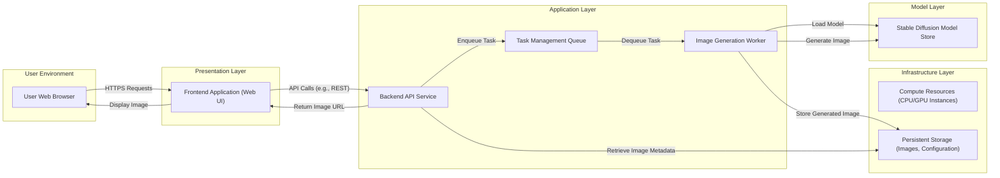
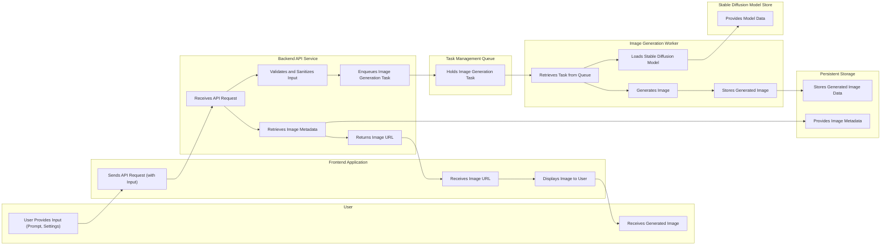

# Project Design Document: Fooocus - Simplified Image Generation

**Version:** 1.1
**Date:** October 26, 2023
**Author:** AI Software Architect

## 1. Project Overview

Fooocus is an open-source image generation software leveraging the power of Stable Diffusion. Its primary goal is to simplify the user experience, abstracting away the complexities often associated with traditional Stable Diffusion interfaces. The project emphasizes an intuitive and streamlined approach to generating high-quality images from textual prompts, making advanced AI art accessible to a broader audience. This document details the system's architecture and key components, serving as a foundation for subsequent threat modeling activities.

## 2. Goals

* Provide an exceptionally user-friendly web interface for generating images using Stable Diffusion models.
* Offer a carefully curated set of essential features and settings to simplify the image generation workflow, minimizing user confusion.
* Empower users with varying technical backgrounds to effortlessly generate high-quality and aesthetically pleasing images.
* Support a range of pre-trained Stable Diffusion models and configurable options for customization.
* Maintain a modular, open-source architecture that encourages community contributions and extensibility.

## 3. Non-Goals

* Implementing highly granular, low-level control over every conceivable Stable Diffusion parameter.
* Directly integrating specialized or advanced features like inpainting, outpainting, or video generation within the core application's initial scope (these are potential future extensions).
* Supporting complex, multi-stage image generation workflows or scripting capabilities in the initial release.
* Providing enterprise-grade user management features, such as role-based access control or detailed audit logging, in the initial phase.

## 4. Target Audience

* Digital artists and creative professionals seeking an accessible and efficient AI image generation tool.
* Hobbyists and individuals curious about exploring the capabilities of AI in generating visual content.
* Users who find the parameter-rich interfaces of traditional Stable Diffusion implementations overwhelming or intimidating.

## 5. System Architecture

The Fooocus project is structured into distinct architectural layers, promoting modularity and separation of concerns:

* **Presentation Layer (Web UI):**  The user-facing interface through which users interact with the application.
* **Application Layer (Backend):**  The core logic layer responsible for processing user requests, orchestrating image generation, and managing application state.
* **Infrastructure Layer:**  The underlying environment providing the necessary resources for the application to operate.
* **Model Layer:**  Contains the pre-trained Stable Diffusion models utilized for image synthesis.

### 5.1. High-Level Architecture Diagram

### 5.2. Component Descriptions

* **User Web Browser:** The standard web browser application used by the end-user to access and interact with the Fooocus web interface.
* **Frontend Application (Web UI):** A client-side web application, likely built using modern JavaScript frameworks (e.g., React, Vue.js, Svelte), responsible for:
    * Rendering the user interface elements (input fields for prompts, setting controls, image display areas).
    * Handling user input and interactions.
    * Communicating with the Backend API Service via asynchronous HTTP/HTTPS requests (e.g., using Fetch API or Axios).
    * Displaying generated images retrieved from the backend.
    * Managing client-side application state.
* **Backend API Service:** A server-side application, potentially developed using Python frameworks (e.g., Flask, FastAPI, Django REST framework), responsible for:
    * Receiving and processing requests from the Frontend Application.
    * Implementing authentication and authorization mechanisms (potentially basic in the initial version).
    * Validating and sanitizing user input to prevent injection attacks.
    * Managing the lifecycle of image generation tasks.
    * Interacting with the Task Management Queue to enqueue new generation requests.
    * Providing endpoints for retrieving the status and results of image generation tasks.
    * Serving generated images or their URLs to the Frontend Application.
* **Task Management Queue:** An asynchronous message broker or in-memory queue system (e.g., Redis, RabbitMQ, Celery with a Redis backend) used to decouple the Backend API Service from the computationally intensive Image Generation Worker. This enables asynchronous processing and improves responsiveness.
* **Image Generation Worker:** A dedicated process or set of processes responsible for the actual image generation. This component:
    * Continuously monitors the Task Management Queue for new image generation tasks.
    * Retrieves tasks from the queue.
    * Loads the specified Stable Diffusion model from the Model Store.
    * Executes the image generation process using the provided prompt and settings, leveraging GPU acceleration if available.
    * Stores the generated image in the Persistent Storage.
    * Potentially updates the status of the task in a persistent store.
* **Stable Diffusion Model Store:** A repository or directory where the pre-trained Stable Diffusion models are stored. This could be a local file system, a cloud storage service (e.g., AWS S3, Google Cloud Storage), or a dedicated model management system.
* **Compute Resources (CPU/GPU Instances):** The underlying hardware infrastructure where the Backend API Service and Image Generation Worker(s) are deployed. GPU acceleration is critical for the performance of the Image Generation Worker. This could be on-premise servers or cloud-based virtual machines/containers.
* **Persistent Storage (Images, Configuration):** A persistent storage solution for:
    * Storing generated images.
    * Storing application configuration settings.
    * Potentially storing user-specific preferences or data (if implemented). This could be a local file system, a network-attached storage (NAS), or a cloud-based object storage service.

### 5.3. Data Flow Diagram

## 6. Key Technologies

* **Programming Languages:**
    * Python (for Backend API Service, Image Generation Worker)
    * JavaScript/TypeScript (for Frontend Application)
* **Web Frameworks:**
    * Flask, FastAPI, or Django REST framework (for Backend API Service)
    * React, Vue.js, or Svelte (for Frontend Application)
* **Machine Learning Libraries:**
    * PyTorch or TensorFlow (for Stable Diffusion integration)
    * Libraries for image processing (e.g., Pillow, OpenCV)
* **Task Queue:**
    * Redis with Celery
    * RabbitMQ
* **Containerization and Orchestration:**
    * Docker (for packaging and deployment)
    * Docker Compose or Kubernetes (for orchestration)
* **Cloud Platform (Optional):**
    * AWS, Google Cloud Platform, Microsoft Azure (for hosting and infrastructure)
* **Database (Optional, for more complex scenarios):**
    * PostgreSQL, MySQL (for storing user data, task status, etc.)

## 7. Security Considerations (High-Level)

This section outlines potential security concerns that will be thoroughly investigated during the subsequent threat modeling exercise.

* **Input Validation and Sanitization:**
    * Preventing prompt injection attacks by rigorously validating and sanitizing user-provided text prompts and settings.
    * Protecting against the execution of arbitrary code through maliciously crafted inputs.
* **Stable Diffusion Model Security:**
    * Ensuring the integrity and authenticity of the Stable Diffusion models to prevent the use of compromised or backdoored models.
    * Implementing access controls to restrict unauthorized access to and modification of model files.
* **Authentication and Authorization:**
    * Implementing secure authentication mechanisms to verify the identity of users accessing the application.
    * Enforcing authorization policies to control access to specific features and resources based on user roles or permissions.
* **Data Security and Privacy:**
    * Protecting the confidentiality and integrity of generated images and any stored user data.
    * Implementing secure storage practices and encryption where necessary.
    * Adhering to relevant data privacy regulations.
* **Dependency Management:**
    * Regularly auditing and updating third-party libraries and dependencies to patch known security vulnerabilities.
    * Utilizing dependency management tools to track and manage dependencies effectively.
* **Denial of Service (DoS) Protection:**
    * Implementing rate limiting and other mechanisms to prevent malicious actors from overwhelming the system with excessive requests.
    * Protecting against resource exhaustion attacks.
* **Code Injection Vulnerabilities:**
    * Safeguarding against various code injection attacks, including SQL injection (if a database is used) and command injection.
* **Cross-Site Scripting (XSS):**
    * Implementing appropriate output encoding and sanitization techniques to prevent the injection of malicious scripts into the web interface.
* **Cross-Site Request Forgery (CSRF):**
    * Employing anti-CSRF tokens to prevent unauthorized actions performed on behalf of authenticated users.
* **API Security:**
    * Securing the communication between the Frontend Application and the Backend API Service using HTTPS.
    * Implementing proper authentication and authorization for API endpoints.
    * Protecting against API abuse and exploitation.
* **Storage Security:**
    * Implementing appropriate access controls and security measures for the Persistent Storage to protect generated images and configuration data.

## 8. Future Considerations

* **Integration of Advanced Image Generation Features:**
    * Incorporating features like inpainting, outpainting, and image-to-image generation capabilities.
    * Exploring support for video generation or animation features.
* **Enhanced User Management and Collaboration:**
    * Implementing user accounts with personalized settings and preferences.
    * Enabling collaborative features, such as shared prompts or image galleries.
* **API Extensions and Programmability:**
    * Providing a well-documented public API for programmatic access to the image generation functionality, enabling integration with other applications and services.
* **Scalability and Performance Optimizations:**
    * Optimizing the architecture and code for handling a larger number of concurrent users and requests.
    * Implementing load balancing and auto-scaling mechanisms.
* **Comprehensive Monitoring and Logging:**
    * Implementing robust monitoring and logging systems to track system health, performance, and potential security incidents.
    * Utilizing centralized logging and alerting mechanisms.
* **Support for Additional Stable Diffusion Models and LoRAs:**
    * Expanding the range of supported Stable Diffusion models and allowing users to easily integrate custom models or LoRAs (Low-Rank Adaptations).
* **Workflow Automation and Scripting:**
    * Introducing features for automating image generation workflows or allowing users to define custom scripts for more complex tasks.

This improved design document provides a more detailed and comprehensive overview of the Fooocus project's architecture and key components. It serves as a robust foundation for conducting a thorough threat modeling exercise to identify and mitigate potential security risks effectively.