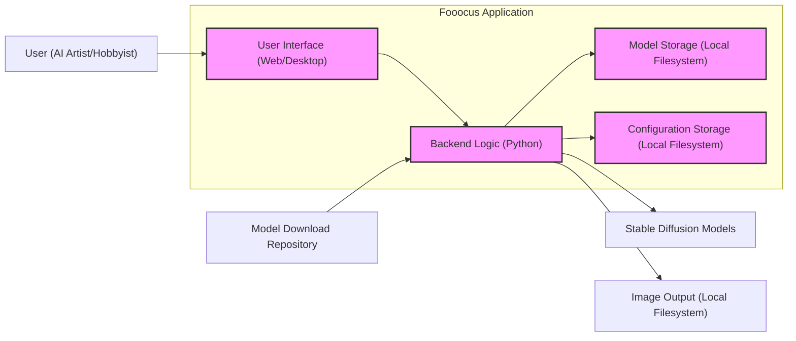
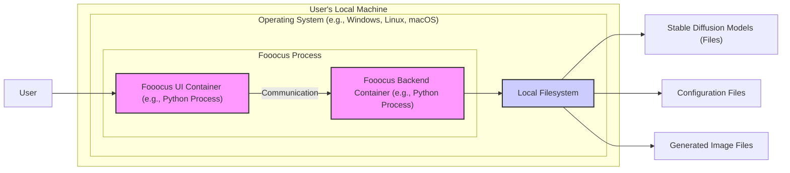
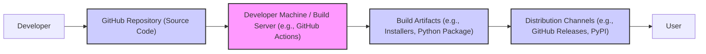

# BUSINESS POSTURE

This project, Fooocus, aims to provide a streamlined and user-friendly interface for interacting with image generation AI models, specifically Stable Diffusion. It targets users who want to create AI-generated art without needing deep technical knowledge or complex setups.

Business Priorities and Goals:
- Democratize access to AI image generation technology.
- Simplify the user experience for creating high-quality AI art.
- Offer a robust and stable platform for AI art generation.
- Potentially build a community around AI art creation and sharing.

Business Risks:
- Misuse of AI-generated content for harmful or unethical purposes.
- Reputational damage if the platform is associated with misuse or low-quality outputs.
- Legal and ethical concerns related to AI-generated art, copyright, and model usage.
- Dependence on external AI models and libraries, which may change or become unavailable.
- Security vulnerabilities in the software that could be exploited.

# SECURITY POSTURE

Existing Security Controls:
- security control: Code hosted on GitHub, providing version control and transparency. Implemented by: GitHub platform.
- security control: Open-source nature of the project allows for community review and potential contributions to security. Implemented by: Open-source community.
- accepted risk: Reliance on community contributions for security, which may be inconsistent or insufficient.
- accepted risk: Potential vulnerabilities in dependencies that are not actively monitored or patched.
- accepted risk: Lack of formal security audits or penetration testing.

Recommended Security Controls:
- security control: Implement automated dependency scanning to identify and address vulnerabilities in third-party libraries.
- security control: Integrate static code analysis tools into the development process to detect potential code-level security issues.
- security control: Implement robust input validation for user prompts and any other user-provided data to prevent injection attacks and unexpected behavior.
- security control: Establish a process for regularly updating dependencies and the core application to incorporate security patches.

Security Requirements:
- Authentication: Not explicitly required for a local, single-user application. If online features are added in the future (e.g., model sharing, cloud processing), authentication will become necessary.
- Authorization: Not explicitly required for a local, single-user application. Authorization might be relevant if user roles or access levels are introduced in future versions.
- Input Validation: Critical for user prompts to prevent prompt injection attacks, denial-of-service through excessive resource consumption, and unexpected application behavior. Input validation should be applied to all user-provided data.
- Cryptography: Potentially needed for storing user preferences, API keys (if any external services are used), or for secure communication if online features are added. Consider encryption for sensitive configuration data.

# DESIGN

## C4 CONTEXT

```mermaid
graph LR
    subgraph "AI Art Generation System"
        Fooocus["Fooocus Application"]
    end
    User["User (AI Artist/Hobbyist)"] --> Fooocus
    StableDiffusion["Stable Diffusion Models"] --> Fooocus
    ImageOutput["Generated Images"] <-- Fooocus
    Configuration["User Configuration"] <--> Fooocus
    ModelRepository["Model Download Repository (e.g., Hugging Face)"] --> Fooocus

    style Fooocus fill:#f9f,stroke:#333,stroke-width:2px
```

### Context Diagram Elements

- Name: User (AI Artist/Hobbyist)
  - Type: Person
  - Description: Individuals who use Fooocus to generate AI art for creative or recreational purposes.
  - Responsibilities: Provide prompts and parameters to Fooocus, review and utilize generated images.
  - Security controls: User is responsible for the security of their own devices and data.

- Name: Fooocus Application
  - Type: Software System
  - Description: The Fooocus application itself, providing the user interface and logic for AI image generation using Stable Diffusion models.
  - Responsibilities: Receive user prompts, interact with Stable Diffusion models, generate images, manage user configuration, and potentially download models.
  - Security controls: Input validation, dependency management, secure configuration storage, potentially secure model download process.

- Name: Stable Diffusion Models
  - Type: Software System
  - Description: Pre-trained AI models that are used by Fooocus to generate images based on user prompts.
  - Responsibilities: Receive prompts from Fooocus and generate image data.
  - Security controls: Model integrity verification (if models are downloaded or updated), access control to model files on the local system.

- Name: Image Output
  - Type: Data Store
  - Description: The generated images produced by Fooocus, stored as files on the user's local system.
  - Responsibilities: Store generated images.
  - Security controls: Access control to the output directory on the local file system.

- Name: User Configuration
  - Type: Data Store
  - Description: User preferences and settings for Fooocus, stored locally.
  - Responsibilities: Store user settings.
  - Security controls: Secure storage of configuration data, potentially encryption if sensitive information is stored.

- Name: Model Download Repository (e.g., Hugging Face)
  - Type: External System
  - Description: Online repositories where Stable Diffusion models are hosted and can be downloaded from.
  - Responsibilities: Host and provide access to Stable Diffusion models.
  - Security controls: Repository security controls (external to Fooocus), Fooocus should implement secure download mechanisms (e.g., HTTPS).

## C4 CONTAINER



### Container Diagram Elements

- Name: User Interface (Web/Desktop)
  - Type: Application
  - Description: The user-facing component of Fooocus, providing an interface for users to interact with the application. This could be a web interface or a desktop application built with frameworks like Gradio or similar.
  - Responsibilities: Handle user input (prompts, parameters), display generated images, manage user interactions.
  - Security controls: Input validation on user inputs, output encoding to prevent injection vulnerabilities, potentially secure communication with the backend.

- Name: Backend Logic (Python)
  - Type: Application
  - Description: The core logic of Fooocus, implemented in Python. This component handles prompt processing, interaction with Stable Diffusion models, image generation workflow, and data management.
  - Responsibilities: Process user prompts, load and execute Stable Diffusion models, manage model storage and configuration, generate images, interact with the file system.
  - Security controls: Input validation, secure handling of model files, secure configuration management, error handling, dependency management.

- Name: Model Storage (Local Filesystem)
  - Type: Data Store
  - Description: Local file system directory where Stable Diffusion models are stored.
  - Responsibilities: Persistently store downloaded and used AI models.
  - Security controls: File system access controls to protect model files from unauthorized access or modification.

- Name: Configuration Storage (Local Filesystem)
  - Type: Data Store
  - Description: Local file system location where user configurations and application settings are stored.
  - Responsibilities: Persistently store user preferences and application settings.
  - Security controls: File system access controls, potentially encryption of sensitive configuration data.

- Name: Stable Diffusion Models
  - Type: External System (Software Library/Executable)
  - Description: The Stable Diffusion AI model libraries or executables that are invoked by the Fooocus backend to perform image generation.
  - Responsibilities: Generate images based on prompts provided by Fooocus backend.
  - Security controls: Model integrity verification (if applicable), secure interaction with the model library/executable.

## DEPLOYMENT

Deployment Architecture: Local Desktop Deployment



### Deployment Diagram Elements

- Name: User's Local Machine
  - Type: Infrastructure
  - Description: The user's personal computer where Fooocus is installed and run.
  - Responsibilities: Provide the execution environment for Fooocus.
  - Security controls: Operating system security controls, user account security, physical security of the machine (user responsibility).

- Name: Operating System (e.g., Windows, Linux, macOS)
  - Type: Software
  - Description: The operating system running on the user's machine.
  - Responsibilities: Manage system resources, provide security features, execute applications.
  - Security controls: OS-level security features (firewall, user permissions, access control lists, security updates).

- Name: Fooocus Process
  - Type: Software Process
  - Description: The running instance of the Fooocus application, consisting of UI and backend components.
  - Responsibilities: Execute Fooocus application logic.
  - Security controls: Process isolation provided by the OS, application-level security controls within Fooocus.

- Name: Fooocus UI Container (e.g., Python Process)
  - Type: Container/Process
  - Description: The process running the User Interface component of Fooocus.
  - Responsibilities: Handle user interactions and display the UI.
  - Security controls: Input validation, output encoding.

- Name: Fooocus Backend Container (e.g., Python Process)
  - Type: Container/Process
  - Description: The process running the Backend Logic component of Fooocus.
  - Responsibilities: Execute core application logic, interact with models and file system.
  - Security controls: Input validation, secure file handling, dependency management.

- Name: Local Filesystem
  - Type: Infrastructure
  - Description: The local file system on the user's machine.
  - Responsibilities: Store application files, models, configuration, and generated images.
  - Security controls: File system permissions, access control lists.

- Name: Stable Diffusion Models (Files)
  - Type: Data
  - Description: Model files stored on the local filesystem.
  - Responsibilities: Provide model data for image generation.
  - Security controls: File system access controls.

- Name: Configuration Files
  - Type: Data
  - Description: Configuration files stored on the local filesystem.
  - Responsibilities: Store application settings.
  - Security controls: File system access controls, potentially encryption.

- Name: Image Output Files
  - Type: Data
  - Description: Generated image files stored on the local filesystem.
  - Responsibilities: Store generated images.
  - Security controls: File system access controls.

## BUILD

Build Process: Basic Open-Source Build



### Build Diagram Elements

- Name: Developer
  - Type: Person
  - Description: Software developers contributing to the Fooocus project.
  - Responsibilities: Write code, commit changes to the repository.
  - Security controls: Secure development practices, code review (potentially).

- Name: GitHub Repository (Source Code)
  - Type: Code Repository
  - Description: GitHub repository hosting the Fooocus source code.
  - Responsibilities: Store and manage source code, track changes.
  - Security controls: GitHub's security controls (access control, vulnerability scanning, etc.).

- Name: Build Server (Developer Machine / Build Server)
  - Type: Infrastructure/Application
  - Description: Environment used to build the Fooocus application. This could be a developer's local machine or a dedicated build server like GitHub Actions.
  - Responsibilities: Compile code, package application, run tests (potentially).
  - Security controls: Secure build environment, access control to build server, potentially automated security checks during build.

- Name: Build Artifacts (e.g., Installers, Python Package)
  - Type: Software Artifacts
  - Description: Packaged versions of the Fooocus application ready for distribution.
  - Responsibilities: Provide installable/distributable versions of Fooocus.
  - Security controls: Code signing (potentially), integrity checks (e.g., checksums).

- Name: Distribution Channels (e.g., GitHub Releases, PyPI)
  - Type: Distribution Platform
  - Description: Platforms used to distribute Fooocus to users.
  - Responsibilities: Host and distribute build artifacts.
  - Security controls: Platform security controls (e.g., GitHub's release security, PyPI's security).

- Name: User
  - Type: Person
  - Description: End-users who download and install Fooocus.
  - Responsibilities: Download and install Fooocus.
  - Security controls: User should download from trusted sources, verify artifact integrity (if possible).

# RISK ASSESSMENT

Critical Business Processes:
- Core functionality: AI image generation based on user prompts.
- User experience: Ease of use and accessibility of the application.

Data to Protect:
- User Prompts: Sensitivity: Low to Medium. Could contain personal or sensitive information depending on the user and their prompts.
- Generated Images: Sensitivity: Low to Medium. Could contain sensitive content depending on the user's prompts and the nature of the generated images.
- User Configuration: Sensitivity: Low. Contains user preferences and settings.
- Stable Diffusion Models: Sensitivity: Medium. Models are valuable intellectual property and essential for the application's functionality. Integrity and availability are important.

Data Sensitivity Levels:
- Low: Publicly available or non-sensitive information.
- Medium: Information that could cause minor inconvenience or reputational impact if disclosed or compromised.
- High: Information that could cause significant financial loss, legal repercussions, or serious reputational damage if disclosed or compromised.

# QUESTIONS & ASSUMPTIONS

BUSINESS POSTURE:
- Assumption: Fooocus is primarily intended for non-commercial, personal use by individuals interested in AI art generation.
- Question: Are there plans to commercialize Fooocus or offer premium features in the future?
- Question: What is the target audience beyond individual hobbyists? Are there specific professional user groups being considered?

SECURITY POSTURE:
- Assumption: Security is currently addressed through standard open-source development practices and community contributions.
- Question: Are there any plans to implement more formal security measures, such as regular security audits or penetration testing?
- Question: Are there specific security concerns or threat models that the project maintainers are currently considering?

DESIGN:
- Assumption: Fooocus is primarily a local desktop application with no online services or user accounts.
- Question: Are there any plans to introduce online features, such as model sharing, cloud processing, or user accounts in the future?
- Question: How are Stable Diffusion models managed and updated? Is there an automated model update mechanism?
- Question: What are the key dependencies of Fooocus, and are there any known security vulnerabilities in these dependencies?