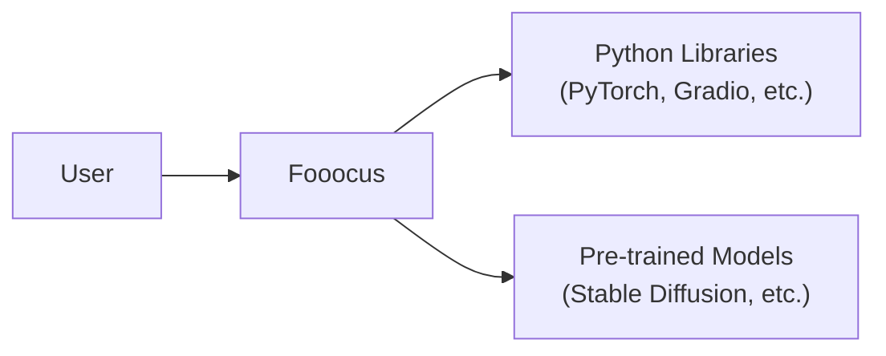
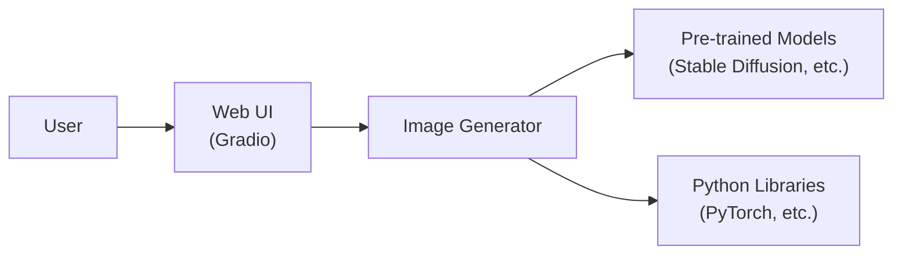
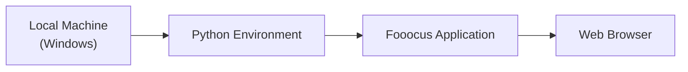
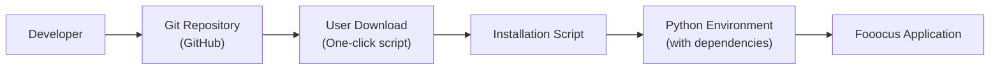

# BUSINESS POSTURE

Fooocus is an open-source image generating software inspired by Stable Diffusion and Midjourney. It appears to be targeted towards individual users and enthusiasts rather than large enterprises. The primary goal is to provide an easy-to-use and free alternative to commercial image generation tools.

Business Priorities:

*   Ease of use: The software should be simple to install and use, even for users with limited technical expertise.
*   Accessibility: The software should be free and open-source, making it accessible to a wide range of users.
*   Image quality: The software should generate high-quality images comparable to commercial alternatives.
*   Community engagement: Foster a community around the project to encourage contributions and support.

Business Risks:

*   Reputational risk: The software could be used to generate inappropriate or harmful content, which could damage the reputation of the project and its contributors.
*   Legal risk: There might be copyright issues related to the training data or the generated images.
*   Resource misuse: Users might attempt to use excessive computational resources, potentially impacting the availability or performance for others if a shared infrastructure is used (this is less of a concern since it's designed for local use).
*   Lack of support: As an open-source project, there may be limited resources for providing user support and addressing bug fixes.

# SECURITY POSTURE

Existing Security Controls:

*   security control: The project is open-source, allowing for community review and contributions to security. (Described in the GitHub repository).
*   security control: The project uses Gradio, which has some built-in security features, such as protection against cross-site scripting (XSS) and cross-site request forgery (CSRF). (Described in Gradio documentation).
*   security control: The project's installation instructions recommend running the software locally, reducing the attack surface compared to a cloud-based deployment. (Described in the GitHub repository).

Accepted Risks:

*   accepted risk: The software is designed to run locally, so the user is responsible for securing their own environment.
*   accepted risk: The project relies on third-party libraries and models, which may have their own vulnerabilities.
*   accepted risk: The project does not currently have a formal security policy or vulnerability disclosure process.

Recommended Security Controls:

*   security control: Implement a Content Security Policy (CSP) to mitigate the risk of XSS attacks.
*   security control: Provide guidance to users on how to securely configure their environment, including firewall settings and access controls.
*   security control: Regularly update dependencies to address known vulnerabilities.
*   security control: Establish a security policy and vulnerability disclosure process.
*   security control: Consider implementing input sanitization and filtering to prevent the generation of malicious prompts.
*   security control: Consider implementing output filtering to prevent the display of inappropriate or harmful content.

Security Requirements:

*   Authentication: Not applicable, as the software is designed for local use by a single user.
*   Authorization: Not applicable, as the software is designed for local use by a single user.
*   Input Validation:
    *   The software should validate user inputs to prevent the injection of malicious code or prompts.
    *   The software should limit the length and complexity of user inputs to prevent resource exhaustion attacks.
*   Cryptography:
    *   If any sensitive data is stored or transmitted (which is unlikely in this case), it should be encrypted using strong cryptographic algorithms.
*   Output validation:
    *   The software should validate generated output to prevent the display of inappropriate or harmful content.

# DESIGN

## C4 CONTEXT

Element List:

*   User:
    *   Name: User
    *   Type: Person
    *   Description: A person who wants to generate images.
    *   Responsibilities: Provides prompts and settings, views generated images.
    *   Security controls: None (relies on user's own environment security).

*   Fooocus:
    *   Name: Fooocus
    *   Type: Software System
    *   Description: The image generation software.
    *   Responsibilities: Processes user inputs, interacts with pre-trained models, generates images, provides a user interface.
    *   Security controls: Gradio's built-in security features, potential input sanitization, potential output filtering.

*   Python Libraries:
    *   Name: Python Libraries
    *   Type: External System
    *   Description: Third-party Python libraries used by Fooocus, such as PyTorch and Gradio.
    *   Responsibilities: Provide core functionalities like deep learning, image processing, and web interface.
    *   Security controls: Relies on the security of the individual libraries. Regular updates are recommended.

*   Pre-trained Models:
    *   Name: Pre-trained Models
    *   Type: External System
    *   Description: Pre-trained deep learning models, such as Stable Diffusion, used for image generation.
    *   Responsibilities: Generate images based on the provided prompts and parameters.
    *   Security controls: Relies on the security of the models themselves.

## C4 CONTAINER

Element List:

*   User:
    *   Name: User
    *   Type: Person
    *   Description: A person who wants to generate images.
    *   Responsibilities: Provides prompts and settings, views generated images.
    *   Security controls: None (relies on user's own environment security).

*   Web UI:
    *   Name: Web UI
    *   Type: Container (Web Application)
    *   Description: The user interface built with Gradio.
    *   Responsibilities: Handles user input, displays generated images, provides controls for settings.
    *   Security controls: Gradio's built-in security features (XSS, CSRF protection), potential CSP implementation.

*   Image Generator:
    *   Name: Image Generator
    *   Type: Container (Python Application)
    *   Description: The core logic for processing prompts and generating images.
    *   Responsibilities: Processes user inputs, interacts with pre-trained models, manages image generation pipeline.
    *   Security controls: Potential input sanitization.

*   Pre-trained Models:
    *   Name: Pre-trained Models
    *   Type: External System
    *   Description: Pre-trained deep learning models, such as Stable Diffusion.
    *   Responsibilities: Generate images based on prompts.
    *   Security controls: Relies on the security of the models themselves.

*   Python Libraries:
    *   Name: Python Libraries
    *   Type: External System
    *   Description: Third-party Python libraries.
    *   Responsibilities: Provide core functionalities.
    *   Security controls: Relies on the security of the individual libraries.

## DEPLOYMENT

Fooocus is designed for local deployment. The user downloads the software and runs it on their own machine.

Possible deployment solutions:

1.  Local machine (Windows, Linux, macOS)
2.  Cloud VM (AWS EC2, Google Compute Engine, Azure VM) - less common, but possible.
3.  Containerized environment (Docker) - possible, but not the primary deployment method.

Chosen deployment solution: Local machine (Windows).

Element List:

*   Local Machine:
    *   Name: Local Machine
    *   Type: Infrastructure Node
    *   Description: The user's personal computer.
    *   Responsibilities: Provides the hardware resources (CPU, GPU, RAM, storage) for running the software.
    *   Security controls: Relies on the user's own security practices (firewall, antivirus, etc.).

*   Python Environment:
    *   Name: Python Environment
    *   Type: Software
    *   Description: The Python environment where Fooocus and its dependencies are installed.
    *   Responsibilities: Provides the runtime environment for the Python code.
    *   Security controls: Relies on the security of the Python installation and the installed packages.

*   Fooocus Application:
    *   Name: Fooocus Application
    *   Type: Software
    *   Description: The Fooocus software itself.
    *   Responsibilities: Runs the image generation process.
    *   Security controls: As described in the C4 Container section.

*   Web Browser:
    *   Name: Web Browser
    *   Type: Software
    *   Description: The user's web browser, used to access the Gradio interface.
    *   Responsibilities: Displays the web UI.
    *   Security controls: Relies on the security of the web browser itself.

## BUILD

Fooocus does not appear to have a complex automated build system. The repository provides a "one-click" installation script, which likely handles downloading dependencies and setting up the environment.

Security Controls in Build Process:

*   security control: Code review (through GitHub's pull request system).
*   security control: Dependency management (using requirements.txt or similar).
*   security control: Use of a "one-click" script simplifies the installation process, reducing the risk of user error.

Recommended Security Controls:

*   security control: Implement static analysis (SAST) to scan the codebase for vulnerabilities.
*   security control: Implement software composition analysis (SCA) to identify known vulnerabilities in dependencies.
*   security control: Consider signing releases to ensure their integrity.

# RISK ASSESSMENT

Critical Business Processes:

*   Image generation: The core functionality of the software.
*   User experience: Providing a simple and intuitive interface.
*   Community engagement: Maintaining a positive and active community.

Data to Protect:

*   User prompts (low sensitivity): While prompts themselves may not be highly sensitive, they could potentially reveal user interests or preferences.
*   Generated images (low to medium sensitivity): The sensitivity of generated images depends on their content. Inappropriate or harmful content could pose a reputational risk.
*   Configuration files (low sensitivity): May contain paths or other system information.
*   Pre-trained models (low sensitivity): These are generally publicly available.

# QUESTIONS & ASSUMPTIONS

Questions:

*   Are there any plans to offer a cloud-based version of Fooocus in the future?
*   What is the intended audience for the software (e.g., hobbyists, researchers, commercial users)?
*   Are there any specific legal or ethical considerations related to the use of pre-trained models?
*   What mechanisms are in place to prevent the generation of harmful or illegal content?
*   Are there any plans to implement more robust security features, such as user authentication or access controls?

Assumptions:

*   BUSINESS POSTURE: The primary goal is to provide a free and easy-to-use image generation tool for individual users.
*   SECURITY POSTURE: The project relies heavily on the security of the user's local environment and the third-party libraries and models it uses.
*   DESIGN: The software is designed to be simple and self-contained, with minimal external dependencies.