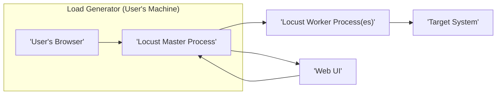

# Project Design Document: Locust Load Testing Tool

**Version:** 1.1
**Date:** October 26, 2023
**Author:** AI Software Architect

## 1. Introduction

This document provides a detailed architectural design of the Locust load testing tool, based on the open-source project available at [https://github.com/locustio/locust](https://github.com/locustio/locust). This document aims to clearly outline the system's components, their interactions, and data flow, serving as a robust foundation for subsequent threat modeling activities. This revision incorporates feedback to enhance clarity and detail.

## 2. Goals and Objectives

The primary goal of this document is to provide a comprehensive and improved architectural overview of Locust. The specific objectives are:

*   Clearly define the major components of the Locust system with enhanced detail.
*   Describe the interactions and communication pathways between these components with greater precision.
*   Illustrate the flow of data within the system using more descriptive diagrams.
*   Identify key functionalities and responsibilities of each component with further elaboration.
*   Provide a more robust basis for identifying potential security vulnerabilities during threat modeling.

## 3. System Architecture

Locust employs a distributed architecture to simulate a large number of concurrent users. The core components are the Master, Workers, and the Web UI.

### 3.1. High-Level Architecture

*   **'User's Browser'**: The interface through which a user interacts with the Locust Web UI to configure and monitor load tests.
*   **'Locust Master Process'**: The central coordinator responsible for managing and distributing tasks to worker processes.
*   **'Locust Worker Process(es)'**: Processes that execute the user-defined test scenarios (user classes) and generate load against the target system.
*   **'Target System'**: The application or service being load tested.
*   **'Web UI'**: A web-based interface provided by the Master process for configuring, starting, stopping, and monitoring load tests.

### 3.2. Component-Level Architecture

This section details the individual components and their responsibilities with more detail.

*   **Locust Master Process:**
    *   **Responsibilities:**
        *   Hosts the Web UI, providing an interface for user interaction and monitoring.
        *   Manages worker registration, accepting connections and tracking available workers.
        *   Distributes tasks (user spawn requests) to workers based on availability and configured load.
        *   Aggregates and processes real-time statistics reported by workers, including request counts, response times, and error rates.
        *   Provides a real-time monitoring dashboard through the Web UI, visualizing aggregated statistics.
        *   Manages the lifecycle of the load test, including starting, stopping, and dynamically adjusting the number of simulated users (ramp-up/down).
        *   Stores test configuration parameters (e.g., number of users, hatch rate, target host) and potentially historical test results (depending on configuration or extensions).
    *   **Key Functionalities:**
        *   **Web Server:** Typically implemented using a framework like Flask, handling HTTP requests for the Web UI and API endpoints.
        *   **Task Queue Management:**  Internal mechanisms for queuing and distributing user spawn requests to workers.
        *   **Worker Registry:**  Maintains a list of connected workers and their status.
        *   **Statistics Aggregator:**  Collects, processes, and aggregates metrics from workers.
        *   **Event Dispatcher:**  Manages internal events and potentially exposes hooks for extensions.
        *   **Configuration Management:** Handles loading and storing test configuration.

*   **Locust Worker Process:**
    *   **Responsibilities:**
        *   Establishes and maintains a connection with the Master process for receiving tasks and reporting status.
        *   Receives instructions from the Master to spawn and execute a specific number of user simulations.
        *   Executes user-defined test scenarios (user classes), simulating user behavior against the target system.
        *   Generates requests to the Target System using libraries like `requests` or protocol-specific clients.
        *   Collects granular performance metrics for each request, including response times, success/failure status, and any custom metrics.
        *   Periodically reports these statistics back to the Master process.
    *   **Key Functionalities:**
        *   **Master Communication:**  Uses messaging protocols (e.g., ZeroMQ, gRPC) to communicate with the Master.
        *   **User Code Execution:**  Executes Python code defined in user classes within its own process.
        *   **Target System Interaction:**  Utilizes HTTP clients or other protocol-specific libraries to interact with the target system.
        *   **Local Statistics Collection:**  Gathers performance data for individual requests and aggregates it before reporting to the Master.

*   **Web UI:**
    *   **Responsibilities:**
        *   Provides a graphical user interface for configuring load test parameters (number of users, hatch rate, target host, etc.).
        *   Displays real-time statistics and visualizations (graphs, tables) of the ongoing load test.
        *   Allows users to start, stop, and dynamically adjust the load test parameters.
        *   Presents historical test results and reports (if persistence is implemented or through extensions).
    *   **Key Functionalities:**
        *   **Frontend Application:** Built using web technologies (HTML, CSS, JavaScript), often leveraging frameworks like React or Vue.js.
        *   **Master Communication:**  Interacts with the Master process via HTTP/WebSockets for data retrieval and control commands.
        *   **Data Visualization:**  Utilizes charting libraries (e.g., Chart.js, D3.js) to display performance metrics.

*   **User Classes:**
    *   **Responsibilities:**
        *   Define the behavior of simulated users, specifying the sequence of actions and interactions with the target system.
        *   Implement specific test scenarios, including making requests, handling responses, and performing assertions.
        *   Can include logic for user authentication, data manipulation, and other realistic user interactions.
    *   **Key Functionalities:**
        *   **Python Classes:**  Defined as Python classes inheriting from `HttpUser` or similar base classes provided by Locust.
        *   **Task Definition:**  Methods decorated with `@task` to define the actions a simulated user can perform.
        *   **Target Interaction Logic:**  Utilizes Locust's built-in functions or external libraries to interact with the target system.
        *   **Custom Metrics:**  Allows for defining and recording custom performance metrics.

## 4. Data Flow

The following outlines the key data flows within the Locust system with more descriptive details:

*   **Test Configuration:**
    *   A user interacts with the **'Web UI'**, inputting test parameters such as the number of users to simulate, the rate at which to spawn new users (hatch rate), and the URL of the **'Target System'**.
    *   The **'Web UI'** sends this configuration data to the **'Locust Master Process'** via HTTP POST requests to specific API endpoints.
    *   The **'Locust Master Process'** receives and stores this configuration in its memory. This configuration dictates the parameters of the load test.

*   **Worker Registration:**
    *   When **'Locust Worker Process(es)'** are started, they initiate a connection to the **'Locust Master Process'**. This connection is typically established using a messaging protocol like ZeroMQ or gRPC.
    *   The **'Locust Master Process'** maintains a registry of connected workers, tracking their availability and status.

*   **Task Distribution:**
    *   Based on the configured number of users and the number of available workers, the **'Locust Master Process'** distributes tasks to the workers. A task typically represents a request to a worker to spawn and manage a certain number of simulated users.
    *   These tasks are sent to the **'Locust Worker Process(es)'** via the established communication channel.

*   **User Simulation and Request Generation:**
    *   Upon receiving a task, a **'Locust Worker Process'** instantiates and executes the defined **'User Classes'**.
    *   The code within the **'User Classes'** generates requests to the **'Target System'**. These requests are typically HTTP requests, but Locust can be extended to support other protocols.

*   **Statistics Reporting:**
    *   As the **'Locust Worker Process(es)'** execute user simulations and generate requests, they collect performance metrics for each request, such as response times, request status codes, and error details.
    *   Workers periodically aggregate these metrics and send them back to the **'Locust Master Process'**. The reporting frequency is configurable.

*   **Statistics Aggregation and Display:**
    *   The **'Locust Master Process'** receives the statistics reports from the workers.
    *   It aggregates these statistics to provide an overall view of the load test performance.
    *   The aggregated statistics are then sent to the **'Web UI'** (typically via WebSockets for real-time updates) for display to the user.

*   **Event Handling:**
    *   Locust utilizes an event system to facilitate communication and extensibility.
    *   **'Locust Worker Process(es)'** can emit events (e.g., when a request succeeds or fails).
    *   The **'Locust Master Process'** can subscribe to these events to perform actions like updating statistics or triggering other processes.
    *   The **'Web UI'** can also subscribe to certain events for real-time updates and notifications.

## 5. Security Considerations (Detailed for Threat Modeling)

This section highlights potential areas of security concern with more specific examples, which will be further explored during threat modeling.

*   **Web UI Security:**
    *   **Authentication and Authorization:** Lack of strong authentication and authorization mechanisms for accessing the **'Web UI'** could allow unauthorized users to control and monitor load tests, potentially disrupting operations or gaining sensitive information. Consider implementing robust authentication (e.g., username/password with hashing, OAuth) and role-based access control.
    *   **Cross-Site Scripting (XSS):** If the **'Web UI'** doesn't properly sanitize user inputs, malicious scripts could be injected and executed in the browsers of other users accessing the UI. Implement proper input validation and output encoding.
    *   **Cross-Site Request Forgery (CSRF):** Without proper CSRF protection, attackers could trick authenticated users into performing unintended actions on the Locust instance. Implement anti-CSRF tokens.
    *   **HTTPS Encryption:** Communication between the user's browser and the **'Web UI'** should be encrypted using HTTPS to protect sensitive data (e.g., credentials, test configurations) in transit.
    *   **Session Management:** Secure session management practices are crucial to prevent session hijacking. Use secure cookies with appropriate flags (HttpOnly, Secure).

*   **Communication between Master and Workers:**
    *   **Authentication and Authorization:**  Workers connecting to the Master should be authenticated to prevent unauthorized workers from joining the cluster and potentially disrupting the load test or injecting malicious data. Consider using shared secrets or certificate-based authentication.
    *   **Integrity and Confidentiality:** Communication between the Master and Workers might contain sensitive information (e.g., test configurations). Encrypting this communication (e.g., using TLS) ensures data integrity and confidentiality.

*   **Execution of User-Defined Code:**
    *   **Code Injection:**  If user-provided code in **'User Classes'** is not properly sandboxed or validated, it could potentially execute arbitrary commands on the worker machines, leading to security breaches. Implement mechanisms to restrict the capabilities of user-defined code or run workers in isolated environments (e.g., containers).
    *   **Resource Exhaustion:** Malicious or poorly written user code could consume excessive resources (CPU, memory) on worker machines, leading to denial of service. Implement resource limits and monitoring for worker processes.

*   **Data Security:**
    *   **Sensitive Test Data:** Test configurations and potentially historical test results might contain sensitive information (e.g., API keys, database credentials). Secure storage and access control mechanisms should be implemented.
    *   **Log Data:** Locust logs might contain sensitive information. Implement secure logging practices and restrict access to log files.

*   **Denial of Service (DoS):**
    *   **Master Overload:** An attacker could potentially overload the **'Locust Master Process'** by sending a large number of malicious requests or by exploiting vulnerabilities in the Master's handling of worker connections. Implement rate limiting and input validation.
    *   **Target System Overload (Unintentional):** While the goal of Locust is to load test, misconfigured tests or malicious actors could use Locust to unintentionally or intentionally overwhelm the **'Target System'**. Implement safeguards and monitoring to prevent excessive load.

*   **Input Validation:**
    *   Improper validation of user inputs in the **'Web UI'** or configuration files could lead to various vulnerabilities, including injection attacks. Implement robust input validation on all user-provided data.

## 6. Deployment Considerations

Locust can be deployed in various configurations, each with its own security implications:

*   **Single Machine:**  Master and worker processes run on the same machine. This simplifies deployment but can limit scalability and introduces a single point of failure. Security considerations focus on securing the single machine.
*   **Distributed Mode:** Master and worker processes run on separate machines. This allows for greater scalability but increases the attack surface due to network communication between machines. Secure network configurations (firewalls, VPNs) and secure communication protocols are crucial.
*   **Containerized Environments (e.g., Docker, Kubernetes):**  Locust can be easily containerized for scalable and reproducible deployments. Container security best practices (e.g., minimal images, vulnerability scanning, secure orchestration) should be followed. Consider network policies to restrict communication between containers.

## 7. Future Enhancements (Potential Areas for Consideration)

*   **Enhanced Authentication and Authorization:** Implementing more sophisticated authentication methods (e.g., multi-factor authentication) and fine-grained role-based access control for the **'Web UI'** and worker connections.
*   **Secure Secrets Management:** Integrating with secrets management tools (e.g., HashiCorp Vault, AWS Secrets Manager) to securely manage credentials used in test scripts, avoiding hardcoding secrets.
*   **Role-Based Access Control (RBAC):** Implementing granular access control for the **'Web UI'**, allowing different users to have different levels of access and control.
*   **Integration with Security Tools:**  Potentially integrating with security scanning tools to automatically trigger security scans of the **'Target System'** during or after load tests.
*   **Auditing and Logging:**  Implementing comprehensive logging of system events, including user actions, configuration changes, and security-related events, for security monitoring and analysis. Securely store and manage audit logs.
*   **Input Sanitization Libraries:**  Integrating libraries to automatically sanitize user inputs in the **'Web UI'** to prevent XSS and other injection attacks.

This improved document provides a more detailed and robust understanding of the Locust architecture, offering a stronger foundation for conducting thorough threat modeling to identify and mitigate potential security risks.
