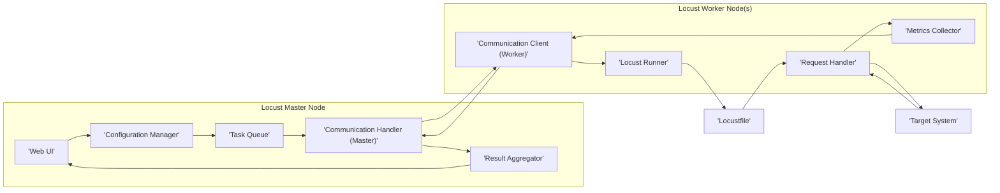

# Project Design Document: Locust - Scalable Load Testing Tool

**Version:** 1.1
**Date:** October 26, 2023
**Author:** AI Software Architect

## 1. Introduction

This document provides an enhanced and more detailed architectural design for the Locust project, an open-source load testing tool written in Python. It elaborates on the core components, their interactions, data flow, deployment considerations, and security aspects. This document serves as a robust foundation for subsequent threat modeling activities, providing a clear understanding of the system's inner workings.

## 2. Goals and Objectives

The primary goals of Locust are to:

* **Empower users to define realistic user behavior through Python code:** This allows for highly customized and dynamic simulation of user interactions, going beyond simple request patterns.
* **Facilitate high-scale load generation by distributing the workload across multiple machines:** This is crucial for testing the performance and resilience of systems under heavy load that exceeds the capacity of a single machine.
* **Offer a user-friendly, real-time web UI for comprehensive test monitoring and control:** This provides immediate feedback on the test execution, enabling dynamic adjustments and in-depth analysis.
* **Maintain a highly extensible and customizable architecture:** This allows users to adapt Locust to diverse testing scenarios and integrate it with other tools and systems.

## 3. Architectural Overview

Locust employs a robust master-worker architecture designed for distributed load generation and management. A central master node acts as the brain of the operation, coordinating the entire test execution and aggregating results. Multiple worker nodes, the workhorses of the system, are responsible for generating the actual load against the target system as instructed by the master.

## 4. Component Description

* **Master Node:**
    * **Responsibilities:**
        * **Test Orchestration:** Manages the overall test lifecycle, including starting, stopping, and scaling the test.
        * **Task Distribution and Management:** Divides the workload and assigns specific tasks to individual worker nodes.
        * **Result Aggregation and Processing:** Collects raw performance data from workers, processes it, and calculates key metrics.
        * **Web UI Hosting:** Serves the interactive web interface for monitoring, control, and configuration.
        * **Configuration Management:** Handles the test configuration parameters such as the number of users, hatch rate, and the selection of the Locustfile.
    * **Key Modules:**
        * **Web Server (e.g., Flask):**  Handles HTTP requests for the web UI and API endpoints.
        * **Task Queue (Internal):**  Manages the distribution of tasks to worker nodes, ensuring even workload distribution.
        * **Result Aggregator:**  Collects, processes, and aggregates performance metrics (e.g., response times, request counts, failure rates) from worker nodes.
        * **Configuration Manager:** Parses and stores the test configuration, making it accessible to other modules.
        * **Communication Handler:** Manages communication channels with worker nodes, typically using a message queue or direct connections.
    * **Data Storage (Ephemeral):** Primarily relies on in-memory storage for real-time metrics and the current test state, ensuring responsiveness.

* **Worker Node:**
    * **Responsibilities:**
        * **User Simulation Execution:** Runs the user behavior code defined in the Locustfile, simulating user interactions.
        * **Target System Request Generation:**  Sends HTTP or other protocol requests to the target system based on the executed user tasks.
        * **Performance Metrics Collection (Local):** Gathers detailed performance data related to the requests it generates.
        * **Result Reporting to Master:** Transmits collected performance metrics back to the master node for aggregation.
        * **Command Reception:** Receives and executes commands from the master node (e.g., start, stop, adjust user count).
    * **Key Modules:**
        * **Locust Runner:**  The core execution engine that interprets and runs the user tasks defined in the Locustfile.
        * **Request Handler (e.g., Requests library):**  Handles the actual sending of requests to the target system, managing connections and timeouts.
        * **Metrics Collector:** Gathers granular performance data, including request latency, status codes, and error details.
        * **Communication Client:** Establishes and maintains communication with the master node, sending results and receiving commands.

* **Locustfile:**
    * **Description:** A Python file authored by the user, serving as the blueprint for simulated user behavior. It defines how virtual users interact with the target system.
    * **Key Elements:**
        * **`User` Classes:** Define the behavior of a single simulated user, including the sequence of tasks they perform.
        * **`TaskSet` Classes:** Organize related tasks into logical groups within a `User`.
        * **`@task` Decorators:** Mark individual methods within `TaskSet` classes as tasks that a user can execute.
        * **Logic for Making Requests:**  Includes code to construct and send requests to the target system, often using libraries like `requests`.
        * **Wait Time Definitions:** Specifies delays between tasks to simulate realistic user pacing.

* **Web UI:**
    * **Purpose:** Provides a real-time, interactive interface for managing and observing the load test.
    * **Features:**
        * **Test Configuration:** Allows users to set parameters like the number of users, hatch rate, and select the Locustfile.
        * **Start/Stop Control:** Provides buttons to initiate and terminate the load test.
        * **Real-time Metrics Display:** Shows live statistics such as the number of active users, requests per second, response times (min, max, average, percentiles), and failure rates.
        * **Error Reporting:** Displays details of any errors encountered during the test execution.
        * **Downloadable Statistics:** Enables users to export test results in various formats for further analysis.

* **Target System:**
    * **Description:** The application, service, or infrastructure being tested under load generated by Locust.
    * **Interaction:** Receives requests from the Locust worker nodes, simulating real user traffic.

## 5. Data Flow

**Detailed Data Flow Description:**

1. **Configuration via Web UI:** The user interacts with the **'Web UI'** to define the test configuration (e.g., number of users, hatch rate, selecting the **'Locustfile'**). This configuration is processed by the **'Configuration Manager'**.
2. **Task Queue Population:** The **'Configuration Manager'** informs the **'Task Queue'** about the number of worker nodes required and the initial task distribution.
3. **Worker Connection and Task Assignment:** Worker nodes connect to the master node. The **'Communication Handler (Master)'** manages these connections. The **'Task Queue'** assigns initial tasks to the connecting workers via the **'Communication Handler (Master)'** and the worker's **'Communication Client (Worker)'**.
4. **Locustfile Execution on Workers:** Each **'Worker Node'** receives its assigned tasks. The **'Locust Runner'** interprets and executes the user behavior defined in the **'Locustfile'**.
5. **Request Generation:** The **'Locustfile'** instructs the **'Request Handler'** to send requests to the **'Target System'**.
6. **Response Handling:** The **'Target System'** processes the requests and sends responses back to the **'Request Handler'**.
7. **Local Metrics Collection:** The **'Metrics Collector'** on each worker node gathers detailed performance data about the requests and responses (e.g., latency, status codes).
8. **Periodic Result Reporting:** The **'Communication Client (Worker)'** on each worker node periodically sends the collected metrics back to the **'Communication Handler (Master)'** on the **'Master Node'**.
9. **Result Aggregation and Processing:** The **'Result Aggregator'** on the master node receives the metrics from all workers, aggregates them, and calculates overall performance statistics.
10. **Web UI Update:** The **'Result Aggregator'** updates the **'Web UI'** with the real-time test statistics, providing live feedback to the user.
11. **Monitoring and Control:** The user monitors the test progress and can adjust parameters (e.g., increasing the number of users) through the **'Web UI'**, which then updates the **'Configuration Manager'** and subsequently the **'Task Queue'** and worker nodes.

## 6. Deployment Options

Locust offers flexible deployment options to suit various testing needs and environments:

* **Local Machine (Single Instance):** For development, debugging, and basic testing, both the master and worker processes can run on a single machine. This simplifies setup but limits the load generation capacity.
* **Distributed Deployment (Multiple Machines):**  The master node runs on a dedicated machine, and multiple worker nodes are deployed on separate machines. This is the most common setup for generating significant load and requires network connectivity between the master and workers (typically using a message queue like RabbitMQ or ZeroMQ, or direct TCP connections).
* **Containerized Environments (Docker, Kubernetes):**  Locust can be easily containerized using Docker, allowing for reproducible and scalable deployments. Kubernetes can be used to orchestrate the master and worker containers, providing features like automatic scaling and failover. This is a popular choice for cloud deployments.
* **Cloud Platforms (AWS, Azure, GCP):** Cloud platforms offer managed services and infrastructure for deploying and scaling Locust clusters. This often involves using container orchestration services (like AWS ECS or EKS, Azure Kubernetes Service, or Google Kubernetes Engine) or deploying Locust directly on virtual machines. Cloud-based message queues and load balancers can be integrated for enhanced scalability and resilience.

## 7. Security Considerations

A comprehensive understanding of potential security risks is crucial for operating Locust securely. Here are key considerations for threat modeling:

* **Web UI Security:**
    * **Authentication and Authorization:** The web UI, if exposed, requires robust authentication mechanisms to prevent unauthorized access and control of the test. Consider implementing strong password policies, multi-factor authentication, and role-based access control to restrict actions based on user roles.
    * **Cross-Site Scripting (XSS) Prevention:**  All user inputs in the web UI must be properly sanitized and encoded to prevent attackers from injecting malicious scripts that could be executed in other users' browsers.
    * **Cross-Site Request Forgery (CSRF) Protection:** Implement anti-CSRF tokens to prevent attackers from forging requests on behalf of authenticated users, potentially manipulating the test execution.
    * **Secure Session Management:** Employ secure session management practices, including using secure and HTTP-only cookies, setting appropriate session timeouts, and invalidating sessions upon logout, to prevent session hijacking.
    * **HTTPS Enforcement:**  Enforce HTTPS for all communication with the web UI to encrypt traffic and protect sensitive data like login credentials and test configurations.

* **Communication between Master and Workers:**
    * **Authentication:** Workers should authenticate themselves to the master node upon connection to prevent unauthorized workers from joining the test and potentially disrupting the process.
    * **Encryption (TLS/SSL):**  Communication between the master and worker nodes might transmit sensitive information. Encrypting this communication using TLS/SSL ensures confidentiality and integrity.
    * **Message Queue Security (if used):** If a message queue is used for communication, ensure it is properly secured with authentication and authorization mechanisms to prevent unauthorized access and message tampering.

* **Locustfile Security:**
    * **Code Injection Risks:** If users can dynamically upload or modify Locustfiles through the web UI or other means, stringent security measures are needed to prevent the injection of malicious code that could compromise the master node or the target system. Consider sandboxing or static analysis of uploaded Locustfiles.
    * **Secrets Management:** Locustfiles might contain credentials or API keys for accessing the target system. Avoid hardcoding secrets directly in the Locustfile. Instead, use secure methods for managing and accessing secrets, such as environment variables, dedicated secret management tools (e.g., HashiCorp Vault), or credential providers.

* **Resource Consumption and Denial of Service (DoS):**
    * **Master Node Overload:** Malicious actors could attempt to overload the master node by initiating an excessively large test or by sending a flood of connection requests. Implement resource limits, rate limiting, and monitoring to mitigate this risk.
    * **Target System Overload (Accidental or Intentional):** While Locust is designed for load testing, misconfigurations or malicious intent could lead to overwhelming the target system. Implement safeguards and monitoring within Locust and the target system to prevent unintended outages.

* **Dependencies and Supply Chain Security:**
    * **Vulnerability Management:** Locust relies on various Python libraries. Regularly scan and update these dependencies to address known vulnerabilities and ensure a secure software supply chain. Use dependency management tools and vulnerability scanners.

* **Data Security and Privacy:**
    * **Sensitive Data in Test Results:** Test results might contain sensitive information about the target system or user behavior. Implement secure storage and access control mechanisms for these results. Consider anonymization or pseudonymization of sensitive data where appropriate.

## 8. Future Considerations

* **Enhanced Security Features:**
    * **Mutual TLS for Master-Worker Communication:** Implement mutual TLS for stronger authentication and encryption between master and worker nodes.
    * **Improved Input Validation and Sanitization:** Enhance input validation and sanitization across the web UI and API endpoints to prevent a wider range of injection attacks.
    * **Integration with Security Scanning Tools:**  Integrate with static and dynamic application security testing (SAST/DAST) tools to automatically identify potential vulnerabilities in Locust's codebase.
* **Pluggable Authentication for Web UI:** Allow users to integrate their preferred authentication providers (e.g., OAuth 2.0, SAML) for the web UI.
* **Comprehensive Auditing and Logging:** Implement detailed auditing and logging of all significant actions performed within Locust, including user logins, test configurations, and administrative operations, for security monitoring and incident response.
* **Role-Based Access Control (RBAC) Enhancements:**  Provide more granular control over user permissions within the web UI, limiting access to sensitive operations based on user roles.

## 9. Conclusion

This improved design document provides a more in-depth and refined architectural overview of the Locust load testing tool. By elaborating on the components, data flow, deployment options, and security considerations, this document serves as a more robust foundation for conducting thorough threat modeling and implementing appropriate security measures to ensure the safe and reliable operation of Locust.