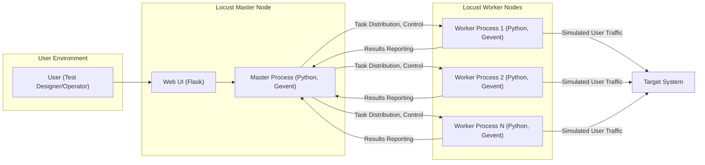
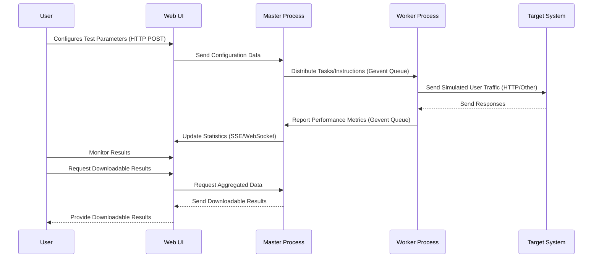

# Project Design Document: Locust Load Testing Framework

**Version:** 1.1
**Date:** October 26, 2023
**Prepared By:** AI Software Architect

## 1. Introduction

This document provides a detailed architectural design of the Locust load testing framework (as represented by the GitHub repository: https://github.com/locustio/locust). This document aims to clearly outline the system's components, their interactions, and data flows, with a specific focus on providing the necessary information for effective threat modeling.

## 2. Goals and Objectives

The primary goal of this document is to provide a comprehensive and understandable architectural overview of Locust, specifically tailored for security analysis. Specific objectives include:

*   Clearly identify the major components of the Locust framework and their underlying technologies.
*   Describe the interactions and communication protocols between these components in detail.
*   Illustrate the flow of various types of data within the system, from test definition to result aggregation.
*   Provide sufficient technical detail to enable thorough and accurate threat modeling.
*   Use clear and concise language, avoiding unnecessary jargon.

## 3. System Architecture

Locust employs a distributed architecture leveraging Python's capabilities for concurrency and networking. The core components work in concert to define, execute, and monitor load tests.

### 3.1. High-Level Architecture

### 3.2. Detailed Architecture and Component Interaction

1. **User (Test Designer/Operator):**  The individual responsible for designing load test scenarios using Python, configuring test parameters, and managing the test execution via the Web UI.
2. **Web UI (Flask):** A web application built using the Flask microframework in Python. It provides:
    *   A user interface for configuring load test parameters (number of users, hatch rate, target host URL).
    *   Controls for starting and stopping the load test execution.
    *   Real-time visualization of test statistics (requests per second, response times, failure rates, user counts).
    *   Functionality to download aggregated test data in various formats.
    *   Serves static assets (HTML, CSS, JavaScript) for the user interface.
3. **Master Process (Python, Gevent):** The central coordinating process, typically implemented as a Python script utilizing the Gevent asynchronous networking library. Its responsibilities include:
    *   Hosting the Flask-based Web UI, listening for HTTP requests on a specified port.
    *   Receiving test configuration parameters from the Web UI via HTTP POST requests.
    *   Managing the pool of Worker processes, including spawning new workers and handling worker disconnections.
    *   Distributing tasks and instructions to Worker processes, often using a message queue mechanism (internally within Gevent).
    *   Aggregating performance metrics reported by the Worker processes.
    *   Providing real-time statistics to the Web UI via server-sent events or similar mechanisms.
    *   Orchestrating the test lifecycle, including setup and teardown phases.
4. **Worker Processes (Python, Gevent):** Independent Python processes, also typically leveraging Gevent for asynchronous operations. Each worker simulates one or more virtual users concurrently. Key responsibilities include:
    *   Receiving task definitions and instructions from the Master process.
    *   Executing the user-defined tasks (Python code within the `locustfile.py`) using asynchronous I/O.
    *   Making requests to the Target System using libraries like `requests` or custom HTTP clients.
    *   Collecting detailed performance metrics for each request (response time, status code, request method, URL, etc.).
    *   Reporting these performance metrics back to the Master process, typically via a message queue or direct communication channels.
5. **Target System:** The application, service, or infrastructure under test, which receives the simulated user traffic generated by the Worker processes.

## 4. Key Components and Their Responsibilities

This section provides a more granular view of the core components and their specific functions and technologies.

*   **`locustfile.py`:** A user-defined Python file that is the heart of the load test. It contains:
    *   `User` classes inheriting from `HttpUser` or `User`, defining the behavior of simulated users.
    *   `TaskSet` classes to group related tasks logically.
    *   `@task` decorated methods within `User` or `TaskSet` classes, representing individual actions a simulated user performs (e.g., making a GET or POST request).
    *   Configuration variables that can be accessed during test execution.
*   **Master Node (Python Process):**  The central control unit, built upon Python and leveraging libraries like Gevent for concurrency. It manages worker processes and aggregates results.
*   **Worker Node (Python Process):** Executes the Python code defined in `locustfile.py`, simulating user interactions with the Target System. Relies heavily on asynchronous I/O provided by Gevent.
*   **Web UI (Flask Application):** A web interface built using the Flask microframework. It handles user interaction, configuration, and visualization of test results. It uses templating engines (like Jinja2) to render HTML.
*   **Message Queue (Implicit within Gevent):** While not a separate dedicated message queue service, Locust leverages Gevent's asynchronous primitives (like `gevent.queue.Queue`) for internal communication between the Master and Worker processes. This facilitates task distribution and result reporting.
*   **Statistics Engine (Python Code):**  Implemented within the Master process, this component aggregates and processes performance data received from the Workers. It calculates metrics like requests per second, average response times, and failure rates.
*   **Event Hooks (Python Decorators):** Locust provides a powerful event system allowing users to hook into various stages of the test execution lifecycle. This is achieved through decorators like `@events.request_success.add_listener` and `@events.request_failure.add_listener`, enabling custom logging, reporting, and integration with external systems.

## 5. Data Flow

The following details the flow of different types of data during a Locust load test, highlighting the communication pathways and data transformations.

1. **Test Definition Data:** The Python code within `locustfile.py`, defining user behavior and tasks. This is static data loaded by both the Master and Worker processes.
2. **Configuration Data:** Parameters set by the User via the Web UI (e.g., number of users, hatch rate, target host). This data is transmitted from the Web UI to the Master process via HTTP POST requests.
3. **Task Distribution Data:** Instructions and potentially specific task assignments sent from the Master process to the Worker processes. This communication typically occurs via Gevent's internal queue mechanisms.
4. **Simulated User Traffic:** HTTP requests (or other protocol requests) generated by the Worker processes and sent to the Target System. This data flow is direct from the Workers to the Target System.
5. **Performance Metrics Data:** Data collected by the Worker processes for each request made to the Target System (e.g., response time, status code, request headers, response content length). This data is reported back to the Master process, usually via Gevent queues.
6. **Aggregated Statistics Data:** Processed performance metrics calculated by the Master process's Statistics Engine. This data is sent to the Web UI for real-time display, often using server-sent events (SSE) or WebSocket connections.
7. **Monitoring Data:** Real-time information about the state of the test, such as the number of active users and the status of Worker processes, communicated from the Master to the Web UI.
8. **Downloadable Results Data:** Aggregated test results that can be downloaded from the Web UI in formats like CSV or JSON. This data is generated by the Master process.

## 6. Security Considerations (Detailed)

This section expands on potential security considerations, providing more specific examples of threats and vulnerabilities.

*   **Web UI Security (Flask Application):**
    *   **Authentication and Authorization Bypass:** Lack of proper authentication or authorization could allow unauthorized users to start, stop, or modify load tests, potentially disrupting services or gaining access to sensitive test data. Implement robust authentication mechanisms (e.g., username/password, API keys) and role-based access control.
    *   **Cross-Site Scripting (XSS):** Vulnerabilities in the Web UI could allow attackers to inject malicious scripts into web pages viewed by other users, potentially stealing credentials or performing actions on their behalf. Implement proper input sanitization and output encoding.
    *   **Cross-Site Request Forgery (CSRF):** Attackers could trick authenticated users into making unintended requests on the Locust Web UI, potentially leading to unauthorized actions. Implement CSRF protection mechanisms (e.g., CSRF tokens).
    *   **Session Hijacking:** Insecure session management could allow attackers to steal user session IDs and impersonate legitimate users. Use secure session cookies and consider HTTP Strict Transport Security (HSTS).
    *   **Insecure Direct Object References (IDOR):** If the Web UI directly exposes internal object IDs without proper authorization checks, attackers might be able to access or modify resources they shouldn't.
*   **Communication Security (Master-Worker):**
    *   **Man-in-the-Middle (MITM) Attacks:** If the communication between the Master and Worker processes occurs over a network without encryption, attackers could intercept and potentially modify the messages. Consider using secure communication protocols (e.g., TLS/SSL) if workers are on different machines.
    *   **Spoofing:** Malicious actors could potentially impersonate either the Master or Worker processes to inject false data or disrupt the test. Implement mechanisms for mutual authentication if necessary.
*   **Code Injection (`locustfile.py`):**
    *   **Malicious Code Execution:** While the `locustfile.py` is executed within the controlled environment of the Worker processes, poorly written or intentionally malicious code could potentially cause harm to the worker machine or leak sensitive information. Implement code review processes and consider sandboxing worker processes.
*   **Resource Exhaustion (Locust Itself):**
    *   **Denial of Service (DoS) against the Master:** An attacker could potentially overload the Master process with requests or by spawning an excessive number of workers, making the Locust framework unavailable. Implement rate limiting and resource management controls.
*   **Data Security (Test Results):**
    *   **Exposure of Sensitive Information:** Aggregated test results might contain sensitive information about the Target System's performance, vulnerabilities, or data. Implement secure storage and access control mechanisms for test results.
    *   **Data Tampering:** Unauthorized modification of test results could lead to inaccurate assessments of the Target System's performance. Ensure the integrity of stored test data.
*   **Dependency Vulnerabilities:**
    *   **Exploitation of Known Vulnerabilities:** Locust relies on various Python libraries. Outdated or vulnerable dependencies could be exploited by attackers. Regularly update dependencies and perform security audits.

## 7. Deployment Considerations

The deployment environment significantly impacts the security posture of Locust.

*   **Single Machine Deployment:** While simpler, this deployment concentrates all components on one system, meaning a compromise of the machine compromises the entire Locust instance.
*   **Distributed Deployment (Separate Machines):** This improves resilience but introduces network communication security concerns between the Master and Workers, requiring careful consideration of network segmentation and encryption.
*   **Containerized Deployment (Docker, Kubernetes):** Containerization provides isolation but requires securing the container images and the orchestration platform itself. Vulnerabilities in container images or misconfigurations in Kubernetes could be exploited.
*   **Cloud Environments (AWS, Azure, GCP):** Leveraging cloud infrastructure offers scalability and security features, but requires proper configuration of cloud security services (e.g., firewalls, IAM roles, network policies) to protect the Locust deployment. Ensure proper access control to cloud resources and secure storage for test data.

## 8. Future Considerations

*   **Enhanced Authentication and Authorization:** Implementing more granular role-based access control (RBAC) for the Web UI, allowing for more fine-grained control over user permissions.
*   **Secure Communication Protocols:** Enforcing encrypted communication (e.g., TLS/SSL) between the Master and Worker processes, especially in distributed deployments.
*   **Input Sanitization and Validation:** Implementing robust input sanitization and validation on all user inputs in the Web UI and Master process to prevent injection attacks.
*   **Security Audits and Penetration Testing:** Regularly conducting security audits and penetration testing to identify and address potential vulnerabilities.
*   **Integration with Security Tools:** Exploring integration with security scanning tools to automatically identify vulnerabilities in the Locust codebase and dependencies.

This improved design document provides a more detailed and technically accurate overview of the Locust load testing framework, specifically tailored for threat modeling activities. It highlights key components, data flows, and potential security considerations in greater depth.