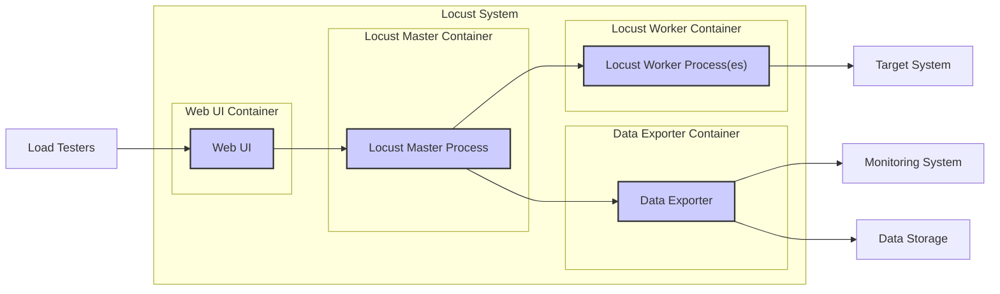
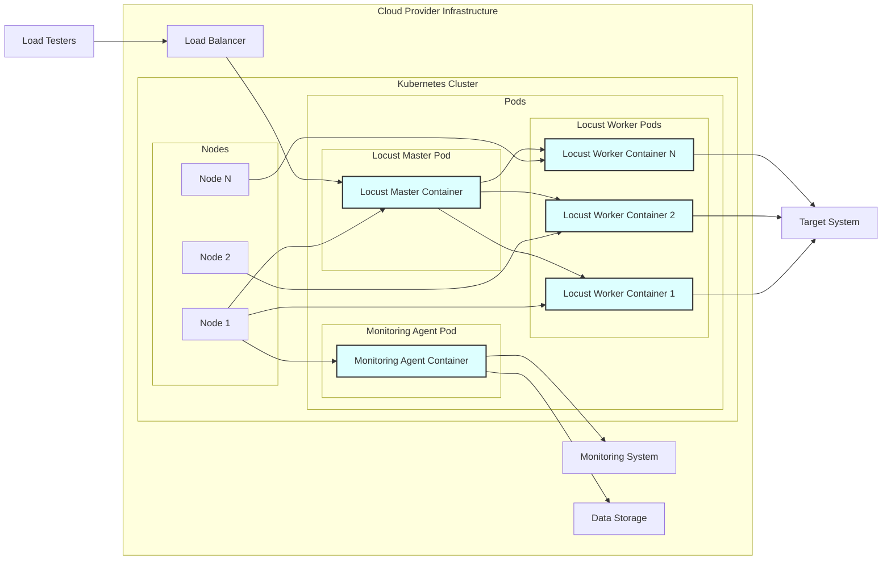
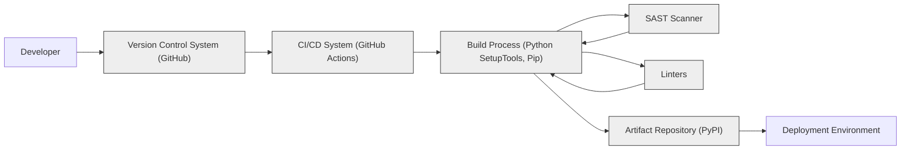

# BUSINESS POSTURE

Locust is an open-source load testing tool designed to simulate user traffic to websites, APIs, and other systems. Its primary business goal is to enable developers and operations teams to understand the performance and scalability of their systems under high load.

Business Priorities and Goals:
- Identify performance bottlenecks in systems before they impact real users.
- Ensure system stability and responsiveness under expected and peak load conditions.
- Optimize infrastructure resource allocation based on performance testing results.
- Facilitate continuous performance monitoring and regression testing as part of the software development lifecycle.

Business Risks:
- Inaccurate load testing scenarios may lead to a false sense of security or missed performance issues in production.
- Misconfiguration of Locust or the target system during testing could cause unintended outages or performance degradation in production environments.
- Security vulnerabilities in Locust itself could be exploited if deployed in sensitive environments or used to test security-sensitive systems.
- Lack of understanding of test results or improper interpretation of performance data may lead to incorrect decisions about system architecture or infrastructure.

# SECURITY POSTURE

Existing Security Controls:
- security control: Open-source project with community review (GitHub).
- security control: Code hosted on GitHub, providing version control and transparency.
- security control: Use of Python, a relatively secure and widely used programming language.
- security control: Standard software development practices within the open-source community.

Accepted Risks:
- accepted risk: Reliance on community contributions for security vulnerability identification and patching.
- accepted risk: Potential for vulnerabilities to exist in dependencies used by Locust.
- accepted risk: Security of Locust deployment environment is the responsibility of the user.

Recommended Security Controls:
- security control: Implement regular security vulnerability scanning of Locust codebase and dependencies.
- security control: Follow secure coding practices during any customization or extension of Locust.
- security control: Deploy Locust in a secure and isolated environment, especially when testing production-like systems.
- security control: Implement access controls and monitoring for Locust instances and test results.

Security Requirements:
- Authentication:
    - Requirement: Locust itself does not require user authentication for basic operation as a load testing tool.
    - Requirement: If Locust is extended with a web UI or API for management, authentication should be implemented to control access.
- Authorization:
    - Requirement: Authorization mechanisms should be in place to control who can configure and run load tests, especially in shared environments.
    - Requirement: Access to test results and configuration data should be restricted based on roles and responsibilities.
- Input Validation:
    - Requirement: Locust should validate user-provided input for test configurations, target URLs, and other parameters to prevent injection attacks or unexpected behavior.
    - Requirement: When extending Locust with custom logic, ensure proper input validation is implemented in the custom code.
- Cryptography:
    - Requirement: Locust should support secure communication protocols (HTTPS) when testing target systems.
    - Requirement: If Locust stores sensitive data (e.g., API keys in test scripts), consider encryption at rest and in transit.

# DESIGN

## C4 CONTEXT

```mermaid
graph LR
    subgraph "Organization System"
        L["Locust"]
    end
    U["Load Testers"] --> L
    M["Monitoring System"] <-- L
    T["Target System"] <-- L
    D["Data Storage"] <-- L
    U -- Configures & Runs Tests --> L
    L -- Sends Requests --> T
    L -- Collects Metrics --> M
    L -- Stores Results --> D
    style L fill:#f9f,stroke:#333,stroke-width:2px
```

Context Diagram Elements:

- Element:
    - Name: Load Testers
    - Type: User
    - Description: Individuals or teams responsible for designing, configuring, and running load tests using Locust.
    - Responsibilities: Define test scenarios, configure Locust, initiate tests, analyze test results.
    - Security controls: Access control to Locust configuration and test execution environments. Training on secure testing practices.

- Element:
    - Name: Locust
    - Type: Software System
    - Description: The Locust load testing framework itself, responsible for generating simulated user traffic and collecting performance metrics.
    - Responsibilities: Execute load tests as configured, generate requests to the target system, collect and aggregate performance metrics, provide reporting and data export.
    - Security controls: Input validation, secure coding practices, vulnerability scanning, access control to Locust instances.

- Element:
    - Name: Target System
    - Type: Software System
    - Description: The system under test, which could be a website, API, application, or any other system that needs to be load tested.
    - Responsibilities: Process requests from Locust, respond to requests, provide services under load.
    - Security controls: Security controls of the target system itself (authentication, authorization, input validation, etc.). Rate limiting and protection against denial-of-service attacks.

- Element:
    - Name: Monitoring System
    - Type: Software System
    - Description: External monitoring tools used to observe the performance of the target system and Locust infrastructure during load tests. Examples include Prometheus, Grafana, CloudWatch, etc.
    - Responsibilities: Collect and visualize performance metrics from the target system and Locust, provide real-time dashboards and alerts.
    - Security controls: Secure integration with Locust, access control to monitoring dashboards, secure storage of monitoring data.

- Element:
    - Name: Data Storage
    - Type: Data Store
    - Description: Persistent storage for Locust test results, configurations, and potentially logs. Could be a database, file system, or cloud storage.
    - Responsibilities: Store test results, configurations, and logs. Provide data retrieval for analysis and reporting.
    - Security controls: Access control to data storage, encryption at rest and in transit, data backup and recovery.

## C4 CONTAINER



Container Diagram Elements:

- Element:
    - Name: Locust Master Process
    - Type: Process
    - Description: The central control process in a distributed Locust setup. It manages worker processes, aggregates results, and exposes the Web UI.
    - Responsibilities: Coordinate worker processes, distribute tasks, aggregate test results, serve the Web UI, manage test execution.
    - Security controls: Access control to the master process (if directly accessible), secure communication with worker processes, input validation for test configurations.

- Element:
    - Name: Locust Worker Process(es)
    - Type: Process
    - Description: Processes responsible for generating the actual load against the target system. Multiple worker processes can run in parallel to increase the load.
    - Responsibilities: Execute test tasks assigned by the master, generate requests to the target system, collect performance metrics, report results to the master.
    - Security controls: Secure communication with the master process, resource limits to prevent resource exhaustion, input validation for test parameters.

- Element:
    - Name: Web UI
    - Type: Web Application
    - Description: A web-based user interface provided by the Locust master for configuring and monitoring load tests.
    - Responsibilities: Provide a user-friendly interface for test configuration, execution, and result visualization.
    - Security controls: Authentication and authorization to access the Web UI, input validation for user inputs, protection against common web vulnerabilities (XSS, CSRF).

- Element:
    - Name: Data Exporter
    - Type: Process/Component
    - Description: A component responsible for exporting Locust test results to external monitoring systems or data storage. This could be built-in exporters or custom extensions.
    - Responsibilities: Format and send test results to monitoring systems (e.g., Prometheus, InfluxDB) or data storage (e.g., databases, files).
    - Security controls: Secure communication with monitoring systems and data storage, proper handling of sensitive data in exported results, access control to exporter configurations.

## DEPLOYMENT

Deployment Solution: Containerized Deployment on Cloud Infrastructure (e.g., Kubernetes)



Deployment Diagram Elements:

- Element:
    - Name: Kubernetes Cluster
    - Type: Infrastructure
    - Description: A Kubernetes cluster deployed on cloud infrastructure, providing orchestration and management for containerized Locust components.
    - Responsibilities: Container orchestration, resource management, scaling, high availability, networking.
    - Security controls: Kubernetes security features (RBAC, network policies, pod security policies), infrastructure security controls provided by the cloud provider.

- Element:
    - Name: Nodes
    - Type: Infrastructure
    - Description: Worker nodes within the Kubernetes cluster, providing compute resources for running Locust containers.
    - Responsibilities: Execute containers, provide compute and network resources.
    - Security controls: Operating system hardening, security patching, access control, monitoring.

- Element:
    - Name: Locust Master Pod
    - Type: Container
    - Description: Kubernetes pod hosting the Locust Master Container.
    - Responsibilities: Run the Locust master process, manage worker pods, expose Web UI.
    - Security controls: Container image security scanning, resource limits, network policies, security context.

- Element:
    - Name: Locust Worker Pods
    - Type: Container
    - Description: Kubernetes pods hosting Locust Worker Containers. Scaled horizontally to increase load generation capacity.
    - Responsibilities: Run Locust worker processes, generate load against the target system.
    - Security controls: Container image security scanning, resource limits, network policies, security context.

- Element:
    - Name: Monitoring Agent Pod
    - Type: Container
    - Description: Kubernetes pod hosting a monitoring agent (e.g., Prometheus exporter) to collect metrics from Locust and the Kubernetes cluster.
    - Responsibilities: Collect and export metrics to the monitoring system and data storage.
    - Security controls: Secure configuration of monitoring agent, access control to metrics data.

- Element:
    - Name: Load Balancer
    - Type: Network Component
    - Description: A load balancer in front of the Locust Master Pod, providing access to the Web UI and potentially API endpoints.
    - Responsibilities: Distribute traffic to the Locust Master Pod, provide external access point.
    - Security controls: HTTPS termination, access control lists, DDoS protection.

- Element:
    - Name: Monitoring System
    - Type: Software System
    - Description: External monitoring system (e.g., Prometheus, Grafana) to visualize and analyze Locust and target system metrics.
    - Responsibilities: Collect, store, and visualize monitoring data.
    - Security controls: Access control, secure data storage, secure communication.

- Element:
    - Name: Data Storage
    - Type: Data Store
    - Description: Persistent storage for Locust test results and monitoring data.
    - Responsibilities: Store test results and monitoring data.
    - Security controls: Access control, encryption at rest and in transit, data backup and recovery.

## BUILD



Build Process Description:

1. Developer writes code and commits changes to the Version Control System (GitHub).
2. CI/CD System (GitHub Actions) is triggered on code changes.
3. Build Process is initiated, typically using Python SetupTools and Pip for dependency management.
4. SAST (Static Application Security Testing) Scanner is integrated into the build process to identify potential security vulnerabilities in the code.
5. Linters are used to enforce code quality and style guidelines.
6. Build artifacts (Python packages) are created.
7. Artifacts are published to an Artifact Repository (PyPI for Locust).
8. Deployment Environment retrieves artifacts from the Artifact Repository for deployment.

Build Process Security Controls:
- security control: Version Control System (GitHub) for code integrity and change tracking.
- security control: CI/CD System (GitHub Actions) for automated and repeatable builds.
- security control: SAST Scanner integration to identify security vulnerabilities early in the development lifecycle.
- security control: Linters to enforce code quality and reduce potential for errors.
- security control: Artifact Repository (PyPI) for secure storage and distribution of build artifacts.
- security control: Code signing of artifacts to ensure integrity and authenticity.
- security control: Dependency scanning to identify vulnerabilities in third-party libraries.

# RISK ASSESSMENT

Critical Business Processes:
- Performance testing of critical applications and services before release.
- Capacity planning and infrastructure optimization based on load test results.
- Ensuring system resilience and availability under peak load.

Data to Protect and Sensitivity:
- Test scripts: May contain sensitive information like API keys, credentials, or business logic. Sensitivity: Medium to High, depending on content.
- Test configuration: Contains parameters for load tests, target system details. Sensitivity: Low to Medium.
- Test results: Performance metrics, logs. Sensitivity: Low to Medium.
- Locust logs: Operational logs of Locust itself. Sensitivity: Low.

Data Sensitivity Levels:
- Low: Publicly available information, system logs.
- Medium: Test configurations, performance metrics, non-sensitive test scripts.
- High: Test scripts containing credentials or sensitive business logic.

# QUESTIONS & ASSUMPTIONS

Questions:
- What is the specific deployment environment for Locust? (Cloud, On-premise, Hybrid) - Assumption: Cloud (Kubernetes).
- What monitoring systems are used in conjunction with Locust? - Assumption: Prometheus and Grafana.
- What is the sensitivity of the target systems being tested? - Assumption: Medium sensitivity, requiring standard security practices.
- Are there any specific compliance requirements for the test environment or data? - Assumption: General security best practices are sufficient.
- Are there any existing security policies or guidelines that Locust deployment must adhere to? - Assumption: Standard organizational security policies apply.

Assumptions:
- BUSINESS POSTURE: The primary business goal is to improve system performance and reliability through load testing.
- SECURITY POSTURE: Standard security practices are expected for an open-source load testing tool. Security is a shared responsibility between the Locust project and its users.
- DESIGN: Locust is deployed in a containerized environment on cloud infrastructure for scalability and manageability. The build process includes standard security checks like SAST and linting.