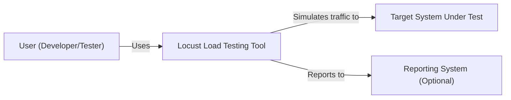
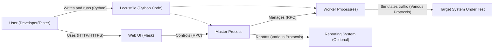
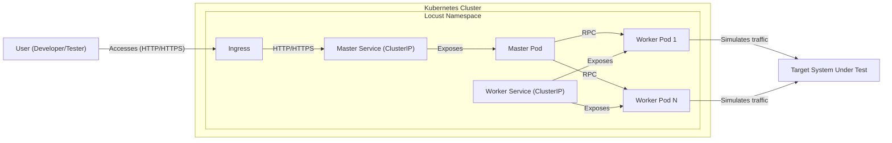
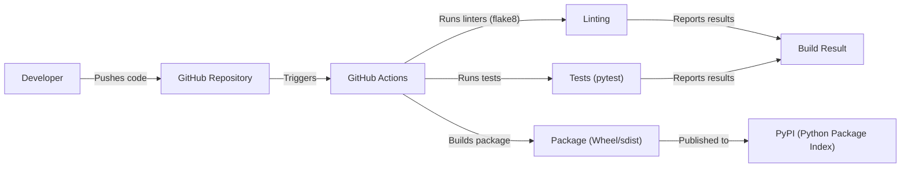

# BUSINESS POSTURE

Locust is an open-source load testing tool. The business priorities likely revolve around:

*   Providing a reliable and scalable tool for developers and performance engineers.
*   Maintaining an active and engaged open-source community.
*   Ensuring the tool is easy to use and extend.
*   Supporting a wide range of use cases and protocols (though HTTP is the primary focus).
*   Keeping the codebase maintainable and well-documented.

Given that Locust is an open-source project, the business risks are somewhat different from a commercial product. Key risks include:

*   Loss of community interest and contributions.
*   Security vulnerabilities that could be exploited in user environments (since Locust executes user-provided code).
*   Lack of maintainability leading to stagnation.
*   Competition from other open-source or commercial load testing tools.
*   Reputational damage due to security issues or poor performance.
*   Inability to scale to meet the needs of large-scale load tests.

# SECURITY POSTURE

*   security control: The project uses GitHub for code hosting, which provides some inherent security features like access control and audit logs. (Described in GitHub repository)
*   security control: The project appears to use linters (flake8) to enforce code style and potentially catch some basic errors. (Described in .github/workflows/tests.yml)
*   security control: The project has a suite of unit and integration tests. (Described in .github/workflows/tests.yml)
*   security control: The project uses a continuous integration (CI) system (GitHub Actions) to automate testing. (Described in .github/workflows/tests.yml)
*   accepted risk: Locust executes arbitrary Python code provided by the user. This is inherent to its design and is a known, accepted risk. Users are responsible for the security of the code they execute within Locust.
*   accepted risk: Locust, by default, doesn't enforce secure communication (HTTPS) between the master and worker nodes. This is left to the user's configuration and deployment environment.
*   accepted risk: Locust's web UI does not enforce authentication by default.

Recommended Security Controls:

*   security control: Implement a Content Security Policy (CSP) for the web UI to mitigate XSS risks.
*   security control: Provide clear documentation and warnings about the security implications of running user-provided code.
*   security control: Offer options/guidance for securing communication between master and worker nodes (e.g., using TLS).
*   security control: Offer built-in authentication mechanisms for the web UI, or provide clear instructions for integrating with existing authentication systems.
*   security control: Regularly perform static analysis (SAST) and dependency vulnerability scanning as part of the CI/CD pipeline.
*   security control: Consider implementing a Software Bill of Materials (SBOM) for releases.
*   security control: Develop and publish a security policy outlining vulnerability reporting procedures.

Security Requirements:

*   Authentication:
    *   The web UI should offer optional authentication mechanisms to restrict access.
    *   Consider supporting common authentication protocols (e.g., OAuth 2.0, OpenID Connect).
*   Authorization:
    *   If authentication is implemented, authorization should control access to specific features and data within the web UI.
    *   Consider role-based access control (RBAC).
*   Input Validation:
    *   All user-provided input in the web UI and through configuration files should be validated to prevent injection attacks.
    *   User-provided Locust scripts (Python code) are inherently trusted, but the framework should provide mechanisms to help users write secure code (e.g., input sanitization libraries).
*   Cryptography:
    *   Communication between master and worker nodes should be encrypted using TLS if sensitive data is being transmitted or if the environment is untrusted.
    *   Sensitive data stored by Locust (if any) should be encrypted at rest.
*   Session Management:
    *   If authentication is implemented, secure session management practices should be followed (e.g., using secure, HTTP-only cookies, proper session timeouts).

# DESIGN

## C4 CONTEXT

*   Elements:
    *   Element:
        *   Name: User (Developer/Tester)
        *   Type: Person
        *   Description: The person who writes and runs Locust tests.
        *   Responsibilities:
            *   Writes Locust scripts (Python code) defining user behavior.
            *   Configures and runs Locust tests.
            *   Analyzes test results.
        *   Security controls:
            *   None directly implemented by Locust. Users are responsible for the security of their own systems and the code they write.

    *   Element:
        *   Name: Locust Load Testing Tool
        *   Type: Software System
        *   Description: The open-source load testing tool itself.
        *   Responsibilities:
            *   Executes user-defined load tests.
            *   Simulates virtual users.
            *   Collects and reports performance metrics.
            *   Provides a web UI for monitoring and control.
        *   Security controls:
            *   Limited built-in security controls. Relies on user-provided code and deployment environment for security.

    *   Element:
        *   Name: Target System Under Test
        *   Type: Software System
        *   Description: The system being load tested. This is external to Locust.
        *   Responsibilities:
            *   Receives and responds to requests generated by Locust.
        *   Security controls:
            *   Not controlled by Locust. The target system's security is the responsibility of its owners.

    *   Element:
        *   Name: Reporting System (Optional)
        *   Type: Software System
        *   Description: An external system to which Locust can send test results (e.g., a time-series database like Graphite or Prometheus).
        *   Responsibilities:
            *   Stores and visualizes Locust test results.
        *   Security controls:
            *   Not controlled by Locust. The reporting system's security is the responsibility of its owners.

## C4 CONTAINER

*   Elements:
    *   Element:
        *   Name: Web UI (Flask)
        *   Type: Web Application
        *   Description: A web-based user interface built using the Flask framework.
        *   Responsibilities:
            *   Provides a user interface for controlling and monitoring load tests.
            *   Displays real-time statistics.
            *   Allows starting, stopping, and configuring tests.
        *   Security controls:
            *   Recommended: CSP, authentication, authorization.

    *   Element:
        *   Name: Locustfile (Python Code)
        *   Type: Code
        *   Description: User-written Python code that defines the load test scenario.
        *   Responsibilities:
            *   Defines user behavior (tasks to be executed).
            *   Specifies the number of users, hatch rate, etc.
        *   Security controls:
            *   None directly implemented by Locust. Users are responsible for the security of their code.

    *   Element:
        *   Name: Master Process
        *   Type: Process
        *   Description: The main Locust process that coordinates the load test.
        *   Responsibilities:
            *   Manages worker processes.
            *   Aggregates statistics.
            *   Handles communication with the web UI.
        *   Security controls:
            *   Recommended: Secure communication (TLS) with worker processes.

    *   Element:
        *   Name: Worker Process(es)
        *   Type: Process
        *   Description: One or more worker processes that simulate users.
        *   Responsibilities:
            *   Executes tasks defined in the Locustfile.
            *   Sends requests to the target system.
            *   Reports statistics to the master process.
        *   Security controls:
            *   Recommended: Secure communication (TLS) with the master process.

    *   Element:
        *   Name: Target System Under Test
        *   Type: Software System
        *   Description: The system being load tested (external to Locust).
        *   Responsibilities:
            *   Receives and responds to requests from Locust worker processes.
        *   Security controls:
            *   Not controlled by Locust.

    *   Element:
        *   Name: Reporting System (Optional)
        *   Type: Software System
        *   Description: An external system for storing and visualizing test results.
        *   Responsibilities:
            *   Receives and stores data from the Locust master process.
        *   Security controls:
            *   Not controlled by Locust.

## DEPLOYMENT

Locust can be deployed in various ways:

1.  **Local Machine:** Running Locust directly on a developer's machine.
2.  **Dedicated Servers:** Deploying Locust master and worker processes on dedicated servers (physical or virtual).
3.  **Docker Containers:** Running Locust master and worker processes within Docker containers.
4.  **Kubernetes:** Deploying Locust as a distributed system within a Kubernetes cluster.

We'll describe the Kubernetes deployment in detail, as it's the most complex and scalable option.

*   Elements:
    *   Element:
        *   Name: Kubernetes Cluster
        *   Type: Infrastructure
        *   Description: The Kubernetes cluster where Locust is deployed.
        *   Responsibilities:
            *   Provides the infrastructure for running and managing Locust containers.
        *   Security controls:
            *   Kubernetes RBAC, network policies, pod security policies, etc.

    *   Element:
        *   Name: Locust Namespace
        *   Type: Logical Isolation
        *   Description: A Kubernetes namespace to isolate Locust resources.
        *   Responsibilities:
            *   Provides a logical grouping for Locust pods and services.
        *   Security controls:
            *   Kubernetes namespace-level security policies.

    *   Element:
        *   Name: Master Pod
        *   Type: Pod
        *   Description: A Kubernetes pod running the Locust master process.
        *   Responsibilities:
            *   Runs the Locust master process.
        *   Security controls:
            *   Kubernetes pod security context, network policies.

    *   Element:
        *   Name: Worker Pod 1, Worker Pod N
        *   Type: Pod
        *   Description: Kubernetes pods running Locust worker processes.
        *   Responsibilities:
            *   Runs Locust worker processes.
        *   Security controls:
            *   Kubernetes pod security context, network policies.

    *   Element:
        *   Name: Master Service (ClusterIP)
        *   Type: Service
        *   Description: A Kubernetes service that exposes the master pod within the cluster.
        *   Responsibilities:
            *   Provides a stable endpoint for worker pods to connect to the master.
        *   Security controls:
            *   Kubernetes service-level network policies.

    *   Element:
        *   Name: Worker Service (ClusterIP)
        *   Type: Service
        *   Description: A Kubernetes service that exposes the worker pods within the cluster.
        *   Responsibilities:
            *   Provides load balancing across worker pods.
        *   Security controls:
            *   Kubernetes service-level network policies.

    *   Element:
        *   Name: Ingress
        *   Type: Ingress
        *   Description: A Kubernetes Ingress that exposes the web UI to external users.
        *   Responsibilities:
            *   Provides external access to the Locust web UI.
        *   Security controls:
            *   Ingress-level security policies (e.g., TLS termination, authentication).

    *   Element:
        *   Name: User (Developer/Tester)
        *   Type: Person
        *   Description: The person accessing the Locust web UI.
        *   Responsibilities:
            *   Interacts with the Locust web UI.
        *   Security controls:
            *   None directly implemented by Locust.

    *   Element:
        *   Name: Target System Under Test
        *   Type: Software System
        *   Description: The system being load tested.
        *   Responsibilities:
            *   Receives traffic from Locust worker pods.
        *   Security controls:
            *   Not controlled by Locust.

## BUILD

Locust's build process is primarily managed through GitHub Actions, as defined in `.github/workflows/tests.yml`.

*   The build process is triggered by pushes to the repository.
*   GitHub Actions runs linters (flake8) to check code style.
*   GitHub Actions runs tests using pytest.
*   The build process creates Python packages (wheel and sdist).
*   Packages are typically published to PyPI (Python Package Index).

Security Controls:

*   security control: Linting (flake8) helps enforce code style and potentially catch some errors.
*   security control: Automated tests (pytest) help ensure code quality and prevent regressions.
*   security control: GitHub Actions provides a controlled and auditable build environment.

Recommended Security Controls:

*   security control: Integrate SAST tools (e.g., Bandit, Snyk) into the GitHub Actions workflow to scan for security vulnerabilities in the code.
*   security control: Integrate dependency scanning tools (e.g., pip-audit, Dependabot) to identify and update vulnerable dependencies.
*   security control: Sign releases uploaded to PyPI to ensure their integrity.
*   security control: Implement SBOM generation as part of the build process.

# RISK ASSESSMENT

*   Critical Business Processes:
    *   Providing a functional and reliable load testing tool.
    *   Maintaining an active open-source community.
*   Data to Protect:
    *   Locust itself doesn't handle highly sensitive data directly. The primary concern is the *user-provided Locust scripts* and the *target system's data*.
    *   User-provided scripts might contain credentials or other sensitive information for interacting with the target system. (Sensitivity: Potentially High, depending on the user's code)
    *   The target system's data is accessed *by* Locust, but not stored *by* Locust. (Sensitivity: Depends entirely on the target system)
    *   Test results (performance metrics) are generated by Locust, but these are generally not considered highly sensitive. (Sensitivity: Low)
    *   Locust Web UI access credentials (if authentication is enabled). (Sensitivity: Medium)

# QUESTIONS & ASSUMPTIONS

*   Questions:
    *   Are there any specific compliance requirements (e.g., GDPR, PCI DSS) that apply to the use of Locust or the systems being tested?
    *   What is the expected scale of Locust deployments (number of users, requests per second)?
    *   What are the specific security concerns of the users of Locust?
    *   What level of support is provided for securing communication between master and worker nodes?
    *   Is there a formal process for handling security vulnerabilities reported in Locust?

*   Assumptions:
    *   Users are responsible for the security of their Locust scripts and the target systems they test.
    *   The primary threat model involves malicious or poorly written user scripts, and vulnerabilities in the Locust framework itself.
    *   The deployment environment (e.g., Kubernetes cluster) is configured securely.
    *   Users are aware of the risks associated with running unauthenticated web UIs and unencrypted communication.
    *   The project prioritizes maintainability and community contributions.
    *   The project has limited resources for implementing complex security features.