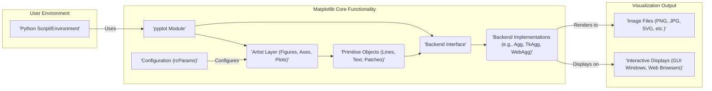
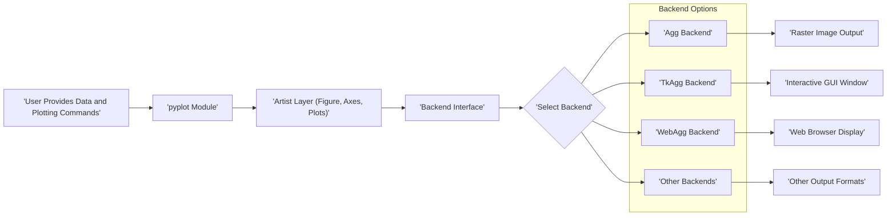

## Project Design Document: Matplotlib (Improved)

**1. Introduction**

This document provides an enhanced architectural overview of the Matplotlib project, a powerful Python library for creating visualizations. It is specifically designed to facilitate threat modeling by clearly outlining key components, data flows, and potential security considerations.

**2. Goals and Objectives**

*   Present a clear and concise description of the Matplotlib architecture, optimized for security analysis.
*   Precisely identify key components and their interactions, highlighting potential attack surfaces.
*   Detail the data flow within the library, emphasizing points of external interaction or data transformation.
*   Sharpen the focus on potential security concerns, providing specific examples relevant for threat modeling.
*   Serve as an improved reference for understanding the system's design from a security perspective.

**3. High-Level Architecture**

Matplotlib's architecture involves user interaction with Python code that leverages the library to generate visual outputs.

**4. Detailed Architecture**

Matplotlib's internal structure is organized into distinct modules and layers:

*   **`matplotlib.pyplot`:** The primary user-facing module, offering a convenient interface for plot creation and management. It orchestrates figure and axes creation and delegates rendering.
*   **`matplotlib.backend_bases`:** Defines abstract base classes for backend renderers, ensuring a consistent interface across different output methods.
*   **Backend Implementations:** Concrete implementations of the backend interface, responsible for the actual drawing process on various output targets:
    *   **Agg:** A robust backend for generating high-quality raster images (e.g., PNG, JPG).
    *   **TkAgg:** Utilizes the Tkinter GUI toolkit for displaying interactive plots in desktop windows.
    *   **WebAgg:** Renders plots in web browsers using HTML, JavaScript, and WebSockets for interactive features.
    *   Other backends support different GUI toolkits (e.g., Qt, GTK) and output formats (e.g., PDF, SVG, PS).
*   **Artist Layer:** The core object-oriented layer, composed of `Artist` objects representing plot elements:
    *   **`Figure`:** The top-level container holding all plot elements.
    *   **`Axes`:** The region where data is plotted, containing plotting functions.
    *   **Plotting Functions:** Methods within `Axes` for creating specific plot types (e.g., `plot()`, `scatter()`, `bar()`).
*   **Primitive Objects:** Low-level graphical elements that constitute the plots:
    *   **`Line2D`:** Represents line plots.
    *   **`Text`:** Represents text elements like labels and annotations.
    *   **`Patch`:** Represents geometric shapes such as rectangles and circles.
    *   **`Image`:** Represents embedded raster images.
*   **`matplotlib.transforms`:** Manages coordinate transformations between different coordinate systems (data, axes, figure).
*   **`matplotlib.colors`:** Provides utilities for color manipulation, colormaps, and normalization.
*   **`matplotlib.cm`:** Contains predefined colormaps for data visualization.
*   **`matplotlib.font_manager`:** Handles font loading, caching, and selection.
*   **`matplotlib.rcsetup` and `matplotlib.rcParams`:** Manage Matplotlib's configuration through resource files and runtime parameters.

**5. Data Flow**

The typical data flow involves user interaction leading to the generation of visual output:

1. **User Interaction:** A Python script or interactive environment uses `matplotlib.pyplot` to define and create plots.
2. **Plotting Commands & Artist Creation:** User calls to plotting functions (e.g., `plt.plot(x, y)`) instantiate `Artist` objects (e.g., `Line2D`) representing the data visually.
3. **Artist Management & Styling:** The `Axes` object manages the created `Artist` objects, applying transformations, styles, and properties.
4. **Backend Selection & Rendering Preparation:** Matplotlib selects the appropriate backend based on configuration or user specification. The backend prepares for the rendering process.
5. **Drawing Instructions:** The chosen backend iterates through the `Artist` objects and their primitives, translating them into specific drawing commands for the target output.
6. **Rendering & Output:** The backend executes the drawing commands, rendering the visualization to the chosen output medium (e.g., pixels on a screen, vector graphics in an SVG).
7. **Display or Saving:** The final output is either displayed interactively or saved to a file.

**6. Key Components for Threat Modeling**

These components are critical for threat modeling due to their interaction with external data, system resources, or their role in generating output:

*   **Backend Implementations (especially interactive backends):** These directly interact with the operating system's graphics subsystem (TkAgg, QtAgg, etc.) or network protocols (WebAgg), representing significant potential attack surfaces. *Example threats: Buffer overflows in native rendering libraries, vulnerabilities in GUI toolkit bindings, cross-site scripting (XSS) in WebAgg.*
*   **Font Handling (`matplotlib.font_manager`):** Processing font files from potentially untrusted sources can lead to vulnerabilities. *Example threats: Exploiting vulnerabilities in font parsing libraries leading to arbitrary code execution.*
*   **Image Handling (within backends and for embedding images):** Parsing and rendering image data can expose vulnerabilities if image formats have exploitable flaws. *Example threats: Exploiting vulnerabilities in image decoding libraries (e.g., libpng, libjpeg) leading to crashes or code execution.*
*   **Configuration Parsing (`matplotlib.rcsetup`):** Loading and parsing configuration files from untrusted locations could allow malicious configuration settings to be applied. *Example threats: Overriding secure defaults, pointing to malicious external resources.*
*   **Input Data Processing (within plotting functions):** While primarily for visualization, improper handling of malformed or excessively large datasets could lead to denial-of-service. *Example threats: Resource exhaustion, triggering unhandled exceptions leading to crashes.*
*   **Interactive Elements (in backends like WebAgg):** Features allowing user interaction can introduce vulnerabilities if input is not properly sanitized. *Example threats: DOM-based XSS vulnerabilities in WebAgg.*

**7. Security Considerations**

Based on the architecture and key components, the following security considerations are paramount:

*   **Dependency Vulnerabilities:** Matplotlib relies on numerous third-party libraries. Vulnerabilities in these dependencies can directly impact Matplotlib's security. *Mitigation: Regular dependency updates and vulnerability scanning.*
*   **Input Validation:**  While visualizing data, robust input validation is crucial to prevent unexpected behavior or crashes due to malicious or malformed data. *Mitigation: Implement strict input validation and sanitization for all data processed by plotting functions.*
*   **Output Security:** Generated output, especially in interactive backends, could be a vector for attacks if not handled carefully. *Mitigation: Implement content security policies (CSP) for WebAgg, sanitize output data to prevent injection attacks.*
*   **Backend Security:** Interactive backends require careful scrutiny due to their direct interaction with system resources. *Mitigation: Employ secure coding practices, leverage operating system security features, consider sandboxing backend processes.*
*   **Code Injection (through custom formatters or extensions):** Allowing user-provided code introduces significant risk. *Mitigation: Avoid or strictly limit the use of custom code execution features, implement robust sandboxing if necessary.*
*   **Denial of Service:**  Protecting against resource exhaustion from processing large or complex plots is important. *Mitigation: Implement resource limits, rate limiting, and input validation to prevent excessive resource consumption.*
*   **Cross-Site Scripting (XSS) in WebAgg:** The WebAgg backend needs rigorous protection against XSS vulnerabilities. *Mitigation: Implement proper output encoding, utilize CSP, and regularly audit for XSS vulnerabilities.*

**8. Dependencies**

Matplotlib relies on the following key dependencies:

*   **NumPy:**  Fundamental for numerical operations and array manipulation. *Security concern: Potential vulnerabilities in NumPy could affect Matplotlib.*
*   **Pillow (PIL):** Used for image processing and handling various image formats. *Security concern: Vulnerabilities in Pillow's image decoding libraries.*
*   **FreeType:** A widely used library for font rendering. *Security concern: Vulnerabilities in FreeType's font parsing logic.*
*   **zlib:** Used for data compression. *Security concern: Potential vulnerabilities in zlib's decompression algorithms.*
*   **Optional GUI Toolkits (Tkinter, PyQt, PyGObject):** Required for specific interactive backends. *Security concern: Vulnerabilities in the GUI toolkit bindings or the underlying toolkit.*
*   **Optional Libraries for Output Formats (e.g., Ghostscript):** Used for generating specific output formats. *Security concern: Vulnerabilities in these external tools.*

**9. Deployment**

Matplotlib is typically deployed as a Python package installed using `pip`. It is integrated into Python applications or used interactively in environments like Jupyter Notebook. The active backend depends on the user's environment and configuration.

**10. Future Considerations**

*   Continuous monitoring and patching of dependencies to address emerging security vulnerabilities.
*   Exploring more secure rendering techniques or sandboxing for interactive backends to isolate potential threats.
*   Strengthening input validation and output sanitization across all components.
*   Regular security audits and penetration testing to proactively identify and address vulnerabilities.
*   Adopting security best practices in the development lifecycle.

This improved design document provides a more focused and detailed architectural overview of Matplotlib, specifically tailored for threat modeling. By highlighting potential attack surfaces and security considerations, it aims to facilitate a more comprehensive and effective security analysis of the project.
