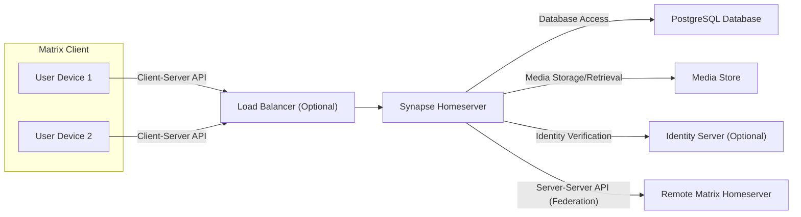
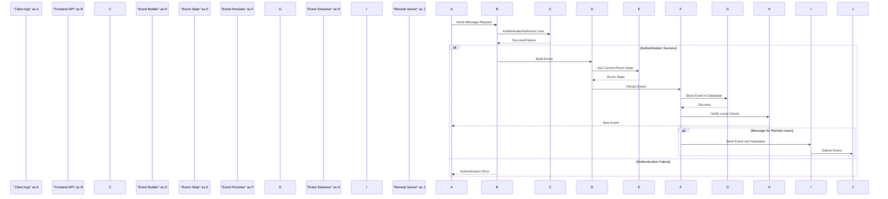
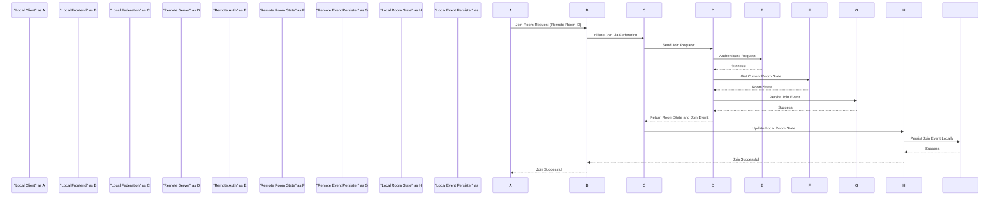

## Project Design Document: Matrix Synapse Homeserver (Improved)

**1. Introduction**

This document provides an enhanced architectural overview of the Matrix Synapse homeserver, building upon the previous version. It is specifically designed to facilitate comprehensive threat modeling. The document details key components, data flows, interactions, and security considerations within the Synapse system.

**2. Goals and Objectives**

*   Provide a more granular and detailed understanding of the Synapse architecture.
*   Clearly define the responsibilities and interactions of key components.
*   Illustrate major data flows with more specific examples.
*   Explicitly highlight security-relevant aspects and potential vulnerabilities within each component and data flow.
*   Serve as a robust and accurate foundation for identifying and analyzing potential threats.

**3. High-Level Architecture**

The Synapse homeserver serves as the core of a Matrix deployment, managing user accounts, rooms, messages, and federation with other Matrix servers. The following diagram illustrates the high-level architecture and key interactions:

**4. Detailed Architecture**

The Synapse homeserver is internally structured into several interconnected modules, each with specific responsibilities.

*   **Frontend (Client-Server HTTP API):**
    *   **Functionality:**  Handles all incoming requests from Matrix clients. Implements the Matrix Client-Server API specification. Provides endpoints for actions like sending messages, joining/leaving rooms, user registration, login, and profile management.
    *   **Security Considerations:**  Primary entry point for external interaction, making it a critical area for security. Vulnerable to web application attacks (XSS, CSRF, injection). Requires robust authentication and authorization mechanisms. Rate limiting is essential to prevent abuse. TLS encryption is mandatory for secure communication. Input validation and output encoding are crucial.

*   **Federation Handler (Server-Server HTTP API):**
    *   **Functionality:** Manages communication with other Matrix homeservers in the federation. Implements the Matrix Server-Server API specification. Handles incoming and outgoing requests for joining remote rooms, receiving messages from remote users, and sharing room state. Responsible for signature verification of remote events.
    *   **Security Considerations:**  Deals with inter-server trust and authentication. Vulnerable to attacks if cryptographic keys are compromised or if signature verification is flawed. Requires careful handling of remote server identities and potential for malicious or compromised remote servers. Susceptible to federation bombing or spam.

*   **Event Persister:**
    *   **Functionality:**  Responsible for writing and storing events (messages, state changes, etc.) into the PostgreSQL database. Ensures the durability and consistency of the event history, which forms the immutable record of Matrix conversations.
    *   **Security Considerations:**  Direct interaction with the database. Requires secure database credentials and access controls. Vulnerabilities here could lead to data corruption or loss. Protection against SQL injection is paramount.

*   **Event Streamer:**
    *   **Functionality:**  Provides a real-time stream of events to connected clients. Allows clients to stay synchronized with room activity and receive new messages and state updates.
    *   **Security Considerations:**  Ensuring only authorized clients receive event streams for rooms they are members of. Potential for information leakage if access controls are not properly enforced.

*   **Room State Manager:**
    *   **Functionality:**  Maintains the current state of each room, including membership, topic, power levels, and other settings. Calculates and updates room state based on incoming events. Resolves conflicts between concurrent state changes.
    *   **Security Considerations:**  Critical for enforcing room permissions and access control. Vulnerabilities could allow unauthorized users to modify room settings or gain elevated privileges.

*   **User Directory:**
    *   **Functionality:**  Manages user accounts, profiles, and device information. Provides mechanisms for searching and discovering users within the homeserver.
    *   **Security Considerations:**  Stores sensitive user information (passwords, email addresses, etc.). Requires strong password hashing and secure storage of credentials. Protection against account enumeration and unauthorized access to user data is vital.

*   **Media Repository:**
    *   **Functionality:**  Handles the storage, retrieval, and management of media files (images, videos, audio). Can store media locally on the file system or in an object storage service (e.g., AWS S3).
    *   **Security Considerations:**  Requires access controls to prevent unauthorized access to uploaded media. Vulnerable to path traversal attacks if not properly configured. Consider scanning uploaded media for malware. Ensure proper handling of private media.

*   **Push Notification Worker:**
    *   **Functionality:**  Generates and sends push notifications to users' devices when they receive new messages or mentions. Integrates with push notification services (e.g., Firebase Cloud Messaging, Apple Push Notification service).
    *   **Security Considerations:**  Handles sensitive information like device tokens. Misconfiguration could lead to notifications being sent to the wrong users. Secure storage and handling of push notification credentials are essential.

*   **Background Workers:**
    *   **Functionality:**  Perform asynchronous tasks that are not time-critical, such as:
        *   Retrying failed federation requests.
        *   Performing database maintenance tasks (e.g., pruning old data).
        *   Generating thumbnails for media files.
    *   **Security Considerations:**  Ensure these workers operate with appropriate permissions and do not introduce vulnerabilities through their execution.

*   **Admin API:**
    *   **Functionality:**  Provides administrative endpoints for managing the homeserver. Allows administrators to perform tasks such as user management, room management, server configuration, and monitoring.
    *   **Security Considerations:**  Requires strong authentication (e.g., API keys, OAuth 2.0) and strict authorization. Access should be limited to authorized administrators only. Vulnerabilities could lead to complete compromise of the homeserver. Audit logging of admin actions is crucial.

**5. Data Flow Diagrams**

**5.1. Sending a Message (Detailed):**

**5.2. Joining a Room (Federated):**

**6. Key Components and their Security Considerations (Detailed)**

*   **Frontend (Client-Server HTTP API):**
    *   **Specific Threats:** Cross-Site Scripting (XSS), Cross-Site Request Forgery (CSRF), SQL Injection (if directly querying the database, though less common), Authentication/Authorization bypass, Denial of Service (DoS), Account Takeover.
    *   **Mitigation Strategies:** Strict input validation and sanitization, output encoding, anti-CSRF tokens, secure session management (HTTPOnly, Secure flags), rate limiting, TLS encryption, regular security audits and penetration testing.

*   **Federation Handler (Server-Server HTTP API):**
    *   **Specific Threats:** Man-in-the-middle attacks, replay attacks, signature forgery, denial of service through resource exhaustion, malicious event injection from compromised servers, federation bombing.
    *   **Mitigation Strategies:** Robust signature verification using strong cryptographic algorithms (e.g., EdDSA), key pinning, TLS encryption for inter-server communication, rate limiting on incoming federation requests, blacklisting known malicious servers, careful monitoring of federation traffic.

*   **Event Persister:**
    *   **Specific Threats:** SQL Injection, data corruption, unauthorized data modification, denial of service through database overload.
    *   **Mitigation Strategies:** Parameterized queries or ORM usage to prevent SQL injection, strong database access controls, encryption at rest for sensitive data, regular database backups, monitoring of database performance and security logs.

*   **Media Repository:**
    *   **Specific Threats:** Unauthorized access to media files, path traversal vulnerabilities, malware uploads, denial of service through excessive storage usage.
    *   **Mitigation Strategies:** Secure access controls based on room membership, content security policies, input validation on file names and types, malware scanning of uploaded files, storage quotas, secure storage configurations.

*   **Admin API:**
    *   **Specific Threats:** Unauthorized access leading to complete server compromise, privilege escalation, data manipulation, denial of service.
    *   **Mitigation Strategies:** Strong authentication mechanisms (API keys, OAuth 2.0), role-based access control, audit logging of all admin actions, rate limiting, keeping the API surface small and well-defined.

**7. Data Storage**

*   **PostgreSQL Database:**
    *   **Data Stored:** User accounts, room metadata, event history (messages, state changes), device information, access tokens, federation state, application service registrations.
    *   **Security Considerations:**  Critical asset requiring strong security measures. Encryption at rest, access controls, regular backups, and monitoring are essential.

*   **Media Store (File System/Object Storage):**
    *   **Data Stored:** Uploaded media files (images, videos, audio).
    *   **Security Considerations:** Access controls to prevent unauthorized access, secure storage configurations, potential need for encryption at rest.

**8. Authentication and Authorization**

*   **Client Authentication:**
    *   **Methods:** Username/Password (with password hashing), Single Sign-On (SSO) via SAML or OpenID Connect, Application Service registration tokens, potentially others.
    *   **Security Considerations:**  Secure storage of password hashes (using strong hashing algorithms like Argon2), protection against brute-force attacks (rate limiting, account lockout), secure handling of SSO tokens.

*   **Authorization:**
    *   **Mechanisms:** Room-level permissions (power levels), Admin API access controls, Federation signature verification.
    *   **Security Considerations:**  Ensuring that authorization checks are correctly implemented and enforced throughout the system. Preventing privilege escalation vulnerabilities.

**9. Deployment Considerations**

*   **Infrastructure:**  Impacts security posture. Secure configuration of underlying operating systems, networks, and cloud infrastructure is crucial.
*   **Scalability:**  Security measures should scale with the system. Load balancers and multiple instances need consistent security configurations.
*   **High Availability:**  Security considerations should be integrated into high availability designs to prevent single points of failure from becoming security vulnerabilities.

**10. Future Considerations (Potential Areas for Threat Modeling Focus)**

*   **End-to-End Encryption (E2EE):** Key management, device verification, and trust models are complex and require thorough threat analysis.
*   **Third-Party Integrations (Application Services, Bridges):**  Security of these integrations needs careful assessment as they introduce new attack surfaces.
*   **Decentralization and Federation:**  Trust models and security implications of interacting with potentially untrusted remote servers.
*   **Privacy and Data Retention:**  Compliance with privacy regulations and secure handling of user data.

This improved design document provides a more detailed and security-focused overview of the Matrix Synapse homeserver, intended to be a valuable resource for comprehensive threat modeling activities.