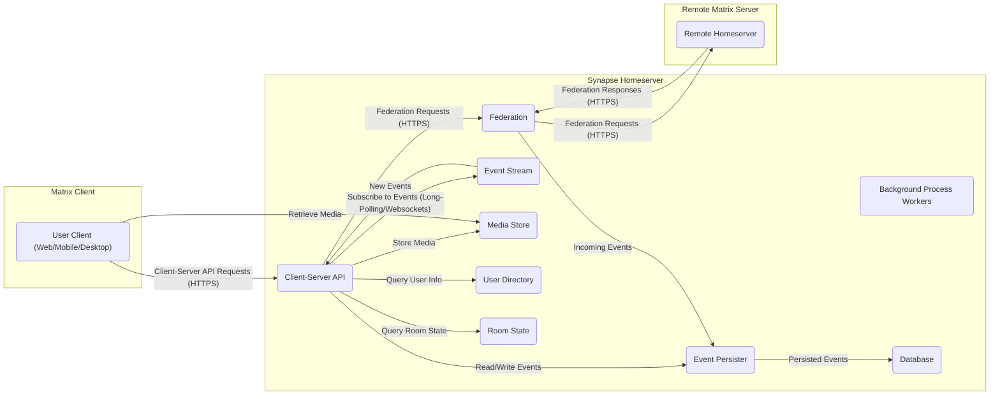
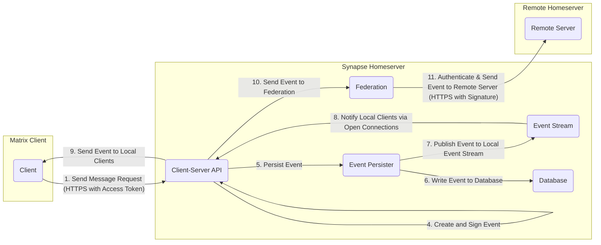
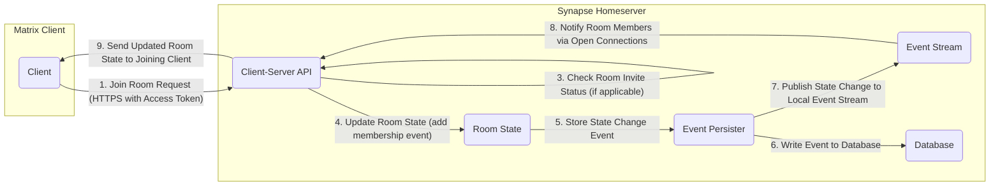
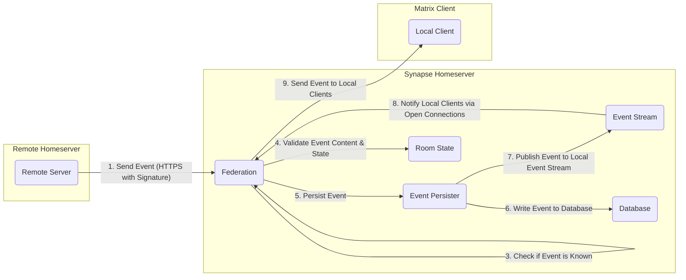

# Project Design Document: Synapse Homeserver

**Version:** 1.1
**Date:** October 26, 2023
**Author:** AI Software Architect

## 1. Introduction

This document provides a detailed design overview of the Synapse homeserver, a core component of the Matrix communication protocol. This document aims to provide a comprehensive understanding of Synapse's architecture, components, and data flow, which will serve as the foundation for subsequent threat modeling activities. This version includes more detail on component interactions and security considerations.

## 2. Goals

The primary goals of this design document are to:

* Clearly describe the architecture and key components of the Synapse homeserver.
* Outline the interactions between different components with more specificity.
* Detail the data flow within the system, including edge cases where applicable.
* Identify key security-relevant aspects of the design, providing more context.
* Provide a robust foundation for threat modeling exercises.

## 3. Scope

This document focuses on the core architectural design of the Synapse homeserver. It includes:

* High-level system architecture.
* Detailed descriptions of major components and their responsibilities, including inter-component communication.
* Data flow diagrams illustrating key interactions, including error handling or alternative paths where relevant.
* Overview of external dependencies and their roles.
* Key security considerations within the design, with examples of potential threats.

This document does not cover:

* Specific implementation details of individual modules (e.g., specific algorithms used).
* Operational procedures (e.g., detailed deployment scripts, monitoring dashboards).
* Granular API specifications (e.g., request/response schemas).
* Client-side implementations or the Matrix protocol specification in its entirety.

## 4. High-Level Architecture

The Synapse homeserver acts as the central hub for a Matrix deployment. It manages user accounts, rooms, messages, and federation with other Matrix servers.

## 5. Detailed Component Descriptions

This section provides more detailed descriptions of the major components of the Synapse homeserver:

* **Client-Server API:**
    * Exposes the Matrix Client-Server API over HTTPS.
    * Handles user authentication (password, SSO, etc.) and authorization based on access tokens.
    * Routes client requests to appropriate internal components.
    * Implements rate limiting to prevent abuse.
    * Performs input validation on client requests.
* **Federation:**
    * Implements the Matrix federation protocol over HTTPS using server-to-server APIs.
    * Handles authentication and authorization of requests from remote homeservers using digital signatures.
    * Manages the process of joining remote rooms and exchanging events.
    * Includes logic for handling federation conflicts and retries.
    * Responsible for fetching missing events from remote servers.
* **Event Persister:**
    * Receives validated events from the Client-Server API and Federation.
    * Writes events to the database in a consistent and durable manner.
    * Assigns unique identifiers and orders events.
    * May involve batching or queuing of writes for performance.
* **Event Stream:**
    * Maintains connections with active clients (using long-polling or WebSockets).
    * Publishes new events to clients who are members of the rooms the events belong to.
    * Manages backpressure to avoid overwhelming clients.
    * Handles reconnection logic for clients.
* **Background Process Workers:**
    * Executes asynchronous tasks that don't need immediate client response.
    * Examples include: sending email notifications, purging old data, generating thumbnails for media, processing device message receipts.
    * May use a task queue or similar mechanism for managing work.
* **Media Store:**
    * Stores uploaded media files, either on the local filesystem or in cloud storage (e.g., AWS S3).
    * Generates thumbnails and performs media conversions.
    * Enforces access controls on media files.
    * May integrate with antivirus scanners.
* **User Directory:**
    * Manages local user accounts, including usernames, passwords (hashed), and display names.
    * Provides search functionality for finding users.
    * May integrate with external authentication providers (LDAP, SAML).
* **Room State:**
    * Tracks the current state of each room, including membership, topic, power levels, and other settings.
    * Applies state resolution algorithms to ensure consistency in federated rooms.
    * Provides APIs for querying the current room state.
* **Database:**
    * Typically a PostgreSQL database.
    * Stores persistent data: events, user accounts, room state, media metadata, access tokens, etc.
    * Performance is critical for overall system responsiveness.
    * Requires proper indexing and schema design.

## 6. Data Flow

This section describes the typical data flow for key operations within Synapse with more detail:

### 6.1. Sending a Message

* A client sends a message request to the Client-Server API, including an access token for authentication.
* The API authenticates the user and authorizes the action (sending a message to that room).
* The API validates the message content to prevent malicious input.
* The API creates a new event, signs it with the server's private key, and passes it to the Event Persister.
* The Event Persister writes the event to the database.
* The Event Persister publishes the event to the local Event Stream.
* The Event Stream notifies relevant local clients via their open connections (long-polling or WebSockets).
* The Client-Server API sends the new event to those local clients.
* The Client-Server API passes the event to the Federation module.
* The Federation module authenticates with the remote server and sends the event over HTTPS, including a digital signature.

### 6.2. Joining a Room (Local User)

* A client sends a request to join a room to the Client-Server API, including an access token.
* The API authenticates the user and authorizes the join action.
* The API checks if the user has an outstanding invite to the room.
* The API instructs the Room State component to update the room's membership by adding a new membership event.
* The Event Persister stores this state change event in the database.
* The Event Persister publishes the state change to the local Event Stream.
* The Event Stream notifies other members of the room about the new joiner.
* The Client-Server API sends the updated room state to the joining client.

### 6.3. Receiving a Federated Message

* A remote homeserver sends an event to the Federation module over HTTPS, including a digital signature.
* The Federation module authenticates the sender and verifies the digital signature of the event.
* The Federation module checks if the event is already known to prevent duplicates.
* The Federation module validates the event content and its effect on the room state.
* The Federation module passes the validated event to the Event Persister.
* The Event Persister stores the event in the database.
* The Event Persister publishes the event to the local Event Stream.
* The Event Stream notifies relevant local clients.
* The Client-Server API sends the event to those local clients.

## 7. Key Security Considerations

The following are key security considerations inherent in the Synapse architecture, with examples of potential threats:

* **Authentication and Authorization:**
    * **Threats:** Brute-force attacks on login endpoints, compromised access tokens, privilege escalation due to authorization flaws.
    * **Mitigations:** Strong password policies, rate limiting on login attempts, secure storage of access tokens, robust authorization checks at each API endpoint.
* **Federation Security:**
    * **Threats:** Man-in-the-middle attacks on federation traffic, spoofing of remote servers, injection of malicious events from compromised servers.
    * **Mitigations:** Mandatory TLS for federation, verification of event signatures, blacklisting of malicious servers, proper handling of federation conflicts.
* **Data Privacy and Encryption:**
    * **Threats:** Unauthorized access to the database, eavesdropping on network traffic, exposure of encryption keys.
    * **Mitigations:** Encryption at rest for the database, TLS encryption for all network communication, secure key management practices, support for end-to-end encryption (although primarily a client responsibility).
* **Input Validation:**
    * **Threats:** SQL injection, cross-site scripting (XSS), command injection through maliciously crafted input.
    * **Mitigations:** Strict input validation on all data received from clients and other homeservers, parameterized queries for database interactions, output encoding to prevent XSS.
* **Rate Limiting and Denial of Service (DoS) Prevention:**
    * **Threats:**  Overwhelming the server with requests, exhausting resources, preventing legitimate users from accessing the service.
    * **Mitigations:** Rate limiting on API endpoints, connection limits, protection against distributed denial-of-service (DDoS) attacks (often handled at the infrastructure level).
* **Media Security:**
    * **Threats:** Unauthorized access to uploaded media, serving of malicious content, data breaches of stored media.
    * **Mitigations:** Access controls on media files, secure storage mechanisms, content security policies, integration with antivirus scanners.
* **Database Security:**
    * **Threats:** Unauthorized access to sensitive data, data breaches, data corruption.
    * **Mitigations:** Strong database credentials, network segmentation, encryption at rest, regular security audits, proper access controls within the database.
* **Code Security:**
    * **Threats:** Vulnerabilities in the Synapse codebase that could be exploited by attackers.
    * **Mitigations:** Secure coding practices, regular security audits and penetration testing, vulnerability scanning, timely patching of dependencies.
* **Dependency Management:**
    * **Threats:** Using vulnerable third-party libraries that could introduce security flaws.
    * **Mitigations:** Keeping dependencies up-to-date, using dependency scanning tools, reviewing security advisories for dependencies.

## 8. Deployment Architecture (More Detail)

Synapse can be deployed in various configurations, each with its own security and scalability implications. Common setups include:

* **Single Instance Deployment:**
    * All components (Synapse, database, media store) reside on a single server.
    * **Pros:** Simple to set up and manage.
    * **Cons:** Single point of failure, limited scalability.
    * **Security Considerations:**  Securing the single server is paramount.
* **Split Deployment:**
    * Synapse and the PostgreSQL database are on separate servers.
    * **Pros:** Improved performance and resilience compared to a single instance.
    * **Cons:** Increased complexity.
    * **Security Considerations:** Secure communication between Synapse and the database is crucial.
* **Clustered Deployment:**
    * Multiple Synapse instances behind a load balancer, sharing a common database.
    * **Pros:** High availability and scalability.
    * **Cons:** More complex to set up and manage.
    * **Security Considerations:** Secure communication between Synapse instances and the database, session management, and load balancer security are important.
* **Cloud-Native Deployment (e.g., Kubernetes):**
    * Deploying Synapse and its dependencies as containers within a Kubernetes cluster.
    * **Pros:** Highly scalable, resilient, and manageable.
    * **Cons:** Requires expertise in containerization and orchestration.
    * **Security Considerations:**  Securing the Kubernetes cluster, container images, and network policies are critical.

Regardless of the deployment architecture, a reverse proxy (e.g., Nginx, Apache) is typically used for:

* **TLS Termination:** Handling SSL/TLS encryption and decryption.
* **Load Balancing:** Distributing traffic across multiple Synapse instances (in clustered setups).
* **Request Routing:** Directing requests to the appropriate backend servers.
* **Basic Security Measures:** Implementing features like request filtering and header manipulation.

## 9. External Dependencies

Synapse relies on several external components and libraries, including:

* **PostgreSQL:** The primary relational database for storing persistent data. Version compatibility is important for stability and security updates.
* **Python Libraries:** A vast ecosystem of Python packages used for various functionalities. Specific examples include:
    * **Twisted:** An event-driven networking engine, core to Synapse's architecture.
    * **attrs:** For defining classes without boilerplate.
    * **PyYAML:** For parsing YAML configuration files.
    * **requests:** For making HTTP requests (especially for federation).
    * **Pillow (PIL):** For image manipulation in the media store.
* **OpenSSL/LibreSSL:** Provides cryptographic primitives for secure communication and data handling.
* **Redis (Optional):** Used for caching, pub/sub functionality, and rate limiting. If used, its own security needs to be considered.
* **Identity Providers (Optional):** For integration with external authentication systems like:
    * **SAML 2.0 Providers:** For enterprise single sign-on.
    * **OAuth 2.0 Providers:** For social login or other delegated authentication schemes.

## 10. Future Considerations

Potential future enhancements and changes that could impact the architecture include:

* **Performance Optimizations:** Continued efforts to improve scalability and reduce resource consumption, potentially involving architectural changes like sharding the database or optimizing event storage.
* **Improved Federation Reliability and Efficiency:** Exploring more robust and efficient federation protocols, potentially leveraging newer technologies or architectural patterns for distributed systems.
* **Decentralized Identity Solutions:** Investigating and potentially integrating with decentralized identity systems to reduce reliance on centralized account management.
* **Enhanced End-to-End Encryption Features:**  Further development of encryption capabilities, such as improving key management or supporting new encryption algorithms.
* **Modularization of Components:**  Breaking down Synapse into smaller, more independent services to improve maintainability and scalability.
* **Support for New Matrix Features:** Adapting the architecture to accommodate new features and extensions to the Matrix protocol.

This document provides a more detailed understanding of the Synapse homeserver architecture, building upon the previous version with greater specificity in component interactions, data flow, and security considerations. It remains a valuable resource for threat modeling and further analysis.
