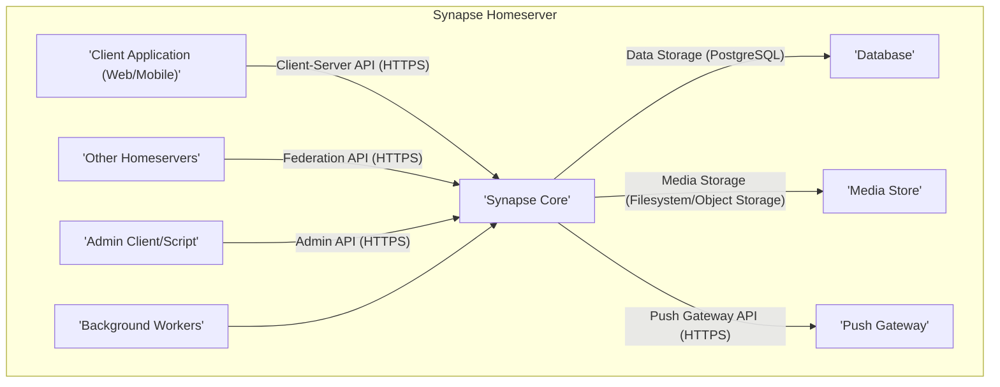
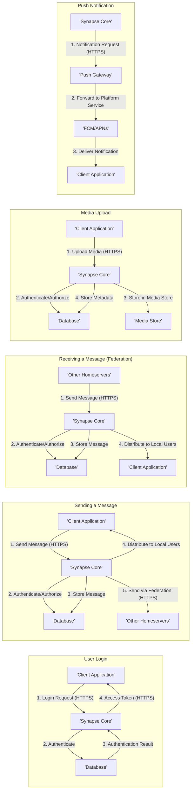

# Project Design Document: Matrix Synapse Homeserver

**Version:** 1.1
**Date:** October 26, 2023
**Author:** Gemini (AI Language Model)

## 1. Introduction

This document provides a detailed design overview of the Matrix Synapse homeserver, an open-source server implementation of the Matrix protocol. This document is intended to serve as a robust foundation for subsequent threat modeling activities. It meticulously outlines the key components, data flows, and interactions within the Synapse architecture, providing the necessary context for identifying potential security vulnerabilities.

## 2. Goals

* Deliver a clear and comprehensive description of the Synapse architecture, suitable for security analysis.
* Precisely identify key components and delineate their specific responsibilities within the system.
* Clearly illustrate the primary data flows, highlighting sensitive data pathways.
* Emphasize important interfaces and interactions, particularly those exposed to external entities.
* Serve as a well-defined basis for identifying potential security threats, vulnerabilities, and attack vectors.

## 3. Scope

This document comprehensively covers the core architectural components of a single Synapse homeserver instance. It includes a detailed examination of:

* Client-server API interactions, including key endpoints and data structures.
* Federation with other Matrix homeservers, focusing on the exchange of data and trust assumptions.
* Data storage mechanisms, detailing the types of data stored and their persistence.
* Background processing and workers, outlining their roles and potential security implications.
* Media handling, including upload, storage, and retrieval processes.
* Push notification functionality, from event triggering to delivery to user devices.
* Administrative interfaces, detailing access controls and available operations.

This document intentionally excludes:

* Specific deployment configurations beyond general considerations (e.g., detailed reverse proxy configurations, specific load balancing algorithms).
* Granular database schema details, focusing instead on the logical data categories.
* Highly specific implementation details within individual modules, maintaining a focus on architectural overview.
* Third-party integrations beyond the fundamental aspects of federation.

## 4. Target Audience

This document is primarily intended for:

* Security engineers and architects tasked with performing threat modeling and security assessments.
* Software developers working on the Synapse project or integrating with its APIs.
* Operations teams responsible for the secure deployment, configuration, and maintenance of Synapse instances.

## 5. System Overview

Synapse is architected as a monolithic application providing the essential functionalities of a Matrix homeserver. It manages user authentication, room lifecycle, message routing, secure federation with other servers, and reliable data persistence.

Here's a high-level architectural diagram illustrating the key components and their relationships:

## 6. Detailed Component Description

This section provides a detailed description of the key components within the Synapse homeserver:

* **Client Application (Web/Mobile):**
    * Represents the user-facing interface through which users interact with the Matrix network.
    * Communicates with the Synapse homeserver exclusively via the documented Client-Server API over HTTPS.
    * Examples include popular Matrix clients like Element, Nheko, and various other community-developed applications.

* **Synapse Core:**
    * The central processing unit of the homeserver, encapsulating the core business logic and functionality.
    * Responsible for:
        * User authentication and authorization based on provided credentials and access tokens.
        * Management of rooms, including creation, membership tracking, and permission enforcement.
        * Routing messages between local users and facilitating communication with federated servers.
        * Implementing the specifications of the Matrix Client-Server API and the Matrix Federation API.
        * Orchestrating interactions with other internal components to fulfill requests.

* **Data Storage (PostgreSQL):**
    * Serves as the primary persistent storage mechanism for all critical Synapse data.
    * Stores a wide range of information, including:
        * User account details (usernames, passwords hashes, profile information).
        * Room state information (membership lists, topic, settings).
        * Message history and associated metadata.
        * User device information (device IDs, access tokens, push notification tokens).
        * Other server configuration and operational data.
    * PostgreSQL is the officially supported and recommended database backend.

* **Media Store (Filesystem/Object Storage):**
    * Dedicated to the storage and retrieval of uploaded media files, such as images, videos, and audio.
    * Offers flexibility in configuration, supporting either the local filesystem or cloud-based object storage services like AWS S3 or similar.

* **Push Gateway:**
    * The intermediary responsible for relaying push notifications to user devices through platform-specific services.
    * Communicates with services like Firebase Cloud Messaging (FCM) for Android and Apple Push Notification service (APNs) for iOS.
    * Synapse integrates with a configurable push gateway, allowing for customization or the use of third-party solutions.

* **Background Workers:**
    * Execute asynchronous and deferred tasks that are not critical for immediate user request processing.
    * Examples of tasks handled by background workers include:
        * Processing incoming federation events from other homeservers.
        * Expiring and purging old or unnecessary data to maintain database efficiency.
        * Generating thumbnails and other derivatives of uploaded media files.

* **Admin Client/Script:**
    * Represents the tools and interfaces used by administrators to manage and monitor the Synapse homeserver.
    * Interacts with the homeserver via the secure Admin API to perform actions such as:
        * User management (creation, deletion, password resets, modification of user attributes).
        * Server configuration adjustments and parameter tuning.
        * Monitoring server health, performance metrics, and activity logs.
        * Room management tasks, including moderation and administrative actions.

* **Other Homeservers:**
    * Represents external Matrix homeservers participating in the federated Matrix network.
    * Communicate with the local Synapse instance using the secure Matrix Federation API over HTTPS.

## 7. Key Interfaces and Interactions

This section details the primary interfaces through which components interact and exchange data:

* **Client-Server API:**
    * A RESTful API accessed over HTTPS, serving as the primary interface for client applications.
    * Key endpoints include:
        * `/register`: User registration.
        * `/login`: User authentication.
        * `/sync`:  Retrieving new events and updates.
        * `/rooms/{roomId}/send/{eventType}`: Sending messages and other events.
        * `/rooms/{roomId}/state`: Retrieving room state.
        * `/profile/{userId}`: Managing user profiles.

* **Federation API:**
    * A server-to-server API, also based on HTTPS, enabling communication and data exchange between Matrix homeservers.
    * Key endpoints include:
        * `/send_join/{roomId}/{eventId}`: Requesting to join a room.
        * `/send/{roomId}/{eventId}`: Sending events to a room.
        * `/state_ids/{roomId}`: Retrieving the state IDs of a room.
        * `/backfill/{roomId}`: Requesting historical events.

* **Admin API:**
    * A privileged API accessed over HTTPS, requiring administrative authentication.
    * Provides endpoints for:
        * `/users`: Managing user accounts.
        * `/server_notice`: Sending server-wide notices.
        * `/rooms`: Managing rooms.
        * `/statistics`: Retrieving server statistics.

* **Push Gateway API:**
    * An HTTPS-based API used by Synapse to communicate with the configured push gateway.
    * Involves sending requests containing device tokens and notification payloads.

* **Database Interaction:**
    * Synapse Core interacts with the PostgreSQL database using standard database drivers (e.g., psycopg2).
    * Involves executing SQL queries for data retrieval, insertion, updates, and deletion.

* **Media Storage Interaction:**
    * Synapse Core interacts with the media store using either filesystem operations or API calls specific to the object storage service.
    * Involves operations for uploading, downloading, and managing media files.

## 8. Data Flows

This section illustrates the primary data flows within the Synapse system, highlighting the movement of information between components:

* **User Login:**
    * "'Client Application'" sends login credentials (username/password or other authentication methods) to "'Synapse Core'" via the Client-Server API over HTTPS.
    * "'Synapse Core'" authenticates the user by verifying the provided credentials against the stored information in the "'Database'".
    * Upon successful authentication, "'Synapse Core'" generates and returns an access token to the "'Client Application'" via HTTPS.

* **Sending a Message:**
    * "'Client Application'" sends a message payload to "'Synapse Core'" via the Client-Server API over HTTPS, including the destination room ID and message content.
    * "'Synapse Core'" authenticates and authorizes the request using the provided access token and room permissions stored in the "'Database'".
    * "'Synapse Core'" stores the message content and metadata in the "'Database'".
    * "'Synapse Core'" distributes the message to all currently connected local room members via their active Client-Server API connections.
    * For remote room members, "'Synapse Core'" forwards the message to the respective "'Other Homeservers'" via the Federation API over HTTPS.

* **Receiving a Message (Local User):**
    * "'Synapse Core'" receives a new message event (either from a local client or via federation).
    * "'Synapse Core'" persists the message in the "'Database'".
    * "'Synapse Core'" notifies connected local clients about the new message event through their established Client-Server API connections (typically using long-polling or WebSockets).

* **Receiving a Message (Federation):**
    * A "'Other Homeserver'" sends a message event to the local "'Synapse Core'" instance via the Federation API over HTTPS.
    * "'Synapse Core'" authenticates and authorizes the incoming request, verifying the sender's identity and permissions.
    * "'Synapse Core'" stores the received message event in the "'Database'".
    * "'Synapse Core'" distributes the message to the appropriate local room members.

* **Media Upload:**
    * "'Client Application'" uploads a media file to "'Synapse Core'" via a specific Client-Server API endpoint over HTTPS.
    * "'Synapse Core'" authenticates and authorizes the upload request.
    * "'Synapse Core'" stores the uploaded media file in the "'Media Store'".
    * "'Synapse Core'" stores metadata about the uploaded media (e.g., filename, MIME type, size) in the "'Database'".

* **Push Notification:**
    * When a new message arrives for a user, "'Synapse Core'" evaluates if a push notification should be triggered based on user settings and device information stored in the "'Database'".
    * If a notification is required, "'Synapse Core'" sends a notification request, including the device token and notification payload, to the configured "'Push Gateway'" via the Push Gateway API over HTTPS.
    * The "'Push Gateway'" forwards the notification to the appropriate platform-specific push notification service (e.g., "'FCM/APNs'").
    * The platform-specific service delivers the push notification to the user's "'Client Application'".

## 9. Security Considerations

This section outlines key security considerations for the Synapse homeserver, providing a starting point for threat modeling:

* **Authentication and Authorization:**
    * **Threat:** Weak password policies leading to compromised accounts.
    * **Threat:** Vulnerabilities in the login process allowing for brute-force attacks or credential stuffing.
    * **Threat:** Insecure storage of password hashes in the "'Database'".
    * **Threat:** Insufficient authorization checks allowing users to access resources or perform actions they are not permitted to.

* **Federation Security:**
    * **Threat:** Man-in-the-middle attacks on Federation API calls, potentially intercepting or modifying sensitive data.
    * **Threat:** Spoofing of remote homeserver identities, leading to trust exploitation.
    * **Threat:** Receiving and processing malicious or malformed events from compromised or malicious "'Other Homeservers'".
    * **Threat:** Denial-of-service attacks originating from the federation, overwhelming the local server.

* **Data Storage Security:**
    * **Threat:** Unauthorized access to the "'Database'" or "'Media Store'", leading to data breaches.
    * **Threat:** Lack of encryption for sensitive data at rest in the "'Database'" (e.g., message content, private user data).
    * **Threat:** Insufficient access controls on the "'Database'" allowing unauthorized modifications or deletions.
    * **Threat:** Vulnerabilities in backup and restore processes, potentially exposing sensitive data.

* **API Security (Client-Server and Admin):**
    * **Threat:** Injection attacks (e.g., SQL injection, command injection) due to insufficient input validation.
    * **Threat:** Cross-site scripting (XSS) vulnerabilities allowing malicious scripts to be injected into the client application.
    * **Threat:** Cross-site request forgery (CSRF) attacks forcing authenticated users to perform unintended actions.
    * **Threat:** API endpoint vulnerabilities allowing unauthorized data access or modification.
    * **Threat:** Lack of rate limiting or request throttling leading to denial-of-service attacks or resource exhaustion.

* **Push Notification Security:**
    * **Threat:** Unauthorized sending of push notifications, potentially spamming users.
    * **Threat:** Exposure of sensitive information within push notification payloads.
    * **Threat:** Compromise of the "'Push Gateway'" or communication channels, allowing for manipulation of notifications.

* **Admin API Security:**
    * **Threat:** Weak or default credentials for administrative accounts.
    * **Threat:** Unauthorized access to the Admin API, allowing malicious actors to control the homeserver.
    * **Threat:** Insufficient auditing of administrative actions, hindering incident response.

* **Media Security:**
    * **Threat:** Serving malicious or inappropriate content from the "'Media Store'".
    * **Threat:** Unauthorized access to stored media files.
    * **Threat:** Information leakage through media metadata.

## 10. Deployment Considerations

* Synapse is primarily deployed as a Python application, typically utilizing a virtual environment for dependency management.
* Requires a properly configured PostgreSQL database instance for persistent data storage.
* Deployment can be done directly on a physical or virtual server or within containerized environments using tools like Docker and Kubernetes.
* Implementing a reverse proxy (e.g., Nginx, Apache) is highly recommended for SSL/TLS termination, load balancing, and enhanced security.
* Configuration of the "'Media Store'" involves choosing between local filesystem storage or integration with object storage services like AWS S3, requiring appropriate access credentials and permissions.
* Push notification functionality necessitates configuration with a compatible "'Push Gateway'" service and the provision of API keys or credentials for platform-specific services (FCM, APNs).
* Regular security updates and patching of Synapse and its dependencies are crucial for mitigating known vulnerabilities.

## 11. Technologies Used

* **Primary Programming Language:** Python 3
* **Database System:** PostgreSQL
* **Asynchronous Networking Library:** Twisted
* **Web Application Framework Components:**  Utilizes various Python libraries for web handling, including those within Twisted.
* **Communication Protocol:** HTTPS with TLS encryption
* **Data Serialization Format:** JSON
* **Federation Protocol:** Matrix Federation Protocol (specification defines the HTTPS and JSON-based communication between servers)

## 12. Future Considerations

* Further detailed analysis of specific security mechanisms implemented within each component (e.g., cryptographic algorithms, input validation routines).
* Comprehensive identification and documentation of potential attack vectors and associated vulnerabilities.
* Development and adherence to secure coding practices throughout the Synapse codebase.
* Implementation of robust security testing methodologies, including penetration testing and vulnerability scanning.
* Ongoing monitoring and logging of security-relevant events for threat detection and incident response.
* Exploration of advanced security features such as end-to-end encryption verification and device verification.

This document provides a significantly enhanced and more detailed understanding of the Matrix Synapse homeserver architecture, specifically tailored for effective threat modeling. It serves as a valuable resource for security professionals and developers alike.