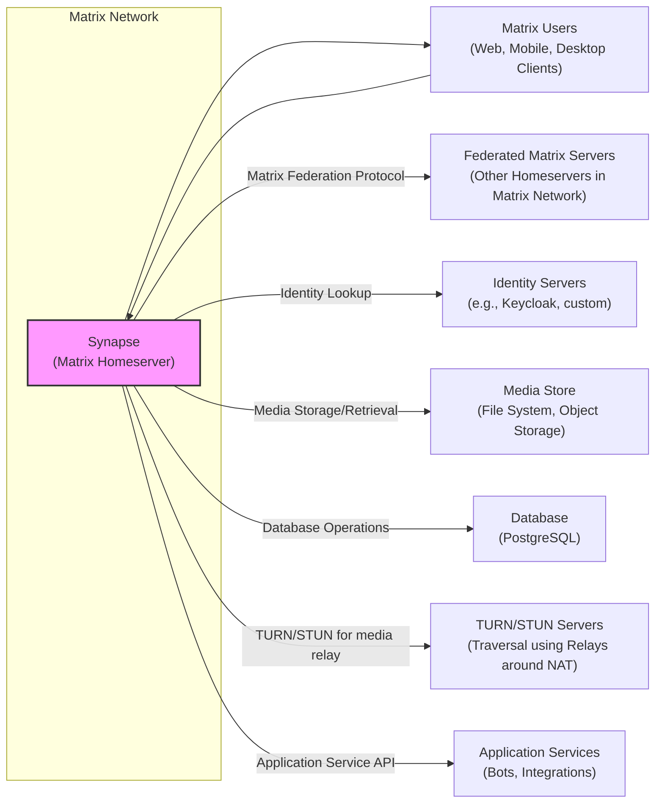
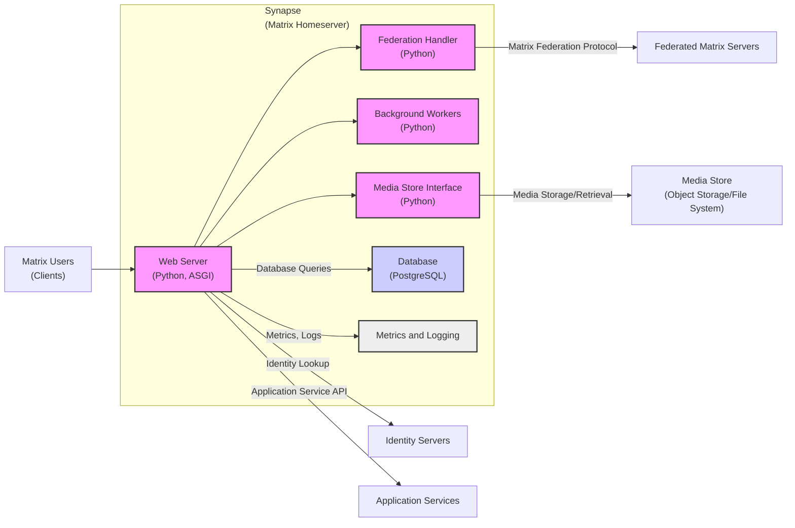
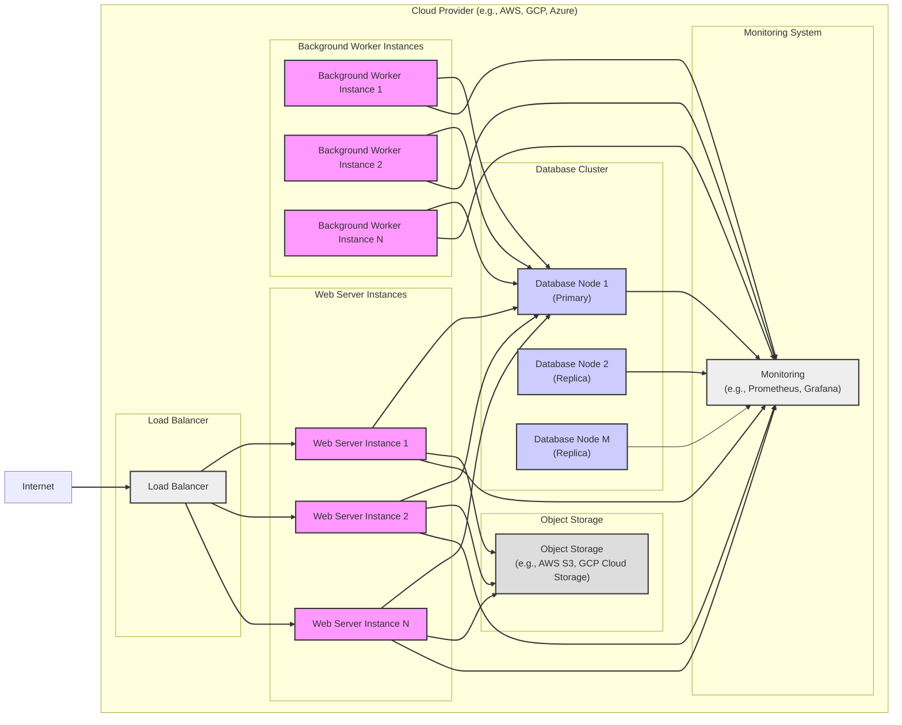
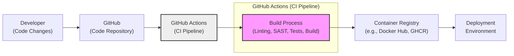

# BUSINESS POSTURE

- Business Priorities and Goals:
  - Provide a reliable and scalable Matrix homeserver implementation.
  - Enable decentralized and open communication for users.
  - Support the Matrix open standard for interoperability.
  - Offer a secure platform for real-time communication and collaboration.
- Business Risks:
  - Data breaches and unauthorized access to user data.
  - Service disruptions and downtime impacting communication availability.
  - Privacy violations and non-compliance with data protection regulations.
  - Reputational damage due to security incidents or service failures.
  - Legal and financial liabilities arising from security vulnerabilities or data breaches.

# SECURITY POSTURE

- Existing Security Controls:
  - security control: HTTPS for web traffic encryption. Implemented in web server configuration.
  - security control: Database encryption for sensitive data at rest. Implementation details in database configuration and schema.
  - security control: Access control mechanisms to manage user permissions and roles. Implemented within the application logic.
  - security control: Code review process for contributions. Implemented as part of the GitHub contribution workflow.
- Accepted Risks:
  - accepted risk: Potential vulnerabilities in third-party dependencies. Mitigation through dependency scanning and updates.
  - accepted risk: Misconfiguration of deployment environment leading to security weaknesses. Mitigation through documented deployment procedures and infrastructure as code.
  - accepted risk: Social engineering attacks targeting users or administrators. Mitigation through security awareness training and multi-factor authentication.
- Recommended Security Controls:
  - security control: Implement regular security audits and penetration testing to identify vulnerabilities.
  - security control: Establish a bug bounty program to incentivize external security researchers to report vulnerabilities.
  - security control: Integrate automated security scanning tools (SAST/DAST) into the CI/CD pipeline.
  - security control: Provide security training for developers on secure coding practices and common vulnerabilities.
  - security control: Implement rate limiting and input validation to protect against denial-of-service and injection attacks.
- Security Requirements:
  - Authentication:
    - Requirement: Secure user authentication mechanisms.
    - Requirement: Support for strong password policies and enforcement.
    - Requirement: Consider multi-factor authentication (MFA) options.
  - Authorization:
    - Requirement: Role-based access control (RBAC) to manage user permissions.
    - Requirement: Fine-grained authorization for accessing resources and performing actions.
    - Requirement: Principle of least privilege should be applied to user and service accounts.
  - Input Validation:
    - Requirement: Comprehensive input validation for all user-provided data.
    - Requirement: Protection against common injection attacks (SQL injection, XSS, etc.).
    - Requirement: Input sanitization and encoding to prevent malicious input from being processed.
  - Cryptography:
    - Requirement: End-to-end encryption for Matrix messages (Matrix specification requirement).
    - Requirement: Encryption of sensitive data at rest and in transit.
    - Requirement: Secure key management practices for cryptographic keys.
    - Requirement: Use of well-vetted and up-to-date cryptographic libraries.

# DESIGN

## C4 CONTEXT

- Context Diagram Elements:
  - Element:
    - Name: Synapse (Matrix Homeserver)
    - Type: Software System
    - Description: The Matrix homeserver software responsible for managing user accounts, rooms, messages, and federation within the Matrix network. It is the core component of a Matrix deployment.
    - Responsibilities: User authentication and authorization, message routing and persistence, room management, federation with other Matrix servers, media storage management, application service integration.
    - Security controls: Access control, input validation, authentication mechanisms, authorization policies, encryption at rest and in transit, security logging and monitoring.
  - Element:
    - Name: Matrix Users (Web, Mobile, Desktop Clients)
    - Type: Person/Software System
    - Description: Users interacting with the Matrix network through various client applications (web browsers, mobile apps, desktop clients). These clients communicate with Synapse to send and receive messages, join rooms, and manage their accounts.
    - Responsibilities: User interface for Matrix communication, message rendering, user input handling, communication with Synapse API.
    - Security controls: Client-side encryption (end-to-end encryption), secure storage of user credentials, protection against client-side vulnerabilities (e.g., XSS).
  - Element:
    - Name: Identity Servers (e.g., Keycloak, custom)
    - Type: Software System
    - Description: External or internal identity providers used for user authentication and identity management. Synapse can integrate with identity servers to delegate authentication and potentially user provisioning.
    - Responsibilities: User authentication, identity verification, potentially user provisioning and management.
    - Security controls: Authentication protocols (OAuth 2.0, OpenID Connect), secure storage of user credentials, access control to identity data.
  - Element:
    - Name: TURN/STUN Servers (Traversal using Relays around NAT)
    - Type: Software System
    - Description: Servers used for media relay and NAT traversal to enable peer-to-peer communication for voice and video calls in Matrix, especially when users are behind Network Address Translation (NAT).
    - Responsibilities: Media relaying, NAT traversal assistance for WebRTC connections.
    - Security controls: Secure communication protocols (DTLS, SRTP), access control to media relay services.
  - Element:
    - Name: Federated Matrix Servers (Other Homeservers in Matrix Network)
    - Type: Software System
    - Description: Other Matrix homeservers in the decentralized Matrix network. Synapse federates with these servers to allow users on different homeservers to communicate with each other.
    - Responsibilities: Federation protocol implementation, inter-server communication, message and event synchronization across the Matrix network.
    - Security controls: Federation protocol security (signature verification, content integrity), access control for federation requests, protection against federation-related attacks.
  - Element:
    - Name: Application Services (Bots, Integrations)
    - Type: Software System
    - Description: External applications and services that integrate with Synapse through the Application Service API to extend functionality, such as bots, bridges to other platforms, and custom integrations.
    - Responsibilities: Providing extended functionality to Matrix users, interacting with Synapse API to send and receive messages and events.
    - Security controls: API authentication and authorization, input validation for API requests, secure handling of API credentials.
  - Element:
    - Name: Database (PostgreSQL)
    - Type: Data Store
    - Description: The database system used by Synapse to persist data, including user accounts, messages, rooms, and server configuration. PostgreSQL is a common choice.
    - Responsibilities: Data persistence, data retrieval, data integrity, database management.
    - Security controls: Database access control, database encryption at rest, regular database backups, database security hardening.
  - Element:
    - Name: Media Store (File System, Object Storage)
    - Type: Data Store
    - Description: Storage system used by Synapse to store media files (images, videos, audio) uploaded by users. Can be a local file system or object storage like AWS S3.
    - Responsibilities: Media file storage, media file retrieval, media file management.
    - Security controls: Access control to media files, secure storage of media files, protection against unauthorized media access.

## C4 CONTAINER

- Container Diagram Elements:
  - Element:
    - Name: Web Server (Python, ASGI)
    - Type: Container
    - Description: The primary container responsible for handling incoming HTTP requests from Matrix clients and other services. It exposes the Matrix Client-Server API and Application Service API. Implemented in Python using an ASGI framework.
    - Responsibilities: API endpoint handling, request routing, authentication and authorization, business logic execution, interaction with other containers, serving web client assets.
    - Security controls: Input validation, authentication and authorization mechanisms, rate limiting, HTTPS enforcement, security logging, protection against web application vulnerabilities.
  - Element:
    - Name: Federation Handler (Python)
    - Type: Container
    - Description: Handles Matrix federation protocol interactions with other Matrix homeservers. Manages inbound and outbound federation requests, event synchronization, and server-to-server communication. Implemented in Python.
    - Responsibilities: Matrix federation protocol implementation, event processing, signature verification, server key management, communication with federated servers.
    - Security controls: Federation protocol security mechanisms, signature verification, content integrity checks, access control for federation requests, protection against federation-specific attacks.
  - Element:
    - Name: Background Workers (Python)
    - Type: Container
    - Description: Executes asynchronous and background tasks, such as processing deferred events, sending notifications, and performing maintenance operations. Implemented in Python.
    - Responsibilities: Asynchronous task processing, background job execution, event queue management, scheduled tasks.
    - Security controls: Secure task queuing and processing, access control for task execution, monitoring of background worker processes.
  - Element:
    - Name: Media Store Interface (Python)
    - Type: Container
    - Description: Provides an interface for storing and retrieving media files. Abstracting the underlying media storage system (file system or object storage). Implemented in Python.
    - Responsibilities: Media file upload and download, media file management, interaction with the media storage backend.
    - Security controls: Access control to media files, secure media storage configuration, input validation for media file operations.
  - Element:
    - Name: Database (PostgreSQL)
    - Type: Container
    - Description: Relational database system used for persistent storage of Synapse data. PostgreSQL is the recommended database.
    - Responsibilities: Data persistence, data retrieval, transactional integrity, database management.
    - Security controls: Database access control, database encryption at rest, regular database backups, database security hardening, connection security.
  - Element:
    - Name: Metrics and Logging
    - Type: Container/Component
    - Description: System for collecting metrics and logs from Synapse components for monitoring, alerting, and security analysis. Can integrate with external monitoring and logging systems.
    - Responsibilities: Metrics collection, log aggregation, monitoring data provision, alerting integration.
    - Security controls: Secure logging configuration, access control to logs and metrics data, protection of sensitive information in logs.

## DEPLOYMENT

- Possible Deployment Architectures:
  - Single Server Deployment: All components (Web Server, Database, Media Store) on a single server. Suitable for small deployments or development environments.
  - Scalable Deployment: Web Servers, Background Workers, and Database are scaled horizontally across multiple servers. Media Store can be object storage. Suitable for production environments requiring high availability and scalability.
- Detailed Deployment Architecture (Scalable Cloud Deployment):

- Deployment Diagram Elements:
  - Element:
    - Name: Load Balancer
    - Type: Infrastructure Component
    - Description: Distributes incoming traffic across multiple Web Server Instances for high availability and scalability. Can be a cloud provider's managed load balancer (e.g., AWS ELB, GCP Load Balancer).
    - Responsibilities: Traffic distribution, health checks, SSL termination, routing.
    - Security controls: DDoS protection, SSL/TLS configuration, access control to load balancer management.
  - Element:
    - Name: Web Server Instances
    - Type: Compute Instance (VM, Container)
    - Description: Multiple instances of the Web Server container running on virtual machines or containers. Handles client requests and application logic.
    - Responsibilities: API request processing, application execution, communication with other components.
    - Security controls: Instance hardening, security updates, network security groups, intrusion detection systems.
  - Element:
    - Name: Background Worker Instances
    - Type: Compute Instance (VM, Container)
    - Description: Multiple instances of the Background Worker container for processing asynchronous tasks.
    - Responsibilities: Background task execution, event processing, queue management.
    - Security controls: Instance hardening, security updates, network security groups, access control for task queues.
  - Element:
    - Name: Database Cluster
    - Type: Managed Database Service
    - Description: Clustered database system (e.g., PostgreSQL managed service like AWS RDS, GCP Cloud SQL) for high availability and data redundancy. Includes primary and replica nodes.
    - Responsibilities: Data persistence, high availability, data replication, database management.
    - Security controls: Database access control, database encryption at rest and in transit, regular backups, database security hardening, network isolation.
  - Element:
    - Name: Object Storage (e.g., AWS S3, GCP Cloud Storage)
    - Type: Cloud Storage Service
    - Description: Cloud-based object storage service for storing media files. Scalable and durable storage.
    - Responsibilities: Media file storage, media file retrieval, data durability.
    - Security controls: Access control policies, encryption at rest, data integrity checks, versioning.
  - Element:
    - Name: Monitoring System (e.g., Prometheus, Grafana)
    - Type: Monitoring Infrastructure
    - Description: System for monitoring the health and performance of Synapse components. Collects metrics and logs for alerting and analysis.
    - Responsibilities: Monitoring data collection, alerting, visualization, logging aggregation.
    - Security controls: Access control to monitoring data, secure monitoring agent configuration, secure storage of monitoring data.

## BUILD

- Build Process Description:
  - Developer commits code changes to the GitHub repository.
  - GitHub Actions CI pipeline is triggered on code changes (e.g., push, pull request).
  - Build Process within CI pipeline includes:
    - Linting: Code style checks and static analysis for code quality.
    - SAST (Static Application Security Testing): Security scanning of source code for vulnerabilities.
    - Unit and Integration Tests: Automated tests to verify code functionality.
    - Build: Compilation, packaging, and container image creation (Docker image).
  - Build artifacts (e.g., Docker images) are pushed to a Container Registry (e.g., Docker Hub, GitHub Container Registry).
  - Deployment environment pulls container images from the Container Registry for deployment.
- Build Security Controls:
  - security control: Automated CI/CD pipeline using GitHub Actions for build automation and repeatability.
  - security control: Source code linting and static analysis to enforce code quality and identify potential issues early.
  - security control: SAST (Static Application Security Testing) integrated into the CI pipeline to detect security vulnerabilities in the code.
  - security control: Comprehensive suite of unit and integration tests to ensure code functionality and prevent regressions.
  - security control: Dependency scanning to identify vulnerabilities in third-party libraries and dependencies.
  - security control: Container image scanning to detect vulnerabilities in base images and dependencies within container images.
  - security control: Secure storage and access control for build artifacts in the Container Registry.
  - security control: Code signing or image signing to ensure the integrity and authenticity of build artifacts.
  - security control: Review and approval process for changes to the CI/CD pipeline configuration.

# RISK ASSESSMENT

- Critical Business Processes:
  - Matrix Message Delivery: Ensuring reliable and secure delivery of messages between users.
  - User Authentication and Authorization: Securely verifying user identities and controlling access to resources.
  - Matrix Federation: Maintaining secure and reliable communication with other Matrix homeservers.
  - Data Storage and Persistence: Protecting the confidentiality, integrity, and availability of user data and server configuration.
- Data Sensitivity:
  - User Messages: Highly sensitive, personal and private communication. Requires confidentiality and integrity.
  - User Credentials (Passwords, Access Tokens): Highly sensitive, requires strong confidentiality and integrity.
  - User Profiles and Metadata: Sensitive, contains personal information and communication patterns. Requires confidentiality and integrity.
  - Server Configuration: Sensitive, if compromised can lead to service disruption or security breaches. Requires integrity and availability.

# QUESTIONS & ASSUMPTIONS

- Questions:
  - What is the expected scale of the Synapse deployment (number of users, messages per day, etc.)?
  - Are there specific compliance requirements (e.g., GDPR, HIPAA) that need to be addressed?
  - What is the organization's risk tolerance and security budget for this project?
  - What are the specific performance and availability requirements for the Synapse service?
  - Are there any existing security policies or standards that Synapse deployment must adhere to?
- Assumptions:
  - Security is a high priority for the Synapse project and its users.
  - Standard best practices for web application security and cloud security are applicable.
  - The deployment environment will be a modern cloud infrastructure or a well-managed on-premises environment.
  - The organization deploying Synapse has resources and expertise to operate and maintain the system securely.
  - The open-source nature of Synapse allows for community security reviews and contributions.