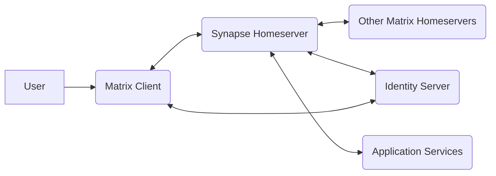
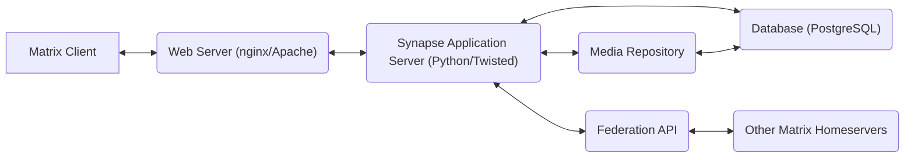
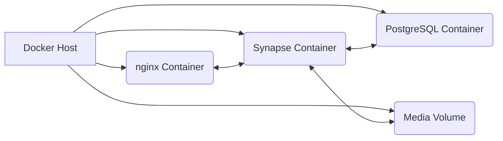
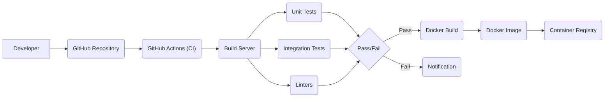

Okay, let's create a design document for the Matrix Synapse project, focusing on aspects relevant for threat modeling.

# BUSINESS POSTURE

Matrix Synapse is a reference "homeserver" implementation for the Matrix communication protocol.  The primary business goal is to provide a robust, scalable, and secure platform for decentralized, real-time communication.  It aims to enable interoperable communication across different Matrix servers, fostering a federated network.  Success is measured by adoption, stability, and the ability to handle large volumes of users and messages while maintaining data integrity and confidentiality.  The project is open-source, so community contributions and reputation are also key.

Business Priorities:

*   Federation:  Enable seamless communication between different Synapse instances and other Matrix servers.
*   Scalability:  Handle a growing number of users, rooms, and messages.
*   Reliability:  Provide a stable and consistently available service.
*   Security:  Protect user data and communications from unauthorized access and modification.
*   Interoperability:  Adhere to the Matrix specification to ensure compatibility with other Matrix clients and servers.
*   Open Source: Maintain a healthy and active open-source project.

Business Risks:

*   Data Breaches:  Unauthorized access to user data (messages, profiles, etc.) due to vulnerabilities in Synapse or related infrastructure.
*   Denial of Service:  Attacks that render the server unavailable to users.
*   Federation Issues:  Problems with communication between servers, leading to message loss or service disruption.
*   Reputation Damage:  Security incidents or prolonged outages could damage the reputation of Synapse and the Matrix protocol.
*   Spam and Abuse:  Malicious users exploiting the platform for spam, harassment, or other abusive activities.
*   Compliance Violations: Failure to comply with relevant data privacy regulations (e.g., GDPR).

# SECURITY POSTURE

Existing Security Controls:

*   security control: HTTPS: Communication between clients and the server, and between servers, is encrypted using HTTPS (TLS). Implemented in Synapse server and client configurations.
*   security control: Access Control:  Synapse implements access control mechanisms to restrict access to rooms and data based on user permissions. Described in Matrix specification and implemented in Synapse code.
*   security control: Federation Security:  Synapse uses TLS and digital signatures to secure communication with other Matrix servers. Described in Matrix specification and implemented in Synapse code.
*   security control: Rate Limiting:  Synapse implements rate limiting to mitigate denial-of-service attacks and abuse. Implemented in Synapse configuration and code.
*   security control: Input Validation: Synapse performs input validation to prevent various injection attacks. Implemented in Synapse code.
*   security control: Authentication: User authentication via passwords, tokens, or single sign-on (SSO). Implemented in Synapse code and configuration.
*   security control: End-to-End Encryption (E2EE): While not directly a *Synapse* feature, Synapse supports E2EE implemented by Matrix clients. Synapse handles encrypted event transport.

Accepted Risks:

*   accepted risk: Complexity of Federation:  The federated nature of Matrix introduces complexity, making it challenging to ensure consistent security across all servers.
*   accepted risk: Reliance on Third-Party Libraries:  Synapse depends on various third-party libraries, which could introduce vulnerabilities.
*   accepted risk: Client-Side Security:  The security of end-to-end encryption relies heavily on the security of the client applications.

Recommended Security Controls:

*   Regular Security Audits: Conduct regular independent security audits of the Synapse codebase and infrastructure.
*   Vulnerability Disclosure Program: Implement a formal vulnerability disclosure program to encourage responsible reporting of security issues.
*   Content Security Policy (CSP): Implement a strong CSP to mitigate cross-site scripting (XSS) vulnerabilities.
*   Intrusion Detection System (IDS): Deploy an IDS to monitor for and alert on suspicious activity.
*   Database Encryption at Rest: Encrypt the database at rest to protect data in case of server compromise.

Security Requirements:

*   Authentication:
    *   Support for strong password policies.
    *   Support for multi-factor authentication (MFA).
    *   Secure storage of passwords (e.g., using bcrypt or similar).
    *   Secure session management.
    *   Support for Single Sign-On (SSO) with secure protocols (e.g., OpenID Connect).

*   Authorization:
    *   Fine-grained access control to rooms and data based on user roles and permissions.
    *   Secure implementation of the Matrix access control model.
    *   Regular review of access control policies.

*   Input Validation:
    *   Strict validation of all user inputs to prevent injection attacks (e.g., XSS, SQL injection).
    *   Use of allow-lists rather than block-lists where possible.
    *   Validation of data received from other Matrix servers.

*   Cryptography:
    *   Use of strong, well-vetted cryptographic algorithms and libraries.
    *   Secure key management practices.
    *   Regular review of cryptographic implementations.
    *   Support for Perfect Forward Secrecy (PFS) in TLS configurations.

# DESIGN

## C4 CONTEXT

Element Descriptions:

*   Element:
    *   Name: User
    *   Type: Person
    *   Description: A person who uses a Matrix client to communicate.
    *   Responsibilities: Sending and receiving messages, managing their profile, joining and leaving rooms.
    *   Security controls: Strong passwords, MFA (if enabled), client-side security measures.

*   Element:
    *   Name: Matrix Client
    *   Type: Software System
    *   Description: A client application used to access the Matrix network (e.g., Element, Fluffychat).
    *   Responsibilities: Connecting to a homeserver, displaying the user interface, handling end-to-end encryption (if enabled).
    *   Security controls: Secure coding practices, protection against XSS and other client-side vulnerabilities, secure storage of encryption keys.

*   Element:
    *   Name: Synapse Homeserver
    *   Type: Software System
    *   Description: The Matrix Synapse homeserver implementation.
    *   Responsibilities: Managing user accounts, storing messages, handling room membership, federating with other homeservers.
    *   Security controls: HTTPS, access control, rate limiting, input validation, federation security.

*   Element:
    *   Name: Other Matrix Homeservers
    *   Type: Software System
    *   Description: Other Matrix homeservers that Synapse federates with.
    *   Responsibilities: Same as Synapse Homeserver.
    *   Security controls:  Should implement similar security controls as Synapse, but this is outside the direct control of the Synapse project.

*   Element:
    *   Name: Identity Server
    *   Type: Software System
    *   Description: An optional server that maps third-party identifiers (e.g., email addresses, phone numbers) to Matrix user IDs.
    *   Responsibilities: Handling identity verification and lookup requests.
    *   Security controls: Secure communication with homeservers and clients, protection of user identity data.

*   Element:
    *   Name: Application Services
    *   Type: Software System
    *   Description: Optional services that extend the functionality of Matrix (e.g., bridges to other communication platforms).
    *   Responsibilities: Varies depending on the specific application service.
    *   Security controls: Secure communication with the homeserver, appropriate access controls.

## C4 CONTAINER

Element Descriptions:

*   Element:
    *   Name: Matrix Client
    *   Type: Software System
    *   Description: A client application used to access the Matrix network.
    *   Responsibilities: Connecting to a homeserver, displaying the user interface, handling end-to-end encryption (if enabled).
    *   Security controls: Secure coding practices, protection against XSS and other client-side vulnerabilities, secure storage of encryption keys.

*   Element:
    *   Name: Web Server (nginx/Apache)
    *   Type: Software System
    *   Description: A reverse proxy server that handles incoming requests and forwards them to the Synapse application server.
    *   Responsibilities: TLS termination, load balancing, serving static content.
    *   Security controls: HTTPS configuration, protection against common web vulnerabilities (e.g., DDoS, request smuggling).

*   Element:
    *   Name: Synapse Application Server (Python/Twisted)
    *   Type: Software System
    *   Description: The core Synapse application, written in Python using the Twisted framework.
    *   Responsibilities: Handling client requests, processing events, managing room state, interacting with the database and other services.
    *   Security controls: Input validation, access control, authentication, rate limiting.

*   Element:
    *   Name: Database (PostgreSQL)
    *   Type: Database
    *   Description: A PostgreSQL database that stores user data, messages, room state, and other persistent data.
    *   Responsibilities: Data storage and retrieval.
    *   Security controls: Database access control, encryption at rest (recommended), regular backups.

*   Element:
    *   Name: Federation API
    *   Type: API
    *   Description: An API used for communication with other Matrix homeservers.
    *   Responsibilities: Sending and receiving events, handling user presence, exchanging room information.
    *   Security controls: HTTPS, digital signatures, access control.

*   Element:
    *   Name: Other Matrix Homeservers
    *   Type: Software System
    *   Description: Other Matrix homeservers that Synapse federates with.
    *   Responsibilities: Same as Synapse Homeserver.
    *   Security controls: Should implement similar security controls as Synapse.

*   Element:
    *   Name: Media Repository
    *   Type: Software System
    *   Description: Stores and serves media files (images, videos, etc.) uploaded by users.
    *   Responsibilities: Storing and retrieving media files.
    *   Security controls: Access control, virus scanning (recommended), content type validation.

## DEPLOYMENT

Possible Deployment Solutions:

1.  Bare Metal/Virtual Machine:  Synapse and its dependencies are installed directly on a physical or virtual server.
2.  Docker: Synapse and its dependencies are packaged as Docker containers.
3.  Kubernetes: Synapse and its dependencies are deployed as a Kubernetes cluster.
4.  Ansible: Using Ansible playbooks to automate deployment.

Chosen Solution (for detailed description): Docker

Element Descriptions:

*   Element:
    *   Name: Docker Host
    *   Type: Infrastructure
    *   Description: The physical or virtual server that runs the Docker engine.
    *   Responsibilities: Running Docker containers.
    *   Security controls: Operating system hardening, firewall, regular security updates.

*   Element:
    *   Name: Synapse Container
    *   Type: Container
    *   Description: A Docker container running the Synapse application server.
    *   Responsibilities: Handling client requests, processing events, managing room state.
    *   Security controls: Minimal base image, regular security updates, running as a non-root user.

*   Element:
    *   Name: PostgreSQL Container
    *   Type: Container
    *   Description: A Docker container running the PostgreSQL database.
    *   Responsibilities: Data storage and retrieval.
    *   Security controls: Minimal base image, secure configuration, regular security updates, running as a non-root user.

*   Element:
    *   Name: nginx Container
    *   Type: Container
    *   Description: A Docker container running the nginx reverse proxy.
    *   Responsibilities: TLS termination, load balancing, serving static content.
    *   Security controls: Minimal base image, secure configuration, regular security updates, running as a non-root user.

*   Element:
    *   Name: Media Volume
    *   Type: Storage
    *   Description: A Docker volume used to store media files.
    *   Responsibilities: Persistent storage for media files.
    *   Security controls: Access control, regular backups.

## BUILD

The Synapse build process typically involves the following steps:

1.  Developer: A developer writes code and pushes it to the Git repository (GitHub).
2.  Continuous Integration (CI): A CI system (e.g., GitHub Actions) is triggered by the push.
3.  Build: The CI system checks out the code, installs dependencies, and builds the Synapse package.
4.  Testing: The CI system runs unit tests, integration tests, and linters.
5.  Packaging: If the tests pass, the CI system creates a Docker image containing the Synapse application.
6.  Publish: The Docker image is pushed to a container registry (e.g., Docker Hub).

Security Controls:

*   Supply Chain Security: Use of signed commits, dependency verification, and vulnerability scanning of dependencies.
*   Build Automation: Automated build process using GitHub Actions to ensure consistency and repeatability.
*   Security Checks:
    *   Linters: Use of linters (e.g., pylint, flake8) to enforce coding standards and identify potential security issues.
    *   Static Analysis Security Testing (SAST): Integration of SAST tools (e.g., Bandit) into the CI pipeline to scan for vulnerabilities in the code.
    *   Software Composition Analysis (SCA): Use of SCA tools to identify and manage vulnerabilities in third-party libraries.
*   Least Privilege: Build processes should run with the least necessary privileges.
*   Reproducible Builds: Aim for reproducible builds to ensure that the same source code always produces the same binary.

# RISK ASSESSMENT

Critical Business Processes:

*   Real-time communication between users.
*   Federated communication between Matrix servers.
*   User account management.
*   Media sharing.

Data Sensitivity:

*   Messages: Highly sensitive, especially if not end-to-end encrypted.
*   User Profile Data:  Potentially sensitive, depending on the information provided by the user.
*   Room Metadata:  Moderately sensitive, as it can reveal information about user activity and relationships.
*   Media Files:  Sensitivity varies depending on the content.
*   Authentication Credentials: Highly sensitive.

# QUESTIONS & ASSUMPTIONS

Questions:

*   What is the specific threat model used by the Matrix Synapse development team?
*   What are the current procedures for handling security incidents?
*   What are the plans for implementing additional security features, such as database encryption at rest?
*   What is the process for reviewing and approving changes to the codebase, particularly those related to security?
*   How are secrets (e.g., API keys, database passwords) managed in the deployment environment?
*   What monitoring and logging capabilities are in place to detect and respond to security events?

Assumptions:

*   BUSINESS POSTURE: The primary business goal is to provide a secure and reliable communication platform.
*   SECURITY POSTURE: The development team follows secure coding practices and regularly updates dependencies.
*   DESIGN: The deployment environment is properly secured and monitored. The database is backed up regularly.
*   DESIGN: The use of Docker containers is the preferred deployment method.
*   DESIGN: GitHub Actions is used for continuous integration.