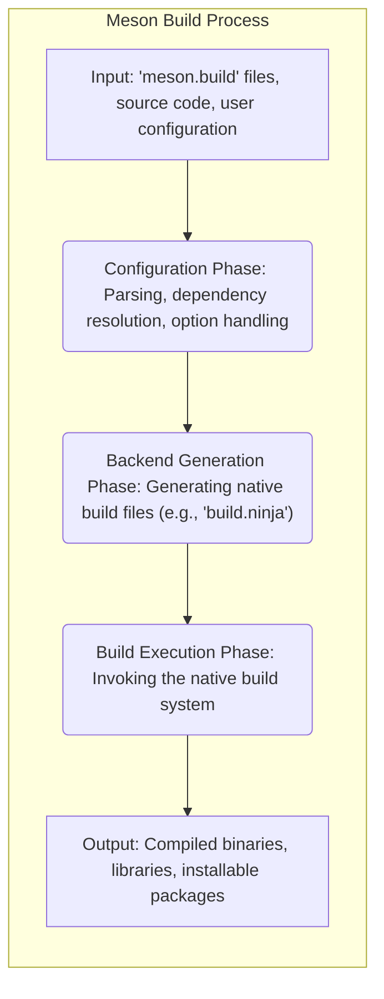

# Project Design Document: Meson Build System

**Version:** 1.1
**Date:** October 26, 2023
**Author:** AI Software Architect

## 1. Introduction

This document provides an enhanced architectural overview of the Meson build system, specifically tailored for threat modeling. It details the key components, data flows, and interactions within the system to facilitate a comprehensive security analysis. This document serves as the foundation for identifying potential security vulnerabilities and designing appropriate mitigations.

Meson is an open-source build system renowned for its speed and user-friendliness. It employs a high-level domain-specific language to define the build process and subsequently generates native build files compatible with various backends, including Ninja, Xcode, and Visual Studio.

## 2. Goals and Non-Goals

**Goals:**

* Deliver a refined and more detailed architectural overview of the Meson build system.
* Provide enhanced descriptions of key components and their interactions, emphasizing security-relevant aspects.
* Offer a clearer depiction of the data flow within the system, highlighting potential points of vulnerability.
* Expand on preliminary security considerations to better inform the threat modeling process.

**Non-Goals:**

* Provide a comprehensive code-level audit or deep dive into Meson's implementation.
* Offer specific, actionable security recommendations or mitigation strategies at this stage (that will be the output of the threat modeling exercise).
* Document every single feature, configuration option, or obscure edge case of Meson.
* Serve as a user manual or tutorial for using Meson.

## 3. High-Level Architecture

Meson orchestrates the transformation of a project's source code into a buildable state through a series of well-defined phases. The following diagram illustrates this high-level architecture:



## 4. Detailed Component Architecture

The Meson build system comprises several interconnected components, each with specific responsibilities:

* **Parser:** Responsible for lexing and parsing `meson.build` files to create a structured representation.
    * Input: `meson.build` files (textual build definitions).
    * Output: An Abstract Syntax Tree (AST) representing the parsed build definition. This AST is a crucial intermediary and its integrity is paramount.
    * Security Relevance: Vulnerabilities in the parser could allow malicious `meson.build` files to cause unexpected behavior or even code execution during the configuration phase.
* **Interpreter:** Executes the AST, resolving variables, evaluating expressions, and constructing the internal build graph.
    * Input: AST from the Parser.
    * Output: An in-memory representation of the build graph, including targets, dependencies, configurations, and custom commands. This graph dictates the subsequent build process.
    * Security Relevance: Errors or vulnerabilities in the interpreter could lead to incorrect build configurations, potentially bypassing security measures or introducing vulnerabilities in the final build.
* **Dependency Resolver:** Locates and manages project dependencies, including both internal project dependencies and external libraries or software packages.
    * Input: Dependency declarations within `meson.build` files (e.g., `dependency('zlib')`).
    * Output: Resolved dependency information, including paths to header files, library files, and any required compiler/linker flags. This often involves interacting with external systems like `pkg-config` or package managers.
    * Security Relevance: This component is a critical point for supply chain attacks. If the resolver can be tricked into using a malicious dependency, it can compromise the entire build.
* **Option Handler:** Manages user-configurable build options provided via the command line or environment variables.
    * Input: User-provided options (e.g., `-Doptimization=3`, `-Dprefix=/opt/myproject`).
    * Output: A set of resolved build options that influence the behavior of other components, particularly the Backend Generator.
    * Security Relevance: Improper handling of user-provided options could lead to command injection vulnerabilities if these options are directly passed to external commands without sanitization.
* **Backend Generator:** Translates the internal build graph into the native build files required by the selected backend (e.g., `build.ninja` for Ninja, project files for Xcode or Visual Studio).
    * Input: The internal build graph, resolved dependency information, and resolved build options.
    * Output: Native build files (e.g., `build.ninja`, `.xcodeproj` files, `.vcxproj` files). These files contain the instructions for the actual compilation and linking process.
    * Security Relevance: This component must carefully sanitize inputs to prevent command injection vulnerabilities in the generated build files. A flaw here could allow attackers to execute arbitrary commands during the build execution phase.
* **Introspection API:** Provides a mechanism to query the build configuration and targets after the configuration phase is complete.
    * Input: Requests for build information, typically through command-line tools or external scripts.
    * Output: JSON-formatted data describing the build setup, including targets, dependencies, and compiler flags.
    * Security Relevance: While primarily for informational purposes, vulnerabilities in the API could expose sensitive build details or potentially be exploited to influence subsequent build steps if not properly secured.
* **Install Handler:** Manages the installation process, copying built artifacts to their designated installation directories.
    * Input: Installation instructions defined in `meson.build` files (e.g., `install()`).
    * Output: Installed files in the specified destination directories.
    * Security Relevance: Incorrect installation paths or permissions could lead to security vulnerabilities in the installed software.
* **Testing Framework:** Provides tools for defining and executing unit tests and integration tests.
    * Input: Test definitions within `meson.build` files and the compiled test executables.
    * Output: Test results (pass/fail status, logs).
    * Security Relevance: While not directly involved in the core build process, vulnerabilities in the testing framework itself could be exploited.
* **Subproject Handler:** Manages the inclusion and building of external projects as subprojects within the main build.
    * Input: Declarations of subprojects in `meson.build` files, potentially including URLs for fetching source code.
    * Output: Integration of the subproject's build output into the main project.
    * Security Relevance: This component introduces significant supply chain risks, as vulnerabilities in subprojects can be easily incorporated into the main project. The process of fetching and building subprojects needs to be secure.

## 5. Data Flow

The following diagram illustrates the detailed flow of data through the Meson build system, highlighting key transformations and interactions:

```mermaid
graph LR
    subgraph "Meson Data Flow"
        A("`meson.build` Files") --> B("Parser");
        B --> C("Abstract Syntax Tree (AST)");
        C --> D("Interpreter");
        D --> E("Internal Build Graph");
        E --> F("Dependency Resolver");
        F --> G("Resolved Dependencies & Metadata");
        E --> H("Option Handler");
        H --> I("Resolved Build Options");
        G --> J("Backend Generator");
        I --> J;
        E --> J;
        J --> K("Native Build Files (e.g., `build.ninja`)");
        K --> L("Native Build System (e.g., Ninja)");
        L --> M("Compiled Binaries, Libraries, Objects");
        E --> N("Install Handler");
        M --> N;
        N --> O("Installed Files");
        E --> P("Testing Framework");
        M --> P;
        P --> Q("Test Results & Logs");
        A --> R("Subproject Handler");
        R --> S("Subproject Source Code");
        S --> T("Subproject Build Process");
        T --> U("Subproject Output");
        U --> E;
        D --> V("Introspection API");
        V --> W("Build Information (JSON)");
    end
```

**Detailed Data Flow Description:**

1. **Input:** The process begins with `meson.build` files, the project's source code, and user-provided configuration options.
2. **Parsing:** The Parser reads and analyzes the `meson.build` files, converting the textual build instructions into an Abstract Syntax Tree (AST).
3. **Interpretation:** The Interpreter takes the AST and executes it, resolving variables, evaluating expressions, and constructing the core data structure: the Internal Build Graph.
4. **Dependency Resolution:** The Interpreter invokes the Dependency Resolver to locate and retrieve information about project dependencies. This may involve querying system libraries, using tools like `pkg-config`, or interacting with package managers. The output includes paths to necessary files and metadata about the dependencies.
5. **Option Handling:** The Interpreter utilizes the Option Handler to process user-provided build options, which can influence various aspects of the build process.
6. **Backend Generation:** The Backend Generator consumes the Internal Build Graph, resolved dependencies, and build options to generate the native build files specific to the chosen backend (e.g., `build.ninja` for Ninja).
7. **Build Execution:** The generated native build files are then passed to the Native Build System (e.g., Ninja, Make, Xcodebuild) for the actual compilation, linking, and creation of build artifacts.
8. **Installation:** The Install Handler uses instructions from the Internal Build Graph to copy the compiled binaries, libraries, and other necessary files to their designated installation locations.
9. **Testing:** The Testing Framework executes the defined tests using the built binaries and reports the results.
10. **Introspection:** External tools or scripts can query the Introspection API to retrieve structured information about the configured build.
11. **Subprojects:** The Subproject Handler fetches (if necessary) and initiates the build process for any declared subprojects, integrating their outputs into the main project's build graph.

## 6. Key Components and Their Interactions

* **Parser & Interpreter Interaction:** The Parser provides the structured representation (AST) of the build definition to the Interpreter. The Interpreter relies on the Parser's correctness to accurately understand the build instructions.
* **Interpreter & Dependency Resolver Interaction:** The Interpreter identifies dependency declarations and calls upon the Dependency Resolver to locate and retrieve the required dependency information. This interaction is crucial for ensuring all necessary libraries and headers are available.
* **Interpreter & Option Handler Interaction:** The Interpreter queries the Option Handler to retrieve and apply user-defined build options, allowing for customization of the build process.
* **Interpreter & Backend Generator Interaction:** The Interpreter provides the high-level build logic and structure (the Internal Build Graph) to the Backend Generator, which translates it into the specific syntax and commands of the target native build system.
* **Backend Generator & Native Build System Interaction:** The Backend Generator produces the input files that drive the Native Build System. The security of this interaction depends on the Backend Generator's ability to prevent command injection.
* **Introspection API Interaction:** External tools interact with the Introspection API to obtain information about the configured build, enabling tasks like IDE integration or static analysis.
* **Subproject Handler Interaction:** The Subproject Handler effectively orchestrates a nested Meson build process for subprojects and integrates their outputs into the main project's build graph, creating a complex interaction with potential security implications.

## 7. Security Considerations (For Threat Modeling)

This section expands on potential security concerns, providing more specific examples to guide the threat modeling process.

* **`meson.build` File Handling:**
    * **Malicious `meson.build` files:** An attacker could craft a `meson.build` file that exploits vulnerabilities in the Parser or Interpreter to execute arbitrary code during the configuration phase. Example: Using specially crafted strings that cause buffer overflows or trigger unintended code paths.
    * **Insufficient Input Validation:** Lack of proper validation of data within `meson.build` files could lead to vulnerabilities. Example: Allowing excessively long strings or unexpected characters that could cause crashes or unexpected behavior.
* **Dependency Resolution:**
    * **Dependency Confusion:** An attacker could upload a malicious package to a public repository with the same name as an internal dependency, tricking the resolver into downloading the malicious version.
    * **Compromised Dependency Sources:** If the sources from which dependencies are downloaded are compromised, malicious code could be injected into the build process. Example: A compromised Git repository or a malicious package on a package manager.
    * **Unverified Downloads:** Downloading dependencies without verifying their integrity (e.g., using checksums or signatures) could lead to the inclusion of tampered or malicious components.
* **Backend Generation:**
    * **Command Injection:** If the Backend Generator doesn't properly sanitize inputs (e.g., target names, compiler flags) when generating native build files, it could lead to command injection vulnerabilities when the native build system is executed. Example: A target name containing shell metacharacters that are not escaped properly.
* **Introspection API:**
    * **Information Disclosure:** A poorly secured Introspection API could expose sensitive build information, such as internal paths, compiler flags, or dependency versions, which could be used by attackers to plan further attacks.
* **Subproject Handling:**
    * **Vulnerabilities in Subprojects:** Security vulnerabilities present in subprojects can be directly incorporated into the main project's build output.
    * **Malicious Subproject Sources:** If the sources for subprojects are fetched from untrusted locations or without proper verification, malicious code could be introduced.
* **Execution of External Processes:**
    * **Command Injection:** When Meson executes external tools like compilers, linkers, or custom commands defined in `meson.build`, improper handling of arguments or environment variables could lead to command injection.
    * **Path Traversal:** If Meson relies on user-provided paths to external tools without proper validation, attackers could potentially execute arbitrary binaries.
* **Handling of User-Provided Options:**
    * **Command Injection:**  If user-provided options are directly passed to external commands without sanitization, it could lead to command injection vulnerabilities. Example: A user providing a malicious compiler flag that executes arbitrary code.

## 8. Future Considerations

* **Plugin System:** If Meson introduces a plugin system, the security of these plugins will be a critical concern. Plugins could potentially bypass Meson's security measures or introduce new vulnerabilities.
* **Web Interface/Remote Execution:** If future versions of Meson allow for remote build execution or a web interface, new security challenges related to authentication, authorization, and data security will need to be addressed.
* **Enhanced Dependency Management:** Future improvements in dependency management, such as mandatory checksum verification or support for signed packages, could significantly enhance security.
* **Sandboxing of Build Processes:** Exploring the possibility of sandboxing the execution of external build tools could mitigate the impact of command injection vulnerabilities.

This enhanced design document provides a more detailed and security-focused overview of the Meson build system's architecture. The information presented here is intended to be a valuable resource for conducting a comprehensive threat modeling exercise to identify and mitigate potential security risks.
