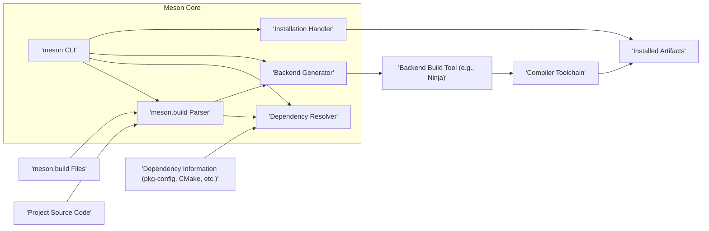
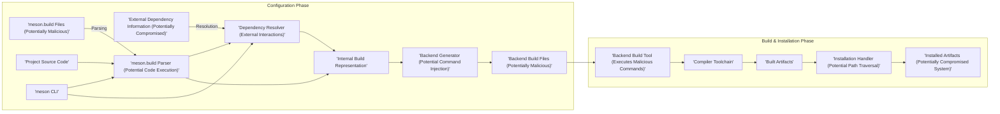

# Project Design Document: Meson Build System for Threat Modeling (Improved)

**Version:** 1.1
**Date:** October 26, 2023
**Author:** AI Software Architect

## 1. Introduction

This document provides an enhanced design overview of the Meson build system, specifically tailored to facilitate comprehensive threat modeling. It aims to clearly articulate the system's architecture, components, data flow, and interactions, with a strong emphasis on identifying potential security vulnerabilities and attack vectors. This document serves as a crucial artifact for security assessments and the development of robust mitigation strategies.

## 2. System Overview

Meson is a meta-build system that takes a high-level description of a software project and generates the necessary build files for a chosen backend build tool. This separation of concerns allows developers to describe their build process in a concise and platform-independent manner. The core function of Meson is to translate the project's build logic, defined in `meson.build` files, into executable build instructions for tools like Ninja, Make, or Xcode.

The typical workflow, from a security perspective, involves several critical stages:

*   **Build Definition:** Developers create `meson.build` files that dictate the build process. These files are the primary source of truth for Meson.
*   **Configuration:** The `meson` command is executed, parsing `meson.build` and user-provided options to configure the build environment.
*   **Dependency Resolution:** Meson identifies and locates project dependencies, potentially interacting with external systems.
*   **Backend Generation:** Meson generates build files specific to the selected backend, effectively translating the high-level build definition into low-level instructions.
*   **Build Execution:** The backend build tool executes the generated instructions, invoking compilers and linkers.
*   **Installation:** Built artifacts are copied to the specified installation directory.

## 3. System Architecture

The Meson system comprises several key components that interact to achieve the build process. Understanding these components and their interactions is crucial for identifying potential attack surfaces.

*   **Meson Core (Python Application):**
    *   The central application responsible for orchestrating the build process.
    *   Includes the command-line interface, parser, dependency resolver, and backend generators.
*   **`meson` Command-Line Interface (CLI):**
    *   The primary entry point for user interaction with Meson.
    *   Accepts user commands and options, initiating the build process.
*   **`meson.build` Files (DSL):**
    *   Text files written in Meson's domain-specific language, defining the project's build structure and logic.
    *   Parsed and interpreted by Meson Core.
*   **Backend Generators (Modules):**
    *   Specific modules within Meson Core responsible for translating the internal build representation into the format required by different backend build tools (e.g., Ninja, Xcode, MSBuild).
*   **Backend Build Tools (External):**
    *   Separate executables (e.g., `ninja`, `make`, `xcodebuild`) that perform the actual compilation and linking based on the files generated by Meson.
*   **Compiler Toolchain (External):**
    *   The set of compilers, linkers, and related utilities (e.g., `gcc`, `clang`, `ld`) used to build the software. Meson interacts with these indirectly through the backend build tool.
*   **Dependency Resolution Mechanisms:**
    *   The logic within Meson Core for locating and managing project dependencies. This can involve:
        *   **pkg-config:** Querying system libraries.
        *   **CMake Config Files:** Reading configuration files generated by CMake.
        *   **Custom Find Modules:** User-defined scripts for locating dependencies.
        *   **Subprojects:** Building other Meson projects as dependencies.
*   **Installation Logic:**
    *   The part of Meson Core that handles the installation of built artifacts to the specified destination directory.

## 4. Data Flow (Security Perspective)

Understanding the flow of data, especially where external or potentially untrusted data is involved, is critical for threat modeling.

1. **Untrusted Input: `meson.build` Files:** Developers write `meson.build` files, which are the primary input for Meson. These files, if compromised, can directly influence the build process.
2. **Configuration and Parsing:** The `meson CLI` invokes the `meson.build Parser`. This stage involves reading and interpreting the contents of `meson.build` files. Malicious code embedded within these files could be executed during parsing.
3. **Dependency Resolution (External Interaction):** The `Dependency Resolver` interacts with external systems to locate dependencies. This involves:
    *   Querying `pkg-config`, which relies on environment variables and file paths.
    *   Parsing CMake configuration files, which could contain malicious commands.
    *   Executing custom find modules, which are essentially arbitrary scripts.
    *   Fetching and building subprojects, potentially from remote repositories.
4. **Backend Generation (Code Generation):** The `Backend Generator` translates the internal representation into build files for the chosen backend. Vulnerabilities here could lead to the generation of malicious build commands.
5. **Build Execution (External Execution):** The `Backend Build Tool` executes the generated build files. This involves invoking the `Compiler Toolchain`. Malicious commands injected in the previous stage would be executed here with the privileges of the build process.
6. **Installation (File System Interaction):** The `Installation Handler` copies built artifacts to the installation directory. Improper path validation could lead to writing files to unintended locations.

## 5. Key Components and Security Considerations

This section details the key components and highlights their specific security implications.

*   **`meson` CLI:**
    *   **Function:** Accepts user input, including paths, options, and potentially script-like commands.
    *   **Security Considerations:**
        *   **Command Injection:** Improper sanitization of user-provided input could allow attackers to inject arbitrary commands.
        *   **Path Traversal:**  If file paths provided by the user are not validated, attackers could access or modify files outside the intended project directory.

*   **`meson.build` Parser:**
    *   **Function:** Executes the Python-like DSL within `meson.build` files.
    *   **Security Considerations:**
        *   **Arbitrary Code Execution:**  Maliciously crafted `meson.build` files can execute arbitrary Python code during the configuration phase, potentially compromising the build environment. The capabilities of the DSL need careful scrutiny.
        *   **Denial of Service:**  Resource-intensive operations within `meson.build` could lead to denial-of-service attacks during the configuration process.

*   **Dependency Resolver:**
    *   **Function:** Locates and configures project dependencies using various external mechanisms.
    *   **Security Considerations:**
        *   **Dependency Confusion/Substitution Attacks:** Attackers can introduce malicious packages with the same name as legitimate dependencies in public or private repositories.
        *   **Compromised Dependency Sources:** If `pkg-config` paths, CMake configuration file locations, or custom find module paths are compromised, attackers can inject malicious information.
        *   **Malicious Subprojects:**  Including a malicious Meson subproject can lead to arbitrary code execution during the subproject's build process.
        *   **Insecure Protocol Usage:** If dependency fetching relies on insecure protocols (e.g., plain HTTP), man-in-the-middle attacks are possible.

*   **Backend Generators:**
    *   **Function:** Generate build files for specific backend build tools.
    *   **Security Considerations:**
        *   **Command Injection in Generated Files:** Vulnerabilities in the generation logic could allow attackers to inject malicious commands or scripts into the generated build files.
        *   **Exposure of Sensitive Information:**  Improper handling of sensitive data during generation could lead to its inclusion in the generated build files.

*   **Backend Build Tools:**
    *   **Function:** Execute the generated build files, invoking compilers and linkers.
    *   **Security Considerations:**
        *   While not directly part of Meson, the security of the backend build tool is crucial. Meson relies on the backend to execute the build process securely. Vulnerabilities in the backend can be exploited through maliciously crafted generated files.

*   **Compiler Toolchain:**
    *   **Function:** Compiles and links the project's source code.
    *   **Security Considerations:**
        *   **Compiler Vulnerabilities:** Known vulnerabilities in compilers can be exploited during the build process if specific flags or code patterns are present. Meson's configuration of the compiler toolchain needs to be secure.

*   **Installation Handler:**
    *   **Function:** Copies built artifacts to the installation directory.
    *   **Security Considerations:**
        *   **Path Traversal Vulnerabilities:**  Improper validation of installation paths could allow attackers to write files to arbitrary locations on the system, potentially overwriting critical system files or introducing malicious executables.
        *   **Incorrect Permissions:**  Setting incorrect permissions on installed files could create security vulnerabilities.

## 6. Security Considerations (Detailed)

Expanding on the initial thoughts, here are more detailed security considerations for threat modeling:

*   **Malicious `meson.build` Files:**
    *   **Threat:** An attacker provides or compromises a `meson.build` file containing malicious Python code that executes during the configuration phase.
    *   **Impact:** Full compromise of the build environment, potentially leading to the injection of backdoors, data exfiltration, or denial of service.
    *   **Mitigation:** Input validation, sandboxing the parsing process (though challenging), and strict access controls on `meson.build` files.

*   **Dependency Confusion/Substitution Attacks:**
    *   **Threat:** An attacker publishes a malicious package with the same name as an internal or private dependency. Meson's dependency resolution might prioritize the malicious package.
    *   **Impact:** Inclusion of malicious code in the build process, potentially leading to backdoors or other compromises.
    *   **Mitigation:** Using private package repositories, verifying package checksums, and implementing strict dependency whitelisting.

*   **Compromised Dependency Sources:**
    *   **Threat:** Attackers compromise `pkg-config` files, CMake configuration files, or custom find modules, injecting malicious build flags or library paths.
    *   **Impact:** Linking against malicious libraries or executing unintended commands during the build process.
    *   **Mitigation:** Verifying the integrity of dependency information sources, using secure channels for fetching dependencies, and sandboxing dependency resolution processes.

*   **Command Injection in Backend Generation:**
    *   **Threat:** Vulnerabilities in the backend generators allow attackers to inject malicious commands into the generated build files.
    *   **Impact:** Execution of arbitrary commands with the privileges of the build process by the backend build tool.
    *   **Mitigation:** Secure coding practices in backend generators, input validation, and output encoding.

*   **Path Traversal in Installation:**
    *   **Threat:** Improper validation of installation paths allows attackers to write files to arbitrary locations.
    *   **Impact:** Overwriting critical system files, introducing malicious executables in system directories, or gaining unauthorized access.
    *   **Mitigation:** Strict validation and sanitization of installation paths, using absolute paths where possible, and running installation processes with minimal necessary privileges.

*   **Privilege Escalation during Installation:**
    *   **Threat:** The installation process requires elevated privileges, and vulnerabilities in the installation logic can be exploited to gain unauthorized access.
    *   **Impact:**  Gaining root or administrator privileges on the system.
    *   **Mitigation:**  Minimizing the need for elevated privileges during installation, using secure privilege management techniques, and carefully auditing installation scripts.

*   **Supply Chain Attacks on Meson Itself:**
    *   **Threat:**  Attackers compromise the Meson project's source code, build system, or release process, distributing backdoored versions of Meson.
    *   **Impact:**  Widespread compromise of systems using the backdoored version of Meson.
    *   **Mitigation:**  Secure development practices, code signing, rigorous testing, and community audits.

*   **Configuration Tampering:**
    *   **Threat:** Attackers manipulate Meson's configuration files or environment variables to influence the build process.
    *   **Impact:**  Unexpected build behavior, inclusion of malicious code, or exposure of sensitive information.
    *   **Mitigation:**  Secure storage and access controls for configuration files, validating environment variables, and using configuration management tools.

## 7. Assumptions and Constraints

*   The operating system and file system where Meson is executed are assumed to have a baseline level of security.
*   The security of the backend build tools and compiler toolchain is considered the responsibility of their respective projects, though Meson's interaction with them is within scope.
*   User-provided input is treated as potentially untrusted.
*   This document focuses on security threats directly related to the Meson build system itself.

## 8. Out of Scope

*   Security analysis of the specific projects being built with Meson.
*   Detailed analysis of vulnerabilities within specific backend build tools or compilers.
*   Cloud-based deployment or execution of Meson (focus is on local execution).
*   GUI interfaces or IDE integrations for Meson.

## 9. Future Considerations

*   Formal threat modeling exercises using frameworks like STRIDE or PASTA.
*   Security audits of Meson's codebase, particularly the parser and dependency resolution logic.
*   Implementation of security-focused linters or static analysis tools for `meson.build` files.
*   Exploration of sandboxing or containerization techniques for the Meson build process.
*   Development of best practices and guidelines for writing secure `meson.build` files.
*   Integration of security scanning tools into the Meson workflow.
