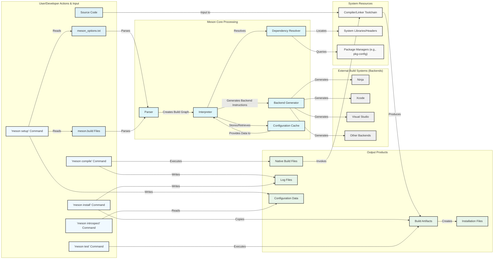

## Project Design Document: Meson Build System (Improved)

**1. Introduction**

This document provides an enhanced architectural design of the Meson build system, offering a more detailed explanation of its components, their interactions, and the flow of data. This refined design serves as a robust foundation for subsequent threat modeling activities, facilitating a thorough security analysis of the Meson project. The emphasis is on clarity and precision to ensure effective communication and understanding of the system's inner workings.

**2. Project Overview**

Meson is a high-performance, open-source build system designed for developer productivity and cross-platform compatibility. It provides a user-friendly, high-level language for defining build processes, abstracting away the complexities of underlying build tools. Meson's primary function is to interpret these build definitions and generate native build files (e.g., Ninja build files, Xcode projects, Visual Studio solutions) optimized for the target platform and build environment. Its key strengths include speed, ease of use, and support for a wide range of programming languages and compilers. The target audience for Meson includes software developers and teams seeking a modern and efficient build system.

**3. System Architecture**

The Meson build system comprises several interconnected components that work together to manage the build process:

*   **Input Sources:**
    *   `meson.build` files: These are the core build definition files, written in Meson's declarative domain-specific language (DSL). They specify build targets, dependencies, compiler flags, and other build-related instructions.
    *   Source code files: The actual source code of the software project being built, in various programming languages.
    *   Compiler and linker toolchains: The specific compiler (e.g., GCC, Clang, MSVC) and linker executables used to compile and link the source code.
    *   System libraries and header files: External dependencies required by the project, provided by the operating system or other software packages.
    *   Environment variables: System-level settings that can influence the build process, such as compiler paths or library locations.
    *   Command-line arguments: Options passed to the `meson` command to configure and control the build process (e.g., specifying the build directory, backend, or custom options).
    *   `meson_options.txt`: An optional file that allows users to define project-specific build options and their default values.
*   **Meson Core Components:**
    *   **Parser:** This component is responsible for reading and lexically analyzing the `meson.build` files and `meson_options.txt`. It verifies the syntax and structure of these files, ensuring they conform to the Meson language specification.
    *   **Interpreter:** The interpreter executes the parsed `meson.build` files. It evaluates expressions, resolves dependencies, handles conditional logic, and constructs an in-memory representation of the project's build graph. This involves understanding the relationships between targets, sources, and dependencies.
    *   **Dependency Resolver:** This crucial component manages both internal (within the project) and external dependencies. It searches for and configures external libraries and subprojects using various methods, including:
        *   `pkg-config`: A standard utility for retrieving information about installed libraries.
        *   System library paths: Searching standard system directories for libraries.
        *   Custom find modules: User-defined scripts or modules to locate specific dependencies.
        *   Wrap dependency system: For managing dependencies that are not readily available on the system.
    *   **Backend Generator:** This component translates the abstract build graph created by the interpreter into the specific native build files required by the chosen backend build system (e.g., Ninja, Xcode, Visual Studio). It generates the precise commands and configurations that the backend will execute.
    *   **Configuration Cache:** Meson maintains a cache of configuration information, including detected dependencies, compiler capabilities, and build options. This cache is used to speed up subsequent configuration runs by avoiding redundant checks.
*   **Build Backends:**
    *   **Ninja:** A lightweight and fast build system that Meson frequently targets due to its performance.
    *   **Xcode:** Apple's integrated development environment; Meson can generate Xcode project files for macOS and iOS development.
    *   **Visual Studio:** Microsoft's integrated development environment; Meson can generate Visual Studio solution and project files for Windows development.
    *   Other backends (e.g., Make, etc.): Meson supports a pluggable backend architecture, allowing for integration with other build systems.
*   **Output Artifacts:**
    *   Native build files: Files specific to the selected backend (e.g., `build.ninja`, `.xcodeproj`, `.sln`). These files contain the instructions for the backend to perform the actual compilation and linking.
    *   Build artifacts: The compiled output of the build process, including object files, static and shared libraries, and executable binaries.
    *   Installation files: Files generated during the installation phase, which are copied to specified installation directories.
    *   Log files: Records of the Meson configuration and build processes, useful for debugging and auditing.
    *   Configuration data: The cached information about the build environment, stored for future use.
*   **User Interaction Points:**
    *   Command-line interface (CLI): The primary interface for interacting with Meson, using commands such as `meson setup`, `meson compile`, `meson install`, `meson test`, and `meson introspect`.
    *   Configuration files (`meson_options.txt`): Allow users to define and customize build options that can be set during the `meson setup` phase.

**4. Data Flow Diagram**

The data flow typically proceeds as follows:

*   The user initiates the build process with `meson setup`, providing the source directory. Meson reads `meson.build` and `meson_options.txt`.
*   The **Parser** analyzes these input files for syntactic correctness.
*   The **Interpreter** executes the build logic, using the **Dependency Resolver** to locate and configure project dependencies.
*   The **Dependency Resolver** interacts with system tools like `pkg-config` or searches standard library paths.
*   The **Backend Generator** translates the interpreted build graph into native build files for the chosen backend.
*   The user then executes the backend build tool (e.g., `ninja`) or uses `meson compile`.
*   The backend build tool utilizes the generated build files to invoke the **Compiler/Linker Toolchain** on the **Source Code**.
*   The **Compiler/Linker Toolchain** produces the final **Build Artifacts**.
*   The user can then use `meson install` to copy the **Build Artifacts** to their installation locations.

**5. Security Considerations (Enhanced)**

Security is a critical aspect of the Meson build system. Potential vulnerabilities can arise in various stages of the build process:

*   **`meson.build` File Vulnerabilities:**
    *   **Arbitrary Code Execution:** Maliciously crafted `meson.build` files could exploit vulnerabilities in the **Parser** or **Interpreter** to execute arbitrary code during the configuration phase. For example, a specially crafted string could lead to a buffer overflow or an injection vulnerability.
    *   **Path Traversal:**  Improperly sanitized paths within `meson.build` could allow access to files outside the intended project directory.
*   **Dependency Management Risks:**
    *   **Supply Chain Attacks:** If Meson resolves dependencies from untrusted sources, malicious dependencies could be introduced into the build process, leading to compromised build artifacts.
    *   **Dependency Confusion:** Attackers might try to introduce malicious packages with names similar to legitimate dependencies.
    *   **Vulnerabilities in Dependencies:**  Even trusted dependencies might contain security vulnerabilities that could be exploited.
*   **Backend Exploitation:**
    *   **Command Injection:** If Meson incorrectly constructs commands for the **Backend Generator**, it could introduce command injection vulnerabilities in the generated build files. For instance, unsanitized user input could be passed directly into a shell command.
    *   **Build File Manipulation:**  If the generated native build files are not properly secured, an attacker could modify them to inject malicious commands.
*   **Compiler and Linker Security:**
    *   **Compiler Vulnerabilities:**  Exploiting vulnerabilities in the **Compiler/Linker Toolchain** itself could lead to arbitrary code execution during compilation.
    *   **Insecure Compiler Flags:**  Using insecure compiler flags could introduce vulnerabilities into the compiled binaries.
*   **Output Integrity:**
    *   **Tampering with Build Artifacts:**  If the output directory is not properly secured, attackers could replace legitimate build artifacts with malicious ones.
*   **Configuration Cache Security:**
    *   **Cache Poisoning:**  If the **Configuration Cache** can be manipulated, an attacker could influence future build configurations.
*   **Permissions and Access Control:**
    *   **Insufficient Permissions:**  Incorrect file system permissions could allow unauthorized modification of build files or artifacts.

**Mitigation Strategies:**

*   **Robust Input Validation:** Implement strict parsing and validation of `meson.build` files to prevent malicious code injection.
*   **Secure Dependency Resolution:** Utilize mechanisms for verifying the integrity and authenticity of dependencies, such as checksums or digital signatures. Consider using dependency pinning or lock files.
*   **Careful Command Construction:**  Sanitize all inputs when constructing commands for backend build systems to prevent command injection.
*   **Secure Output Handling:**  Ensure proper permissions are set on output directories to prevent unauthorized modification of build artifacts.
*   **Regular Security Audits:** Conduct regular security audits of the Meson codebase and its dependencies.

**6. Deployment Considerations**

Meson is commonly deployed in the following environments:

*   **Developer Workstations:** Individual developers install Meson on their local machines to build, test, and debug software. Security considerations here include protecting against malicious `meson.build` files from untrusted sources.
*   **Continuous Integration/Continuous Deployment (CI/CD) Pipelines:** CI/CD systems use Meson to automate the build process. Security in this context involves ensuring the integrity of the CI/CD environment and the security of the dependency sources. Isolated build environments (e.g., containers) are recommended.
*   **Build Farms/Servers:** Organizations may use dedicated build servers or farms to handle build processes. Security measures should include access control, network segmentation, and monitoring for suspicious activity.

**7. Future Considerations**

Potential future enhancements and considerations for Meson's architecture and security include:

*   **Enhanced Dependency Verification:** Implementing more robust mechanisms for verifying the integrity and authenticity of dependencies, potentially integrating with software bill of materials (SBOM) standards.
*   **Sandboxing of Build Processes:** Exploring options for sandboxing the execution of build commands to limit the impact of potential vulnerabilities.
*   **Formal Security Analysis:** Applying formal methods to analyze the security properties of core Meson components.
*   **Improved Error Reporting for Security Issues:** Providing more informative error messages when potential security issues are detected during the build process.
*   **Plugin Security Model:** If Meson adopts a plugin architecture, a robust security model for plugins will be crucial.

**8. Conclusion**

This improved design document provides a more detailed and nuanced understanding of the Meson build system's architecture, with a stronger emphasis on security considerations. This document serves as a valuable resource for threat modeling and for guiding future development efforts with security in mind. By understanding the components, data flow, and potential vulnerabilities, developers and security professionals can work together to ensure the integrity and security of software built with Meson.