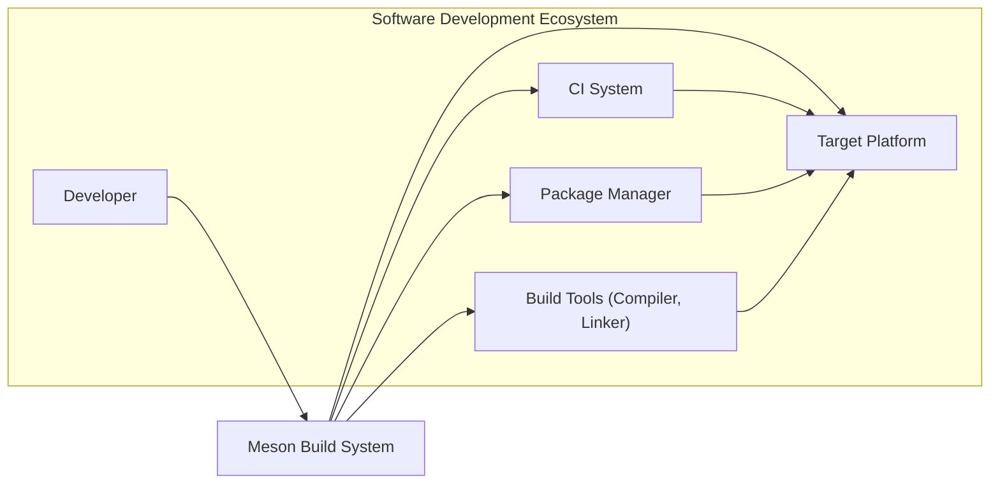
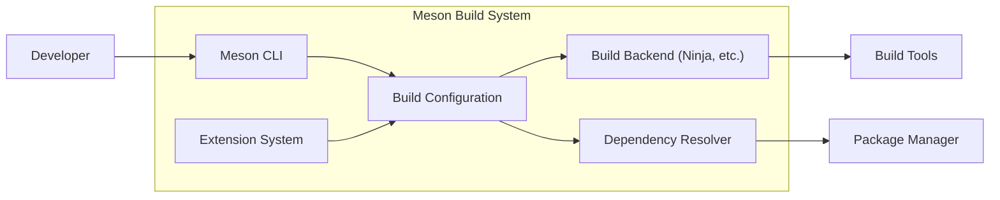
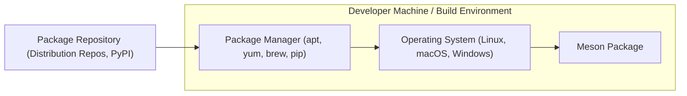
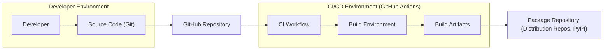

# BUSINESS POSTURE

Meson is an open-source build system designed to be fast, user-friendly, and portable. It aims to provide a better alternative to older build systems like Autotools and CMake, focusing on modern software development practices and developer experience.

Business priorities and goals:
- Primary goal: To provide a robust, efficient, and developer-friendly build system for software projects.
- Key priorities:
  - Speed and performance of the build process.
  - Ease of use and clear syntax for build definitions.
  - Cross-platform compatibility and portability.
  - Extensibility and support for modern development tools.
  - Active community and continuous improvement.

Most important business risks:
- Risk of vulnerabilities in the build system itself that could compromise software projects using Meson.
- Risk of supply chain attacks targeting Meson's dependencies or distribution channels.
- Risk of adoption failure if Meson does not meet developer needs or faces competition from other build systems.
- Risk of security issues arising from complex build configurations or custom Meson extensions.

# SECURITY POSTURE

Existing security controls:
- security control: Open source development model with public code repository on GitHub. This allows for community review and scrutiny of the codebase. (Implemented: GitHub repository)
- security control: Use of standard version control system (Git) for tracking changes and enabling rollback. (Implemented: Git repository)
- security control: Bug reporting and issue tracking system (GitHub Issues) for reporting and addressing security vulnerabilities. (Implemented: GitHub Issues)
- security control: Community contributions and peer review process for code changes. (Implemented: GitHub pull requests)
- security control: Testing framework and test suite to ensure the correctness and stability of the build system. (Implemented: Test suite in repository)

Accepted risks:
- accepted risk: Risks inherent in open source software, including potential for undiscovered vulnerabilities and reliance on community maintenance.
- accepted risk: Potential for vulnerabilities in third-party dependencies used by Meson.
- accepted risk: Risk of malicious contributions being merged into the codebase, although mitigated by review process.

Recommended security controls:
- recommended security control: Implement automated Static Application Security Testing (SAST) in the CI/CD pipeline to detect potential vulnerabilities in the Meson codebase.
- recommended security control: Implement automated Dependency Scanning to identify known vulnerabilities in third-party libraries used by Meson.
- recommended security control: Generate and publish Software Bill of Materials (SBOM) for Meson releases to improve transparency and supply chain security.
- recommended security control: Establish a clear process for handling security vulnerabilities, including responsible disclosure and timely patching.
- recommended security control: Consider code signing for Meson releases to ensure integrity and authenticity.

Security requirements:
- Authentication: Not directly applicable to Meson itself as a build system. Authentication is relevant in the context of systems that *use* Meson, such as CI/CD pipelines or package repositories.
- Authorization: Meson needs to respect file system permissions during build processes. It should not bypass user-level authorization controls. Meson extensions and build scripts should operate within expected authorization boundaries.
- Input validation: Meson must rigorously validate all input, including build definition files (meson.build), command-line arguments, and environment variables, to prevent injection attacks and other input-related vulnerabilities.
- Cryptography: Meson itself may not directly implement cryptographic algorithms, but it should support and integrate with cryptographic tools and libraries used in software projects being built. If Meson provides features like downloading dependencies, secure channels (HTTPS) should be enforced. If Meson provides features like package signing or verification, robust cryptographic practices are essential.

# DESIGN

## C4 CONTEXT

Context Diagram Elements:

- Element:
  - Name: Developer
  - Type: Person
  - Description: Software developers who use Meson to build their projects.
  - Responsibilities: Writes code, creates meson.build files, runs Meson to configure and build software.
  - Security controls: Uses secure development practices, manages access to source code and build environments.

- Element:
  - Name: Meson Build System
  - Type: Software System
  - Description: The Meson build system itself, responsible for configuring and orchestrating the software build process.
  - Responsibilities: Parses meson.build files, generates build files for backend build tools, manages dependencies, executes build commands.
  - Security controls: Input validation, secure handling of build scripts, protection against command injection, secure update mechanisms.

- Element:
  - Name: Build Tools (Compiler, Linker)
  - Type: Software System
  - Description: Underlying build tools like compilers (gcc, clang, Visual Studio), linkers, and other utilities that Meson uses to perform the actual compilation and linking.
  - Responsibilities: Compiles source code, links object files, creates executables and libraries.
  - Security controls: Security of the toolchain itself is assumed to be managed separately. Meson relies on the toolchain's security.

- Element:
  - Name: Target Platform
  - Type: Technology
  - Description: The operating system and hardware architecture where the software is being built and will be executed (e.g., Linux, Windows, macOS, embedded systems).
  - Responsibilities: Provides the runtime environment for the built software.
  - Security controls: Operating system level security controls, hardware security features.

- Element:
  - Name: Package Manager
  - Type: Software System
  - Description: System package managers (e.g., apt, yum, brew, pip) used to install dependencies required by Meson or the software being built.
  - Responsibilities: Installs and manages software packages and libraries.
  - Security controls: Package manager's security mechanisms for verifying package integrity and authenticity.

- Element:
  - Name: CI System
  - Type: Software System
  - Description: Continuous Integration and Continuous Delivery systems (e.g., GitHub Actions, Jenkins, GitLab CI) that automate the build, test, and deployment process using Meson.
  - Responsibilities: Automates build and test processes, integrates with Meson to build software in a controlled environment.
  - Security controls: CI system's security controls for managing pipelines, secrets, and access to build environments.

## C4 CONTAINER

Container Diagram Elements:

- Element:
  - Name: Meson CLI
  - Type: Application
  - Description: Command-line interface for interacting with Meson. Provides commands for configuring builds, running builds, testing, and other build-related tasks.
  - Responsibilities: Parses user commands, invokes build configuration, triggers build backend, displays build status.
  - Security controls: Input validation of command-line arguments, secure handling of user credentials if any (though unlikely for core Meson CLI).

- Element:
  - Name: Build Configuration
  - Type: Library/Component
  - Description: Component responsible for parsing meson.build files, interpreting build options, and generating build files for the selected backend.
  - Responsibilities: Parsing build definition files, validating build configuration, generating backend-specific build instructions, managing build options.
  - Security controls: Input validation of meson.build files, secure parsing logic to prevent vulnerabilities, authorization checks for file access during configuration.

- Element:
  - Name: Build Backend (Ninja, etc.)
  - Type: Application
  - Description:  External build tools like Ninja, or potentially others, that Meson uses to execute the actual build process based on the generated build files.
  - Responsibilities: Executing build commands, managing build dependencies, compiling and linking code.
  - Security controls: Meson relies on the security of the chosen build backend. Meson should ensure that it invokes the backend securely and handles its outputs safely.

- Element:
  - Name: Dependency Resolver
  - Type: Library/Component
  - Description: Component responsible for resolving project dependencies, potentially interacting with package managers or other dependency sources.
  - Responsibilities: Resolving project dependencies, downloading dependencies (if needed), ensuring dependencies are available for the build process.
  - Security controls: Securely fetching dependencies (HTTPS), verifying dependency integrity (checksums, signatures), mitigating dependency confusion attacks.

- Element:
  - Name: Extension System
  - Type: Library/Component
  - Description:  Allows extending Meson's functionality through plugins or modules.
  - Responsibilities: Loading and managing Meson extensions, providing APIs for extensions to interact with the build system.
  - Security controls: Secure loading and execution of extensions, input validation for extension inputs, sandboxing or isolation of extensions to prevent malicious code from compromising the core system.

## DEPLOYMENT

Meson itself is not "deployed" in the traditional sense of a web application or service. It is distributed as a package that developers install on their systems or in build environments.  Deployment in this context refers to how Meson is made available to users.

Deployment Options:
1. Package Managers: Distributed through system package managers (apt, yum, brew, pip).
2. Standalone Binaries: Downloadable pre-compiled binaries for different platforms.
3. Source Code: Available as source code on GitHub for manual compilation and installation.

Detailed Deployment (Package Managers - most common):

Deployment Diagram Elements:

- Element:
  - Name: Package Repository
  - Type: Infrastructure
  - Description: Online repositories that host Meson packages (e.g., distribution repositories for Linux, PyPI for Python packages).
  - Responsibilities: Storing and distributing Meson packages.
  - Security controls: Repository security measures to prevent package tampering and malware distribution (package signing, HTTPS).

- Element:
  - Name: Package Manager
  - Type: Software
  - Description: System package managers on user machines or build environments that download and install Meson packages from repositories.
  - Responsibilities: Downloading, verifying, and installing Meson packages.
  - Security controls: Package manager's verification mechanisms (signature checking), secure download channels (HTTPS).

- Element:
  - Name: Operating System
  - Type: Infrastructure
  - Description: The operating system on the developer's machine or build environment where Meson is installed and executed.
  - Responsibilities: Providing the runtime environment for Meson.
  - Security controls: OS-level security controls to protect the system and installed software.

- Element:
  - Name: Meson Package
  - Type: Software
  - Description: The packaged distribution of the Meson build system, installed on the user's system.
  - Responsibilities: Providing the Meson build system functionality.
  - Security controls: Package integrity (signatures), protection against tampering during distribution and installation.

## BUILD

Build Process Description:

1. Developer writes code and Meson build files (meson.build) and commits them to a Git repository (e.g., GitHub).
2. A CI/CD workflow (e.g., GitHub Actions) is triggered by code changes.
3. The CI workflow sets up a clean build environment.
4. The CI workflow checks out the source code from the Git repository.
5. The CI workflow uses Meson to configure and build the project. This includes:
    - Running `meson setup` to configure the build based on meson.build files.
    - Running `meson compile` to compile the code using the backend build tool.
6. The CI workflow performs security checks (SAST, dependency scanning - recommended security controls).
7. The CI workflow runs tests to ensure the build is functional.
8. The CI workflow packages the build artifacts (e.g., source distributions, wheels).
9. The CI workflow publishes the build artifacts to package repositories (e.g., PyPI for Python packages, distribution repositories).

Build Diagram Elements:

- Element:
  - Name: Developer
  - Type: Person
  - Description: Software developers who contribute to the Meson project.
  - Responsibilities: Writing code, fixing bugs, developing new features, submitting code changes.
  - Security controls: Secure coding practices, code review, access control to the repository.

- Element:
  - Name: Source Code (Git)
  - Type: Data Store
  - Description: Git repository hosted on GitHub containing the Meson source code and build scripts.
  - Responsibilities: Storing the source code, tracking changes, managing versions.
  - Security controls: Access control to the repository, branch protection, commit signing (optional).

- Element:
  - Name: GitHub Repository
  - Type: Platform
  - Description: GitHub platform hosting the Meson repository and CI/CD workflows.
  - Responsibilities: Hosting the code, managing issues, running CI/CD pipelines.
  - Security controls: GitHub's security features, access controls, audit logs.

- Element:
  - Name: CI Workflow
  - Type: Application
  - Description: GitHub Actions workflow that automates the build, test, and release process for Meson.
  - Responsibilities: Automating build steps, running tests, performing security checks, publishing artifacts.
  - Security controls: Secure workflow definition, secret management, access control to workflow execution, integration of security scanning tools.

- Element:
  - Name: Build Environment
  - Type: Infrastructure
  - Description: Isolated environment within the CI system where the build process is executed.
  - Responsibilities: Providing a clean and consistent environment for building Meson.
  - Security controls: Isolation from other environments, controlled access, secure configuration.

- Element:
  - Name: Build Artifacts
  - Type: Data Store
  - Description: Output of the build process, including source distributions, wheels, and potentially binaries.
  - Responsibilities: Packaging the built software for distribution.
  - Security controls: Integrity of build artifacts (signing), secure storage before publication.

- Element:
  - Name: Package Repository
  - Type: Infrastructure
  - Description: Repositories where Meson packages are published for distribution (e.g., PyPI).
  - Responsibilities: Hosting and distributing Meson packages to users.
  - Security controls: Repository security measures, package signing, HTTPS.

# RISK ASSESSMENT

Critical business process we are trying to protect:
- The integrity and availability of the Meson build system itself. If Meson is compromised, it could lead to widespread vulnerabilities in software projects that rely on it.
- The trust and reputation of the Meson project. Security incidents can damage user trust and hinder adoption.

Data we are trying to protect and their sensitivity:
- Source code of Meson: Intellectual property, vulnerabilities in source code can be exploited. High sensitivity.
- Build scripts (meson.build):  Less sensitive than source code, but vulnerabilities in build scripts could also be exploited. Medium sensitivity.
- Build artifacts (Meson packages):  Must be protected from tampering to ensure users download legitimate and safe software. High sensitivity.
- Development and build infrastructure (CI/CD pipelines, build environments):  Compromise can lead to supply chain attacks. High sensitivity.

# QUESTIONS & ASSUMPTIONS

Questions:
- What is the current process for handling security vulnerability reports in Meson? Is there a dedicated security team or contact?
- Are there any existing security scanning tools (SAST, DAST, dependency scanning) integrated into the Meson development or CI/CD process?
- Is there a process for generating and publishing SBOMs for Meson releases?
- Are Meson releases currently signed? If not, is code signing considered for future releases?
- What is the process for reviewing and merging contributions from the community, especially from a security perspective?

Assumptions:
- BUSINESS POSTURE: Assumed that the primary business goal is to provide a secure and reliable build system for the open-source community and wider software development ecosystem.
- SECURITY POSTURE: Assumed that while basic open-source security practices are in place, there is room for improvement in areas like automated security scanning, SBOM generation, and formal vulnerability handling processes.
- DESIGN: Assumed a modular design with clear separation of concerns, as reflected in the container diagram. Assumed that the build process is primarily automated using CI/CD pipelines.