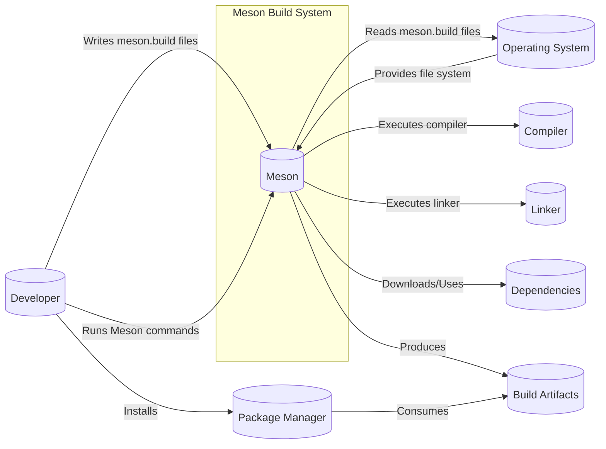
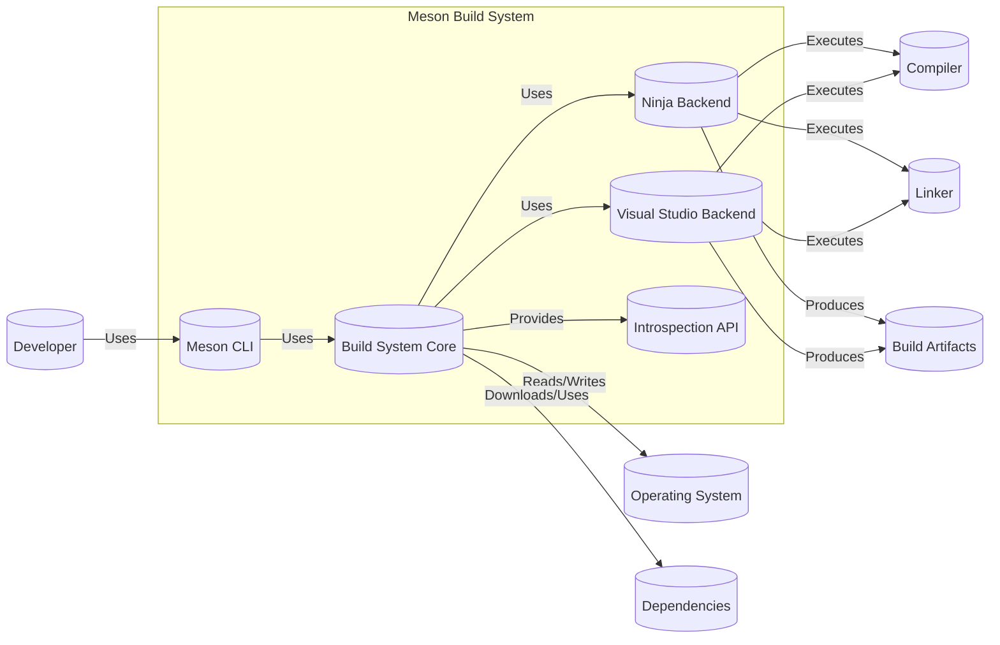
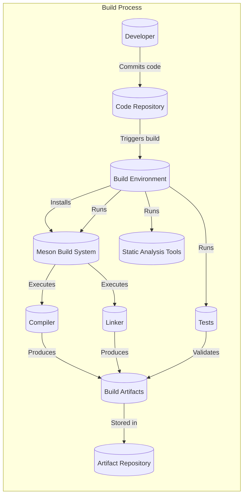

# Project Design Document: Meson Build System

## BUSINESS POSTURE

Meson is a build system designed to be fast and user-friendly. Its primary goal is to improve developer productivity by reducing the time spent on configuring and executing builds. The project prioritizes ease of use, cross-platform compatibility, and speed. Given its role in the software development lifecycle, incorrect builds can lead to deployment of vulnerable or non-functional software.

Business Priorities:

*   Developer Productivity: Minimize time spent on build configuration and execution.
*   Cross-Platform Compatibility: Support a wide range of platforms and compilers.
*   Build Reproducibility: Ensure consistent and reliable builds across different environments.
*   Speed: Provide fast compilation and linking times.
*   Ease of Use: Offer a simple and intuitive build configuration language.

Business Goals:

*   Become a widely adopted build system, replacing older, less efficient systems.
*   Maintain a high level of quality and reliability to ensure trust from the user base.
*   Foster a strong community to support and contribute to the project.

Most Important Business Risks:

*   Incorrect Build Output: The build system producing incorrect binaries or libraries, leading to runtime errors, security vulnerabilities, or deployment failures.
*   Supply Chain Attacks: Compromise of the Meson build system itself or its dependencies, leading to the injection of malicious code into projects that use Meson.
*   Lack of Adoption: Failure to gain widespread adoption due to complexity, lack of features, or competition from other build systems.
*   Maintainability: Difficulty in maintaining and extending the codebase as it grows and evolves.
*   Security Vulnerabilities in Meson: Vulnerabilities within Meson itself that could be exploited by malicious actors.

## SECURITY POSTURE

Existing Security Controls:

*   security control: Code Reviews: All changes to the Meson codebase undergo code review by other developers. (Described in the project's contribution guidelines).
*   security control: Static Analysis: The project uses static analysis tools to identify potential bugs and security vulnerabilities. (Mentioned in the project's documentation and CI configuration).
*   security control: Testing: Meson has an extensive test suite to ensure the correctness and reliability of its functionality. (Visible in the project's repository structure and CI configuration).
*   security control: Dependency Management: Meson uses a controlled set of dependencies to minimize the risk of supply chain attacks. (Implicit in the project's design and build configuration).
*   security control: Secure Development Practices: Developers are encouraged to follow secure coding practices. (Implicit in the project's culture and code review process).

Accepted Risks:

*   accepted risk: Limited Dynamic Analysis: While static analysis is used, there may be limited use of dynamic analysis tools, such as fuzzers.
*   accepted risk: Reliance on Third-Party Libraries: Meson, like any software, relies on third-party libraries, which may have their own vulnerabilities.
*   accepted risk: User-Controlled Build Scripts: Meson executes user-provided build scripts (meson.build), which could potentially contain malicious code if the user's system is compromised.

Recommended Security Controls:

*   security control: Fuzzing: Implement fuzzing to test Meson's input parsing and handling of unexpected data.
*   security control: Regular Security Audits: Conduct regular security audits of the codebase and dependencies.
*   security control: Software Bill of Materials (SBOM): Generate and maintain an SBOM to track all dependencies and their versions.
*   security control: Supply Chain Security Measures: Implement measures to verify the integrity of downloaded dependencies, such as checksum verification or signature checking.
*   security control: Sandboxing: Consider sandboxing the execution of user-provided build scripts to limit the potential impact of malicious code.

Security Requirements:

*   Authentication: Not directly applicable to the Meson build system itself, as it operates locally. However, authentication may be relevant when interacting with external services (e.g., package repositories).
*   Authorization: Not directly applicable in the same way as for a service. However, file system permissions control access to source code and build artifacts. Meson should respect these permissions.
*   Input Validation: Meson must rigorously validate all inputs, including user-provided build scripts (meson.build files), command-line arguments, and environment variables. This is crucial to prevent injection vulnerabilities.
*   Cryptography: Meson should use cryptographic libraries appropriately when needed (e.g., for verifying signatures of downloaded dependencies). It should not attempt to implement its own cryptographic algorithms.

## DESIGN

### C4 CONTEXT



Element Descriptions:

*   Element:
    *   Name: Developer
    *   Type: Person
    *   Description: The person writing code and using Meson to build it.
    *   Responsibilities: Writing source code, writing meson.build files, running Meson commands, and installing build artifacts.
    *   Security controls: Uses secure coding practices, performs code reviews.

*   Element:
    *   Name: Meson
    *   Type: Software System
    *   Description: The Meson build system itself.
    *   Responsibilities: Parsing meson.build files, managing dependencies, executing build commands, and generating build artifacts.
    *   Security controls: Input validation, static analysis, code reviews, testing.

*   Element:
    *   Name: Operating System
    *   Type: Software System
    *   Description: The underlying operating system (e.g., Linux, Windows, macOS).
    *   Responsibilities: Providing file system access, process management, and other system resources.
    *   Security controls: File system permissions, process isolation.

*   Element:
    *   Name: Compiler
    *   Type: Software System
    *   Description: The compiler used to translate source code into machine code (e.g., GCC, Clang, MSVC).
    *   Responsibilities: Compiling source code files.
    *   Security controls: Compiler-specific security flags (e.g., stack protection, ASLR).

*   Element:
    *   Name: Linker
    *   Type: Software System
    *   Description: The linker used to combine compiled object files into an executable or library.
    *   Responsibilities: Linking object files.
    *   Security controls: Linker-specific security flags.

*   Element:
    *   Name: Dependencies
    *   Type: Software System
    *   Description: External libraries and tools that the project depends on.
    *   Responsibilities: Providing functionality required by the project.
    *   Security controls: Dependency management, SBOM, vulnerability scanning.

*   Element:
    *   Name: Build Artifacts
    *   Type: Data
    *   Description: The output of the build process (e.g., executables, libraries, documentation).
    *   Responsibilities: N/A
    *   Security controls: Code signing (optional).

*   Element:
    *   Name: Package Manager
    *   Type: Software System
    *   Description: System or language specific package manager.
    *   Responsibilities: Installing, updating, and managing software packages.
    *   Security controls: Package signing, repository verification.

### C4 CONTAINER



Element Descriptions:

*   Element:
    *   Name: Meson CLI
    *   Type: Application
    *   Description: The command-line interface for interacting with Meson.
    *   Responsibilities: Parsing command-line arguments, invoking the build system core.
    *   Security controls: Input validation.

*   Element:
    *   Name: Build System Core
    *   Type: Library
    *   Description: The core logic of the Meson build system.
    *   Responsibilities: Parsing meson.build files, managing dependencies, generating build configurations.
    *   Security controls: Input validation, static analysis, code reviews.

*   Element:
    *   Name: Ninja Backend
    *   Type: Library
    *   Description: The backend that generates Ninja build files.
    *   Responsibilities: Generating Ninja build files.
    *   Security controls: Code reviews, testing.

*   Element:
    *   Name: Visual Studio Backend
    *   Type: Library
    *   Description: The backend that generates Visual Studio project files.
    *   Responsibilities: Generating Visual Studio project files.
    *   Security controls: Code reviews, testing.

*   Element:
    *   Name: Introspection API
    *   Type: API
    *   Description: An API for querying information about the build configuration.
    *   Responsibilities: Providing build information to external tools.
    *   Security controls: Input validation, access control (if applicable).

*   Element:
    *   Name: Developer
    *   Type: Person
    *   Description: The person writing code and using Meson to build it.
    *   Responsibilities: Writing source code, writing meson.build files, running Meson commands, and installing build artifacts.
    *   Security controls: Uses secure coding practices, performs code reviews.

*   Element:
    *   Name: Operating System
    *   Type: Software System
    *   Description: The underlying operating system (e.g., Linux, Windows, macOS).
    *   Responsibilities: Providing file system access, process management, and other system resources.
    *   Security controls: File system permissions, process isolation.

*   Element:
    *   Name: Compiler
    *   Type: Software System
    *   Description: The compiler used to translate source code into machine code (e.g., GCC, Clang, MSVC).
    *   Responsibilities: Compiling source code files.
    *   Security controls: Compiler-specific security flags (e.g., stack protection, ASLR).

*   Element:
    *   Name: Linker
    *   Type: Software System
    *   Description: The linker used to combine compiled object files into an executable or library.
    *   Responsibilities: Linking object files.
    *   Security controls: Linker-specific security flags.

*   Element:
    *   Name: Dependencies
    *   Type: Software System
    *   Description: External libraries and tools that the project depends on.
    *   Responsibilities: Providing functionality required by the project.
    *   Security controls: Dependency management, SBOM, vulnerability scanning.

*   Element:
    *   Name: Build Artifacts
    *   Type: Data
    *   Description: The output of the build process (e.g., executables, libraries, documentation).
    *   Responsibilities: N/A
    *   Security controls: Code signing (optional).

### DEPLOYMENT

Meson itself is typically installed via a system package manager or built from source. The deployment of projects *built* with Meson depends entirely on the project. Here are some common deployment scenarios:

1.  **System Package:** The project is packaged using a system package manager (e.g., apt, yum, pacman, MSI) and installed system-wide.
2.  **User Installation:** The project is installed in the user's home directory.
3.  **Containerization:** The project is packaged into a container image (e.g., Docker) and deployed to a container orchestration platform (e.g., Kubernetes).
4.  **Embedded System:** The project is cross-compiled and deployed to an embedded device.
5.  **Web Application:** The project is deployed to a web server.

We'll describe the "System Package" scenario in detail, as it's a common and relatively straightforward deployment model.

```mermaid
graph LR
    subgraph Deployment Environment (Target System)
        os[("Operating System")]
        packagemanager[("Package Manager")]
        filesystem[("File System")]
        installedsoftware[("Installed Software")]

        packagemanager -- "Installs to" --> filesystem
        filesystem -- "Contains" --> installedsoftware
    end
    buildserver[("Build Server")]
    package[("Package (e.g., .deb, .rpm)")]

    buildserver -- "Creates" --> package
    package -- "Uploaded to" --> packagemanager
```

Element Descriptions:

*   Element:
    *   Name: Build Server
    *   Type: Server
    *   Description: A server that builds the Meson project and creates the package.
    *   Responsibilities: Building the software, creating the package.
    *   Security controls: Limited access, secure build environment.

*   Element:
    *   Name: Package (e.g., .deb, .rpm)
    *   Type: Data
    *   Description: The installation package for the target system.
    *   Responsibilities: Containing the build artifacts and installation instructions.
    *   Security controls: Package signing.

*   Element:
    *   Name: Operating System
    *   Type: Software System
    *   Description: The operating system of the target system.
    *   Responsibilities: Providing the runtime environment.
    *   Security controls: OS-level security features.

*   Element:
    *   Name: Package Manager
    *   Type: Software System
    *   Description: The system package manager (e.g., apt, yum, pacman).
    *   Responsibilities: Installing, updating, and removing software packages.
    *   Security controls: Package signature verification, repository verification.

*   Element:
    *   Name: File System
    *   Type: Infrastructure
    *   Description: The file system of the target system.
    *   Responsibilities: Storing the installed software.
    *   Security controls: File system permissions.

*   Element:
    *   Name: Installed Software
    *   Type: Software System
    *   Description: The software installed by the package manager.
    *   Responsibilities: Providing the intended functionality.
    *   Security controls: Depends on the specific software.

### BUILD

Meson's build process can vary depending on how it's invoked (directly, via a script, or within a CI environment). A typical build process, including security considerations, is described below:

1.  **Developer writes code and meson.build files:** The developer creates or modifies the source code and the Meson build definition files.
2.  **Code Review (Optional but Recommended):** Changes are reviewed by other developers to identify potential bugs and security vulnerabilities.
3.  **Local Build (Developer's Machine):** The developer runs Meson locally to build the project. This involves:
    *   Meson parsing the `meson.build` files.
    *   Meson resolving dependencies (potentially downloading them).
    *   Meson generating build files (e.g., Ninja files).
    *   Meson invoking the compiler and linker.
4.  **Testing:** The developer runs unit tests and integration tests to verify the build.
5.  **CI/CD (Continuous Integration/Continuous Delivery):** In a CI/CD environment (e.g., GitHub Actions, GitLab CI, Jenkins), the following steps are typically performed:
    *   Code is checked out from the repository.
    *   A clean build environment is created (often using containers).
    *   Meson is installed (if not already present in the environment).
    *   Meson is executed to build the project.
    *   Static analysis tools (e.g., linters, code analyzers) are run.
    *   Tests are executed.
    *   If all steps are successful, build artifacts are created and potentially published (e.g., to a package repository).
6.  **Artifact Creation:** The build process produces build artifacts (executables, libraries, etc.).
7.  **Artifact Storage/Publication:** Build artifacts are stored locally or published to a repository.



Security Controls in the Build Process:

*   security control: Clean Build Environment: Using a clean build environment (e.g., a container) ensures that builds are reproducible and prevents contamination from previous builds.
*   security control: Static Analysis: Running static analysis tools helps identify potential vulnerabilities before runtime.
*   security control: Dependency Management: Carefully managing dependencies and using a Software Bill of Materials (SBOM) helps mitigate supply chain risks.
*   security control: Testing: Thorough testing helps ensure the correctness and reliability of the build.
*   security control: Limited Access to Build Server: Restricting access to the build server reduces the risk of unauthorized modifications.
*   security control: Code Signing (Optional): Signing build artifacts can help ensure their integrity and authenticity.

## RISK ASSESSMENT

Critical Business Processes to Protect:

*   Software Development Lifecycle: Ensuring the integrity and reliability of the build process is crucial for the entire software development lifecycle.
*   Release Management: Protecting the process of releasing software to users, ensuring that only trusted and verified builds are deployed.

Data to Protect and Sensitivity:

*   Source Code: Highly sensitive. Contains the intellectual property of the project and could reveal vulnerabilities if exposed.
*   meson.build Files: Moderately sensitive. Contains build configuration information, which could be used to exploit vulnerabilities or understand the project's structure.
*   Dependencies: Variable sensitivity. Dependencies may contain their own vulnerabilities, and their integrity must be protected.
*   Build Artifacts: Variable sensitivity. Executables and libraries may contain sensitive information or be targets for malicious modification.
*   Test Data: Low to moderate sensitivity. May contain sensitive data used for testing purposes.

## QUESTIONS & ASSUMPTIONS

Questions:

*   Are there any specific compliance requirements (e.g., industry regulations) that need to be considered?
*   What is the expected frequency of builds and deployments?
*   What are the specific target platforms and compilers that need to be supported?
*   What is the level of expertise of the developers who will be using Meson?
*   Are there any existing security tools or processes that should be integrated with Meson?
*   What level of detail is required in the introspection API?
*   What are the specific mechanisms used for dependency management (e.g., version pinning, checksum verification)?
*   Are there any plans to support remote builds or caching?

Assumptions:

*   BUSINESS POSTURE: The primary users of Meson are software developers.
*   BUSINESS POSTURE: The project aims to be a general-purpose build system, not tailored to a specific industry or domain.
*   SECURITY POSTURE: Developers are expected to follow basic secure coding practices.
*   SECURITY POSTURE: The project has a relatively small attack surface, as it primarily operates locally.
*   DESIGN: The build environment is trusted (i.e., not compromised).
*   DESIGN: The operating system and compiler are correctly configured and secure.
*   DESIGN: Dependencies are obtained from trusted sources.
*   DESIGN: The build process is automated (at least partially) using a CI/CD system.