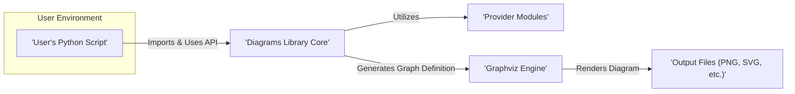

# Project Design Document: Diagrams - Infrastructure as Code for Visuals

**Version:** 1.1
**Date:** October 26, 2023
**Author:** AI Software Architect

## 1. Project Overview

The Diagrams project, accessible on GitHub at [https://github.com/mingrammer/diagrams](https://github.com/mingrammer/diagrams), is a Python library designed to create system architecture diagrams programmatically. It offers a declarative approach, allowing users to define infrastructure and application components as code, which are then rendered into various image formats. This "infrastructure as code" methodology for diagram creation enables version control, automation of diagram generation, and enhanced collaboration on system designs.

This document details the design of the Diagrams library, focusing on its architectural structure, key components, and the flow of data during diagram generation. This information is essential for conducting thorough threat modeling activities.

## 2. Goals

*   To provide a user-friendly and Pythonic interface for defining and generating system architecture diagrams.
*   To support a range of common diagram output formats, including PNG, JPG, SVG, and PDF.
*   To offer an extensive collection of pre-built node representations for popular cloud providers, technologies, and general system components.
*   To enable users to customize the visual appearance and styling of generated diagrams.
*   To facilitate seamless integration of diagram generation into existing software development and deployment workflows.

## 3. Non-Goals

*   Providing real-time monitoring or dynamic visualization of live system states.
*   Implementing interactive diagram editing capabilities directly within the library.
*   Offering automatic discovery or inference of existing infrastructure configurations.
*   Functioning as a tool for deploying or provisioning infrastructure resources.
*   Enforcing specific architectural best practices or compliance standards through the library itself.

## 4. Target Audience

*   Software developers involved in system design and documentation.
*   System architects responsible for creating and maintaining architectural diagrams.
*   DevOps engineers who need to automate the generation of infrastructure visualizations.
*   Technical writers tasked with documenting system architectures.
*   Anyone requiring a programmatic way to create and manage system diagrams.

## 5. System Architecture

The Diagrams library operates as a locally executed Python application. The fundamental process involves a user writing Python code that leverages the library's API to define the elements and relationships within a diagram. Upon execution, this code instructs the library to render the defined diagram into the desired image format.

## 6. Components

*   **User's Python Script:** This is the starting point where the user defines the diagram using the Diagrams library's API. Key aspects include:
    *   Import statements for the core `diagrams` library and specific provider modules as needed.
    *   Instantiation of a `Diagram` object, specifying the diagram's name and the desired output file path.
    *   Creation of `Node` objects representing various system components (e.g., databases, servers, cloud services).
    *   Definition of relationships (edges) between the created `Node` objects.
    *   Optional configuration of diagram-level attributes such as layout and styling.

*   **Diagrams Library Core:** This is the central component of the library, responsible for:
    *   Interpreting the user's Python code and extracting the diagram definition.
    *   Managing the internal collection of defined nodes and their relationships (edges).
    *   Orchestrating the overall diagram generation workflow.
    *   Providing the primary API for defining diagrams, nodes, and edges.
    *   Handling global settings and configurations for diagram generation.

*   **Provider Modules:** These modules offer pre-defined `Node` representations for specific technologies and cloud providers (e.g., AWS, Azure, GCP, Kubernetes). Each provider module contains:
    *   A structured hierarchy of node classes representing different services and components within that provider's ecosystem.
    *   Associated icons and default styling for each node type, enhancing visual representation.
    *   Convenience abstractions to simplify the creation of nodes specific to that provider.

*   **Graphviz Engine:** The Diagrams library relies on the external Graphviz library for the actual rendering of the diagram. This component:
    *   Accepts a graph definition (expressed in the DOT language) as input.
    *   Applies various layout algorithms to arrange the nodes and edges in a visually coherent manner.
    *   Generates the final diagram image in the specified output format.

*   **Output Files:** These are the generated diagram images, produced in formats such as PNG, JPG, SVG, or PDF. They represent the visual output of the defined system architecture.

## 7. Data Flow

The process of generating a diagram involves the following sequence of data flow:

1. **User authors a Python script:** The user creates a Python script that declaratively defines the desired diagram structure using the Diagrams library's API.
2. **Script execution:** The user executes the Python script.
3. **Diagrams library initialization:** The `diagrams` library is imported and its core components are initialized.
4. **Diagram definition parsing:** The library parses the user's script, identifying and extracting the defined nodes, edges, and any specified diagram attributes.
5. **Node and edge collection:** The library internally constructs a representation of the diagram by collecting the defined nodes and their interconnections.
6. **Graph definition generation:** The library translates its internal representation of the diagram into a Graphviz DOT language definition. This includes specifying node attributes (labels, shapes, icons) and the connections between nodes.
7. **Graphviz rendering:** The generated DOT definition is passed to the Graphviz engine.
8. **Diagram layout and rendering:** Graphviz applies a layout algorithm to arrange the diagram elements and then renders the diagram into the requested output format (e.g., PNG, SVG).
9. **Output file creation:** The rendered diagram is saved as an image file at the specified output path.

## 8. Security Considerations

While the Diagrams library primarily operates within a local environment, several security aspects warrant consideration:

*   **Dependency Vulnerabilities:** The library relies on external dependencies, notably Graphviz. Security vulnerabilities discovered in these dependencies could potentially be exploited if a user operates the library in a vulnerable environment or uses outdated versions of these dependencies.
*   **Input Handling:** The library processes Python code provided by the user. Although its primary function is diagram definition, inadequate handling of maliciously crafted or malformed input could lead to unexpected behavior or potential code execution vulnerabilities.
*   **Output Security:** The generated diagram images may contain sensitive information about the system architecture. Ensuring appropriate access controls and secure storage for these output files is crucial to prevent unauthorized disclosure.
*   **Accidental Credential Exposure:** While less likely in typical usage, if diagram definitions inadvertently include information resembling cloud provider credentials, this could present a security risk. Users should avoid hardcoding sensitive information in their diagram definitions.
*   **Local Execution Environment Security:** The security posture of the environment where the Diagrams library is executed is paramount. If the user's machine is compromised, the library and its generated outputs could be at risk.
*   **Supply Chain Risks:** The possibility of using a compromised version of the `diagrams` library itself from a package repository (such as PyPI) should be considered. Employing package integrity verification mechanisms and relying on trusted sources for package installation is essential.

## 9. Deployment Model

The Diagrams library is typically deployed and utilized as a local Python library, installed using `pip`. The primary deployment scenarios involve:

*   **Local Development Environments:** Developers install the library and its dependencies on their local machines to create diagrams as part of their development workflow.
*   **CI/CD Pipeline Integration:** The library can be integrated into Continuous Integration/Continuous Deployment (CI/CD) pipelines to automate the generation of system architecture diagrams as part of the build or deployment process. This usually involves executing Python scripts that utilize the Diagrams library.

## 10. Technologies Used

*   **Primary Programming Language:** Python
*   **Diagram Rendering Engine:** Graphviz
*   **Package Management Tool:** pip
*   **Supported Output Formats:** PNG, JPG, SVG, PDF (provided by Graphviz)
*   **Potential External Dependencies:** Various Python libraries for image manipulation or specific integrations with cloud provider SDKs.
