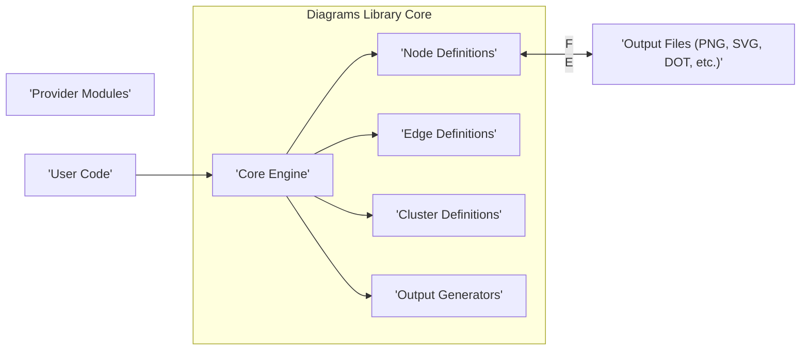
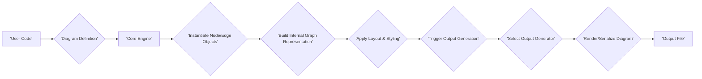

# Project Design Document: Diagrams Library

**Version:** 1.1
**Date:** October 26, 2023
**Author:** AI Software Architect

## 1. Introduction

This document provides a detailed architectural design of the `diagrams` Python library (available at [https://github.com/mingrammer/diagrams](https://github.com/mingrammer/diagrams)). This document is intended to serve as a foundation for subsequent threat modeling activities. It outlines the key components, functionalities, and interactions within the library, providing a comprehensive understanding of its structure and potential attack surfaces. This revision clarifies certain aspects and expands on security considerations.

## 2. Goals

*   Clearly define the architecture and components of the `diagrams` library.
*   Illustrate the data flow and interactions within the library with enhanced clarity.
*   Identify key areas of functionality relevant to security considerations, providing more specific examples.
*   Provide a robust basis for identifying potential threats and vulnerabilities.

## 3. Scope

This document covers the core functionalities of the `diagrams` library, including:

*   Defining nodes and edges representing infrastructure components with various attributes.
*   Grouping nodes into clusters and applying specific styling.
*   Generating diagrams in various output formats (e.g., PNG, JPEG, SVG, DOT) leveraging external tools.
*   Utilizing provider modules for specific cloud platforms and technologies, including the mechanism for loading these modules.
*   The overall structure and organization of the library's codebase, focusing on architectural layers.

This document does not cover:

*   Specific implementation details of individual provider modules beyond their general role and interaction with the core.
*   The deployment environment of applications using the `diagrams` library, focusing solely on the library's internal workings.
*   The security of the systems being diagrammed by the library; the focus is on the library itself.

## 4. Target Audience

This document is intended for:

*   Security engineers and architects performing threat modeling on the `diagrams` library or systems incorporating it.
*   Developers contributing to the `diagrams` library, providing a high-level architectural understanding.
*   Anyone seeking a detailed understanding of the library's architecture for security analysis or modification purposes.

## 5. System Overview

The `diagrams` library empowers users to create system architecture diagrams programmatically using Python. It offers a declarative approach to define nodes representing diverse infrastructure elements (e.g., servers, databases, services) and connect them with edges to visualize their relationships. The library's extensible architecture includes provider modules that offer pre-defined node shapes, icons, and contextual information for specific cloud platforms and technologies. The resulting diagrams can be exported in various standard image and graph description formats.

## 6. System Architecture

The `diagrams` library's architecture is structured around several key components that interact to facilitate diagram creation:

*   **Core Engine:** The central component responsible for managing the diagram's lifecycle.
    *   Manages the internal graph representation using nodes and edges as fundamental building blocks.
    *   Implements layout algorithms to arrange nodes and edges for optimal visual representation.
    *   Coordinates the diagram generation process, orchestrating interactions between other components.
*   **Node Definitions:** Define the individual elements within a diagram.
    *   Consist of base node classes offering fundamental properties (e.g., label, icon).
    *   Include provider-specific node classes inheriting from the base, providing tailored representations and metadata.
    *   Allow for custom node definitions, enabling users to represent unique components.
*   **Edge Definitions:** Define the connections and relationships between nodes.
    *   Specify the source and destination nodes of a connection.
    *   Support attributes such as label, style, and directionality to convey relationship details.
*   **Cluster Definitions:** Provide a mechanism for grouping related nodes visually.
    *   Allow users to organize diagrams into logical sections.
    *   Support styling options to differentiate clusters visually.
*   **Provider Modules:** Extend the library's capabilities by providing pre-built definitions for specific technologies.
    *   Contain Python modules organized by provider (e.g., `diagrams.aws`, `diagrams.gcp`).
    *   Offer classes representing individual services or components within the provider's ecosystem.
    *   Typically include icon resources (e.g., image files) used for visual representation.
    *   Provider modules are dynamically loaded when referenced in user code.
*   **Output Generators:** Handle the conversion of the internal graph representation into various output formats.
    *   Implement format-specific logic for rendering the diagram.
    *   Often rely on external tools or libraries (e.g., Graphviz's `dot` executable for generating image formats).
    *   Manage the invocation of these external tools and the handling of their output.
*   **User Code:** The Python scripts written by users that utilize the `diagrams` library's API to define and generate diagrams. This is the primary point of interaction with the library.

## 7. Data Flow

The process of generating a diagram using the `diagrams` library involves the following data flow:

1. **User Code Defines Diagram Structure:** The user authors Python code, leveraging the `diagrams` library's API to define the diagram's components (nodes, edges, clusters) and their attributes. This code essentially describes the desired visual representation.
2. **Diagram Definition is Interpreted:** The `Core Engine` receives and interprets the diagram definition from the user's code. This involves instantiating relevant objects based on the user's specifications.
3. **Node and Edge Objects are Instantiated:** The `Core Engine` creates instances of `Node` and `Edge` objects. If provider-specific nodes are used, the corresponding classes from the `Provider Modules` are instantiated.
4. **Internal Graph Representation is Constructed:** The `Core Engine` builds an in-memory graph representation of the diagram, linking the created node and edge objects. This graph serves as the internal model of the diagram.
5. **Layout and Styling Rules are Applied:** The `Core Engine` applies layout algorithms to determine the positioning of nodes and edges. Styling attributes defined by the user or by default settings are applied to the visual elements.
6. **Output Generation is Triggered:** The user's code specifies the desired output format (e.g., PNG, SVG) when invoking the diagram saving functionality.
7. **Appropriate Output Generator is Selected:** Based on the requested output format, the corresponding `Output Generator` module is selected and invoked by the `Core Engine`.
8. **Diagram is Rendered or Serialized:** The selected `Output Generator` translates the internal graph representation into the target format. This may involve:
    *   Generating a `dot` language description, which is then passed to the Graphviz `dot` executable.
    *   Directly rendering the diagram using a graphics library for certain formats.
9. **Output File is Persisted:** The generated diagram is saved to a file in the specified format at the location specified by the user or default settings.

## 8. Security Considerations (Detailed)

While the `diagrams` library primarily focuses on diagram generation and doesn't directly handle sensitive data or network communication in its core operation, several potential security considerations warrant attention:

*   **Dependency Vulnerabilities:** The library relies on external Python packages, including potentially `graphviz`. Vulnerabilities in these dependencies could be exploited if the library is used in a security-sensitive environment. Regularly auditing and updating dependencies is crucial.
*   **Malicious User Code as Input:** If an attacker can influence the Python code used to define the diagram, they could potentially craft diagrams for malicious purposes. This could include:
    *   **Social Engineering:** Creating diagrams that mimic legitimate infrastructure to deceive users or system administrators.
    *   **Information Disclosure (Indirect):**  While the library doesn't directly access sensitive data, a poorly secured system using `diagrams` might inadvertently expose internal network structures or component names in generated diagrams.
*   **Provider Module Loading and Potential Risks:** The library dynamically loads provider modules. If the mechanisms for discovering and loading these modules are not secure, there's a potential risk of loading malicious or tampered provider modules. This could lead to unexpected behavior or even code execution within the context of the application using `diagrams`.
*   **Output File Security:** The generated diagram files themselves can contain information about the system's architecture. Secure storage and access control mechanisms for these files are essential to prevent unauthorized disclosure of infrastructure details.
*   **Command Injection via Output Generators:** If the `Output Generators` rely on external commands (like invoking the `dot` executable), and if the input to these commands is not properly sanitized, there's a theoretical risk of command injection if an attacker could control parts of the diagram definition that are passed to these external tools. This risk is mitigated by careful handling of input parameters.
*   **Denial of Service (Resource Exhaustion):**  A maliciously crafted diagram definition with an extremely large number of nodes and edges could potentially consume excessive resources (memory, CPU) during the generation process, leading to a denial-of-service condition. Input validation and resource limits might be considered.

## 9. Deployment Considerations

The `diagrams` library is typically integrated as a dependency within a Python application or script. The security of the environment where this application is deployed is paramount. Key considerations include:

*   **Secure Development Practices:** Employing secure coding practices when developing applications that utilize the `diagrams` library is crucial to prevent vulnerabilities in the surrounding application logic.
*   **Dependency Management and Auditing:** Utilizing tools like `pip-audit` or `safety` to manage and monitor dependencies for known vulnerabilities is essential for maintaining a secure environment.
*   **Access Control and Permissions:** Restricting access to the environment where the library is used and where generated diagram files are stored is vital to prevent unauthorized access and modification.
*   **Sandboxing or Containerization:** Consider using sandboxing or containerization technologies to isolate the application using `diagrams` and limit the potential impact of any vulnerabilities.

## 10. Future Considerations

Potential future enhancements to the `diagrams` library that could introduce new security considerations include:

*   **Interactive Diagram Features with User Input:** Implementing interactive elements that accept user input could introduce vulnerabilities related to input validation and cross-site scripting (XSS) if the diagrams are displayed in a web context.
*   **Direct Integration with Infrastructure-as-Code (IaC) Tools:** If the library were to directly parse or interact with IaC configurations (e.g., Terraform, CloudFormation), careful consideration would be needed to prevent the execution of unintended actions or the exposure of sensitive credentials.
*   **Remote Diagram Generation Services:** If the library were extended to offer remote diagram generation capabilities, robust authentication, authorization, and secure communication protocols would be essential.
*   **Plugin System with External Contributions:** Introducing a plugin system would necessitate a thorough review and security assessment process for contributed plugins to mitigate the risk of malicious code injection.

## 11. Conclusion

This revised document provides a more detailed and nuanced understanding of the `diagrams` library's architecture and functionalities, with an expanded focus on potential security considerations. It highlights key areas where vulnerabilities could arise, both within the library itself and in how it is used. This information serves as a valuable foundation for conducting thorough threat modeling and implementing appropriate security measures. Continuous monitoring and adaptation to evolving security threats will be essential for maintaining the security posture of systems utilizing this library.