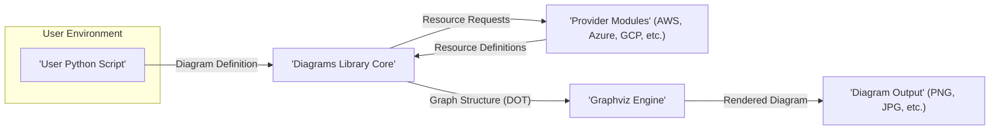
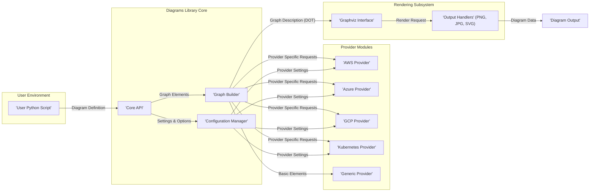
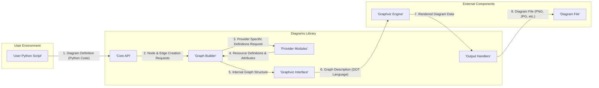

# Project Design Document: Diagrams - Infrastructure as Code for Visuals

**Version:** 1.1
**Date:** October 26, 2023
**Author:** AI Software Architect

## 1. Introduction

This document provides an enhanced and more detailed design overview of the `diagrams` project, a Python library enabling the programmatic creation of system architecture diagrams. This document serves as a robust foundation for understanding the project's architecture, individual components, and the flow of data, which is essential for subsequent threat modeling activities.

### 1.1. Project Overview

The `diagrams` library empowers users to define their cloud and on-premise system infrastructure using Python code, subsequently generating visual diagrams that represent this infrastructure. It boasts support for a diverse range of providers, including AWS, Azure, GCP, and Kubernetes, offering a declarative and version-controlled approach to creating and maintaining up-to-date architectural diagrams.

### 1.2. Project Goals

* To offer a user-friendly and intuitive Python interface for defining complex infrastructure diagrams as code.
* To provide comprehensive support for a wide array of cloud providers and on-premise technologies, ensuring broad applicability.
* To generate visually appealing, informative, and easily understandable diagrams in various standard image formats.
* To facilitate version control and automation of diagram creation, integrating seamlessly into CI/CD pipelines.

### 1.3. Scope

This design document focuses specifically on the internal workings and core functionalities of the `diagrams` library itself. The scope includes:

* The central engine responsible for parsing user-defined diagram structures and orchestrating the generation process.
* The modular provider implementations that offer representations of different infrastructure components and services.
* The rendering pipeline that transforms the internal graph representation into the final visual diagram output.

This document explicitly excludes:

* The GitHub repository and its associated infrastructure where the project is hosted.
* Diagrams created by users utilizing the library, as their content and security are outside the library's direct control.
* External tools, plugins, or integrations that might interact with or extend the functionality of the library.

### 1.4. Target Audience

This document is primarily intended for:

* Security engineers tasked with performing thorough threat modeling of the `diagrams` library.
* Developers actively contributing to the development and maintenance of the `diagrams` project.
* Software and cloud architects seeking a deeper technical understanding of the library's internal architecture and design principles.

## 2. Architectural Overview

The `diagrams` library is designed with a modular architecture, clearly separating the core logic for diagram definition and processing from the provider-specific implementations and the rendering mechanisms. This separation of concerns enhances maintainability and extensibility.

### 2.1. High-Level Architecture

* **User Python Script:** The user authors a Python script that utilizes the `diagrams` library's API to define their desired infrastructure diagram. This script acts as the input to the library.
* **Diagrams Library Core:** This is the central orchestrator of the diagram generation process. It parses the user's script, manages the collection of nodes and edges representing the infrastructure, and coordinates with provider modules and the rendering engine.
* **Provider Modules:** These are independent modules, each dedicated to a specific cloud provider or technology. They contain the definitions and representations of the various resources offered by that provider (e.g., EC2 instances in AWS, Virtual Machines in Azure).
* **Graphviz Engine:** The `diagrams` library relies on Graphviz, a widely used open-source graph visualization software, to perform the actual rendering of the diagram based on the graph structure generated by the core library.
* **Diagram Output:** The final output of the process is a visually rendered diagram in a chosen format, such as PNG, JPG, or SVG, which visually represents the defined infrastructure.

### 2.2. Component Diagram

* **User Python Script:** The starting point where users define their infrastructure diagrams using the library's Python API.
* **Diagrams Library Core:**
    * **Core API:** Provides the high-level, user-facing interface for defining diagram elements (nodes, edges, etc.) and their properties. It acts as the entry point for user interaction.
    * **Graph Builder:**  The central component responsible for translating the user's abstract diagram definition into a concrete, internal graph representation suitable for rendering.
    * **Configuration Manager:** Manages global settings for the library and provider-specific configurations, allowing customization of the diagram generation process.
* **Provider Modules:**
    * **AWS Provider:** Contains definitions and logic for representing AWS services and resources (e.g., EC2 instances, S3 buckets).
    * **Azure Provider:** Contains definitions and logic for representing Azure services and resources (e.g., Virtual Machines, Storage Accounts).
    * **GCP Provider:** Contains definitions and logic for representing GCP services and resources (e.g., Compute Engine instances, Cloud Storage buckets).
    * **Kubernetes Provider:** Contains definitions and logic for representing Kubernetes resources (e.g., Pods, Deployments, Services).
    * **Generic Provider:** Offers a set of basic, non-provider-specific node types for representing general components.
* **Rendering Subsystem:**
    * **Graphviz Interface:**  Handles the communication with the external Graphviz engine, translating the internal graph representation into the DOT language that Graphviz understands.
    * **Output Handlers:** Responsible for taking the rendered output from Graphviz and saving it to a file in the desired image format (e.g., PNG, JPG, SVG).

### 2.3. Data Flow Diagram

1. **Diagram Definition (Python Code):** The user initiates the process by writing a Python script that defines the desired infrastructure diagram using the `diagrams` library's API.
2. **Node & Edge Creation Requests:** The Core API receives the user's definition and sends requests to the Graph Builder to create the necessary nodes and edges representing the infrastructure components and their connections.
3. **Provider Specific Definitions Request:** The Graph Builder interacts with the relevant Provider Modules to retrieve specific definitions, attributes, and icons for the cloud resources being represented in the diagram.
4. **Resource Definitions & Attributes:** The Provider Modules provide the Graph Builder with the necessary data and visual information for each resource.
5. **Internal Graph Structure:** The Graph Builder constructs an in-memory representation of the diagram's graph structure, defining nodes and their relationships.
6. **Graph Description (DOT Language):** The Graphviz Interface takes the internal graph structure and translates it into the DOT language, a graph description language understood by the Graphviz engine.
7. **Rendered Diagram Data:** The Graphviz engine processes the DOT language description and renders the visual diagram as an image or vector graphic.
8. **Diagram File (PNG, JPG, etc.):** The Output Handlers receive the rendered diagram data from Graphviz and save it to a file in the user-specified format.

## 3. Key Components

### 3.1. Core API

* **Responsibility:** Serves as the primary point of interaction for users, providing the functions and classes necessary to define infrastructure diagrams programmatically.
* **Functionality:**
    * Provides a user-friendly interface for creating `Diagram` objects, which represent the overall diagram.
    * Offers methods for defining `Node` objects, representing individual infrastructure components, with their associated attributes and labels.
    * Enables the creation of `Edge` objects to define the relationships and connections between nodes.
    * Handles the initial parsing and validation of the user's diagram definition.
    * Orchestrates the overall diagram generation process by delegating tasks to other core components.

### 3.2. Graph Builder

* **Responsibility:**  Transforms the abstract, user-defined diagram into a concrete graph structure that can be processed by the rendering engine.
* **Functionality:**
    * Creates and manages the collection of nodes and edges that form the internal representation of the diagram.
    * Resolves dependencies and relationships between different nodes in the diagram.
    * Applies layout algorithms and styling rules to ensure the generated diagram is visually appealing and informative.
    * Interacts with the appropriate Provider Modules to obtain specific details and visual representations for each infrastructure component.

### 3.3. Provider Modules

* **Responsibility:**  To encapsulate the knowledge and definitions of specific infrastructure providers and technologies.
* **Functionality:**
    * Define Python classes that represent the various resources offered by a specific provider (e.g., `AWS.EC2.Instance`, `Azure.Storage.BlobService`).
    * Provide default icons, shapes, and styling attributes for the nodes representing provider-specific resources.
    * May contain logic for dynamically fetching information about resources (though this is less common within the core library itself, often handled by user scripts).

### 3.4. Graphviz Interface

* **Responsibility:** Acts as the intermediary between the `diagrams` library and the external Graphviz rendering engine.
* **Functionality:**
    * Translates the internal graph representation, created by the Graph Builder, into the DOT language, which is the input format for Graphviz.
    * Executes the Graphviz engine as a separate process, providing it with the generated DOT file.
    * Receives the rendered diagram output (typically in an intermediate format) from the Graphviz engine.

### 3.5. Output Handlers

* **Responsibility:**  To manage the final stage of the diagram generation process, converting the output from Graphviz into various user-friendly image formats.
* **Functionality:**
    * Support a range of common image formats, including PNG, JPG, and SVG, allowing users to choose the most suitable format for their needs.
    * Provide options for customizing output settings, such as image resolution, background color, and other rendering parameters.

## 4. Security Considerations (For Threat Modeling)

This section outlines initial security considerations based on the project's design. These points will be further investigated and analyzed during the dedicated threat modeling process.

* **Dependency Vulnerabilities:** The library relies on external dependencies, most notably Graphviz. Security vulnerabilities discovered in these dependencies could potentially be exploited through the `diagrams` library. Regular dependency updates and vulnerability scanning are crucial.
* **Malicious Input Handling:** The library processes user-provided Python code to define diagrams. If not carefully handled, malicious or poorly written user code could potentially lead to code injection or other unexpected and harmful behavior within the library's execution environment.
* **Code Injection Risks (Mitigation Required):** While the primary use case is declarative diagram definition, any features allowing dynamic code execution or string interpolation based on user input could introduce code injection vulnerabilities. Strict input sanitization and avoiding dynamic code generation are essential.
* **Information Disclosure in Diagrams:** Diagrams generated by the library might inadvertently expose sensitive information if node labels, attributes, or connection details contain secrets, internal IP addresses, or other confidential data. Secure handling of sensitive information within user scripts is paramount.
* **Resource Exhaustion (Denial of Service):** Processing extremely large or complex diagram definitions could potentially consume excessive CPU, memory, or disk resources during the rendering process, leading to a denial-of-service condition. Implementing safeguards against overly complex diagrams might be necessary.
* **Indirect Exposure of Provider Credentials:** Although the `diagrams` library itself does not directly manage or store cloud provider credentials, users might inadvertently include sensitive credential information within their diagram definition scripts or rely on external tools that do. Educating users on secure credential management is important.
* **Supply Chain Security Risks:**  Compromise of the library's distribution channels (e.g., PyPI) could lead to the distribution of a malicious version of the library. Employing measures like signing releases and verifying checksums can mitigate this risk.
* **Serialization/Deserialization Vulnerabilities:** If the library serializes or deserializes diagram definitions or internal state, vulnerabilities in the serialization libraries used could be exploited. Careful selection and secure configuration of serialization mechanisms are important.

## 5. Future Considerations

* **Interactive Diagram Generation and Exploration:**  Exploring the possibility of generating interactive diagrams that allow users to explore the infrastructure in more detail could introduce new security considerations related to client-side scripting and data handling within the interactive elements.
* **Diagram Validation and Policy Enforcement:** Implementing mechanisms to validate diagram definitions against predefined schemas, security policies, or best practices could help prevent the creation of diagrams that represent insecure or non-compliant infrastructure.
* **Integration with Security Scanning and Analysis Tools:**  Developing integrations with security scanning and analysis tools could automate the process of identifying potential security vulnerabilities or misconfigurations directly from the infrastructure defined in the diagrams.
* **Enhanced Error Handling and Security Logging:** Improving error handling and implementing comprehensive security logging can aid in identifying and responding to potential security incidents or malicious activity.

This enhanced document provides a more detailed and comprehensive design overview of the `diagrams` project. The information presented here will be invaluable for conducting thorough and effective threat modeling, ultimately contributing to the security and robustness of the library and the infrastructure it represents.