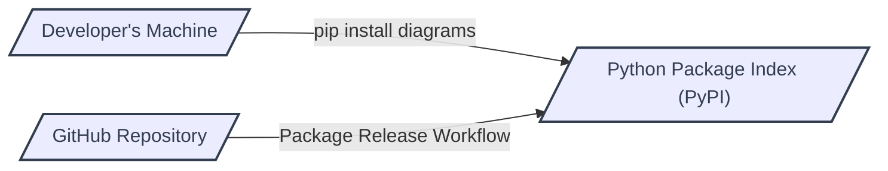
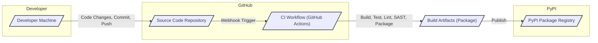

# BUSINESS POSTURE

This project, the `diagrams` Python library, aims to simplify the creation of system architecture diagrams as code. By providing a declarative way to define infrastructure and application components, it enables developers, architects, and DevOps engineers to easily visualize and document their systems.

* Business Priorities and Goals:
  - Enhance system documentation and communication through visual diagrams.
  - Increase developer productivity by providing a code-driven approach to diagram creation.
  - Facilitate collaboration and understanding of system architectures across teams.
  - Reduce the effort and time required to create and maintain up-to-date system diagrams.

* Business Risks:
  - Supply chain vulnerability: If the library is compromised, applications using it could be indirectly affected, especially if diagrams are used for security-sensitive system documentation or configuration.
  - Misrepresentation of system architecture: Bugs or inaccuracies in the library could lead to misleading diagrams, potentially causing misunderstandings or incorrect decisions about system design and security.
  - Availability risk: If the library becomes unavailable (e.g., PyPI outage, repository deletion), users might be unable to generate or update diagrams, impacting documentation workflows.

# SECURITY POSTURE

* Security Controls:
  - security control: Repository hosted on GitHub, leveraging GitHub's security features for code hosting and access control. (Implemented: GitHub)
  - security control: Open-source project, allowing for community review and contribution to identify and fix potential vulnerabilities. (Implemented: GitHub)
  - security control: Use of Python Package Index (PyPI) for distribution, relying on PyPI's infrastructure for package integrity and availability. (Implemented: PyPI)

* Accepted Risks:
  - accepted risk: Vulnerabilities in dependencies: The library relies on third-party Python packages, which may contain security vulnerabilities.
  - accepted risk: Open-source vulnerability disclosure: Security vulnerabilities, once discovered, are publicly disclosed, potentially increasing the window of exploitation before patches are widely adopted.
  - accepted risk: Community-driven development: Security relies on the vigilance and security awareness of community contributors.

* Recommended Security Controls:
  - security control: Implement automated dependency scanning to identify and address vulnerabilities in third-party packages.
  - security control: Integrate Static Application Security Testing (SAST) tools into the CI/CD pipeline to detect potential security flaws in the library's code.
  - security control: Implement Software Bill of Materials (SBOM) generation to provide transparency about the library's components and dependencies.
  - security control: Consider code signing for releases to ensure the integrity and authenticity of distributed packages.
  - security control: Establish a security policy and vulnerability disclosure process to handle security issues effectively.

* Security Requirements:
  - Authentication: Not directly applicable to the library itself, as it's a development tool. Authentication is relevant for the platforms where the library is hosted (GitHub, PyPI).
  - Authorization: Access control to the GitHub repository should be managed using GitHub's roles and permissions. Authorization is relevant for PyPI account used for publishing.
  - Input Validation: The library should validate user-provided diagram definitions to prevent unexpected behavior or errors. This is important to ensure robustness and prevent potential denial-of-service or other issues if malicious input is provided (though less of a security vulnerability in this context).
  - Cryptography: Cryptography is not a primary requirement for this library as it does not handle sensitive data directly. However, if future features involve handling credentials or sensitive information (e.g., for connecting to cloud providers to automatically generate diagrams), appropriate cryptographic measures would be necessary. For now, focus on secure handling of dependencies and build process.

# DESIGN

The `diagrams` library is designed as a Python package that provides a domain-specific language (DSL) for defining system architecture diagrams. Users write Python code using the library's API to describe nodes, edges, and groups, and the library renders these definitions into various diagram formats.

## C4 CONTEXT

```mermaid
flowchart LR
    subgraph Internet
    end

    subgraph "Software Developers, Architects, DevOps Engineers"
        User[/"User"/]
    end

    System[/"diagrams Library"/]

    User --> System : Uses to define diagrams
    System --> RenderingEngine[/"Diagram Rendering Engine"/] : Delegates rendering
    System -->> PyPI[/"Python Package Index (PyPI)"/] : Distributed via
    User -->> PyPI : Downloads library from

    classDef box stroke:#323E4F,stroke-width:2px,color:#323E4F
    class System,RenderingEngine,PyPI box
```

* C4 Context Elements:
  - Element:
    - Name: User
    - Type: Person
    - Description: Software developers, architects, and DevOps engineers who use the `diagrams` library to create system architecture diagrams.
    - Responsibilities: Define system diagrams using the `diagrams` library's Python API. Utilize generated diagrams for documentation, communication, and system understanding.
    - Security controls: User's local development environment security controls. Access control to systems being documented (outside the scope of the library itself).

  - Element:
    - Name: diagrams Library
    - Type: Software System
    - Description: Python library for creating system architecture diagrams as code. Provides a DSL to define nodes, edges, and groups, and renders diagrams in various formats.
    - Responsibilities: Parse diagram definitions written in Python. Generate diagram representations in different formats (e.g., PNG, SVG, potentially others). Provide an extensible API for users to define custom diagrams.
    - Security controls: Input validation of diagram definitions. Dependency scanning for third-party libraries. SAST during development. Secure build and release process.

  - Element:
    - Name: Diagram Rendering Engine
    - Type: Software System
    - Description: Underlying engine responsible for rendering the diagram definitions into visual outputs. This could be libraries like Graphviz or built-in rendering capabilities.
    - Responsibilities: Take diagram definitions from the `diagrams` library and generate visual diagram outputs in specified formats. Handle layout and styling of diagrams.
    - Security controls: Security controls of the rendering engine itself (if it's an external dependency, its security posture needs to be considered). Input validation to prevent rendering engine vulnerabilities.

  - Element:
    - Name: Python Package Index (PyPI)
    - Type: Software System
    - Description: Public repository for Python packages. Used to distribute the `diagrams` library to users.
    - Responsibilities: Host and distribute the `diagrams` Python package. Provide infrastructure for users to download and install the library.
    - Security controls: PyPI's security controls for package integrity and availability. Package signing (if implemented for `diagrams`).

## C4 CONTAINER

For a library like `diagrams`, the "containers" are more akin to modules or components within the library itself.  Given its nature, a detailed container diagram might be an internal view of the library's architecture. However, for the purpose of threat modeling at a higher level, we can consider the main functional parts as containers.

```mermaid
flowchart LR
    subgraph "diagrams Library"
        PythonAPI[/"Python API"/]
        DiagramDefinition[/"Diagram Definition Parser"/]
        Renderer[/"Diagram Renderer"/]
        OutputFormatters[/"Output Formatters"/]
    end

    User[/"User Code"/] --> PythonAPI : Imports and uses
    PythonAPI --> DiagramDefinition : Processes DSL
    DiagramDefinition --> Renderer : Generates diagram model
    Renderer --> OutputFormatters : Renders to specific formats
    OutputFormatters --> User : Diagram files (PNG, SVG, etc.)

    classDef box stroke:#323E4F,stroke-width:2px,color:#323E4F
    class PythonAPI,DiagramDefinition,Renderer,OutputFormatters box
```

* C4 Container Elements:
  - Element:
    - Name: Python API
    - Type: Library Module
    - Description: Public Python API exposed by the `diagrams` library. Provides classes and functions for users to define diagram elements (nodes, edges, groups, providers, etc.).
    - Responsibilities: Accept diagram definitions from user code. Validate user input. Translate user-defined diagram elements into an internal representation.
    - Security controls: Input validation of user-provided diagram definitions. API documentation and usage guidelines to prevent misuse.

  - Element:
    - Name: Diagram Definition Parser
    - Type: Library Module
    - Description: Component responsible for parsing the diagram definitions provided through the Python API. Interprets the DSL and creates an internal model of the diagram.
    - Responsibilities: Parse the DSL. Build an in-memory representation of the diagram structure. Handle errors in diagram definitions.
    - Security controls: Input validation and sanitization to prevent parsing vulnerabilities. Error handling to gracefully manage invalid diagram definitions.

  - Element:
    - Name: Diagram Renderer
    - Type: Library Module
    - Description: Core rendering engine of the library. Takes the internal diagram model and orchestrates the rendering process. Potentially delegates to external rendering engines or uses built-in capabilities.
    - Responsibilities: Generate the visual representation of the diagram. Handle layout and styling. Manage interactions with underlying rendering technologies.
    - Security controls: Secure integration with any external rendering engines. Resource management to prevent denial-of-service during rendering.

  - Element:
    - Name: Output Formatters
    - Type: Library Module
    - Description: Modules responsible for generating diagram output in different formats (PNG, SVG, etc.).
    - Responsibilities: Convert the rendered diagram into specific output formats. Handle format-specific options and settings.
    - Security controls: Secure generation of output files. Prevention of output format vulnerabilities (e.g., in SVG generation).

## DEPLOYMENT

The `diagrams` library itself is deployed as a Python package to the Python Package Index (PyPI). Users then install this package into their development environments or CI/CD pipelines to use it.  The "deployment" in this context is primarily about the distribution of the library.



* Deployment Elements:
  - Element:
    - Name: Developer's Machine
    - Type: Environment
    - Description: The local development environment of a user where they install and use the `diagrams` library.
    - Responsibilities: Run Python code that utilizes the `diagrams` library. Generate diagrams locally.
    - Security controls: Security controls of the developer's machine (OS hardening, antivirus, etc.). Secure development practices.

  - Element:
    - Name: Python Package Index (PyPI)
    - Type: Infrastructure
    - Description: Public repository for Python packages, serving as the distribution platform for the `diagrams` library.
    - Responsibilities: Host and distribute the `diagrams` package. Provide download access to users.
    - Security controls: PyPI's infrastructure security. Package integrity checks by PyPI.

  - Element:
    - Name: GitHub Repository
    - Type: Infrastructure
    - Description: Source code repository for the `diagrams` library. Used for development, version control, and release management.
    - Responsibilities: Store the source code of the `diagrams` library. Manage code contributions and releases. Trigger package release workflows.
    - Security controls: GitHub's security features (access control, vulnerability scanning, etc.). Repository security settings. Secure release workflows.

## BUILD

The build process for the `diagrams` library likely involves steps to package the Python code, run tests, and publish the package to PyPI. A secure build process is crucial for ensuring the integrity and trustworthiness of the distributed library.



* Build Elements:
  - Element:
    - Name: Developer Machine
    - Type: Environment
    - Description: Developer's local machine where code is written and tested before being committed.
    - Responsibilities: Code development, local testing, committing and pushing code changes.
    - Security controls: Developer workstation security practices. Code review before commit.

  - Element:
    - Name: Source Code Repository (GitHub)
    - Type: System
    - Description: GitHub repository hosting the `diagrams` library's source code.
    - Responsibilities: Version control, code storage, collaboration, triggering CI workflows.
    - Security controls: GitHub's access controls, branch protection, vulnerability scanning.

  - Element:
    - Name: CI Workflow (GitHub Actions)
    - Type: Automation System
    - Description: Automated CI/CD pipeline defined using GitHub Actions.
    - Responsibilities: Automated build process: fetching code, setting up environment, running tests, linting, SAST, packaging, and publishing.
    - Security controls: Secure CI/CD configuration. Secrets management for PyPI credentials. Build environment security. Integration of security scanning tools (SAST, dependency scanning).

  - Element:
    - Name: Build Artifacts (Package)
    - Type: Data Store
    - Description: The packaged Python library (e.g., a wheel or sdist file) produced by the CI workflow.
    - Responsibilities: Storing the packaged library temporarily before publishing.
    - Security controls: Integrity checks of build artifacts. Secure storage during the build process.

  - Element:
    - Name: PyPI Package Registry
    - Type: System
    - Description: Python Package Index, the public registry where the `diagrams` library is published and distributed.
    - Responsibilities: Hosting and distributing the `diagrams` package. Making the package available for download.
    - Security controls: PyPI's security measures for package integrity and availability. Package signing (if implemented).

# RISK ASSESSMENT

* Critical Business Processes:
  - Maintaining the integrity and availability of the `diagrams` library package on PyPI.
  - Ensuring the accuracy and reliability of the diagram generation functionality.
  - Protecting the source code repository from unauthorized access and modification.

* Data to Protect and Sensitivity:
  - Source code of the `diagrams` library (Medium sensitivity - intellectual property, potential for supply chain attacks if compromised).
  - PyPI publishing credentials (High sensitivity - compromise could lead to malicious package releases).
  - Diagram definitions created by users (Low to Medium sensitivity - may contain information about system architecture, but the library itself doesn't store or transmit this data).

# QUESTIONS & ASSUMPTIONS

* Questions:
  - What is the current CI/CD pipeline setup for the project? Is there automated testing, linting, and security scanning in place?
  - Are there any existing security policies or guidelines for contributing to the project?
  - Is there a vulnerability disclosure process in place?
  - Are there plans to implement code signing for releases?
  - What are the dependencies of the `diagrams` library, and are they regularly reviewed for vulnerabilities?

* Assumptions:
  - The project is intended to be open-source and community-driven.
  - Security is a consideration for the project, especially given its potential use in system documentation and the broader software supply chain.
  - The primary distribution channel is PyPI.
  - The project uses GitHub for source code hosting and collaboration.