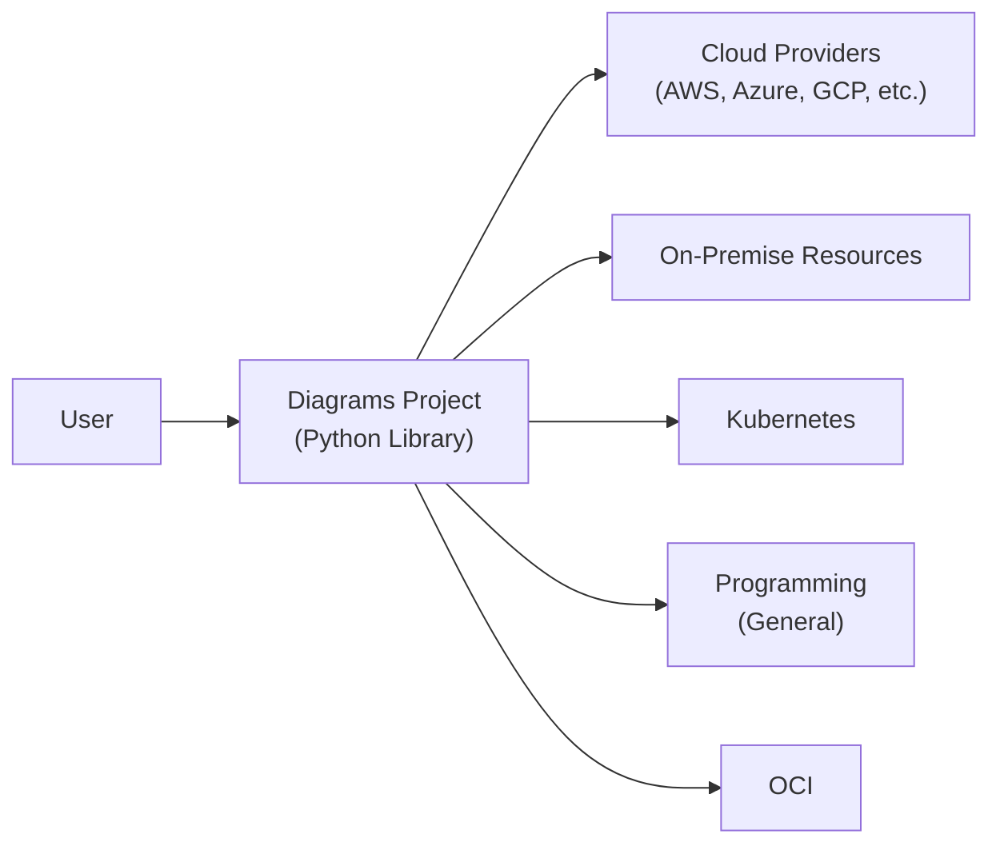
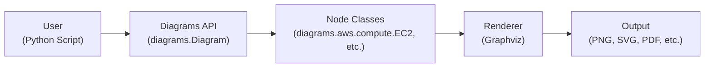
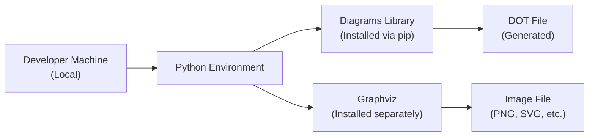
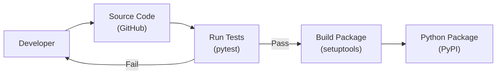

Okay, let's create a design document for the "diagrams" project hosted at the provided GitHub repository.

# BUSINESS POSTURE

Business Priorities and Goals:

*   Provide a user-friendly tool for creating cloud system architecture diagrams.
*   Enable users to generate diagrams programmatically using Python.
*   Support a wide range of cloud providers and services.
*   Offer a flexible and customizable solution for diagram creation.
*   Foster a community around the project, encouraging contributions and extensions.
*   Reduce time and effort required to create professional-looking diagrams.

Most Important Business Risks:

*   Inaccurate or misleading diagrams could lead to flawed system designs and deployments.
*   Lack of support for new cloud services could limit the tool's usefulness.
*   Security vulnerabilities in the tool or its dependencies could expose users to risks.
*   Poor performance or usability could hinder adoption.
*   Failure to keep up with changes in cloud provider APIs could break functionality.
*   Lack of community engagement could lead to project stagnation.

# SECURITY POSTURE

Existing Security Controls:

*   security control: The project is open-source, allowing for community review and contributions to security. (GitHub repository)
*   security control: The project uses Python, a generally memory-safe language. (GitHub repository)
*   security control: The project has a dependency management. (requirements.txt, setup.py)

Accepted Risks:

*   accepted risk: The project relies on external cloud provider APIs, which are outside the project's direct control.
*   accepted risk: The project is primarily a visualization tool, and the security of the generated diagrams depends on the user's input and understanding.
*   accepted risk: The project does not handle sensitive data directly.

Recommended Security Controls:

*   security control: Implement a regular security review process, including static code analysis and dependency vulnerability scanning.
*   security control: Provide clear documentation on secure usage of the tool, including best practices for diagram creation.
*   security control: Establish a process for handling security vulnerabilities reported by users or researchers.
*   security control: Consider adding support for signing generated diagrams to ensure their integrity.

Security Requirements:

*   Authentication: Not directly applicable, as the tool is a library used within other applications. Authentication is the responsibility of the integrating application.
*   Authorization: Not directly applicable, as the tool itself does not manage access control. Authorization is the responsibility of the integrating application.
*   Input Validation: The tool should validate user-provided input to prevent errors and potential vulnerabilities (e.g., injection attacks if the input is used to generate code).  Specifically, sanitize input used in filenames or paths.
*   Cryptography: Not directly applicable for the core functionality.  If diagram signing is implemented, use strong cryptographic algorithms and secure key management.

# DESIGN

## C4 CONTEXT

Element Descriptions:

*   Element:
    *   Name: User
    *   Type: Person
    *   Description: A software developer or architect who uses the Diagrams library to create architecture diagrams.
    *   Responsibilities: Provides input to the Diagrams library to define the diagram structure and content.  Uses the generated diagrams for documentation, communication, and design purposes.
    *   Security controls: N/A (External to the project)

*   Element:
    *   Name: Diagrams Project (Python Library)
    *   Type: Software System
    *   Description: The core Diagrams library, providing the API for creating diagrams programmatically.
    *   Responsibilities: Parses user input, generates diagram representations, and renders them using Graphviz.
    *   Security controls: Input validation, dependency management.

*   Element:
    *   Name: Cloud Providers (AWS, Azure, GCP, etc.)
    *   Type: External Systems
    *   Description: Various cloud providers and their services, represented as nodes in the diagrams.
    *   Responsibilities: Provide the services and infrastructure being diagrammed.
    *   Security controls: Managed by the respective cloud providers.

*   Element:
    *   Name: On-Premise Resources
    *   Type: External Systems
    *   Description: On-premise resources, represented as nodes in the diagrams.
    *   Responsibilities: Provide the services and infrastructure being diagrammed.
    *   Security controls: Managed by internal IT teams.

*   Element:
    *   Name: Kubernetes
    *   Type: External Systems
    *   Description: Kubernetes resources, represented as nodes in the diagrams.
    *   Responsibilities: Provide the services and infrastructure being diagrammed.
    *   Security controls: Managed by Kubernetes configurations.

*   Element:
    *   Name: Programming (General)
    *   Type: External Systems
    *   Description: General programming resources, represented as nodes in the diagrams.
    *   Responsibilities: Provide the services and infrastructure being diagrammed.
    *   Security controls: Managed by best practices.

*   Element:
    *   Name: OCI
    *   Type: External Systems
    *   Description: OCI resources, represented as nodes in the diagrams.
    *   Responsibilities: Provide the services and infrastructure being diagrammed.
    *   Security controls: Managed by OCI configurations.

## C4 CONTAINER

Element Descriptions:

*   Element:
    *   Name: User (Python Script)
    *   Type: Person/Software System
    *   Description: A Python script written by the user that utilizes the Diagrams library.
    *   Responsibilities: Defines the diagram structure and content using the Diagrams API.
    *   Security controls: Relies on the security of the Python environment and the user's code.

*   Element:
    *   Name: Diagrams API (diagrams.Diagram)
    *   Type: Software Component
    *   Description: The main entry point for interacting with the Diagrams library.
    *   Responsibilities: Provides methods for creating diagrams, adding nodes and edges, and configuring the output.
    *   Security controls: Input validation.

*   Element:
    *   Name: Node Classes (diagrams.aws.compute.EC2, etc.)
    *   Type: Software Components
    *   Description: Classes representing different cloud resources and services.
    *   Responsibilities: Define the visual representation and properties of each node type.
    *   Security controls: Input validation (for node attributes).

*   Element:
    *   Name: Renderer (Graphviz)
    *   Type: Software Component
    *   Description: The component responsible for rendering the diagram into a visual format.  Relies on the external Graphviz library.
    *   Responsibilities: Takes the diagram representation and generates the output file (e.g., PNG, SVG).
    *   Security controls: Relies on the security of the Graphviz library.

*   Element:
    *   Name: Output (PNG, SVG, PDF, etc.)
    *   Type: Data
    *   Description: The generated diagram file in the specified format.
    *   Responsibilities: N/A
    *   Security controls: N/A

## DEPLOYMENT

Possible Deployment Solutions:

1.  Local Installation: Users install the Diagrams library and its dependencies (Graphviz) locally on their machines.
2.  Containerized Environment: Users run the Diagrams library within a Docker container, which includes all necessary dependencies.
3.  Cloud-Based IDE: Users utilize a cloud-based IDE (e.g., AWS Cloud9, Google Cloud Shell) with the Diagrams library pre-installed or installed as needed.
4.  Serverless Function: Users deploy a serverless function (e.g., AWS Lambda) that uses the Diagrams library to generate diagrams on demand.

Chosen Solution (Local Installation):

Element Descriptions:

*   Element:
    *   Name: Developer Machine (Local)
    *   Type: Infrastructure
    *   Description: The user's local machine where they write and execute their Python scripts.
    *   Responsibilities: Provides the environment for running the Diagrams library.
    *   Security controls: Relies on the security of the user's operating system and local environment.

*   Element:
    *   Name: Python Environment
    *   Type: Software
    *   Description: The Python interpreter and installed packages.
    *   Responsibilities: Executes the Python code.
    *   Security controls: Relies on the security of the Python installation and package management.

*   Element:
    *   Name: Diagrams Library (Installed via pip)
    *   Type: Software
    *   Description: The Diagrams library installed using pip.
    *   Responsibilities: Provides the API for creating diagrams.
    *   Security controls: Dependency management, input validation.

*   Element:
    *   Name: Graphviz (Installed separately)
    *   Type: Software
    *   Description: The Graphviz software installed on the user's machine.
    *   Responsibilities: Renders the diagram from the DOT file.
    *   Security controls: Relies on the security of the Graphviz installation.

*   Element:
    *   Name: DOT File (Generated)
    *   Type: Data
    *   Description: Intermediate file in Graphviz DOT language.
    *   Responsibilities: N/A
    *   Security controls: N/A

*   Element:
    *   Name: Image File (PNG, SVG, etc.)
    *   Type: Data
    *   Description: Final diagram image.
    *   Responsibilities: N/A
    *   Security controls: N/A

## BUILD

The Diagrams project uses a typical Python package build process.

*   Developer writes code and commits to the GitHub repository.
*   Tests are run using pytest.  This includes unit tests and potentially integration tests.
*   If tests pass, the package is built using setuptools. This creates source distributions and wheels.
*   The built package is published to PyPI (Python Package Index).
*   Security Controls:
    *   security control: Code Review: Pull requests are used for code review before merging into the main branch.
    *   security control: Automated Testing: pytest is used to run automated tests, ensuring code quality and preventing regressions.
    *   security control: Dependency Management: Dependencies are managed through `requirements.txt` and `setup.py`, allowing for tracking and updates.
    *   security control: (Recommended) Static Analysis: Integrate a static analysis tool (e.g., Bandit, Pylint) into the build process to identify potential security vulnerabilities.
    *   security control: (Recommended) Dependency Scanning: Use a tool like `pip-audit` or Dependabot to automatically scan for known vulnerabilities in dependencies.

# RISK ASSESSMENT

Critical Business Processes:

*   Diagram Generation: The core process of generating diagrams from user-provided input.
*   Dependency Management: Ensuring that the project's dependencies are up-to-date and secure.
*   Community Engagement: Maintaining an active and engaged community around the project.

Data Protection:

*   The Diagrams library itself does not handle sensitive data directly. The data being visualized (cloud infrastructure configurations) is provided by the user and is not stored or processed by the library itself, other than to create a visual representation.
*   Data Sensitivity: Low (for the library itself). The sensitivity of the data being visualized depends on the user's input.

# QUESTIONS & ASSUMPTIONS

Questions:

*   Are there any specific compliance requirements (e.g., HIPAA, PCI DSS) that the generated diagrams need to adhere to? (Assumption: No specific compliance requirements are imposed on the library itself, but users should ensure their diagrams accurately reflect their compliant infrastructure.)
*   What is the expected scale of usage (number of users, frequency of diagram generation)? (Assumption: Moderate usage, primarily by individual developers and small teams.)
*   Are there any plans to integrate the library with other tools or platforms? (Assumption: No specific integrations are planned at this time, but the library is designed to be easily integrated into other Python applications.)
*   What level of support is expected for different cloud providers and services? (Assumption: Best-effort support for major cloud providers, with community contributions encouraged for expanding coverage.)
*   Are there any plans to monetize the project? (Assumption: The project is open-source and freely available, with no current plans for monetization.)

Assumptions:

*   BUSINESS POSTURE: The primary goal is to provide a useful and widely adopted tool for creating cloud architecture diagrams.
*   SECURITY POSTURE: The project follows basic security best practices, but relies heavily on the security of its dependencies and the user's environment.
*   DESIGN: The design is modular and extensible, allowing for future additions and modifications. The use of Graphviz is a key design decision.