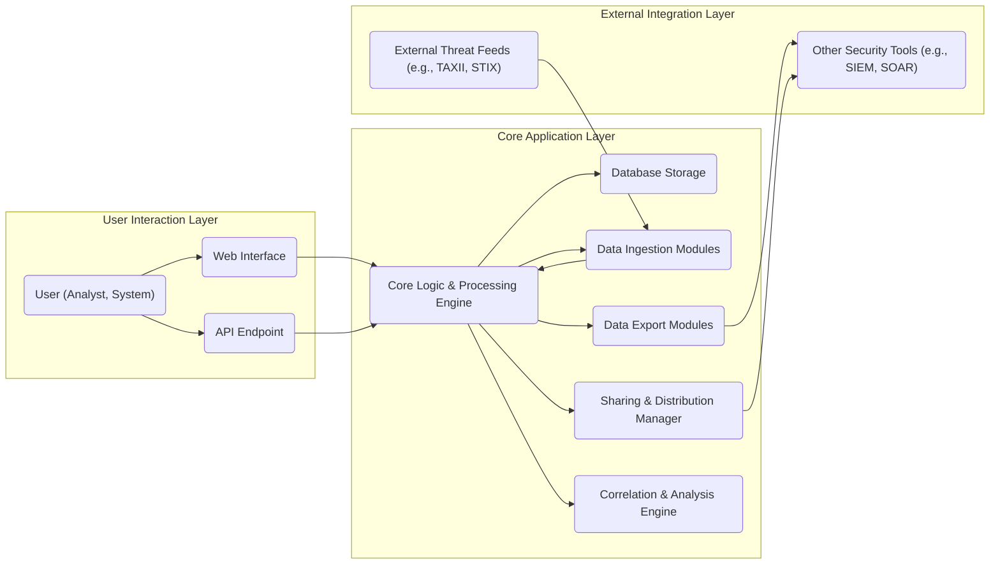
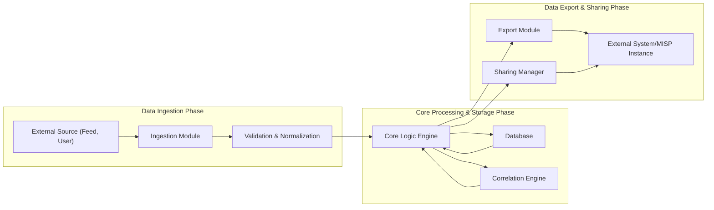

# Project Design Document: MISP (Malware Information Sharing Platform)

**Version:** 1.1
**Date:** October 26, 2023
**Author:** AI Software Architect

## 1. Project Overview

This document details the design of the Malware Information Sharing Platform (MISP), an open-source software solution designed for the aggregation, sharing, storage, and correlation of Indicators of Compromise (IOCs), cybersecurity threats, and vulnerability information. This document aims to provide a comprehensive understanding of the system's architecture and will serve as the primary input for subsequent threat modeling exercises.

## 2. Goals and Objectives

*   Establish a central repository for security analysts and researchers to collaboratively share and enrich threat intelligence.
*   Provide robust mechanisms for the secure and efficient storage, tagging, searching, and retrieval of IOCs and associated contextual information.
*   Enable the correlation of disparate threat data from diverse internal and external sources to identify patterns and relationships.
*   Offer flexible and granular data sharing models, allowing organizations to control the dissemination of their threat intelligence.
*   Support automated ingestion and export of threat intelligence in various standardized formats.
*   Present a user-friendly web interface for intuitive management, analysis, and visualization of threat data.
*   Expose a comprehensive API to facilitate programmatic access and seamless integration with other security tools and workflows.

## 3. Target Audience

This document is primarily intended for:

*   Security architects and engineers responsible for the system's design and implementation.
*   Software developers contributing to the MISP project.
*   Threat intelligence analysts who will be the primary users of the platform.
*   Security operations center (SOC) personnel leveraging MISP for incident response and threat hunting.
*   Individuals involved in threat modeling, security assessments, and penetration testing of the MISP platform.

## 4. Scope

This design document encompasses the core architectural components and fundamental functionalities of the MISP platform, including:

*   The web interface facilitating user interaction and data visualization.
*   The RESTful API enabling programmatic access and integration.
*   The core application logic responsible for data processing, storage, and correlation.
*   The underlying data model for structuring and storing threat intelligence.
*   The mechanisms for data ingestion from various sources and export to external systems.
*   The user authentication and authorization framework for secure access control.
*   The functionalities for sharing and distributing threat intelligence among different entities.

This document explicitly excludes:

*   Specific deployment configurations, such as detailed instructions for containerization or cloud deployment on specific providers.
*   In-depth implementation details of individual modules or functions within the codebase.
*   Specific configurations or implementation details of third-party integrations, although general integration points will be discussed.

## 5. High-Level Architecture

**Description:**

*   **User Interaction Layer:**  This layer provides the interfaces through which users interact with MISP, either through the graphical web interface or programmatically via the API.
*   **Core Application Layer:** This layer houses the core functionalities of MISP, including data processing, storage, sharing, and correlation.
*   **External Integration Layer:** This layer represents the interaction points with external systems, both for ingesting threat intelligence and for exporting data to other security tools.

## 6. Component Breakdown

*   **Web Interface:**
    *   Provides a user-friendly graphical interface built using web technologies (likely a Python framework like Django or Flask with templating engines).
    *   Handles user authentication (e.g., local accounts, LDAP, SAML) and session management.
    *   Allows analysts to create, view, modify, and delete events, attributes, organizations, users, and other MISP entities.
    *   Offers advanced search and filtering capabilities for threat data based on various criteria.
    *   Provides visualization tools for exploring relationships between threat indicators.

*   **API Endpoint (RESTful API):**
    *   Exposes a RESTful API for programmatic interaction with MISP functionalities, adhering to standard HTTP methods and response codes.
    *   Supports various authentication mechanisms for API access (e.g., API keys, OAuth 2.0).
    *   Enables automated data ingestion (e.g., submitting events and attributes), export (e.g., retrieving IOCs in specific formats), and management tasks.
    *   Facilitates integration with other security tools, automation scripts, and threat intelligence platforms.

*   **Core Logic & Processing Engine:**
    *   Implements the core business logic of MISP, managing the creation, modification, and deletion of threat intelligence objects.
    *   Enforces access control policies and sharing rules based on user roles, organizations, and sharing groups.
    *   Orchestrates data ingestion and export processes, including data transformation and validation.
    *   Manages user sessions, permissions, and audit logging.

*   **Database Storage:**
    *   Persistently stores all MISP data, including events, attributes, organizations, users, relationships, and system configurations.
    *   Likely utilizes a relational database management system (RDBMS) such as MySQL or PostgreSQL, chosen for its reliability and data integrity features.
    *   The database schema is designed for efficient querying and retrieval of complex threat intelligence data.

*   **Data Ingestion Modules:**
    *   Responsible for importing threat data from diverse internal and external sources.
    *   Supports various standardized data formats, including STIX/TAXII, OpenIOC, CSV, and plain text.
    *   Includes specific modules or connectors for fetching data from external threat intelligence feeds (e.g., via TAXII clients).
    *   Performs data normalization, validation, and deduplication to ensure data consistency and quality.

*   **Data Export Modules:**
    *   Enables the export of threat data in various formats for consumption by other systems or for sharing purposes.
    *   Supports exporting data in formats like STIX, CSV, JSON, and custom formats.
    *   Allows for filtering and selecting specific data to be exported based on criteria like tags, attributes, or timeframes.
    *   May include mechanisms for pushing data to external systems (e.g., SIEM, firewalls) via APIs or other protocols.

*   **Sharing & Distribution Manager:**
    *   Manages the sharing of threat intelligence with other MISP instances, partner organizations, or communities.
    *   Implements different sharing models, including push-based synchronization, pull-based requests, and community-based sharing.
    *   Enforces access control policies on shared data, ensuring that only authorized entities can access specific information.
    *   Handles the synchronization of data between different MISP instances, resolving conflicts and ensuring data consistency.

*   **Correlation & Analysis Engine:**
    *   Analyzes threat data to identify relationships, patterns, and potential campaigns.
    *   Correlates attributes within individual events and across multiple events to establish connections between seemingly disparate pieces of information.
    *   May utilize graph database technologies or specialized correlation algorithms to identify complex relationships.
    *   Provides features for visualizing correlated data and identifying potential threat actors or attack vectors.

## 7. Data Flow

**Description:**

1. **Data Ingestion Phase:** Threat data originates from external sources (e.g., threat intelligence feeds, user input via the web interface or API). It is received by the appropriate ingestion module, which then performs validation and normalization to ensure data consistency.
2. **Core Processing & Storage Phase:** The validated and normalized data is processed by the core logic engine, which applies business rules and stores the data in the database. The correlation engine analyzes the data to identify relationships and patterns, enriching the existing threat intelligence.
3. **Data Export & Sharing Phase:** Processed and analyzed data can be exported to external systems via export modules or shared with other MISP instances through the sharing manager, adhering to defined sharing policies and access controls.

## 8. Key Technologies

*   **Primary Programming Language:** Python (widely used for its extensive libraries and frameworks relevant to web development and data processing).
*   **Web Application Framework:** Likely Django or Flask (providing structure and tools for building the web interface and API).
*   **Database Management System:** Typically MySQL or PostgreSQL (robust and reliable relational databases suitable for storing structured data).
*   **API Framework/Libraries:**  Likely Django REST Framework or Flask-RESTful (for building and managing the RESTful API).
*   **Data Serialization Formats:** JSON (primary format for API communication), with support for other formats like STIX, XML, and CSV for data import/export.
*   **Asynchronous Task Queue (Optional):**  Potentially Celery or Redis Queue (for handling background tasks like data ingestion, export, and sharing).
*   **Search Engine (Optional):**  May integrate with Elasticsearch or similar technologies for advanced full-text search capabilities over threat data.
*   **Message Broker (Optional):**  Could utilize RabbitMQ or Kafka for asynchronous communication between components or for handling high-volume data streams.

## 9. Deployment Architecture (Conceptual Examples)

*   **Single Instance Deployment:** All components (web interface, API, core logic, database) are deployed on a single server. This is suitable for small deployments, testing environments, or individual analysts.
*   **Clustered Deployment:** Different components are deployed on separate servers for scalability, high availability, and improved performance. This might involve:
    *   Dedicated servers for the web interface and API (potentially behind a load balancer).
    *   Separate application servers hosting the core logic and processing engine.
    *   A dedicated database server (potentially with replication for redundancy).
    *   Separate servers for specialized components like the correlation engine or message brokers.
*   **Cloud-Based Deployment:** Leveraging cloud infrastructure services (e.g., AWS, Azure, GCP) for hosting various components. This offers scalability, elasticity, and managed services for databases and other infrastructure elements.

## 10. Security Considerations (High-Level)

*   **Robust Authentication and Authorization:** Implementing strong authentication mechanisms (e.g., multi-factor authentication) and granular role-based access control (RBAC) to protect sensitive threat intelligence.
*   **Strict Input Validation and Sanitization:** Thoroughly validating all user inputs and data received from external sources to prevent injection attacks (e.g., SQL injection, cross-site scripting).
*   **Encryption of Data at Rest and in Transit:** Encrypting sensitive data stored in the database and ensuring secure communication channels (e.g., HTTPS) to protect data confidentiality.
*   **Secure API Design and Implementation:** Adhering to security best practices for API development, including rate limiting, input validation, and secure authentication/authorization.
*   **Regular Security Audits and Penetration Testing:** Conducting periodic security assessments and penetration tests to identify and remediate potential vulnerabilities.
*   **Secure Configuration Management:** Implementing secure configurations for all components, including web servers, application servers, and databases, following security hardening guidelines.
*   **Comprehensive Logging and Monitoring:** Implementing detailed logging of system activities and security events, coupled with real-time monitoring to detect and respond to security incidents promptly.
*   **Protection Against Common Web Vulnerabilities:** Implementing measures to mitigate common web application vulnerabilities such as Cross-Site Scripting (XSS), Cross-Site Request Forgery (CSRF), and session hijacking.

## 11. Assumptions and Constraints

*   The fundamental data model in MISP revolves around "events" containing "attributes" to represent threat intelligence.
*   The system relies on a relational database as the primary persistent data store.
*   The API adheres to RESTful architectural principles for interoperability.
*   The web interface serves as the primary user interface for many administrative and analytical tasks.
*   The system is designed to handle a potentially large volume of threat data and user activity.
*   Security is a critical non-functional requirement and is considered throughout the design and development process.

This document provides a comprehensive overview of the MISP architecture and serves as a foundation for understanding its components and functionalities. Further detailed design specifications may be developed for specific modules or features as needed. This document will be a key resource for the subsequent threat modeling activities.
