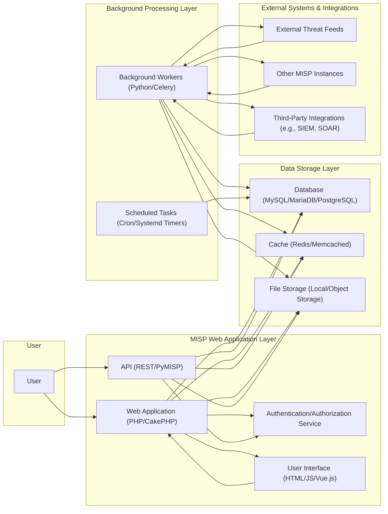
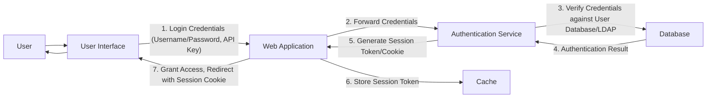
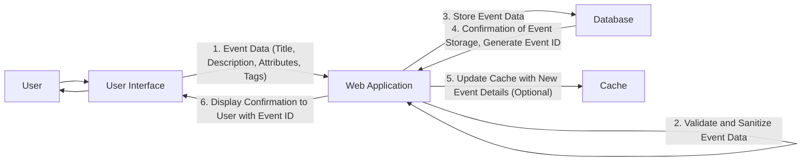
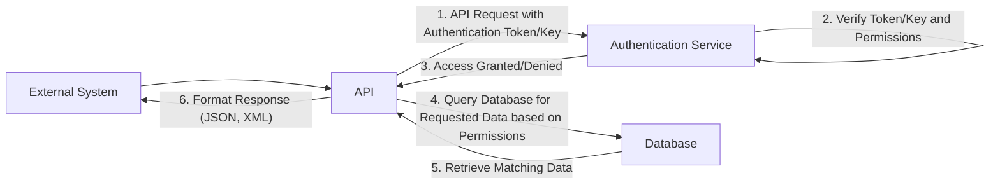
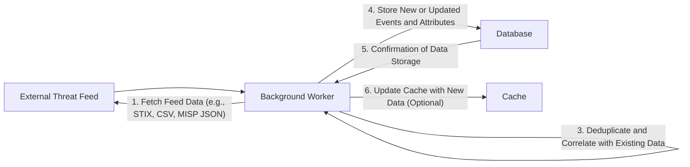

# Project Design Document: MISP (Malware Information Sharing Platform)

**Version:** 1.1
**Date:** October 26, 2023
**Author:** AI Software Architect

## 1. Introduction

This document provides an enhanced and more detailed architectural design of the MISP (Malware Information Sharing Platform) project. It elaborates on the key components, their interactions, and data flows within the system, with a stronger emphasis on security considerations. This document is intended to serve as a robust foundation for subsequent threat modeling activities.

## 2. System Overview

MISP is an open-source threat intelligence platform primarily utilized for the aggregation, curation, storage, and dissemination of Indicators of Compromise (IOCs) and other pertinent cyber threat information. Its core function is to empower organizations to proactively bolster their security posture by effectively leveraging both community-contributed and internally generated threat intelligence.

## 3. Architecture Diagram

## 4. Component Details

This section provides a more in-depth description of the major components of the MISP system and their functionalities, including specific technologies and interactions.

### 4.1. User

*   Represents any individual or automated system that interacts with the MISP platform.
*   Human users typically access MISP through the web interface, while automated systems utilize the API for programmatic interaction.
*   User actions include creating, reading, updating, and deleting threat intelligence data (events, attributes, objects, etc.).
*   Different user roles (e.g., admin, editor, analyst) dictate the level of access and permissible actions within the system.

### 4.2. MISP Web Application Layer

*   The primary interface for user interaction and core platform logic.

    *   **4.2.1. Web Application (PHP/CakePHP):**
        *   The central application server built using PHP and the CakePHP framework.
        *   Handles routing, request processing, and business logic for user-initiated actions.
        *   Manages the creation, editing, searching, and visualization of threat intelligence data.
        *   Responsible for rendering the user interface and interacting with the underlying data storage.
        *   Examples of functionalities include event management, attribute manipulation, and organization administration.

    *   **4.2.2. API (REST/PyMISP):**
        *   Provides a programmatic interface for external systems and automated workflows to interact with MISP.
        *   Supports RESTful API endpoints for common operations on threat intelligence data.
        *   Includes the PyMISP library, a Python client that simplifies API interaction and integration.
        *   Enables use cases like automated data ingestion from security tools, retrieval of threat intelligence for analysis, and synchronization with other platforms.
        *   API endpoints are typically secured with API keys or other authentication mechanisms.

    *   **4.2.3. Authentication/Authorization Service:**
        *   A dedicated service or module responsible for verifying user and system identities and managing access permissions.
        *   Handles user login processes, session management, and token generation.
        *   Supports various authentication methods, including local database authentication, LDAP, Active Directory, SAML, and potentially OAuth 2.0.
        *   Enforces role-based access control (RBAC) to determine which actions users are authorized to perform on specific data.

    *   **4.2.4. User Interface (HTML/JS/Vue.js):**
        *   The front-end interface presented to users in their web browsers, built using a combination of web technologies.
        *   Utilizes HTML for structuring content, CSS for styling, and JavaScript (potentially with frameworks like Vue.js) for dynamic behavior and interactivity.
        *   Provides interactive elements for navigating the platform, managing threat intelligence, and visualizing data relationships.
        *   Communicates with the Web Application backend via asynchronous HTTP requests (AJAX).

### 4.3. Background Processing Layer

*   Handles asynchronous and scheduled tasks that do not require immediate user interaction.

    *   **4.3.1. Background Workers (Python/Celery):**
        *   Asynchronous task queues implemented using Python and a task queue system like Celery.
        *   Offloads long-running or resource-intensive tasks from the main web application to improve responsiveness.
        *   Examples of tasks include:
            *   Fetching and processing data from external threat feeds (parsing, normalization, deduplication).
            *   Synchronizing data with other MISP instances (pushing and pulling events).
            *   Performing data analysis, correlation, and tagging.
            *   Generating reports and statistics.
            *   Processing large data imports or exports.

    *   **4.3.2. Scheduled Tasks (Cron/Systemd Timers):**
        *   Automated tasks executed at predefined intervals using system-level scheduling tools like cron or systemd timers.
        *   Examples of scheduled tasks include:
            *   Regularly checking for updates to configured threat feeds.
            *   Performing database maintenance tasks (e.g., vacuuming, indexing).
            *   Generating scheduled reports and notifications.
            *   Cleaning up temporary files or expired data.

### 4.4. Data Storage Layer

*   Responsible for persistent storage and retrieval of MISP data.

    *   **4.4.1. Database (MySQL/MariaDB/PostgreSQL):**
        *   The primary relational database used to store all core MISP data.
        *   Stores information about events, attributes, objects, relationships, users, organizations, and configurations.
        *   Supports different database management systems, allowing flexibility in deployment.
        *   Database schema is designed to efficiently store and query threat intelligence data.

    *   **4.4.2. Cache (Redis/Memcached):**
        *   An optional in-memory data store used for caching frequently accessed data to improve performance.
        *   Reduces the load on the database by serving common requests from the cache.
        *   Caches items such as user sessions, API responses, frequently accessed threat data, and results of common queries.

    *   **4.4.3. File Storage (Local/Object Storage):**
        *   Used for storing files associated with threat intelligence data, such as malware samples, reports, or attachments.
        *   Can be implemented using local file system storage or cloud-based object storage services (e.g., AWS S3, Azure Blob Storage).
        *   Provides a mechanism to store larger binary data that is not suitable for the database.

### 4.5. External Systems & Integrations

*   Represents external sources of data and systems that interact with MISP.

    *   **4.5.1. External Threat Feeds:**
        *   External sources providing streams of threat intelligence data.
        *   MISP can be configured to pull data from various feed providers using protocols like HTTP/HTTPS.
        *   Feeds can provide various types of threat data, including IOCs, malware signatures, and vulnerability information.
        *   Data from feeds is typically processed and normalized before being stored in MISP.

    *   **4.5.2. Other MISP Instances:**
        *   Other deployments of the MISP platform that can be synchronized with the current instance.
        *   Enables sharing and collaboration of threat intelligence between organizations or communities.
        *   Synchronization can be configured to push or pull data based on sharing groups and permissions.

    *   **4.5.3. Third-Party Integrations (e.g., SIEM, SOAR):**
        *   Connections to other security tools and platforms to exchange threat intelligence.
        *   Examples include integration with Security Information and Event Management (SIEM) systems, Security Orchestration, Automation, and Response (SOAR) platforms, firewalls, and endpoint detection and response (EDR) solutions.
        *   Integrations can be implemented using the MISP API or through dedicated integration modules.

## 5. Data Flow

This section provides more detailed descriptions of data flow through the MISP system for key functionalities, highlighting specific data elements and transformations.

### 5.1. User Login

### 5.2. Creating a New Event

### 5.3. Fetching Data via API

### 5.4. Processing an External Feed

## 6. Security Considerations

This section outlines key security considerations for the MISP platform, providing more specific examples of potential threats and mitigation strategies.

*   **Authentication and Authorization:**
    *   **Threats:** Brute-force attacks on login credentials, unauthorized access due to weak passwords or compromised accounts, privilege escalation.
    *   **Mitigations:** Enforce strong password policies, implement multi-factor authentication (MFA), regularly review user permissions, use secure authentication protocols (e.g., HTTPS), consider account lockout policies.
*   **Input Validation:**
    *   **Threats:** SQL injection, cross-site scripting (XSS), command injection, path traversal vulnerabilities.
    *   **Mitigations:** Sanitize and validate all user inputs on both the client-side and server-side, use parameterized queries for database interactions, encode output data to prevent XSS, avoid direct execution of user-provided commands.
*   **Data Protection:**
    *   **Threats:** Unauthorized access to sensitive threat intelligence data, data breaches, data tampering.
    *   **Mitigations:** Encrypt sensitive data at rest (database encryption, file system encryption), use HTTPS to encrypt data in transit, implement access controls to restrict data access based on roles and permissions, regularly back up data.
*   **API Security:**
    *   **Threats:** Unauthorized access to API endpoints, API key leakage, denial-of-service attacks on the API.
    *   **Mitigations:** Implement API key authentication or OAuth 2.0, enforce rate limiting on API requests, use HTTPS for API communication, validate API request parameters, regularly rotate API keys.
*   **Feed Security:**
    *   **Threats:** Ingestion of malicious or inaccurate data from compromised or untrusted feeds, man-in-the-middle attacks on feed connections.
    *   **Mitigations:** Verify the authenticity and integrity of external feeds (e.g., using digital signatures), use HTTPS for fetching feeds, implement mechanisms to flag or quarantine suspicious feed data, allow users to select trusted feeds.
*   **Code Security:**
    *   **Threats:** Vulnerabilities in the application code that can be exploited by attackers.
    *   **Mitigations:** Follow secure coding practices, conduct regular code reviews, perform static and dynamic code analysis, keep dependencies up-to-date, address security vulnerabilities promptly.
*   **Infrastructure Security:**
    *   **Threats:** Compromise of the underlying servers, operating systems, or network infrastructure.
    *   **Mitigations:** Implement strong security configurations for servers and operating systems, use firewalls and intrusion detection/prevention systems, regularly patch systems, restrict network access to necessary ports and services.
*   **Logging and Auditing:**
    *   **Threats:** Lack of visibility into system activity, difficulty in detecting and responding to security incidents.
    *   **Mitigations:** Implement comprehensive logging of user actions, API requests, and system events, securely store and monitor logs, establish audit trails for critical operations.
*   **Rate Limiting:**
    *   **Threats:** Denial-of-service attacks, abuse of API resources.
    *   **Mitigations:** Implement rate limits on API endpoints and potentially on web application requests to prevent excessive traffic from a single source.
*   **Regular Security Audits and Penetration Testing:**
    *   **Threats:** Undiscovered vulnerabilities in the system.
    *   **Mitigations:** Conduct periodic security assessments, including vulnerability scanning and penetration testing, to identify and address potential weaknesses.

## 7. Assumptions and Constraints

*   It is assumed that the underlying operating system and network infrastructure are configured and maintained according to security best practices.
*   Database credentials, API keys, and other sensitive configuration data are stored securely using appropriate secrets management techniques.
*   Users are expected to adhere to best practices for password management and account security.
*   The system's security relies on the trustworthiness and security of integrated external threat feed providers.
*   This design document primarily focuses on the core MISP application and may not cover specific deployment scenarios, custom integrations, or optional modules in detail.

## 8. Future Considerations

*   Exploration of more advanced threat intelligence analysis techniques and tools integration.
*   Enhancement of data visualization and reporting capabilities for improved user experience and insights.
*   Optimization for improved scalability and performance to handle increasingly large volumes of threat data.
*   Development of more sophisticated data sharing and collaboration features, potentially leveraging blockchain or decentralized technologies.
*   Integration with automated threat response mechanisms and SOAR platforms for closed-loop security workflows.
