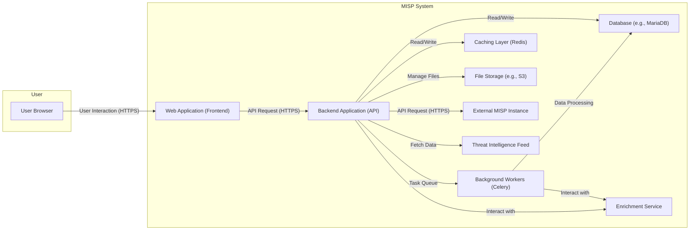
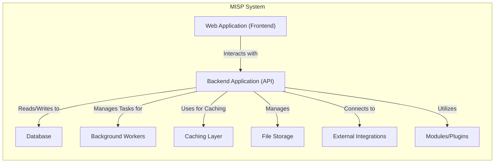
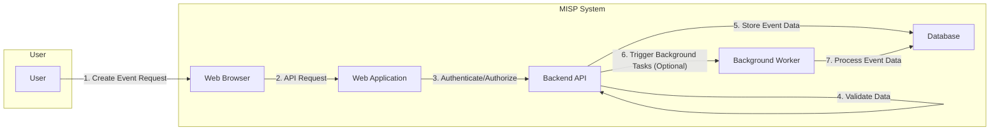

## Project Design Document: MISP (Malware Information Sharing Platform) - Improved

**1. Introduction**

This document provides an enhanced architectural design of the MISP (Malware Information Sharing Platform) project, an open-source threat intelligence platform. This improved document aims to provide a more detailed and nuanced understanding of the system's architecture, specifically for use in subsequent threat modeling activities. It elaborates on the key components, data flows, and interactions within the MISP system, offering greater clarity for security analysis.

**2. Goals and Scope**

The primary goal of this document is to offer a comprehensive and refined architectural overview of MISP, with a strong emphasis on aspects relevant to security vulnerabilities and potential threats. The scope encompasses the core functionalities of MISP, its major components with more granular detail, and their interactions. It also expands on deployment considerations and the technologies utilized. This document remains focused on the architectural level and will not delve into the specifics of individual code modules or detailed implementation logic, but provides more context for understanding potential attack vectors.

**3. Target Audience**

This document is intended for individuals deeply involved in the security analysis and threat modeling of the MISP platform, including:

* Security architects responsible for the platform's security posture.
* Penetration testers tasked with identifying vulnerabilities.
* Security engineers involved in securing and maintaining the system.
* Developers contributing to the MISP project with a security-conscious mindset.

**4. System Overview**

MISP is a sophisticated web-based platform engineered for the collaborative sharing, secure storage, and intelligent correlation of Indicators of Compromise (IOCs) and diverse threat intelligence data. It empowers organizations to collectively understand and respond to malware, attacks, and vulnerabilities. Key functionalities include:

* **Granular Event Management:** Creation, detailed modification, versioning, and secure storage of security events containing rich attributes (IOCs) and contextual information.
* **Attribute Management with Context:**  Detailed information about IOCs, including standardized types, validated values, extensive context (e.g., source, confidence level), and relationships between attributes.
* **Flexible Taxonomy and Tagging:**  Hierarchical categorization and fine-grained labeling of events and attributes using both predefined and custom taxonomies for enhanced organization, efficient searching, and targeted sharing.
* **Sophisticated Sharing and Synchronization:** Secure and configurable mechanisms for sharing intelligence with other trusted MISP instances and defined communities, including granular control over data dissemination.
* **Robust User and Organization Management:**  Comprehensive control over user access, roles, permissions, and organizational structures within the platform, supporting multi-tenancy and collaborative environments.
* **Comprehensive API Access:**  Well-documented and secure programmatic access via RESTful APIs for seamless integration with a wide range of other security tools and automated systems.
* **Versatile Data Feeds:**  Flexible ingestion and management of external threat intelligence feeds in various formats (e.g., STIX, OpenIOC), with options for automated updates and data normalization.
* **Advanced Reporting and Visualization:**  Powerful tools for analyzing, visualizing, and reporting on threat data, enabling actionable insights and informed decision-making.
* **Workflow and Automation Capabilities:** Features for automating tasks, such as enrichment, correlation, and sharing, improving efficiency and response times.

**5. Architectural Design**

The MISP architecture is composed of the following key components, described with greater detail:

* **Web Application (Frontend):**
    * Presents the user interface for all user interactions with MISP, built with a modern web framework (likely Flask in Python with Jinja templating).
    * Manages user authentication (supporting various methods like local accounts, LDAP, SAML) and enforces authorization policies based on roles and permissions.
    * Handles user input sanitization and output encoding to mitigate client-side vulnerabilities.
    * Communicates with the backend API via secure HTTPS requests.
* **Backend Application (API):**
    * Implements the core business logic and rules of MISP, serving as the central processing unit.
    * Provides a comprehensive set of RESTful APIs for the frontend, external systems, and integrations.
    * Enforces strict data validation, sanitization, and integrity checks.
    * Manages user sessions, API key authentication, and authorization for all requests.
    * Orchestrates interactions with the database, background workers, and other internal components.
* **Database:**
    * Persistently stores all critical data, including events, attributes, taxonomies, users, organizations, sharing configurations, and system settings.
    * Likely a robust relational database system (e.g., MySQL/MariaDB or PostgreSQL) chosen for its reliability and data integrity features.
    * Data is organized into well-defined schemas with appropriate indexing for efficient querying.
* **Background Workers (Celery/Redis):**
    * Executes asynchronous and long-running tasks offloaded from the main application to improve responsiveness and scalability.
    * Utilizes a distributed task queue system like Celery, with Redis acting as the message broker for reliable task management.
    * Handles tasks such as: processing large data imports, sending email notifications, updating threat intelligence feeds, performing data enrichment, and running scheduled maintenance jobs.
* **Caching Layer (Redis):**
    * Enhances performance by storing frequently accessed data in-memory, reducing the load on the database.
    * Used for caching API responses, user session data, and other frequently accessed configuration settings.
    * Provides a fast and efficient way to retrieve data, improving the overall user experience.
* **File Storage:**
    * Securely stores uploaded files associated with events (e.g., malware samples, reports).
    * Can be implemented using local filesystem storage or a scalable cloud-based object storage service (e.g., AWS S3, Azure Blob Storage).
    * Access to stored files is controlled and authenticated.
* **External Integrations:**
    * Facilitates interaction with external systems and services, extending MISP's capabilities.
    * Includes modules for:
        * Ingesting threat intelligence feeds in various formats (STIX/TAXII, CSV, etc.).
        * Integrating with SIEM systems for event forwarding and correlation.
        * Connecting to SOAR platforms for automated incident response.
        * Synchronizing data with other MISP instances through secure channels.
        * Utilizing enrichment services to add context to attributes.
* **Modules and Plugins:**
    * Provides a flexible mechanism for extending MISP's functionality without modifying the core codebase.
    * Examples include:
        * Import/export modules for handling different data formats.
        * Enrichment modules for automatically adding contextual information to attributes (e.g., geolocation, reputation scores).
        * Analysis modules for performing automated analysis on threat data.
        * Custom sharing modules for specific community requirements.

**6. Data Flow**

The following outlines more detailed data flows within the MISP system for common use cases:

* **Event Creation and Enrichment:**
    1. **User Interaction:** A user interacts with the **Web Application (Frontend)** via their browser to input details for a new security event.
    2. **Request to Backend:** The frontend sends a secure HTTPS API request to the **Backend Application (API)** containing the event data.
    3. **Authentication and Authorization:** The backend authenticates the user and verifies their authorization to create events within the specified organization.
    4. **Data Validation and Sanitization:** The backend rigorously validates and sanitizes the incoming event data to prevent injection attacks and ensure data integrity.
    5. **Data Storage:** The validated event data, including attributes, tags, and relationships, is securely stored in the **Database**.
    6. **Background Enrichment (Optional):** If configured, the backend queues an enrichment task with the **Background Workers (Celery/Redis)**.
    7. **Enrichment Processing:** A background worker retrieves the task and utilizes configured enrichment modules or external services to add contextual information to the event's attributes.
    8. **Updated Data Storage:** The enriched event data is updated in the **Database**.
    9. **Caching:** Relevant data related to the new or updated event is stored in the **Caching Layer (Redis)** for faster retrieval.

* **Sharing Event with a Community:**
    1. **User Action:** A user with appropriate permissions marks an event for sharing with a specific community.
    2. **Backend Processing:** The **Backend Application (API)** retrieves the sharing group configuration from the **Database**, defining the target MISP instances and sharing rules.
    3. **Data Preparation:** The backend prepares the event data for sharing, adhering to the configured sharing rules and data minimization principles.
    4. **Secure Transmission:** The event data is securely transmitted to the target remote MISP instances (**External MISP Instance**) via their APIs, typically over HTTPS with mutual authentication.
    5. **Remote Instance Processing:** The receiving MISP instance authenticates the request and processes the incoming event data, storing it in its own **Database**.

* **Ingesting a Threat Intelligence Feed:**
    1. **Scheduled Task or User Trigger:** A scheduled task or a user action triggers the ingestion of a configured threat intelligence feed.
    2. **Feed Retrieval:** The **Backend Application (API)** or a dedicated integration module fetches the feed data from the specified source (**Threat Intelligence Feed**), potentially using API keys or other authentication mechanisms.
    3. **Data Parsing and Normalization:** The fetched data is parsed and normalized into MISP's internal data model.
    4. **Data Validation and Deduplication:** The backend validates the feed data and deduplicates it against existing events and attributes in the **Database**.
    5. **Data Storage:** New and updated threat intelligence data is stored in the **Database**.
    6. **Caching:** Relevant feed data or derived information might be cached in the **Caching Layer (Redis)**.

**7. Security Considerations (Detailed for Threat Modeling)**

This section expands on the initial security considerations, providing more specific details relevant to threat modeling:

* **Authentication and Authorization:**
    * **Threat:** Brute-force attacks against login forms, weak password policies leading to compromised accounts.
    * **Threat:** Session hijacking due to insecure session management.
    * **Threat:** Privilege escalation by exploiting vulnerabilities in authorization checks.
    * **Threat:** Compromise of API keys leading to unauthorized access.
    * **Mitigation Considerations:** Strong password policies, multi-factor authentication, secure session management (e.g., HTTPOnly, Secure flags), robust role-based access control, secure API key generation and storage.
* **Input Validation:**
    * **Threat:** SQL injection attacks through unsanitized user input in database queries.
    * **Threat:** Cross-site scripting (XSS) attacks due to improper handling of user-supplied data in the frontend.
    * **Threat:** Command injection vulnerabilities if user input is used to construct system commands.
    * **Threat:** Path traversal vulnerabilities when handling file uploads or downloads.
    * **Mitigation Considerations:** Strict input validation on both frontend and backend, parameterized queries, output encoding, principle of least privilege for database access, secure file handling practices.
* **Data Security:**
    * **Threat:** Unauthorized access to sensitive data in the database if encryption at rest is not implemented.
    * **Threat:** Data breaches during transmission if HTTPS is not enforced or is misconfigured.
    * **Threat:** Unauthorized access to stored files if proper access controls are not in place.
    * **Threat:** Data loss or exposure due to inadequate data retention and secure deletion policies.
    * **Mitigation Considerations:** Encryption at rest for the database and file storage, mandatory HTTPS with strong TLS configurations, access control lists for database and file storage, well-defined data retention and secure deletion procedures.
* **API Security:**
    * **Threat:** Denial-of-service attacks against API endpoints due to lack of rate limiting.
    * **Threat:** Man-in-the-middle attacks if API communication is not properly secured.
    * **Threat:** Exploitation of vulnerabilities in API endpoints leading to data breaches or unauthorized actions.
    * **Mitigation Considerations:** Rate limiting and request throttling, secure authentication and authorization mechanisms for API access (e.g., OAuth 2.0), regular security audits of API endpoints.
* **Sharing and Synchronization:**
    * **Threat:** Sharing of sensitive information with untrusted or compromised instances.
    * **Threat:** Man-in-the-middle attacks during data synchronization between MISP instances.
    * **Threat:** Information leakage due to misconfigured sharing rules.
    * **Mitigation Considerations:** Secure communication channels (e.g., TLS with client certificates), strong authentication between instances, granular sharing rules and access controls, regular review of sharing configurations.
* **Third-Party Dependencies:**
    * **Threat:** Exploitation of known vulnerabilities in underlying frameworks, libraries, and dependencies.
    * **Mitigation Considerations:** Regular vulnerability scanning of dependencies, timely patching and updates, using dependency management tools to track and manage versions.
* **Background Workers:**
    * **Threat:** Execution of malicious tasks if the task queue is compromised.
    * **Threat:** Information disclosure if background workers have excessive access to sensitive data.
    * **Mitigation Considerations:** Secure configuration of the task queue system, principle of least privilege for background workers, input validation for tasks.
* **File Uploads:**
    * **Threat:** Upload of malware or malicious files that could compromise the server or other users.
    * **Threat:** Storage of sensitive information in uploaded files without proper access controls.
    * **Mitigation Considerations:** Malware scanning of uploaded files, secure storage locations with restricted access, content security policies, input validation on file types and sizes.
* **Logging and Monitoring:**
    * **Threat:** Insufficient logging making it difficult to detect and investigate security incidents.
    * **Threat:** Lack of monitoring allowing attacks to go unnoticed.
    * **Mitigation Considerations:** Comprehensive logging of security-related events, real-time monitoring for suspicious activity, security information and event management (SIEM) integration.

**8. Deployment Considerations**

MISP's deployment architecture significantly impacts its security profile. Key considerations include:

* **Single Server Deployment:** While simpler, this concentrates all components and increases the impact of a single point of failure or compromise.
* **Distributed Deployment:** Offers better scalability and resilience but requires more complex security configurations for inter-component communication.
* **Containerized Deployment (Docker/Kubernetes):** Provides isolation and simplifies management but introduces new security considerations related to container security and orchestration.
* **Network Segmentation:** Isolating MISP components within different network segments can limit the impact of a breach.
* **Hardening:** Applying security hardening measures to the operating system and underlying infrastructure is crucial.

**9. Technologies Used**

* **Primary Programming Language:** Python
* **Core Web Framework:** Flask
* **Templating Engine:** Jinja2
* **Database Options:** MySQL/MariaDB, PostgreSQL
* **Asynchronous Task Queue:** Celery
* **Message Broker for Celery:** Redis
* **Caching Mechanism:** Redis
* **Frontend Technologies:** HTML, CSS, JavaScript
* **Operating System (Typical):** Linux distributions (e.g., Ubuntu, CentOS)

**10. Diagrams**

**(Diagrams remain the same as the previous version for brevity, but in a real-world scenario, these would be reviewed and potentially enhanced for clarity and detail based on the improvements made in the text.)**

**10.1. Component Diagram**

**10.2. Data Flow Diagram (Event Creation)**

**11. Future Considerations**

This document represents a significant improvement in the architectural understanding of MISP for threat modeling. Future enhancements could include:

* More detailed sequence diagrams illustrating specific interactions between components for critical functionalities.
* Threat modeling diagrams overlaying potential threats on the architecture.
* Specific security controls and countermeasures mapped to potential threats.
* Integration with security scanning tools and their output.

This enhanced document provides a robust foundation for conducting a comprehensive threat model of the MISP platform, enabling a deeper understanding of potential security vulnerabilities and informing effective mitigation strategies.