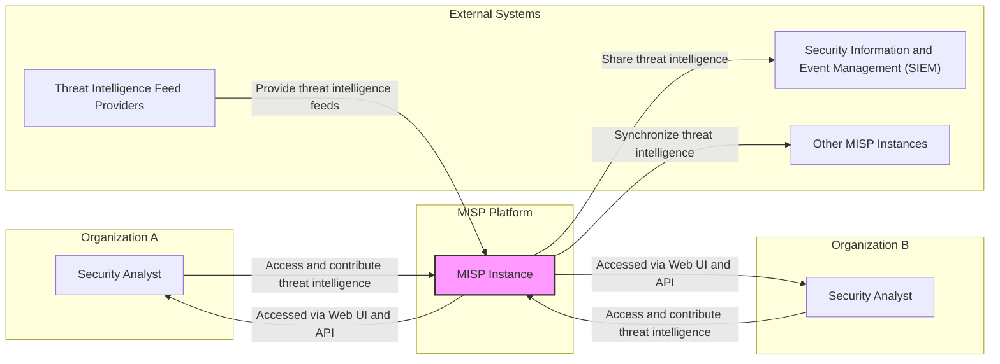
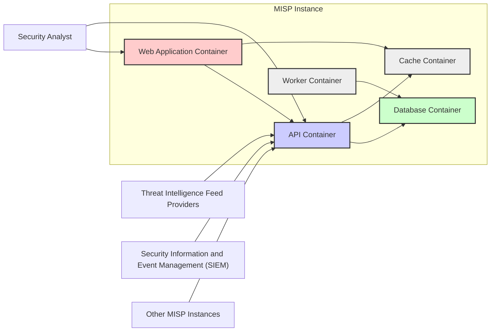

# BUSINESS POSTURE

This project, Malware Information Sharing Platform (MISP), aims to facilitate the sharing of threat intelligence among organizations and security professionals. The primary business priority is to enhance collective cybersecurity by enabling faster detection, prevention, and response to cyber threats.

Business Goals:
- Improve threat detection and incident response capabilities for participating organizations.
- Foster collaboration and information sharing within the cybersecurity community.
- Reduce the impact of cyberattacks by providing timely and actionable threat intelligence.
- Enhance situational awareness regarding emerging threats and vulnerabilities.

Business Risks:
- Data breaches or unauthorized access to sensitive threat intelligence data within the MISP platform.
- Misinformation or false positives disseminated through the platform leading to incorrect security decisions.
- Platform unavailability impacting timely access to critical threat intelligence.
- Legal and compliance risks associated with sharing and processing threat intelligence data across different jurisdictions.
- Reputational damage due to security incidents or data leaks affecting trust in the platform.

# SECURITY POSTURE

Existing Security Controls:
- security control: Access control lists to manage user permissions and data access within the platform. (Implemented in MISP application code and database access controls)
- security control: Regular security updates and patching of the MISP software and underlying infrastructure. (Described in MISP documentation and release notes)
- security control: Use of HTTPS for web interface to protect data in transit. (Standard web server configuration)
- security control: API keys for programmatic access to the MISP platform. (Implemented in MISP API)
- security control: Data encryption at rest for sensitive information within the database. (Configurable database feature)
- security control: Input validation and sanitization to prevent common web application vulnerabilities. (Implemented in MISP application code)
- security control: Security audits and penetration testing are conducted periodically. (Mentioned in MISP community discussions and documentation)

Accepted Risks:
- accepted risk: Potential for social engineering attacks targeting MISP users to gain unauthorized access.
- accepted risk: Risk of vulnerabilities in third-party libraries and dependencies used by MISP.
- accepted risk: Performance impact of extensive security logging and auditing.

Recommended Security Controls:
- security control: Implement multi-factor authentication (MFA) for user logins to enhance account security.
- security control: Deploy a Web Application Firewall (WAF) to protect against web-based attacks.
- security control: Implement a Security Information and Event Management (SIEM) system to monitor MISP security logs and detect anomalies.
- security control: Conduct regular vulnerability scanning and penetration testing with automated tools and manual reviews.
- security control: Implement a robust incident response plan specifically for the MISP platform.
- security control: Establish a secure software development lifecycle (SSDLC) incorporating security reviews and testing at each stage.

Security Requirements:
- Authentication:
    - security requirement: Secure user authentication mechanism to verify user identity.
    - security requirement: Support for strong passwords and password complexity policies.
    - security requirement: Consider integration with existing organizational identity providers (e.g., LDAP, Active Directory, SAML).
    - security requirement: Implement session management to control user session duration and prevent session hijacking.
- Authorization:
    - security requirement: Role-based access control (RBAC) to manage user permissions based on their roles and responsibilities.
    - security requirement: Granular access control policies to restrict access to specific threat intelligence data based on sensitivity and user privileges.
    - security requirement: Audit logging of authorization decisions and access attempts.
- Input Validation:
    - security requirement: Comprehensive input validation for all user-supplied data to prevent injection attacks (e.g., SQL injection, cross-site scripting).
    - security requirement: Input sanitization and encoding to neutralize potentially malicious input.
    - security requirement: Use of secure coding practices to minimize vulnerabilities related to input handling.
- Cryptography:
    - security requirement: Use strong encryption algorithms for data at rest and in transit.
    - security requirement: Secure key management practices for encryption keys.
    - security requirement: Implement cryptographic hashing for data integrity verification.
    - security requirement: Utilize TLS/SSL for all communication channels, including web interface and API.

# DESIGN

## C4 CONTEXT



Context Diagram Elements:

- Name: Organization A
    - Type: System
    - Description: Represents a generic organization that utilizes MISP for threat intelligence.
    - Responsibilities: Consumes and contributes threat intelligence to improve its security posture.
    - Security controls: Organization-specific security policies, access controls to MISP, user training.
- Name: Security Analyst (User A, User B)
    - Type: Person
    - Description: Security professionals within organizations who use MISP to access, analyze, and share threat intelligence.
    - Responsibilities: Utilize MISP to enhance threat detection, incident response, and proactive security measures. Contribute relevant threat intelligence back to the platform.
    - Security controls: Strong passwords, multi-factor authentication (recommended), access control permissions within MISP.
- Name: MISP Instance
    - Type: Software System
    - Description: The Malware Information Sharing Platform itself, the central component for aggregating, correlating, and sharing threat intelligence.
    - Responsibilities: Store, process, and disseminate threat intelligence data. Provide a user interface and API for interaction. Manage user accounts and access control.
    - Security controls: Authentication, authorization, input validation, encryption, security logging, regular security updates, vulnerability scanning, penetration testing.
- Name: Threat Intelligence Feed Providers
    - Type: External System
    - Description: External sources of threat intelligence data, providing feeds of IOCs and related information.
    - Responsibilities: Provide timely and accurate threat intelligence feeds in a compatible format.
    - Security controls: Secure API access, data integrity checks, reputation management of feed providers.
- Name: Security Information and Event Management (SIEM)
    - Type: External System
    - Description: Security monitoring system used by organizations to aggregate and analyze security logs and events. MISP provides threat intelligence to enhance SIEM capabilities.
    - Responsibilities: Consume threat intelligence from MISP to improve threat detection and incident alerting.
    - Security controls: Secure API integration with MISP, access control to SIEM data.
- Name: Other MISP Instances
    - Type: External System
    - Description: Other independent deployments of MISP, potentially belonging to different organizations or communities, with which the current MISP instance can synchronize threat intelligence.
    - Responsibilities: Share and receive threat intelligence with the current MISP instance to broaden the threat intelligence landscape.
    - Security controls: Secure synchronization protocols (e.g., MISP sync API), access control for synchronization, trust relationships between MISP instances.

## C4 CONTAINER



Container Diagram Elements:

- Name: Web Application Container
    - Type: Web Application
    - Description: Provides the user interface for MISP, allowing security analysts to interact with the platform through a web browser. Implemented using a web server (e.g., Apache, Nginx) and a web application framework (e.g., Python/PHP).
    - Responsibilities: User authentication and authorization, presentation of threat intelligence data, user input handling, interaction with the API container.
    - Security controls: HTTPS, session management, input validation, output encoding, protection against common web vulnerabilities (OWASP guidelines), web application firewall (recommended).
- Name: API Container
    - Type: API Application
    - Description: Provides a programmatic interface (REST API) for external systems and automated processes to interact with MISP. Used by the Web UI, feed providers, SIEM systems, and other MISP instances. Implemented using an API framework (e.g., REST).
    - Responsibilities: API endpoint management, request handling, data validation, authorization for API access, interaction with the database and worker containers.
    - Security controls: API key authentication, rate limiting, input validation, output encoding, secure API design principles, API gateway (recommended).
- Name: Database Container
    - Type: Database
    - Description: Stores all persistent data for MISP, including threat intelligence attributes, events, users, organizations, and configurations. Typically implemented using a relational database (e.g., MySQL, PostgreSQL).
    - Responsibilities: Data persistence, data integrity, data retrieval, data indexing, user and access management for database.
    - Security controls: Database access control lists, data encryption at rest, database auditing, regular database backups, database hardening, vulnerability scanning of database system.
- Name: Worker Container
    - Type: Background Worker
    - Description: Handles background tasks and asynchronous operations within MISP, such as processing threat intelligence feeds, data enrichment, and scheduled tasks. Implemented using a task queue system (e.g., Celery, Redis Queue).
    - Responsibilities: Asynchronous task execution, background processing, integration with external services, data processing and enrichment.
    - Security controls: Secure task queue configuration, input validation for task parameters, resource management, monitoring of worker processes.
- Name: Cache Container
    - Type: Cache
    - Description: Provides caching mechanisms to improve performance and reduce database load. Caches frequently accessed data, such as threat intelligence attributes and user session data. Implemented using a caching system (e.g., Redis, Memcached).
    - Responsibilities: Caching frequently accessed data, improving application performance, reducing database load.
    - Security controls: Access control to cache, secure cache configuration, data sanitization before caching sensitive data (if applicable).

## DEPLOYMENT

Deployment Solution: Cloud-based Deployment (Example using AWS)

```mermaid
flowchart LR
    subgraph "AWS Cloud"
        subgraph "VPC"
            InternetGateway["Internet Gateway"]
            RouteTable["Route Table"]
            subgraph "Public Subnet"
                LoadBalancer["Load Balancer (ALB)"]
            end
            subgraph "Private Subnet"
                WebServer["Web Server Instance"]
                APIServer["API Server Instance"]
                WorkerServer["Worker Server Instance"]
                CacheServer["Cache Server Instance"]
                DatabaseServer["Database Server Instance (RDS)"]
            end
        end
        subgraph "AWS Services"
            WAF["Web Application Firewall (WAF)"]
            CloudWatch["CloudWatch (Monitoring)"]
            GuardDuty["GuardDuty (Threat Detection)"]
            SecretsManager["Secrets Manager"]
        end
    end

    InternetGateway -- Route to Internet --> LoadBalancer
    LoadBalancer -- Routes traffic --> WebServer & APIServer
    WebServer -- API Requests --> APIServer
    APIServer -- Database Access --> DatabaseServer
    APIServer -- Cache Access --> CacheServer
    WorkerServer -- Database Access --> DatabaseServer
    WorkerServer -- Cache Access --> CacheServer

    LoadBalancer -- WAF
    WebServer -- CloudWatch
    APIServer -- CloudWatch
    WorkerServer -- CloudWatch
    DatabaseServer -- CloudWatch
    VPC -- GuardDuty
    DatabaseServer -- SecretsManager

    style LoadBalancer fill:#fcc,stroke:#333,stroke-width:2px
    style WebServer fill:#fcc,stroke:#333,stroke-width:2px
    style APIServer fill:#ccf,stroke:#333,stroke-width:2px
    style DatabaseServer fill:#cfc,stroke:#333,stroke-width:2px
    style WorkerServer fill:#eee,stroke:#333,stroke-width:2px
    style CacheServer fill:#eee,stroke:#333,stroke-width:2px
    style WAF fill:#eee,stroke:#333,stroke-width:2px
    style CloudWatch fill:#eee,stroke:#333,stroke-width:2px
    style GuardDuty fill:#eee,stroke:#333,stroke-width:2px
    style SecretsManager fill:#eee,stroke:#333,stroke-width:2px
```

Deployment Diagram Elements (Cloud-based - AWS Example):

- Name: Internet Gateway
    - Type: Network Component
    - Description: AWS Internet Gateway to allow communication between the VPC and the internet.
    - Responsibilities: Provides internet connectivity to the VPC.
    - Security controls: AWS managed service, DDoS protection.
- Name: Route Table
    - Type: Network Component
    - Description: AWS Route Table to define network routes within the VPC.
    - Responsibilities: Controls network traffic flow within the VPC and to the internet.
    - Security controls: Network access control lists (NACLs), security group rules.
- Name: Public Subnet
    - Type: Network Zone
    - Description: AWS Public Subnet within the VPC, with direct internet access.
    - Responsibilities: Hosting public-facing components like the Load Balancer.
    - Security controls: Security group rules, network access control lists (NACLs).
- Name: Private Subnet
    - Type: Network Zone
    - Description: AWS Private Subnet within the VPC, without direct internet access. Resources in this subnet access the internet through the Load Balancer or NAT Gateway (not shown for simplicity).
    - Responsibilities: Hosting backend application servers and database.
    - Security controls: Security group rules, network access control lists (NACLs), no direct internet access.
- Name: Load Balancer (ALB)
    - Type: Application Load Balancer
    - Description: AWS Application Load Balancer to distribute incoming traffic across web and API server instances.
    - Responsibilities: Traffic distribution, SSL termination, health checks, routing.
    - Security controls: HTTPS listener, SSL certificates, security group rules, integration with WAF.
- Name: Web Server Instance
    - Type: EC2 Instance
    - Description: AWS EC2 instance hosting the Web Application Container (e.g., Apache/Nginx with MISP web application).
    - Responsibilities: Serving the MISP web application, handling user requests.
    - Security controls: Security group rules, OS hardening, regular patching, web application firewall (WAF via ALB), intrusion detection system (IDS - e.g., CloudWatch, GuardDuty).
- Name: API Server Instance
    - Type: EC2 Instance
    - Description: AWS EC2 instance hosting the API Container (MISP API).
    - Responsibilities: Serving the MISP API, handling API requests.
    - Security controls: Security group rules, OS hardening, regular patching, API gateway (WAF via ALB), intrusion detection system (IDS - e.g., CloudWatch, GuardDuty).
- Name: Worker Server Instance
    - Type: EC2 Instance
    - Description: AWS EC2 instance hosting the Worker Container (MISP background tasks).
    - Responsibilities: Running background tasks, processing feeds, data enrichment.
    - Security controls: Security group rules, OS hardening, regular patching, intrusion detection system (IDS - e.g., CloudWatch, GuardDuty).
- Name: Cache Server Instance
    - Type: EC2 Instance
    - Description: AWS EC2 instance hosting the Cache Container (e.g., Redis).
    - Responsibilities: Providing caching services for web and API servers.
    - Security controls: Security group rules, access control to cache service, regular patching.
- Name: Database Server Instance (RDS)
    - Type: RDS Database Instance
    - Description: AWS RDS instance hosting the Database Container (e.g., MySQL, PostgreSQL).
    - Responsibilities: Persistent data storage for MISP.
    - Security controls: Database access control lists, data encryption at rest and in transit, database auditing, regular backups, database hardening, vulnerability scanning, managed service security features, secrets management (Secrets Manager).
- Name: Web Application Firewall (WAF)
    - Type: AWS WAF
    - Description: AWS Web Application Firewall to protect the web application from common web attacks.
    - Responsibilities: Filtering malicious web traffic, protecting against OWASP Top 10 vulnerabilities.
    - Security controls: WAF rulesets, custom rules, integration with Load Balancer.
- Name: CloudWatch
    - Type: AWS Monitoring Service
    - Description: AWS CloudWatch for monitoring system and application logs and metrics.
    - Responsibilities: Logging, monitoring, alerting, performance analysis.
    - Security controls: Access control to logs, log retention policies, security monitoring dashboards.
- Name: GuardDuty
    - Type: AWS Threat Detection Service
    - Description: AWS GuardDuty for threat detection and security monitoring at the infrastructure level.
    - Responsibilities: Threat detection, security alerts, anomaly detection.
    - Security controls: AWS managed service, threat intelligence feeds, security alerts.
- Name: Secrets Manager
    - Type: AWS Secrets Management Service
    - Description: AWS Secrets Manager for securely storing and managing database credentials and other secrets.
    - Responsibilities: Secure secrets storage, secrets rotation, access control to secrets.
    - Security controls: Encryption of secrets at rest and in transit, access control policies, audit logging.

## BUILD

```mermaid
flowchart LR
    subgraph "Developer Workstation"
        Developer["Developer"]
        CodeChanges["Code Changes"]
    end
    subgraph "GitHub"
        GitHubRepo["GitHub Repository (misp/misp)"]
        PullRequest["Pull Request"]
    end
    subgraph "CI/CD Pipeline (GitHub Actions)"
        CI["CI Workflow (GitHub Actions)"]
        BuildArtifacts["Build Artifacts (Packages, Containers)"]
        SAST["SAST Scanner"]
        Linting["Linters"]
        DependencyCheck["Dependency Check"]
        ContainerScan["Container Scanner (if containerized)"]
    end
    subgraph "Artifact Repository (GitHub Packages/Container Registry)"
        ArtifactRepo["Artifact Repository"]
    end

    Developer -- Code Changes --> GitHubRepo
    Developer -- Pull Request --> GitHubRepo
    GitHubRepo -- Trigger CI --> CI
    CI -- Checkout Code --> GitHubRepo
    CI -- Run Linters --> Linting
    CI -- Run SAST Scanner --> SAST
    CI -- Dependency Check --> DependencyCheck
    CI -- Container Scan --> ContainerScan
    CI -- Build Artifacts --> BuildArtifacts
    BuildArtifacts -- Publish Artifacts --> ArtifactRepo
    ArtifactRepo -- Deployment --> Deployment Environment

    style CI fill:#fcc,stroke:#333,stroke-width:2px
    style SAST fill:#eee,stroke:#333,stroke-width:2px
    style Linting fill:#eee,stroke:#333,stroke-width:2px
    style DependencyCheck fill:#eee,stroke:#333,stroke-width:2px
    style ContainerScan fill:#eee,stroke:#333,stroke-width:2px
    style BuildArtifacts fill:#eee,stroke:#333,stroke-width:2px
    style ArtifactRepo fill:#eee,stroke:#333,stroke-width:2px
```

Build Process Diagram Elements:

- Name: Developer
    - Type: Person
    - Description: Software developers contributing code to the MISP project.
    - Responsibilities: Writing code, committing changes, creating pull requests, addressing code review feedback.
    - Security controls: Secure coding practices, code review, workstation security.
- Name: Code Changes
    - Type: Data
    - Description: Source code modifications made by developers.
    - Responsibilities: Representing the changes to the codebase.
    - Security controls: Version control (Git), code review.
- Name: GitHub Repository (misp/misp)
    - Type: Code Repository
    - Description: Central repository for the MISP source code on GitHub.
    - Responsibilities: Version control, code storage, collaboration platform.
    - Security controls: Access control, branch protection, audit logging, GitHub security features.
- Name: Pull Request
    - Type: Process
    - Description: Mechanism for proposing code changes and initiating code review.
    - Responsibilities: Code review, collaboration, change management.
    - Security controls: Code review process, access control to merge pull requests.
- Name: CI Workflow (GitHub Actions)
    - Type: CI/CD System
    - Description: GitHub Actions workflow automating the build, test, and security checks for MISP.
    - Responsibilities: Automated build process, running security scans, generating build artifacts.
    - Security controls: Secure CI/CD pipeline configuration, access control to CI/CD workflows, secret management for CI/CD, audit logging.
- Name: Linting
    - Type: Security Tool
    - Description: Automated linters to check code style and identify potential code quality issues.
    - Responsibilities: Code quality checks, style enforcement, early bug detection.
    - Security controls: Linter configuration, integration into CI/CD pipeline.
- Name: SAST Scanner
    - Type: Security Tool
    - Description: Static Application Security Testing (SAST) scanner to identify potential security vulnerabilities in the source code.
    - Responsibilities: Static code analysis, vulnerability detection, security code review support.
    - Security controls: SAST scanner configuration, integration into CI/CD pipeline, vulnerability reporting.
- Name: Dependency Check
    - Type: Security Tool
    - Description: Tool to check for known vulnerabilities in project dependencies (libraries, packages).
    - Responsibilities: Dependency vulnerability scanning, supply chain security.
    - Security controls: Dependency check tool configuration, vulnerability database updates, integration into CI/CD pipeline.
- Name: Container Scan (if containerized)
    - Type: Security Tool
    - Description: Container image scanner to identify vulnerabilities in container images.
    - Responsibilities: Container image security scanning, vulnerability detection in container layers.
    - Security controls: Container scanner configuration, vulnerability database updates, integration into CI/CD pipeline, secure base images.
- Name: Build Artifacts (Packages, Containers)
    - Type: Artifacts
    - Description: Output of the build process, including installable packages, container images, and other distributable artifacts.
    - Responsibilities: Software distribution, deployment.
    - Security controls: Artifact signing, integrity checks, secure artifact storage.
- Name: Artifact Repository (GitHub Packages/Container Registry)
    - Type: Artifact Storage
    - Description: Repository for storing and managing build artifacts.
    - Responsibilities: Artifact storage, versioning, distribution.
    - Security controls: Access control, artifact integrity checks, secure storage, vulnerability scanning of artifact repository.
- Name: Deployment Environment
    - Type: Environment
    - Description: Target environment where MISP is deployed (e.g., cloud, on-premises).
    - Responsibilities: Running MISP application, providing infrastructure.
    - Security controls: Deployment environment security controls (as described in Deployment section).

# RISK ASSESSMENT

Critical Business Processes:
- Threat Intelligence Sharing: The core business process is the sharing of threat intelligence data between organizations and users. Disruption or compromise of this process would severely impact the platform's value.
- Threat Intelligence Ingestion: Ingesting threat intelligence from various sources (feeds, user contributions) is crucial for platform content and effectiveness. Failure in this process would lead to outdated or incomplete threat intelligence.
- Threat Intelligence Analysis and Correlation: The platform's ability to analyze and correlate threat intelligence data is essential for providing actionable insights. Impairment of this process would reduce the platform's analytical capabilities.
- User Access and Authentication: Secure and reliable user access to the platform is necessary for users to contribute and consume threat intelligence. Issues with authentication and authorization would prevent legitimate users from accessing the platform.

Data Sensitivity:
- Threat Intelligence Data (IOCs, malware samples, threat descriptions): High sensitivity. This data can contain sensitive information about threats, vulnerabilities, and organizational security posture. Unauthorized disclosure could lead to further attacks or compromise.
- User Account Information (usernames, email addresses, roles): Moderate sensitivity. Compromise of user accounts could lead to unauthorized access to threat intelligence data and platform functionalities.
- Audit Logs: Moderate sensitivity. Audit logs contain information about user activities and system events, which can be valuable for security monitoring and incident investigation. Unauthorized access or modification could hinder security investigations.
- Configuration Data: Moderate sensitivity. Configuration data contains settings for the platform and its components. Improper configuration or unauthorized modification could lead to security vulnerabilities or operational issues.

# QUESTIONS & ASSUMPTIONS

Questions:
- What is the expected scale of the MISP deployment in terms of users and data volume? (Assumption: Medium scale, supporting multiple organizations and a significant amount of threat intelligence data).
- What are the specific compliance requirements for the MISP deployment (e.g., GDPR, HIPAA, PCI DSS)? (Assumption: General data protection and privacy regulations apply, but no specific industry-specific compliance is mandated).
- What is the organization's risk appetite regarding security vulnerabilities and data breaches? (Assumption: Moderate risk appetite, with a focus on implementing reasonable security controls to mitigate major risks).
- Are there any existing security tools or infrastructure that MISP needs to integrate with? (Assumption: Integration with standard security tools like SIEM, WAF, and vulnerability scanners is desirable).
- What is the expected level of technical expertise of the users who will be managing and using MISP? (Assumption: Users are security professionals with moderate technical expertise).

Assumptions:
- BUSINESS POSTURE: The primary business goal is to improve cybersecurity through threat intelligence sharing. The organization prioritizes data confidentiality, integrity, and availability.
- SECURITY POSTURE: The organization is security-conscious and willing to invest in reasonable security controls. Secure software development lifecycle (SSDLC) principles are followed.
- DESIGN: A cloud-based deployment is preferred for scalability and manageability. Standard web application architecture with separate web UI, API, database, and worker components is suitable.