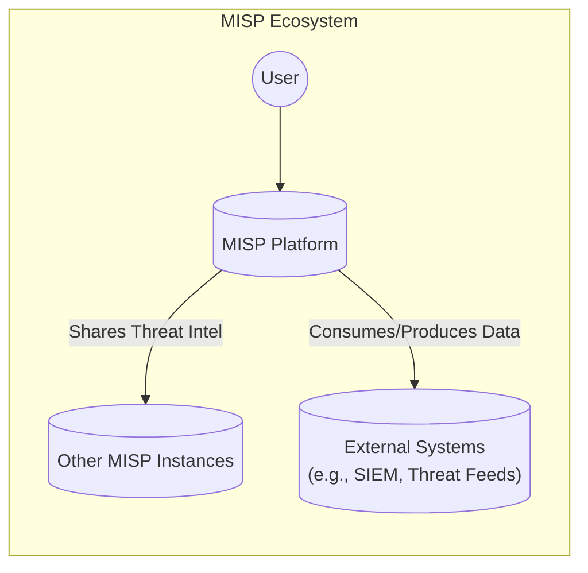
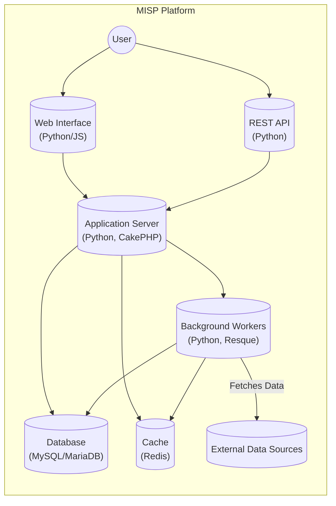
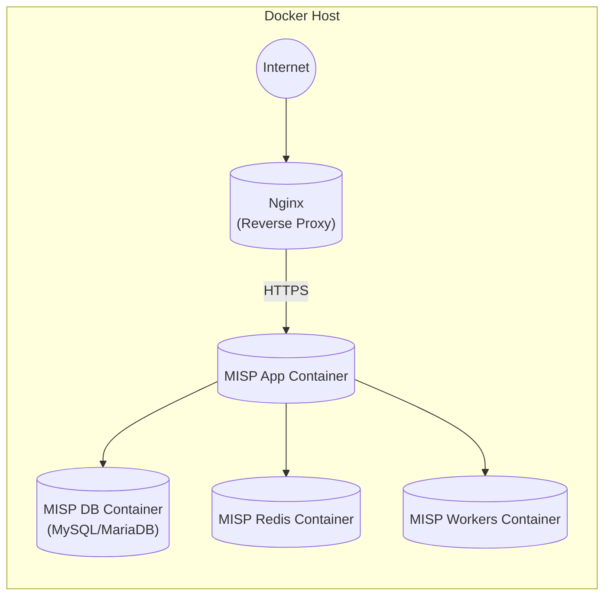
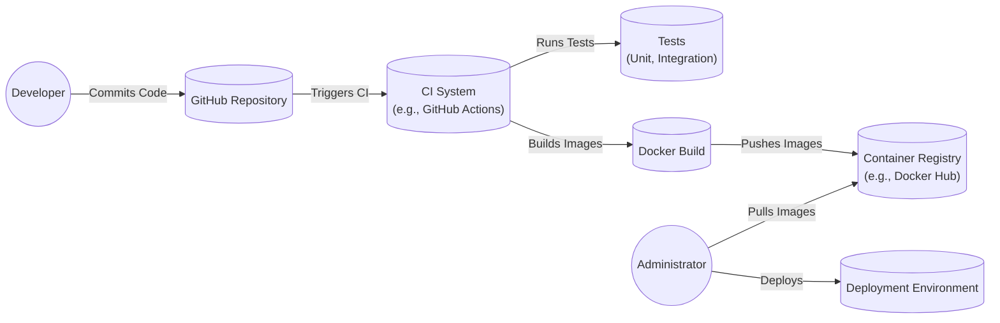

Okay, let's create a design document for the MISP (Malware Information Sharing Platform) project based on the provided GitHub repository.

# BUSINESS POSTURE

MISP is an open-source threat intelligence platform. Its primary goal is to facilitate the collection, storage, distribution, and sharing of threat intelligence, including indicators of compromise (IOCs), malware analysis, and threat actor information among organizations.

Business Priorities:

*   Enable efficient and timely sharing of threat intelligence.
*   Improve the collective defense against cyber threats.
*   Provide a platform that is flexible and adaptable to different organizational needs.
*   Foster collaboration and trust within the threat intelligence community.
*   Maintain the confidentiality, integrity, and availability of shared information.

Business Goals:

*   Become the defacto standard for threat intelligence sharing.
*   Reduce the time to detect and respond to cyber threats.
*   Improve the overall security posture of participating organizations.
*   Increase the number of active users and contributors.

Most Important Business Risks:

*   Data breaches or leaks of sensitive threat intelligence.
*   Compromise of the MISP platform itself, leading to data manipulation or disruption of service.
*   Loss of trust and reputation due to security incidents.
*   Inability to scale the platform to meet growing demands.
*   Lack of adoption or contribution from the wider community.
*   Legal and compliance issues related to data sharing and privacy.

# SECURITY POSTURE

Existing Security Controls (based on the GitHub repository and general knowledge of the project):

*   security control: Authentication: MISP supports various authentication methods, including local accounts, LDAP, and API keys. (Implemented in the application code and configuration).
*   security control: Authorization: Role-based access control (RBAC) is implemented to manage user permissions and data access. (Implemented in the application code and database).
*   security control: Input Validation: MISP performs input validation to prevent common web vulnerabilities like cross-site scripting (XSS) and SQL injection. (Implemented in the application code).
*   security control: Cryptography: MISP uses encryption for data at rest and in transit, including HTTPS for web communication and PGP for email encryption. (Implemented using libraries and server configurations).
*   security control: Auditing: MISP logs user actions and system events for auditing and forensic analysis. (Implemented in the application code and database).
*   security control: API Security: API keys are used to authenticate and authorize API access. (Implemented in the application code and configuration).
*   security control: Regular Updates: The MISP project releases regular updates to address security vulnerabilities and improve functionality. (Part of the project's development lifecycle).
*   security control: Community Support: A large and active community contributes to MISP's development and security, providing peer review and vulnerability reporting.

Accepted Risks:

*   accepted risk: The reliance on community contributions for code review and vulnerability identification introduces a potential risk of delayed detection of security flaws.
*   accepted risk: The complexity of the platform and its numerous integrations may increase the attack surface and the likelihood of configuration errors.
*   accepted risk: The distributed nature of threat intelligence sharing means that MISP instances may be hosted in environments with varying levels of security.

Recommended Security Controls:

*   Implement a comprehensive Software Security Assurance program, including static and dynamic code analysis, penetration testing, and a bug bounty program.
*   Provide detailed security hardening guides and best practices for deploying and configuring MISP instances.
*   Develop a formal incident response plan for handling security incidents related to the MISP platform.
*   Consider implementing multi-factor authentication (MFA) for enhanced user authentication.
*   Implement integrity checks for data at rest.

Security Requirements:

*   Authentication:
    *   Support for strong password policies.
    *   Option for multi-factor authentication (MFA).
    *   Integration with existing identity providers (e.g., SAML, OAuth).
*   Authorization:
    *   Fine-grained access control based on roles and attributes.
    *   Ability to restrict access to specific data sets and functionalities.
    *   Regular review and auditing of user permissions.
*   Input Validation:
    *   Strict validation of all user inputs to prevent injection attacks.
    *   Use of output encoding to prevent XSS vulnerabilities.
    *   Protection against other common web vulnerabilities (e.g., CSRF, file upload vulnerabilities).
*   Cryptography:
    *   Use of strong encryption algorithms and key management practices.
    *   Encryption of data at rest and in transit.
    *   Protection of API keys and other sensitive credentials.
    *   Regular review and update of cryptographic protocols.

# DESIGN

## C4 CONTEXT

Element Descriptions:

*   Element:
    *   Name: User
    *   Type: Person
    *   Description: A security analyst, threat researcher, or other individual who interacts with the MISP platform.
    *   Responsibilities:
        *   Creating, viewing, and modifying threat intelligence data.
        *   Sharing data with other MISP instances.
        *   Managing their own account and settings.
    *   Security controls:
        *   Authentication (passwords, MFA, API keys).
        *   Authorization (RBAC).

*   Element:
    *   Name: MISP Platform
    *   Type: Software System
    *   Description: The core MISP application, providing the functionality for storing, managing, and sharing threat intelligence.
    *   Responsibilities:
        *   Storing and managing threat intelligence data.
        *   Providing a web interface and API for user interaction.
        *   Facilitating data sharing with other MISP instances.
        *   Integrating with external systems.
    *   Security controls:
        *   Input validation.
        *   Output encoding.
        *   Cryptography (data at rest and in transit).
        *   Auditing.
        *   Regular security updates.

*   Element:
    *   Name: Other MISP Instances
    *   Type: Software System
    *   Description: Other instances of the MISP platform, operated by different organizations.
    *   Responsibilities:
        *   Sharing threat intelligence data with the primary MISP instance.
        *   Receiving threat intelligence data from the primary MISP instance.
    *   Security controls:
        *   Authentication (API keys, mutual TLS).
        *   Authorization (data sharing agreements).
        *   Data integrity checks.

*   Element:
    *   Name: External Systems
    *   Type: Software System
    *   Description: External systems that interact with MISP, such as SIEMs, threat intelligence feeds, and other security tools.
    *   Responsibilities:
        *   Consuming threat intelligence data from MISP.
        *   Providing threat intelligence data to MISP.
    *   Security controls:
        *   Authentication (API keys, mutual TLS).
        *   Authorization (data sharing agreements).
        *   Data integrity checks.

## C4 CONTAINER

Element Descriptions:

*   Element:
    *   Name: Web Interface
    *   Type: Web Application
    *   Description: The user interface for interacting with MISP through a web browser.
    *   Responsibilities:
        *   Displaying threat intelligence data.
        *   Providing forms for creating and modifying data.
        *   Handling user authentication and authorization.
    *   Security controls:
        *   Authentication (session management).
        *   Authorization (RBAC).
        *   Input validation.
        *   Output encoding.
        *   CSRF protection.

*   Element:
    *   Name: REST API
    *   Type: API
    *   Description: The API for interacting with MISP programmatically.
    *   Responsibilities:
        *   Providing access to MISP functionality for external systems and scripts.
        *   Handling authentication and authorization.
    *   Security controls:
        *   Authentication (API keys).
        *   Authorization (RBAC).
        *   Input validation.
        *   Rate limiting.

*   Element:
    *   Name: Application Server
    *   Type: Web Application
    *   Description: The core application logic for MISP.
    *   Responsibilities:
        *   Handling user requests.
        *   Interacting with the database and cache.
        *   Managing background workers.
    *   Security controls:
        *   Input validation.
        *   Data access control.
        *   Business logic security.

*   Element:
    *   Name: Database
    *   Type: Database
    *   Description: The database for storing threat intelligence data.
    *   Responsibilities:
        *   Storing and retrieving data.
        *   Enforcing data integrity.
    *   Security controls:
        *   Data encryption at rest.
        *   Database access control.
        *   Regular backups.

*   Element:
    *   Name: Cache
    *   Type: Cache
    *   Description: The cache for improving performance.
    *   Responsibilities:
        *   Storing frequently accessed data.
    *   Security controls:
        *   Cache invalidation policies.

*   Element:
    *   Name: Background Workers
    *   Type: Background Processes
    *   Description: Background processes for performing tasks such as data import, export, and synchronization.
    *   Responsibilities:
        *   Performing long-running tasks.
        *   Interacting with external data sources.
    *   Security controls:
        *   Input validation.
        *   Data access control.

*   Element:
    *   Name: External Data Sources
    *   Type: External System
    *   Description: External sources of threat intelligence data, such as threat feeds and other APIs.
    *   Responsibilities:
        *   Providing data to MISP.
    *   Security controls:
        *   Data validation.
        *   Secure communication channels.

## DEPLOYMENT

Possible Deployment Solutions:

1.  Bare-metal server installation.
2.  Virtual machine installation (e.g., using VMware, VirtualBox, KVM).
3.  Containerized deployment (e.g., using Docker, Kubernetes).
4.  Cloud-based deployment (e.g., using AWS, Azure, GCP).

Chosen Solution (for detailed description): Containerized deployment using Docker.

Element Descriptions:

*   Element:
    *   Name: Internet
    *   Type: Network
    *   Description: The public internet.
    *   Responsibilities:
        *   Providing external access to the MISP instance.
    *   Security controls:
        *   Firewall.
        *   Intrusion detection/prevention system (IDS/IPS).

*   Element:
    *   Name: Nginx
    *   Type: Web Server
    *   Description: A reverse proxy server that handles incoming requests and forwards them to the MISP application container.
    *   Responsibilities:
        *   Handling SSL/TLS termination.
        *   Load balancing.
        *   Serving static content.
    *   Security controls:
        *   HTTPS configuration.
        *   Web application firewall (WAF).
        *   Rate limiting.

*   Element:
    *   Name: MISP App Container
    *   Type: Container
    *   Description: The container running the MISP application code.
    *   Responsibilities:
        *   Handling user requests.
        *   Interacting with the database and cache.
    *   Security controls:
        *   Application-level security controls (see previous sections).

*   Element:
    *   Name: MISP DB Container
    *   Type: Container
    *   Description: The container running the MISP database.
    *   Responsibilities:
        *   Storing and retrieving data.
    *   Security controls:
        *   Database-level security controls (see previous sections).

*   Element:
    *   Name: MISP Redis Container
    *   Type: Container
    *   Description: The container running the Redis cache.
    *   Responsibilities:
        *   Storing frequently accessed data.
    *   Security controls:
        *   Cache invalidation policies.

*   Element:
    *   Name: MISP Workers Container
    *   Type: Container
    *   Description: The container running the MISP background workers.
    *   Responsibilities:
        *   Performing long-running tasks.
    *   Security controls:
        *   Application-level security controls (see previous sections).

## BUILD

The MISP build process typically involves the following steps:

1.  Developer commits code changes to the GitHub repository.
2.  Continuous integration (CI) system (e.g., GitHub Actions) is triggered.
3.  CI system runs tests (unit tests, integration tests).
4.  CI system builds Docker images.
5.  Docker images are pushed to a container registry (e.g., Docker Hub).
6.  MISP administrators pull the latest Docker images and deploy them to their environments.

Security Controls in the Build Process:

*   Code Review: All code changes are reviewed by other developers before being merged into the main branch.
*   Static Analysis: Static analysis tools (e.g., linters, security scanners) are used to identify potential code quality and security issues.
*   Dependency Scanning: Dependencies are scanned for known vulnerabilities.
*   Automated Testing: Automated tests are run to ensure that the code is functioning correctly and that there are no regressions.
*   Signed Commits: Developers sign their commits to ensure the integrity of the codebase.

# RISK ASSESSMENT

Critical Business Processes to Protect:

*   Threat intelligence sharing and collaboration.
*   Data ingestion and processing.
*   User authentication and authorization.
*   System administration and maintenance.

Data to Protect and Sensitivity:

*   Indicators of Compromise (IOCs): High sensitivity (can reveal vulnerabilities and attack patterns).
*   Malware Analysis Reports: High sensitivity (can contain sensitive information about malware capabilities and targets).
*   Threat Actor Information: High sensitivity (can reveal information about threat actors and their tactics, techniques, and procedures).
*   User Account Information: Medium sensitivity (can be used for unauthorized access).
*   System Logs: Medium sensitivity (can contain information about system activity and potential security incidents).
*   Configuration Files: Medium sensitivity (can contain sensitive information about system configuration).

# QUESTIONS & ASSUMPTIONS

Questions:

*   What are the specific compliance requirements (e.g., GDPR, HIPAA) that apply to the MISP deployment?
*   What are the existing security policies and procedures of the organization deploying MISP?
*   What is the expected scale of the MISP deployment (number of users, data volume, sharing partners)?
*   What are the specific threat models and attack scenarios that are of greatest concern?
*   What level of integration with external systems is required?

Assumptions:

*   BUSINESS POSTURE: The organization deploying MISP has a strong commitment to security and is willing to invest in the necessary resources to protect the platform.
*   SECURITY POSTURE: The organization has a basic understanding of security best practices and has implemented some security controls.
*   DESIGN: The deployment environment will be secured according to industry best practices. The organization will follow the MISP project's security recommendations and keep the platform up to date.