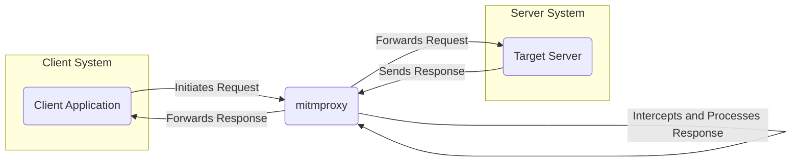
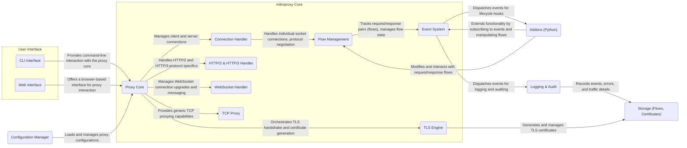
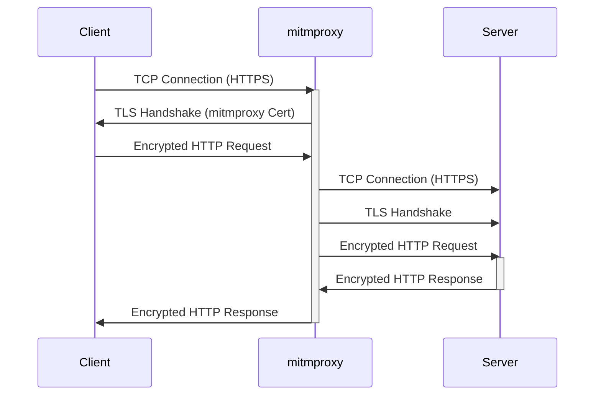

# Project Design Document: mitmproxy

**Version:** 1.1
**Date:** October 26, 2023
**Author:** AI Software Architect

## 1. Introduction

This document provides an enhanced design overview of the mitmproxy project, an interactive, TLS-capable intercepting HTTP proxy. It aims to provide a clear and detailed articulation of the system's architecture, core components, and data flow, specifically tailored for use in subsequent threat modeling exercises. This document is intended for security analysts, developers, and anyone involved in assessing the security posture of systems utilizing mitmproxy.

## 2. Goals and Objectives

The core objectives of mitmproxy are:

*   **Traffic Interception and Inspection:** To seamlessly intercept network traffic, primarily HTTP(S), and provide mechanisms for detailed inspection.
*   **Real-time Modification Capabilities:** To enable users and extensions to modify intercepted requests and responses on the fly.
*   **Extensible Functionality through Addons:** To offer a robust addon system (primarily in Python) for extending and customizing proxy behavior.
*   **Transparent TLS Handling:** To manage TLS connections effectively, including dynamic certificate generation for man-in-the-middle operations.
*   **Multi-Protocol Support:** To extend beyond basic HTTP(S) and support protocols like WebSockets and potentially others.
*   **Stable and Performant Proxy Solution:** To function as a reliable and efficient proxy for various use cases.

## 3. High-Level Architecture

**Description:**

*   The **Client Application** initiates network communication, unaware of the proxy in a transparent setup or explicitly configured to use mitmproxy.
*   **mitmproxy** acts as an intermediary, intercepting all network traffic between the client and the server. It provides the core functionality for inspection and modification.
*   The **Target Server** is the intended destination of the client's request. mitmproxy forwards the (potentially modified) request to this server.

## 4. Detailed Architecture

**Description of Components:**

*   **Proxy Core:** The central orchestrator of mitmproxy, responsible for managing the lifecycle of connections, coordinating components, and handling the overall proxy logic.
*   **Connection Handler:** Manages individual client and server-side socket connections, handling connection establishment, protocol negotiation (e.g., TLS handshake), and connection closure.
*   **Flow Management:**  Maintains the state of intercepted request/response pairs (referred to as "flows"). It provides an API for accessing, inspecting, and modifying these flows.
*   **Event System:** A publish-subscribe mechanism that allows different components and addons to react to events occurring within the proxy lifecycle (e.g., a new request has arrived, a response has been received).
*   **TLS Engine:**  Handles all aspects of TLS, including performing TLS handshakes with clients and servers, generating necessary certificates for man-in-the-middle operations, and managing certificate storage.
*   **HTTP/2 & HTTP/3 Handler:**  Specifically manages the complexities of the HTTP/2 and HTTP/3 protocols, including frame handling, stream management, and other protocol-specific logic.
*   **WebSocket Handler:**  Manages WebSocket connections, allowing for the interception and manipulation of WebSocket messages.
*   **TCP Proxy:** Provides a more generic TCP proxying capability, allowing mitmproxy to handle protocols beyond HTTP(S) and WebSockets.
*   **CLI Interface:** The command-line interface for interacting with mitmproxy, providing tools for inspecting flows, replaying requests, and configuring the proxy.
*   **Web Interface:** A browser-based user interface for interacting with mitmproxy, offering a visual way to inspect traffic, manage flows, and configure settings.
*   **Addons (Python):** A powerful system for extending mitmproxy's functionality. Addons are Python scripts that can subscribe to events and interact with the proxy's internal state, allowing for custom logic and modifications.
*   **Configuration Manager:** Responsible for loading, validating, and managing mitmproxy's configuration settings, including listening addresses, TLS settings, and addon paths.
*   **Logging & Audit:**  Handles the logging of significant events, errors, and potentially intercepted traffic details for debugging, auditing, and analysis.
*   **Storage (Flows, Certificates):**  Provides mechanisms for persisting intercepted flows, generated TLS certificates, and other relevant data.

## 5. Data Flow

The following outlines the typical data flow for an HTTPS request intercepted by mitmproxy:

1. **Client Connection Initiation:** The client application initiates a TCP connection, intending to connect to a target server. The client's system is configured to route traffic through mitmproxy.
2. **mitmproxy Accepts Connection:** The `Connection Handler` in mitmproxy accepts the incoming client connection.
3. **Client TLS Handshake:** The client initiates a TLS handshake. The `TLS Engine` in mitmproxy intercepts this and performs a TLS handshake with the client, presenting a dynamically generated certificate for the target domain.
4. **mitmproxy Establishes Server Connection:**  Simultaneously, the `Connection Handler` in mitmproxy establishes a separate TCP connection with the actual target server.
5. **mitmproxy TLS Handshake with Server:** The `TLS Engine` in mitmproxy initiates a TLS handshake with the target server.
6. **Request Reception:** The `Connection Handler` receives the encrypted HTTP request from the client. The `TLS Engine` decrypts the request.
7. **Request Flow Creation:** The `Flow Management` component creates a new "flow" object representing this request/response pair.
8. **Request Event Dispatch:** The `Event System` dispatches a "request" event, making the request available to registered `Addons`.
9. **Addon Processing (Optional):** Registered `Addons` receive the "request" event. They can inspect and potentially modify the request through the `Flow Management` API.
10. **User Interaction (Optional):** If a user is interacting with the CLI or Web interface, they can inspect and modify the request at this stage.
11. **Request Forwarding:** The `Proxy Core` forwards the (potentially modified) request to the target server. The `TLS Engine` encrypts the request before sending.
12. **Server Processing:** The target server processes the request and generates an HTTP response.
13. **Response Reception:** The `Connection Handler` receives the encrypted HTTP response from the server. The `TLS Engine` decrypts the response.
14. **Response Flow Update:** The `Flow Management` component updates the corresponding flow object with the received response.
15. **Response Event Dispatch:** The `Event System` dispatches a "response" event, making the response available to registered `Addons`.
16. **Addon Processing (Optional):** Registered `Addons` receive the "response" event and can inspect and potentially modify the response.
17. **User Interaction (Optional):** If a user is interacting with the CLI or Web interface, they can inspect and modify the response.
18. **Response Forwarding:** The `Proxy Core` forwards the (potentially modified) response back to the client. The `TLS Engine` encrypts the response before sending.
19. **Connection Closure:** The connections between the client and mitmproxy, and mitmproxy and the server, are eventually closed.

## 6. Security Considerations (For Threat Modeling)

This section outlines key security considerations relevant for threat modeling mitmproxy deployments:

*   **TLS Interception Risks:**
    *   **Certificate Pinning Bypass:** Clients implementing certificate pinning may detect mitmproxy's dynamically generated certificates, leading to connection failures or security warnings.
    *   **Weak Certificate Generation:** Vulnerabilities in the `TLS Engine`'s certificate generation process could result in insecure or easily compromised certificates.
    *   **Protocol Downgrade Attacks:**  Attackers might attempt to force the use of older, less secure TLS versions during negotiation.
    *   **Improper Certificate Handling:**  Insecure storage or management of generated private keys could lead to compromise.
*   **Addon Security Risks:**
    *   **Malicious Addons:** Users could install or develop addons with malicious intent, potentially exfiltrating intercepted data, modifying traffic for malicious purposes, or compromising the mitmproxy host.
    *   **Addon Vulnerabilities:** Security flaws in addon code could be exploited by attackers.
    *   **Lack of Sandboxing:** Addons typically run with the same privileges as mitmproxy, increasing the impact of a compromised addon.
*   **Authentication and Authorization Weaknesses:**
    *   **Unsecured Interfaces:**  If the CLI or Web interface is not properly secured (e.g., using strong passwords or authentication mechanisms), unauthorized users could gain access and control the proxy.
    *   **Lack of Addon Authentication:** There is generally no built-in mechanism to authenticate or verify the source and integrity of addons.
*   **Data Storage and Logging Concerns:**
    *   **Sensitive Data in Logs:** Logs might inadvertently contain sensitive information (e.g., API keys, passwords, session tokens) if not configured carefully.
    *   **Insecure Flow Storage:** Persisted flows could contain sensitive data and require robust encryption and access control mechanisms.
    *   **Certificate Storage Security:** The private keys for generated certificates are highly sensitive and require secure storage.
*   **Input Validation and Sanitization Issues:**
    *   **Handling Malformed Traffic:** mitmproxy needs to robustly handle malformed or malicious network requests and responses to prevent crashes or exploits.
    *   **Input Validation in Addons:** Addons must properly validate and sanitize any user-provided input or data from intercepted traffic to prevent injection attacks.
*   **Denial of Service (DoS) Vulnerabilities:**
    *   **Resource Exhaustion:** mitmproxy could be targeted with a high volume of traffic to exhaust its resources (CPU, memory, network), leading to service disruption.
    *   **Exploiting Protocol Weaknesses:** Attackers might exploit vulnerabilities in the handled protocols (HTTP, TLS, etc.) to cause resource exhaustion or crashes.
*   **Side-Channel Attacks:**
    *   **Timing Attacks:** Information about intercepted traffic or internal operations could potentially be leaked through timing variations.
*   **Web Interface Security Flaws:**
    *   **Cross-Site Scripting (XSS):** Vulnerabilities in the web interface could allow attackers to inject malicious scripts that execute in the browsers of users accessing the interface.
    *   **Cross-Site Request Forgery (CSRF):** Attackers could trick authenticated users into performing unintended actions on the mitmproxy instance.
*   **Dependency Vulnerabilities:**  Vulnerabilities in the underlying libraries and frameworks used by mitmproxy (e.g., Python libraries) could introduce security risks.

## 7. Deployment Considerations

Considerations for deploying mitmproxy securely:

*   **Secure the Host System:** Ensure the operating system and underlying infrastructure where mitmproxy is deployed are properly secured and hardened.
*   **Restrict Access:** Limit access to the mitmproxy instance (both CLI and Web interface) to authorized users only. Implement strong authentication mechanisms.
*   **Careful Addon Management:** Only install addons from trusted sources and review their code for potential security issues.
*   **Secure Logging Configuration:** Configure logging to avoid capturing sensitive data. Implement secure log storage and rotation.
*   **Protect Certificate Storage:** Securely store the private keys for generated certificates. Consider using hardware security modules (HSMs) for enhanced protection.
*   **Network Segmentation:** Deploy mitmproxy within a segmented network to limit the impact of a potential compromise.
*   **Regular Updates:** Keep mitmproxy and its dependencies updated to patch known security vulnerabilities.

## 8. Future Considerations

Potential future enhancements and areas for development:

*   **Improved Performance and Scalability:** Further optimizations for handling high-volume traffic and concurrent connections.
*   **Enhanced Web Interface Functionality:** Adding more advanced features to the web interface for traffic analysis and manipulation.
*   **More Granular Access Control Mechanisms:** Implementing more fine-grained control over user permissions and access to specific features.
*   **Built-in Addon Security Features:** Exploring mechanisms for verifying addon integrity and potentially sandboxing addon execution.
*   **Integration with Security Information and Event Management (SIEM) Systems:**  Improving integration for centralized logging and security monitoring.
*   **Formal Security Audits:** Conducting regular security audits by external experts to identify and address potential vulnerabilities.

This enhanced design document provides a more detailed and structured overview of the mitmproxy project, specifically focusing on aspects relevant for threat modeling. It highlights key components, data flows, and potential security considerations to facilitate a comprehensive security assessment.
