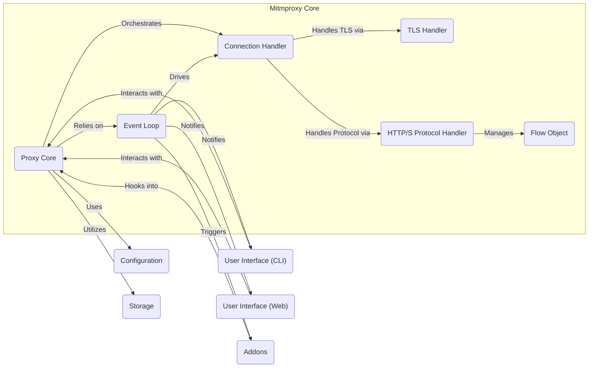
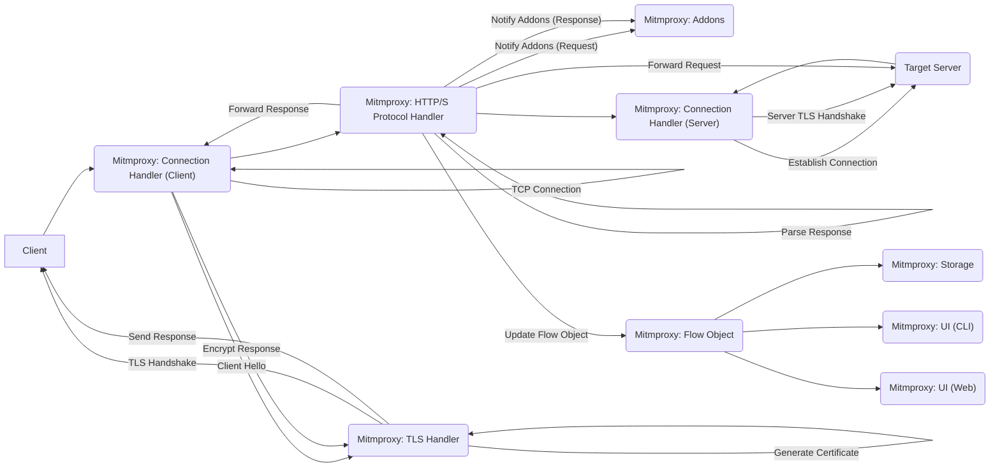

# Project Design Document: mitmproxy

**Version:** 1.1
**Date:** October 26, 2023
**Author:** AI Software Architect

## 1. Introduction

This document provides an enhanced architectural design of mitmproxy, an interactive, TLS-capable intercepting HTTP/2, HTTP/1, and WebSockets proxy. This document aims to provide a detailed and clear outline of the system's components, data flow, and key functionalities. It will serve as a robust foundation for subsequent threat modeling activities.

mitmproxy empowers users to intercept, inspect, modify, and replay network traffic in real-time. It offers a command-line interface (mitmproxy), a web interface (mitmweb), and a powerful Python API for extending its capabilities through addons. This document focuses on the core architectural elements relevant to security analysis.

## 2. Goals and Non-Goals

**Goals:**

*   Clearly define the major architectural components of mitmproxy and their responsibilities.
*   Describe the detailed data flow of network traffic through the system, including interaction with addons.
*   Identify key functionalities and their interactions with a focus on security-relevant aspects.
*   Provide a comprehensive and well-structured overview of the architecture specifically for security analysis and threat modeling.

**Non-Goals:**

*   Provide an exhaustive, code-level description of every module or function within the mitmproxy codebase.
*   Document every single configuration option available in mitmproxy.
*   Include performance benchmarks, optimization strategies, or scalability considerations.
*   Cover the historical evolution of the project or its detailed development processes.

## 3. System Architecture

The mitmproxy architecture is modular and can be broadly categorized into the following key components, which work together to facilitate traffic interception and manipulation:

*   **Proxy Core:** The central orchestrator responsible for managing the lifecycle of connections, directing traffic flow, and coordinating interactions between other components.
*   **Connection Handler:** Manages individual network connections established with clients and target servers, handling socket operations and connection state.
*   **TLS Handler:** Responsible for managing TLS/SSL negotiation and secure communication for both client-facing and server-facing connections, including dynamic certificate generation.
*   **HTTP/S Protocol Handler:** Parses and serializes HTTP/1, HTTP/2, and WebSocket messages, extracting and structuring relevant data for inspection and modification.
*   **Flow Object:** A fundamental data structure representing a single intercepted network transaction (request and response, or WebSocket handshake and messages), containing all relevant details.
*   **Event Loop:** The asynchronous engine driving mitmproxy, managing I/O events, timers, and callbacks to ensure efficient and non-blocking operation.
*   **User Interface (CLI - mitmproxy):** A terminal-based interface providing interactive control and inspection of intercepted traffic.
*   **User Interface (Web - mitmweb):** A web browser-based interface offering a visual representation of intercepted traffic and management capabilities.
*   **Addons:** External Python scripts that extend mitmproxy's functionality by hooking into various events within the proxy lifecycle.
*   **Configuration:** Manages the proxy's settings and options, including listening addresses, TLS settings, upstream proxy configurations, and addon loading.
*   **Storage:** Mechanisms for persisting intercepted flows to various formats (e.g., HAR files, raw dumps) for later analysis or replay.

### 3.1. Component Details

*   **Proxy Core:** This component acts as the central nervous system of mitmproxy. It listens for incoming client connections on configured ports, establishes connections to target servers, and manages the overall flow of intercepted traffic. It also coordinates the interaction between other components like the TLS Handler and HTTP/S Protocol Handler.

*   **Connection Handler:** This component is responsible for the low-level management of individual TCP connections. It handles socket creation, data buffering, connection closing, and manages the state of each connection (e.g., idle, active, closed). It differentiates between client-facing and server-facing connections.

*   **TLS Handler:** This crucial component manages the complexities of establishing secure TLS/SSL connections. For client connections, it intercepts the initial handshake and dynamically generates TLS certificates for the target domain, signed by mitmproxy's Certificate Authority (CA). For server connections, it performs standard TLS negotiation and certificate verification. It handles various TLS versions and cipher suites.

*   **HTTP/S Protocol Handler:** This component is responsible for understanding and manipulating the application-layer protocols. It parses incoming HTTP/1, HTTP/2, and WebSocket messages, extracting headers, bodies, methods, URLs, and other relevant information. It also serializes modified messages before forwarding them. For WebSockets, it manages the bidirectional message flow.

*   **Flow Object:** This is a central data structure that represents a complete network transaction. For HTTP/S, it contains the client request, the server response, associated metadata (timestamps, connection details), and any modifications made by the user or addons. For WebSockets, it represents the initial handshake and subsequent messages exchanged.

*   **Event Loop:** mitmproxy leverages an asynchronous event loop (typically based on `asyncio`) to handle multiple concurrent connections efficiently. It monitors sockets for incoming data, manages timers for timeouts, and dispatches events to appropriate handlers, ensuring non-blocking operation.

*   **User Interface (CLI - mitmproxy):** This provides a text-based, interactive interface for controlling and inspecting intercepted traffic. Users can view flows, modify requests and responses, replay requests, set breakpoints, and configure various proxy settings directly from the terminal.

*   **User Interface (Web - mitmweb):** This offers a graphical, web browser-based interface for interacting with mitmproxy. It provides a more visual representation of intercepted traffic, allowing users to inspect headers, bodies, and other details in a user-friendly manner. It also provides controls for modifying and replaying requests.

*   **Addons:** These are external Python scripts that extend mitmproxy's functionality. Addons can register hooks to be called at various stages of the request/response lifecycle (e.g., request received, response sent). This allows for custom logic, such as modifying traffic based on specific criteria, logging data, or integrating with other tools.

*   **Configuration:** This component manages all configurable aspects of mitmproxy. It handles loading configuration from files or command-line arguments, providing settings for listening addresses and ports, TLS certificate paths, upstream proxy settings, addon paths, and other operational parameters.

*   **Storage:** This encompasses the mechanisms for persisting intercepted flows. mitmproxy can save flows to various formats, including HAR (HTTP Archive) files, raw message dumps, or custom formats defined by addons. This allows for offline analysis, reporting, or replaying of captured traffic.

## 4. Data Flow

The following describes the detailed data flow for a typical intercepted HTTPS request through mitmproxy, highlighting key interaction points:

1. **Client Initiates Connection:** The client application initiates a TCP connection to mitmproxy's configured listening address and port.
2. **Connection Handling:** The `Connection Handler` accepts the incoming connection and creates a new connection object to manage its state.
3. **Client TLS Handshake Interception:** For HTTPS traffic, the `TLS Handler` intercepts the client's initial TLS Client Hello message.
4. **Dynamic Certificate Generation:** The `TLS Handler` dynamically generates a TLS certificate for the requested server's hostname. This certificate is signed by mitmproxy's root CA certificate.
5. **Client TLS Negotiation:** mitmproxy presents the generated certificate to the client and completes the TLS handshake, effectively acting as the server from the client's perspective. The client will trust this certificate if mitmproxy's CA certificate is installed in the client's trusted certificate store.
6. **Server Connection Establishment:** The `Proxy Core` initiates a new TCP connection to the actual target server.
7. **Server TLS Negotiation:** The `TLS Handler` negotiates a secure TLS connection with the target server, verifying the server's certificate to ensure authenticity.
8. **Request Reception:** The `Connection Handler` receives the client's encrypted HTTP request.
9. **Request Decryption and Parsing:** The `TLS Handler` decrypts the request, and the `HTTP/S Protocol Handler` parses the HTTP request, extracting headers, body, and other relevant information.
10. **Addon Processing (Request Hooks):** The `Proxy Core` notifies registered `Addons` about the incoming request. Addons can inspect and modify the request at this stage.
11. **Request Forwarding:** The `HTTP/S Protocol Handler` forwards the (potentially modified) HTTP request to the target server through the established server connection.
12. **Response Reception:** The `Connection Handler` receives the target server's encrypted HTTP response.
13. **Response Decryption and Parsing:** The `TLS Handler` decrypts the response, and the `HTTP/S Protocol Handler` parses the HTTP response.
14. **Addon Processing (Response Hooks):** The `Proxy Core` notifies registered `Addons` about the incoming response. Addons can inspect and modify the response at this stage.
15. **Response Forwarding:** The `HTTP/S Protocol Handler` forwards the (potentially modified) HTTP response to the client through the established client connection.
16. **Response Encryption:** The `TLS Handler` encrypts the response before sending it to the client.
17. **Flow Object Update:** The `Flow Object` is updated with the complete request and response data, including any modifications made by addons or the user.
18. **Flow Storage (Optional):** Based on configuration, the `Storage` component may persist the `Flow Object` to disk.
19. **UI Update:** The `Event Loop` triggers updates to the `User Interface (CLI)` and `User Interface (Web)` to display the intercepted flow.
20. **User Interaction:** Users can interact with the UIs to inspect the flow, modify and replay requests, or perform other actions.

## 5. Security Considerations (Detailed)

This section expands on the initial security considerations, providing more detail on potential risks and implications:

*   **Inherent Man-in-the-Middle (MitM) Risk:** mitmproxy operates by performing a deliberate MitM attack. The security of this model relies entirely on the user explicitly trusting mitmproxy's generated certificates. If the root CA certificate is compromised, attackers could intercept and decrypt traffic without the user's knowledge, potentially exposing sensitive data like credentials and personal information. Secure generation, storage, and distribution of this CA certificate are paramount.

*   **Certificate Authority (CA) Management:** The security of mitmproxy heavily depends on the secure management of its generated CA certificate and private key. Unauthorized access to this key would allow an attacker to forge certificates for any domain, completely undermining the security of intercepted connections. Best practices for key management, including secure storage and access control, must be followed.

*   **Addon Security and Sandboxing:** Addons execute arbitrary Python code within the mitmproxy process. This presents a significant security risk, as malicious or poorly written addons could compromise the proxy itself, the system running mitmproxy, or even inject malicious content into intercepted traffic. Mechanisms for addon sandboxing or strong security review processes are crucial to mitigate this risk. The principle of least privilege should be applied to addon permissions.

*   **Data Storage Security:** If intercepted flows are persisted to disk, the security of the storage mechanism becomes critical. Sensitive data within the flows must be protected against unauthorized access. This includes using appropriate file system permissions, encryption at rest, and secure transfer protocols if flows are exported.

*   **Configuration Security Vulnerabilities:** Insecure configuration options can introduce vulnerabilities. For example, weak TLS settings might allow downgrade attacks, or an open management port could provide unauthorized access to the proxy's control plane. Secure default configurations and clear guidance on secure configuration practices are essential.

*   **Web UI Security:** The web interface (mitmweb) is a potential attack vector. It must be protected against common web vulnerabilities such as Cross-Site Scripting (XSS), Cross-Site Request Forgery (CSRF), and injection attacks. Robust authentication and authorization mechanisms are necessary to prevent unauthorized access and manipulation. Regular security audits and penetration testing of the web UI are recommended.

*   **Resource Exhaustion and Denial of Service (DoS):** mitmproxy, like any network application, is susceptible to resource exhaustion attacks. Handling a large volume of traffic or malformed requests could potentially overwhelm the proxy, leading to denial of service. Rate limiting, input validation, and resource management strategies are important considerations.

*   **Secure Update Mechanisms:** The process for updating mitmproxy itself must be secure to prevent attackers from injecting malicious code through compromised updates. Signed updates and secure distribution channels are necessary.

## 6. Technologies Used

*   **Python (3.7+):** The primary programming language for mitmproxy, leveraging its extensive libraries and ecosystem.
*   **asyncio:** Python's standard asynchronous I/O framework, used for managing concurrent network connections and non-blocking operations.
*   **cryptography:** A powerful and widely used Python library providing cryptographic primitives for TLS implementation and other security-related functionalities.
*   **mitmproxy/netlib:**  A core mitmproxy library providing low-level networking and protocol handling abstractions.
*   **Urwid:** A library for creating text-based user interfaces, used for the command-line interface (mitmproxy).
*   **React:** A JavaScript library for building user interfaces, used for the modern web interface (mitmweb).
*   **Flask:** A lightweight WSGI web application framework, used as the backend for the web interface (mitmweb).
*   **Werkzeug:** A comprehensive WSGI web application library, a dependency of Flask.
*   **HTML, CSS, JavaScript:** Standard web technologies used for the structure, styling, and interactivity of the web interface.
*   **WebSockets:**  A communication protocol supported by mitmproxy for intercepting and manipulating WebSocket traffic.
*   **HTTP/2:** The latest version of the HTTP protocol, fully supported by mitmproxy.

## 7. Deployment Considerations

Mitmproxy offers flexibility in deployment scenarios, each with its own security implications:

*   **Local Proxy (Developer Workstation):** This is the most common use case, where developers run mitmproxy on their local machines to inspect traffic from their own applications. Security relies on the user's trust in the locally running instance. However, malware on the developer's machine could potentially compromise mitmproxy.

*   **Transparent Proxy (Network Gateway):**  Deployed as a network gateway, intercepting traffic without explicit client configuration. This requires network infrastructure changes (e.g., routing, firewall rules). Security considerations are heightened as mitmproxy handles traffic for multiple users or systems. Secure configuration and hardening are crucial.

*   **Reverse Proxy (Limited Use Case):** While not its primary function, mitmproxy can be used as a reverse proxy in specific scenarios. This involves placing mitmproxy in front of one or more backend servers. Security considerations include protecting the backend servers and ensuring mitmproxy is properly configured to handle incoming requests.

*   **Cloud Environments (Virtual Machines, Containers):** mitmproxy can be deployed in cloud environments for traffic inspection and analysis within the cloud infrastructure. Security considerations include securing the underlying cloud infrastructure, managing access controls, and ensuring secure communication channels. Containerization (e.g., Docker) can provide isolation and simplify deployment.

*   **Headless Deployment (Scripted Automation):** mitmproxy can be run in a headless mode without a user interface, controlled entirely through scripting and its API. This is often used for automated testing or traffic analysis. Security considerations include securing the scripts and the environment where they are executed.

This enhanced design document provides a more detailed and comprehensive understanding of the mitmproxy architecture, specifically tailored for security analysis and threat modeling. It highlights the key components, data flows, and security considerations necessary for a thorough evaluation of the system's security posture.