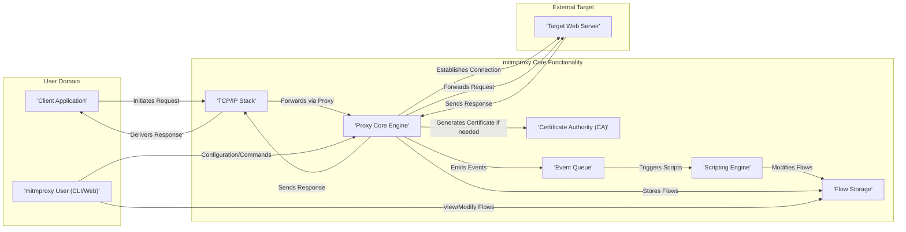
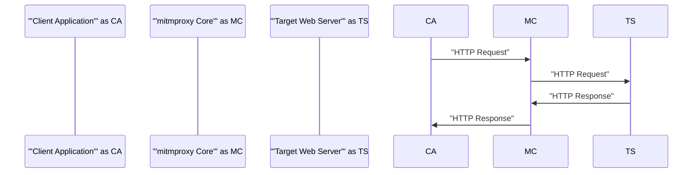
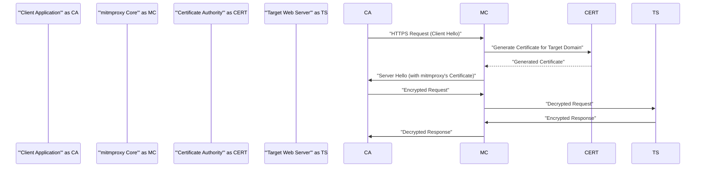
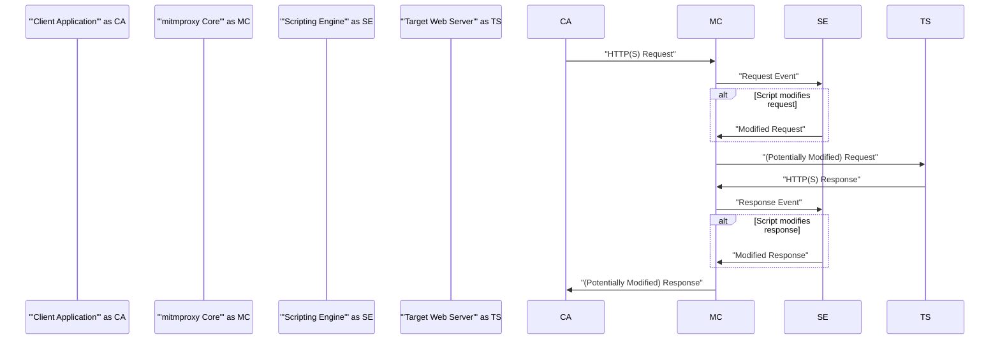

# Project Design Document: mitmproxy

**Version:** 1.1
**Date:** October 26, 2023
**Author:** AI Software Architect

## 1. Introduction

This document provides an enhanced architectural design of the mitmproxy project, an interactive TLS-capable intercepting HTTP proxy. This revised document aims to provide greater clarity and detail regarding the system's components, data flows, and interactions, serving as a robust foundation for subsequent threat modeling activities. We have expanded on several areas to provide a more comprehensive understanding of the system.

## 2. Goals and Objectives

The primary goals of mitmproxy are:

*   **Transparent Interception:** To seamlessly intercept and inspect network traffic, primarily focusing on HTTP, HTTPS, and WebSocket protocols, without requiring significant client-side configuration beyond proxy settings.
*   **On-the-Fly Modification:** To empower users to dynamically alter intercepted requests and responses, enabling tasks like debugging, testing, and security analysis.
*   **Detailed Traffic Inspection:** To offer comprehensive views of intercepted traffic, including all relevant headers, body content, timing information, and metadata, presented in a user-friendly manner.
*   **Scriptable Automation:** To enable users to automate repetitive interception and modification tasks, as well as extend core functionality, through a powerful scripting interface.
*   **Facilitating Security Analysis:** To provide a valuable tool for security professionals to analyze web application and API behavior, identify vulnerabilities, and test security controls.
*   **Aiding Development and Debugging:** To assist developers in understanding the intricacies of network interactions, diagnosing issues, and verifying API behavior.

## 3. Architectural Overview

mitmproxy employs a client-server architecture with distinct components working in concert. The central element is the Proxy Core Engine, responsible for intercepting and forwarding network traffic. User interaction is facilitated through both command-line (mitmproxy and mitmdump) and web-based (mitmweb) interfaces. The Scripting Engine allows for dynamic extension and automation of the proxy's capabilities.

## 4. Component Details

This section provides a more detailed breakdown of the key components within the mitmproxy architecture:

*   **Client Application:** Any software application (e.g., web browser, mobile application, API client, command-line tool) configured to direct its network traffic through the mitmproxy instance. This redirection is typically achieved through proxy settings at the operating system or application level.
*   **mitmproxy User (CLI/Web):** The human operator interacting with the mitmproxy system through one of its user interfaces:
    *   **mitmproxy (Interactive CLI):** A terminal-based interactive interface providing real-time inspection and modification of intercepted traffic flows. It offers features like filtering, searching, and replaying requests.
    *   **mitmdump (Non-interactive CLI):** A command-line tool designed for passively capturing and logging intercepted traffic to the console or a file, suitable for automated analysis or long-term monitoring.
    *   **mitmweb (Web Interface):** A browser-based graphical interface offering a user-friendly way to visualize, inspect, and manipulate intercepted traffic. It often provides a more intuitive experience for users less familiar with command-line tools.
*   **Proxy Core Engine:** The central processing unit of mitmproxy, responsible for the core interception and forwarding logic:
    *   **Connection Listening:**  Accepts incoming TCP connections from client applications directed to the configured proxy port.
    *   **TLS Negotiation (Client-Side):**  Performs the TLS handshake with the client application, presenting mitmproxy's generated certificate.
    *   **Dynamic Certificate Generation:**  Generates TLS certificates on-the-fly for the hostname of the target server being accessed by the client. This is crucial for intercepting HTTPS traffic.
    *   **TLS Negotiation (Server-Side):** Establishes a separate TLS connection with the actual target web server.
    *   **Request and Response Handling:** Receives HTTP requests from the client, forwards them to the target server, receives the corresponding HTTP responses, and sends them back to the client. This involves parsing and potentially modifying the request and response data.
    *   **Flow Management:** Creates and manages "flows," which represent the complete lifecycle of a single request-response transaction, including metadata like timestamps, connection details, and any modifications made.
    *   **Event Emission:**  Generates events at various stages of the request/response lifecycle (e.g., `request`, `response`, `error`, `tcp_client_connected`). These events are the primary mechanism for interacting with the Scripting Engine.
*   **Certificate Authority (CA):**  The component responsible for generating and signing the root Certificate Authority certificate used by mitmproxy. This root certificate is used to sign the dynamically generated certificates for individual target domains.
    *   **Root CA Certificate:**  The foundational certificate that needs to be trusted by client applications (typically by importing it into the browser's or operating system's trust store) to avoid security warnings during HTTPS interception.
    *   **Certificate Generation for Domains:**  Uses the root CA's private key to sign certificates for specific target domains as they are accessed by clients through the proxy.
*   **Scripting Engine:**  A runtime environment that allows users to execute custom scripts (primarily written in Python) to extend mitmproxy's functionality.
    *   **Event Handling:** Scripts can register handlers for specific events emitted by the Proxy Core Engine, allowing them to react to different stages of the traffic flow.
    *   **Request and Response Manipulation:** Scripts can access and modify the contents of intercepted requests and responses, including headers, bodies, and status codes.
    *   **Custom Logic Implementation:** Enables users to implement arbitrary logic for tasks like traffic filtering, data transformation, injecting faults, or integrating with external systems.
    *   **API Access:** Provides an API for scripts to interact with mitmproxy's internal state and functionality.
*   **Event Queue:** A queueing mechanism that facilitates asynchronous communication between the Proxy Core Engine and the Scripting Engine. When the Proxy Core Engine emits an event, it is placed in the queue, and the Scripting Engine processes these events in order. This prevents scripts from blocking the main proxy loop.
*   **Flow Storage:** A temporary storage mechanism for intercepted flows. This allows users to review past traffic, apply filters, search for specific requests, and potentially replay them. The storage can be configured to be in-memory (for ephemeral storage) or persisted to disk (for retaining traffic history).
*   **TCP/IP Stack:** While not strictly a mitmproxy component, it's the underlying network layer through which mitmproxy operates. mitmproxy listens for and establishes TCP connections, relying on the operating system's TCP/IP stack for network communication.
*   **Target Web Server:** The remote server that the client application intends to communicate with. mitmproxy acts as an intermediary in this communication.

## 5. Data Flow Diagrams

This section visually represents the flow of data through the mitmproxy system in various common scenarios.

### 5.1 Basic HTTP Request/Response Flow

### 5.2 HTTPS Request/Response Flow with Certificate Generation

### 5.3 Request/Response Flow with Scripting Interaction

## 6. Security Considerations

Security is paramount when deploying and using mitmproxy, given its position as a man-in-the-middle. Key security considerations include:

*   **Certificate Management Vulnerabilities:** Improper handling of TLS certificates can lead to severe security risks.
    *   **Root CA Compromise:** If the private key of the root CA is compromised, attackers can generate trusted certificates for any domain, enabling widespread phishing and data interception. Secure storage and access control for the root CA private key are critical.
    *   **Weak Certificate Generation:**  Using weak cryptographic algorithms or insecure random number generation during certificate creation could lead to predictable or easily forged certificates.
    *   **Lack of Certificate Revocation:**  If a generated certificate is compromised, there needs to be a mechanism to revoke it, preventing its further use. mitmproxy relies on the ephemeral nature of these certificates.
*   **Scripting Engine Security Risks:** The ability to execute arbitrary user-provided scripts introduces potential vulnerabilities.
    *   **Code Injection Attacks:** Malicious actors could inject harmful code into scripts, potentially gaining control of the mitmproxy process or the underlying system. Input validation and sandboxing (though limited in mitmproxy's current architecture) are important considerations.
    *   **Data Exfiltration via Scripts:** Scripts could be designed to intercept and transmit sensitive data to unauthorized locations. Limiting the capabilities of the scripting API and providing mechanisms for auditing script behavior can mitigate this.
    *   **Denial of Service through Scripting:**  Poorly written or malicious scripts could consume excessive resources (CPU, memory), leading to a denial of service for the proxy itself. Resource limits and monitoring are necessary.
*   **Access Control Deficiencies:**  Lack of proper access controls can allow unauthorized individuals to interact with and potentially misuse mitmproxy.
    *   **Unauthenticated Access:** If the mitmproxy interfaces (CLI or web) are accessible without authentication, unauthorized users could inspect or modify traffic. Implementing authentication mechanisms is crucial.
    *   **Authorization Bypass:** Even with authentication, inadequate authorization controls could allow users to perform actions beyond their intended privileges. Role-based access control can help manage this.
    *   **Insecure Configuration:**  Default or poorly configured settings could expose mitmproxy to vulnerabilities. Secure default configurations and guidance on secure configuration practices are important.
*   **Data Privacy Concerns:** Intercepted traffic often contains sensitive personal or confidential information.
    *   **Insecure Logging:** If logging is enabled, the stored data needs to be protected from unauthorized access. Encryption of log files and secure storage practices are essential.
    *   **Data Retention Policies:**  Clear policies regarding how long intercepted data is stored and when it is securely deleted are necessary to comply with privacy regulations.
    *   **Lack of Data Masking/Redaction:**  The UI and logs should ideally provide options to mask or redact sensitive data to prevent accidental exposure.
*   **Software Supply Chain Security:**  Ensuring the integrity and security of the mitmproxy software itself and its dependencies is crucial.
    *   **Vulnerable Dependencies:** Using outdated or vulnerable third-party libraries can introduce security flaws. Regular dependency updates and vulnerability scanning are necessary.
    *   **Compromised Distribution Channels:**  Ensuring that the software is downloaded from trusted sources to prevent the installation of malware.
*   **Deployment Environment Security:** The security of the environment where mitmproxy is deployed significantly impacts its overall security.
    *   **Network Segmentation:** Deploying mitmproxy in a segmented network can limit the impact of a potential compromise.
    *   **Operating System Security:**  Keeping the underlying operating system secure and patched is essential.

## 7. Deployment Considerations

The method of deploying mitmproxy has significant implications for its functionality, security, and scalability:

*   **Local Machine Deployment:**  Running mitmproxy on a developer's workstation is common for testing and debugging. This is generally the simplest deployment but may not be suitable for production environments. Security relies heavily on the security of the local machine.
*   **Network Gateway Deployment (Transparent Proxy):** Deploying mitmproxy as a transparent proxy on a network gateway allows for intercepting traffic without explicit client-side configuration. This requires careful network configuration and can introduce performance bottlenecks. Security considerations are paramount due to the broad scope of traffic being intercepted.
*   **Containerized Deployment (e.g., Docker, Kubernetes):**  Deploying mitmproxy within containers offers benefits like isolation, portability, and scalability. Container security best practices must be followed to secure the deployment. Orchestration platforms like Kubernetes can manage multiple instances for increased capacity.
*   **Cloud Environment Deployment (e.g., AWS, Azure, GCP):** Deploying mitmproxy on cloud infrastructure provides scalability and availability. Cloud-specific security features and best practices should be utilized. Considerations include network configuration (VPCs, security groups), access control (IAM), and data storage security.
*   **Reverse Proxy Deployment:** While not the primary use case, mitmproxy can be configured as a reverse proxy in certain scenarios. This involves placing mitmproxy in front of one or more backend servers. Security considerations are similar to those for web servers and reverse proxies in general.

## 8. Non-Goals

It's important to clarify what this project design *does not* aim to achieve:

*   **Full Network Intrusion Detection System (NIDS):** While mitmproxy can be used for security analysis, it's not designed to be a comprehensive NIDS with real-time alerting and automated threat response.
*   **High-Performance Production Proxy:** While mitmproxy can handle a reasonable amount of traffic, it's primarily designed as an interactive tool and may not be optimized for extremely high-throughput production environments. Dedicated high-performance proxies are better suited for such scenarios.
*   **Anonymization or VPN Service:** mitmproxy is not designed to provide anonymity or function as a VPN. Its primary purpose is interception and inspection, not traffic obfuscation.
*   **Built-in Vulnerability Scanning:** While mitmproxy can facilitate vulnerability analysis, it doesn't have built-in automated vulnerability scanning capabilities. Integration with dedicated scanning tools is possible through scripting.

## 9. Future Considerations

Potential future enhancements and considerations for the mitmproxy architecture include:

*   **Enhanced Certificate Management Features:**  Implementing features like automatic certificate rotation, support for ACME protocol for certificate issuance, and more granular control over certificate generation parameters.
*   **Improved Scripting API and Ecosystem:**  Expanding the scripting API with more functionalities, providing better documentation and examples, and potentially fostering a community-driven library of useful scripts.
*   **Modular Plugin Architecture:**  Developing a more robust plugin architecture to allow for easier extension of mitmproxy's core functionality without modifying the core codebase. This could enable features like custom protocol support or integration with specific security tools.
*   **Centralized Management and Monitoring:**  Developing features for managing and monitoring multiple mitmproxy instances from a central console, which would be beneficial for larger deployments.
*   **Deeper Integration with Security Tools:**  Improving integration with popular security analysis tools, such as vulnerability scanners, SIEM systems, and forensic platforms.
*   **Performance and Scalability Improvements:**  Continuously optimizing the proxy engine for better performance and scalability to handle higher traffic loads. This might involve exploring asynchronous I/O or multi-processing/multi-threading improvements.
*   **Enhanced User Interface Features:**  Adding new features to the web and CLI interfaces to improve usability and provide more insightful data visualization.

This enhanced design document provides a more detailed and comprehensive understanding of the mitmproxy architecture. The expanded component descriptions, refined data flow diagrams, and more specific security considerations should provide a solid foundation for effective threat modeling and future development efforts.