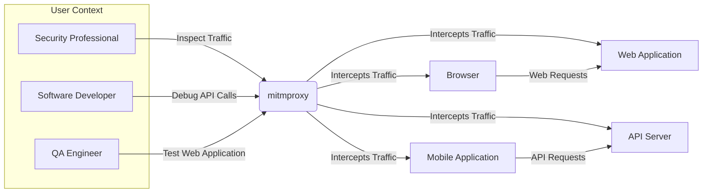
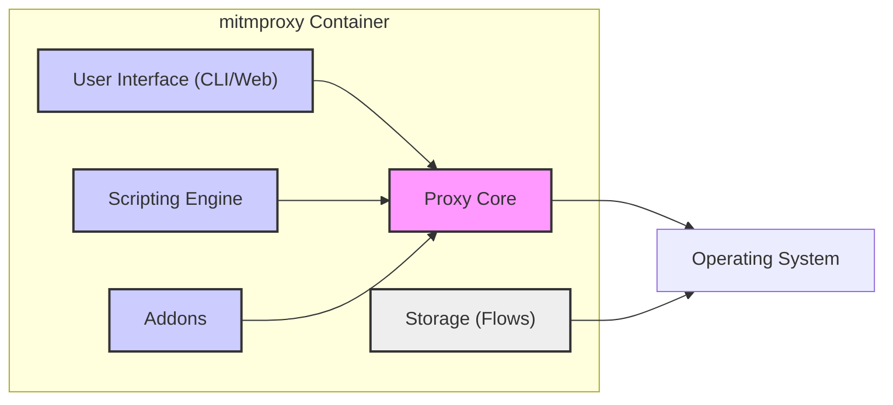
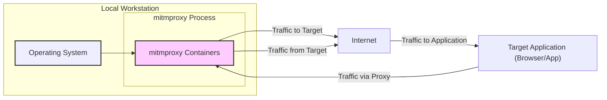
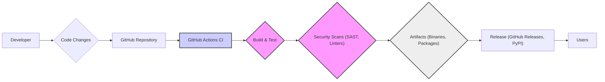

# BUSINESS POSTURE

mitmproxy is an interactive TLS-capable intercepting HTTP proxy. It is primarily used by security professionals, software developers, and QA engineers to inspect, analyze, and manipulate network traffic.

- Business Priorities and Goals:
  - Provide a powerful and flexible tool for intercepting, inspecting, and modifying HTTP/HTTPS traffic.
  - Enable users to debug, test, and secure web applications and APIs.
  - Offer a user-friendly interface and scripting capabilities for advanced traffic analysis and automation.
  - Maintain an active open-source community and project.

- Business Risks:
  - Misuse of mitmproxy for malicious purposes due to its powerful interception capabilities.
  - Security vulnerabilities in mitmproxy itself could expose users to risks if they rely on it for security testing.
  - Lack of commercial support might be a concern for enterprise users requiring guaranteed uptime and SLAs.
  - Open-source nature requires community trust and reliance on volunteer contributions for maintenance and updates.

# SECURITY POSTURE

- Security Controls:
  - security control: Open Source Security - The project is open source, allowing for community review and scrutiny of the codebase. (Implemented: GitHub Repository)
  - security control: Regular Code Reviews - Contributions are reviewed by maintainers before being merged. (Implemented: GitHub Pull Request Process)
  - security control: Issue Tracking - Public issue tracker for reporting bugs and security vulnerabilities. (Implemented: GitHub Issues)
  - security control: TLS Encryption - mitmproxy supports TLS interception and analysis, demonstrating awareness of encryption importance. (Implemented: Core Functionality)
  - security control: Input Validation - mitmproxy likely implements input validation to handle various HTTP traffic formats. (Implemented: Codebase - needs verification)
  - security control: Authorization - mitmproxy's access control is primarily based on user's system permissions to run the proxy. (Implemented: Operating System Level)

- Accepted Risks:
  - accepted risk: Reliance on community for security vulnerability discovery and patching.
  - accepted risk: Potential for vulnerabilities to exist in the codebase due to complexity of network protocol handling.
  - accepted risk: Users might misuse mitmproxy for unethical or illegal activities.
  - accepted risk: No formal security certification or penetration testing reports publicly available.

- Recommended Security Controls:
  - security control: Implement automated security scanning (SAST/DAST) in the CI/CD pipeline.
  - security control: Establish a clear vulnerability disclosure policy and process.
  - security control: Conduct periodic penetration testing by external security experts.
  - security control: Provide security hardening guidelines for mitmproxy deployments.
  - security control: Implement signed releases to ensure software integrity and prevent tampering.

- Security Requirements:
  - Authentication:
    - Requirement: mitmproxy itself does not require user authentication as it relies on the user's operating system permissions.
    - Requirement: For mitmproxy web interface (if enabled), consider adding authentication to restrict access.
  - Authorization:
    - Requirement: Authorization is primarily handled by the operating system's user permissions.
    - Requirement: Within mitmproxy scripts, implement authorization checks if sensitive operations are performed.
  - Input Validation:
    - Requirement: Rigorously validate all inputs, especially when parsing and processing network traffic (HTTP headers, bodies, etc.) to prevent injection attacks and parsing vulnerabilities.
    - Requirement: Sanitize user-provided script inputs to prevent script injection vulnerabilities.
  - Cryptography:
    - Requirement: Ensure proper and secure implementation of TLS and other cryptographic operations.
    - Requirement: Use well-vetted cryptographic libraries and avoid implementing custom cryptography.
    - Requirement: Protect private keys used for TLS interception and certificate generation.

# DESIGN

## C4 CONTEXT

- Context Diagram Elements:
  - Element:
    - Name: Security Professional
    - Type: User
    - Description: Uses mitmproxy for security testing, vulnerability analysis, and penetration testing.
    - Responsibilities: Identify security vulnerabilities in web applications and APIs. Analyze network traffic for malicious activity.
    - Security controls: Responsible for using mitmproxy ethically and legally.
  - Element:
    - Name: Software Developer
    - Type: User
    - Description: Uses mitmproxy to debug API calls, understand network interactions of applications, and troubleshoot issues.
    - Responsibilities: Debug application network behavior. Verify API requests and responses.
    - Security controls: Responsible for using mitmproxy in development and testing environments.
  - Element:
    - Name: QA Engineer
    - Type: User
    - Description: Uses mitmproxy to test web application functionality, simulate different network conditions, and verify application behavior under various scenarios.
    - Responsibilities: Test application functionality and performance. Verify correct handling of different network responses.
    - Security controls: Responsible for using mitmproxy in testing environments.
  - Element:
    - Name: mitmproxy
    - Type: System
    - Description: An interactive TLS-capable intercepting HTTP proxy. Allows users to inspect, modify, and replay network traffic.
    - Responsibilities: Intercept and forward network traffic. Provide a user interface for traffic inspection and manipulation. Offer scripting capabilities for automation.
    - Security controls: Input validation, TLS encryption, secure configuration options.
  - Element:
    - Name: Web Application
    - Type: External System
    - Description: Web applications being tested or analyzed using mitmproxy.
    - Responsibilities: Serve web content and APIs. Implement application-level security controls.
    - Security controls: Web application firewalls, input validation, authentication, authorization.
  - Element:
    - Name: API Server
    - Type: External System
    - Description: API servers being tested or analyzed using mitmproxy.
    - Responsibilities: Serve API endpoints. Implement API security controls.
    - Security controls: API gateways, authentication, authorization, rate limiting.
  - Element:
    - Name: Browser
    - Type: External System
    - Description: Web browser generating traffic that is intercepted by mitmproxy.
    - Responsibilities: Render web pages and execute client-side scripts.
    - Security controls: Browser security features, content security policy.
  - Element:
    - Name: Mobile Application
    - Type: External System
    - Description: Mobile application generating traffic that is intercepted by mitmproxy.
    - Responsibilities: Execute application logic and communicate with backend APIs.
    - Security controls: Application-level security controls, mobile OS security features.

## C4 CONTAINER

- Container Diagram Elements:
  - Element:
    - Name: Proxy Core
    - Type: Container (Python Application)
    - Description: The core engine of mitmproxy responsible for intercepting, processing, and forwarding network traffic. Handles TLS termination, HTTP parsing, and flow management.
    - Responsibilities: Network traffic interception, TLS handling, HTTP protocol processing, flow management, communication with other containers.
    - Security controls: Input validation, secure TLS configuration, memory safety in code, privilege separation (if applicable).
  - Element:
    - Name: User Interface (CLI/Web)
    - Type: Container (Python Application/Web Application)
    - Description: Provides user interfaces for interacting with mitmproxy. CLI for command-line interaction and a web interface for browser-based access.
    - Responsibilities: Present intercepted traffic to users, allow users to modify and replay traffic, provide control over proxy settings, visualize data.
    - Security controls: Input sanitization, output encoding, session management (for web UI), authorization (for web UI access - recommended).
  - Element:
    - Name: Scripting Engine
    - Type: Container (Python Interpreter)
    - Description: Executes user-provided Python scripts to extend mitmproxy functionality. Allows for custom traffic manipulation, automation, and analysis.
    - Responsibilities: Execute user scripts, provide APIs for script interaction with proxy core, manage script execution environment.
    - Security controls: Script sandboxing (if feasible), input validation for script inputs, resource limits for script execution, secure API design to prevent script from compromising the system.
  - Element:
    - Name: Addons
    - Type: Container (Python Modules)
    - Description: Collection of pre-built addons that extend mitmproxy's capabilities. Addons can provide features like traffic analysis, protocol support, and integration with other tools.
    - Responsibilities: Provide additional functionalities, extend proxy capabilities, integrate with external systems.
    - Security controls: Code review of addons, addon isolation (if possible), clear documentation of addon functionalities and potential risks.
  - Element:
    - Name: Storage (Flows)
    - Type: Container (File System/In-Memory Database)
    - Description: Stores intercepted network flows for later inspection and analysis. Can be in-memory or persisted to disk.
    - Responsibilities: Persist intercepted traffic data, provide access to stored flows, manage storage space.
    - Security controls: Access control to stored flow data, encryption of sensitive data at rest (if required), secure file handling, data sanitization before storage.
  - Element:
    - Name: Operating System
    - Type: Infrastructure
    - Description: The underlying operating system on which mitmproxy is running (e.g., Linux, macOS, Windows).
    - Responsibilities: Provide system resources, manage processes, handle file system access, network communication.
    - Security controls: OS-level security controls (firewall, access control, patching), user permissions, system hardening.

## DEPLOYMENT

Deployment Scenario: Local Workstation Deployment

This scenario describes deploying mitmproxy on a security professional's or developer's local workstation for testing and analysis.

- Deployment Diagram Elements:
  - Element:
    - Name: Local Workstation
    - Type: Environment
    - Description: The user's personal computer where mitmproxy is installed and run.
    - Responsibilities: Provide computing resources for mitmproxy, host the operating system and mitmproxy process.
    - Security controls: Operating system security controls, user account security, physical security of the workstation.
  - Element:
    - Name: Operating System
    - Type: Software
    - Description: The operating system running on the local workstation (e.g., macOS, Windows, Linux).
    - Responsibilities: Manage system resources, provide system-level security features, execute mitmproxy process.
    - Security controls: OS firewall, user access control, regular security updates, anti-malware software.
  - Element:
    - Name: mitmproxy Process
    - Type: Software Process
    - Description: The running instance of mitmproxy, containing all its containers (Proxy Core, UI, Scripting Engine, Addons, Storage).
    - Responsibilities: Intercept and process network traffic, provide user interface, execute scripts, store flows.
    - Security controls: Input validation, secure configuration, memory protection, process isolation within the OS.
  - Element:
    - Name: mitmproxy Containers
    - Type: Software Group
    - Description: The set of containers that constitute the mitmproxy application (as described in the Container Diagram).
    - Responsibilities: Collectively perform the functions of mitmproxy.
    - Security controls: Security controls implemented within each container as described in the Container Diagram section.
  - Element:
    - Name: Target Application (Browser/App)
    - Type: External System
    - Description: The application whose traffic is being intercepted by mitmproxy, running on the same or a different machine.
    - Responsibilities: Generate network traffic to be analyzed.
    - Security controls: Application-level security controls, browser/app security features.
  - Element:
    - Name: Internet
    - Type: Network
    - Description: The external network that the target application communicates with.
    - Responsibilities: Route network traffic between the target application and remote servers.
    - Security controls: Network security controls, firewalls, intrusion detection systems (outside of mitmproxy's scope).

## BUILD

- Build Process:
  - Developer:
    - Name: Developer
    - Type: Role
    - Description: Software developers contributing code to the mitmproxy project.
    - Responsibilities: Write code, fix bugs, implement new features, submit code changes.
    - Security controls: Secure coding practices, code review participation, adherence to project security guidelines.
  - Code Changes:
    - Name: Code Changes
    - Type: Artifact
    - Description: Modifications to the mitmproxy codebase submitted by developers.
    - Responsibilities: Represent new features, bug fixes, or improvements to the software.
    - Security controls: Code review process, version control (Git).
  - GitHub Repository:
    - Name: GitHub Repository
    - Type: System
    - Description: The central repository hosting the mitmproxy source code.
    - Responsibilities: Store source code, manage version history, facilitate collaboration, trigger CI/CD pipelines.
    - Security controls: Access control (GitHub permissions), branch protection rules, audit logs.
  - GitHub Actions CI:
    - Name: GitHub Actions CI
    - Type: System
    - Description: GitHub's built-in CI/CD service used to automate the build, test, and release process for mitmproxy.
    - Responsibilities: Automate build process, run tests, perform security scans, create release artifacts.
    - Security controls: Secure CI/CD configuration, access control to CI/CD workflows, secret management, build environment security.
  - Build & Test:
    - Name: Build & Test
    - Type: Process
    - Description: Compilation of the source code and execution of automated tests to ensure code quality and functionality.
    - Responsibilities: Compile code, run unit tests, run integration tests, generate build artifacts.
    - Security controls: Controlled build environment, dependency management, test coverage, vulnerability scanning of dependencies.
  - Security Scans (SAST, Linters):
    - Name: Security Scans (SAST, Linters)
    - Type: Process
    - Description: Automated security analysis of the codebase using Static Application Security Testing (SAST) tools and linters to identify potential vulnerabilities and code quality issues.
    - Responsibilities: Identify potential security vulnerabilities, enforce coding standards, improve code quality.
    - Security controls: SAST tool configuration, linter rules, vulnerability reporting, integration with CI/CD pipeline.
  - Artifacts (Binaries, Packages):
    - Name: Artifacts (Binaries, Packages)
    - Type: Artifact
    - Description: The compiled and packaged software ready for distribution (e.g., executables, Python packages).
    - Responsibilities: Represent the distributable software, be used for releases and installations.
    - Security controls: Artifact signing, integrity checks (checksums), secure artifact storage.
  - Release (GitHub Releases, PyPI):
    - Name: Release (GitHub Releases, PyPI)
    - Type: Process
    - Description: Publishing the build artifacts to distribution platforms like GitHub Releases and PyPI (Python Package Index) for users to download and install.
    - Responsibilities: Distribute software to users, manage release versions, provide release notes.
    - Security controls: Secure release process, artifact signing, secure distribution channels (HTTPS), vulnerability disclosure information.
  - Users:
    - Name: Users
    - Type: Role
    - Description: End-users who download and use mitmproxy.
    - Responsibilities: Download and install mitmproxy, use it for their intended purposes.
    - Security controls: Verify artifact integrity (signature/checksum), follow security best practices when using mitmproxy.

# RISK ASSESSMENT

- Critical Business Processes:
  - Maintaining the mitmproxy project as a valuable open-source tool for security professionals and developers.
  - Ensuring the integrity and security of mitmproxy software releases.
  - Protecting the reputation of the mitmproxy project and community.

- Data Sensitivity:
  - Source Code: Publicly available, but integrity and confidentiality of development process are important.
  - Build Artifacts: Publicly available, integrity is critical to prevent supply chain attacks.
  - User Scripts and Addons: Potentially sensitive if users create custom scripts or addons that handle sensitive data.
  - Intercepted Network Traffic (Flows): Can contain highly sensitive data (passwords, API keys, personal information, etc.). Sensitivity depends on user's usage and target applications. By default, mitmproxy users are expected to handle sensitive data with care.

# QUESTIONS & ASSUMPTIONS

- Questions:
  - Are there any specific compliance requirements (e.g., GDPR, HIPAA) that mitmproxy needs to adhere to, especially regarding the handling of intercepted data?
  - Is there a formal vulnerability disclosure policy in place for mitmproxy?
  - Are there any plans for commercial support or enterprise versions of mitmproxy in the future?
  - What is the current process for security testing and penetration testing of mitmproxy?
  - Are there any specific security certifications or audits that mitmproxy aims to achieve?

- Assumptions:
  - BUSINESS POSTURE: The primary goal is to maintain mitmproxy as a useful open-source security tool, rather than a commercially driven product.
  - SECURITY POSTURE: Security is a significant concern for the project, but resources are limited due to its open-source nature. Security controls are primarily community-driven and rely on open-source best practices.
  - DESIGN: The architecture is modular and designed for flexibility and extensibility through addons and scripting. Deployment is primarily focused on individual user workstations for testing and analysis purposes. Build process relies on GitHub Actions for automation and basic security checks.