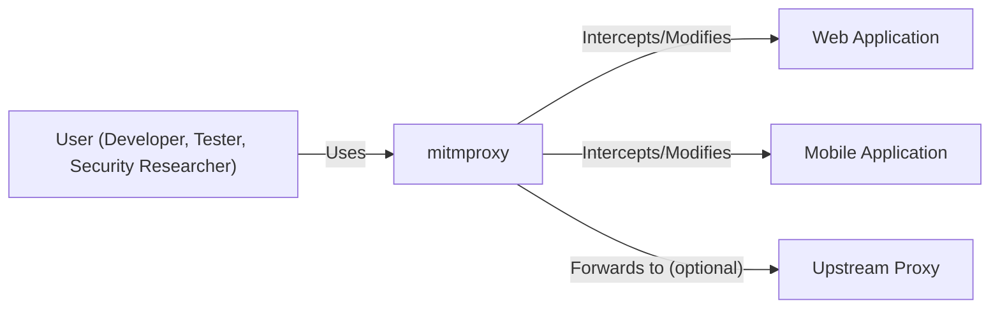
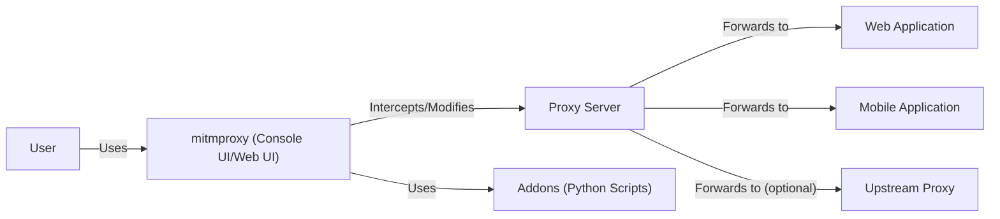
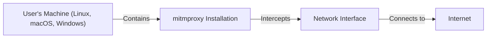
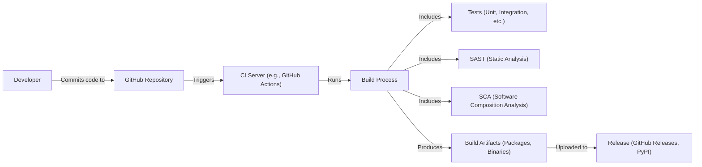

# BUSINESS POSTURE

Business Priorities and Goals:

*   Provide a free and open-source, interactive HTTPS proxy.
*   Enable developers, testers, security researchers, and privacy enthusiasts to intercept, inspect, modify, and replay web traffic.
*   Offer a versatile tool that can be used for debugging, testing, security analysis, and privacy exploration.
*   Maintain a strong community and encourage contributions.
*   Ensure the tool is easy to use and well-documented.
*   Provide cross-platform support (Linux, macOS, Windows).

Business Risks:

*   Reputational Risk: If mitmproxy is found to have severe vulnerabilities, it could damage the project's reputation and erode user trust.
*   Misuse Risk: The tool can be used for malicious purposes, such as intercepting sensitive data without consent. While this is inherent to the nature of the tool, the project must clearly state its intended use and ethical considerations.
*   Maintenance Risk: As an open-source project, maintaining the codebase, addressing security issues, and providing support relies on community contributions and dedicated maintainers. A lack of active maintenance could lead to security vulnerabilities and usability issues.
*   Legal Risk: Depending on how mitmproxy is used, there could be legal implications, particularly concerning privacy laws and regulations. The project should provide clear disclaimers and guidelines to mitigate this risk.
*   Competition Risk: Other similar tools exist, so mitmproxy needs to continuously improve and offer unique features to remain relevant.

# SECURITY POSTURE

Existing Security Controls:

*   security control: Code Reviews: The project uses GitHub's pull request system, which inherently includes code review before merging changes. (Described in contribution guidelines).
*   security control: Community Reporting: Vulnerabilities can be reported by the community, allowing for crowd-sourced security auditing. (Described in security policy).
*   security control: Static Analysis: Some level of static analysis is likely performed, although the specifics are not detailed in the provided repository overview. This is a standard practice in many open-source projects.
*   security control: Regular Updates: The project appears to be actively maintained, with regular releases, which often include security fixes.
*   security control: Documentation: Clear documentation helps users understand how to use the tool securely and avoid common pitfalls.

Accepted Risks:

*   accepted risk: Inherent Risk of Interception: The very nature of mitmproxy involves intercepting and potentially modifying HTTPS traffic. This carries inherent risks, and users must be aware of the potential consequences.
*   accepted risk: User Responsibility: The project relies on users to act responsibly and ethically when using the tool. Mitmproxy cannot fully control how users utilize its capabilities.
*   accepted risk: Limited Formal Security Audits: As an open-source project, it likely does not have the resources for frequent, comprehensive professional security audits.

Recommended Security Controls:

*   security control: Implement a comprehensive SAST (Static Application Security Testing) pipeline.
*   security control: Integrate DAST (Dynamic Application Security Testing) to identify runtime vulnerabilities.
*   security control: Establish a formal vulnerability disclosure program with clear guidelines and response procedures.
*   security control: Consider offering a bug bounty program to incentivize security researchers to find and report vulnerabilities.
*   security control: Provide security-focused documentation and best practices for users.
*   security control: Regularly conduct penetration testing, either internally or by engaging external experts.
*   security control: Implement fuzzing to test the robustness of the proxy against unexpected inputs.
*   security control: Implement supply chain security measures to protect against compromised dependencies.

Security Requirements:

*   Authentication:
    *   mitmproxy itself does not typically require authentication for basic usage. However, if mitmproxy is deployed in a shared environment, authentication mechanisms (e.g., basic auth, client certificate authentication) should be considered to restrict access.
    *   When mitmproxy interacts with upstream proxies that require authentication, it should support various authentication methods (basic, digest, NTLM, etc.).
*   Authorization:
    *   Access control should be considered if mitmproxy is used in a multi-user environment. This could involve restricting which users can intercept traffic from specific domains or modify certain requests.
*   Input Validation:
    *   mitmproxy must properly handle various HTTP headers, request methods, and encodings. It should be robust against malformed or malicious input that could cause crashes, unexpected behavior, or security vulnerabilities (e.g., buffer overflows, injection attacks).
    *   Input validation is crucial for any user-provided configuration, such as scripts or command-line options.
*   Cryptography:
    *   mitmproxy must correctly implement TLS/SSL protocols to ensure secure communication with both clients and servers.
    *   It should support a wide range of cipher suites and TLS versions, allowing users to configure the desired level of security.
    *   Proper handling of certificates and private keys is essential to prevent unauthorized interception or impersonation.
    *   The generation of certificates for on-the-fly interception should follow best practices, including using strong key lengths and appropriate validity periods.

# DESIGN

## C4 CONTEXT

Element Descriptions:

*   Element:
    *   Name: User
    *   Type: Person
    *   Description: A person who uses mitmproxy for various purposes, such as debugging, testing, security analysis, or privacy exploration.
    *   Responsibilities: Configures mitmproxy, initiates traffic interception, analyzes and potentially modifies traffic.
    *   Security controls: Uses mitmproxy responsibly and ethically, adhering to relevant laws and regulations.

*   Element:
    *   Name: mitmproxy
    *   Type: Software System
    *   Description: The core mitmproxy application, which acts as an interactive HTTPS proxy.
    *   Responsibilities: Intercepts HTTP(S) traffic, allows inspection and modification of requests and responses, provides a user interface (console UI, web UI, or API) for interaction.
    *   Security controls: Implements TLS/SSL correctly, handles certificates securely, validates input, provides options for secure configuration.

*   Element:
    *   Name: Web Application
    *   Type: Software System
    *   Description: A web application that the user interacts with through mitmproxy.
    *   Responsibilities: Serves web content to the user (via mitmproxy).
    *   Security controls: Relies on standard web security practices (HTTPS, input validation, etc.). mitmproxy's presence should not weaken the web application's inherent security.

*   Element:
    *   Name: Mobile Application
    *   Type: Software System
    *   Description: A mobile application that the user interacts with through mitmproxy.
    *   Responsibilities: Communicates with backend servers, typically using HTTP(S).
    *   Security controls: Relies on standard mobile application security practices. mitmproxy's presence should not weaken the mobile application's inherent security.

*   Element:
    *   Name: Upstream Proxy
    *   Type: Software System
    *   Description: An optional upstream proxy server that mitmproxy can forward traffic to.
    *   Responsibilities: Acts as an intermediary between mitmproxy and the target web application or mobile application backend.
    *   Security controls: Implements standard proxy security measures, potentially including authentication and authorization.

## C4 CONTAINER

Element Descriptions:

*   Element:
    *   Name: User
    *   Type: Person
    *   Description: A person who uses mitmproxy.
    *   Responsibilities: Configures mitmproxy, initiates traffic interception, analyzes and potentially modifies traffic.
    *   Security controls: Uses mitmproxy responsibly and ethically.

*   Element:
    *   Name: mitmproxy (Console UI/Web UI)
    *   Type: Container: Application
    *   Description: The user interface of mitmproxy, which can be a console-based UI or a web-based UI.
    *   Responsibilities: Provides a way for the user to interact with mitmproxy, configure settings, view and modify traffic.
    *   Security controls: Input validation, protection against XSS (in the web UI), secure communication with the proxy server component.

*   Element:
    *   Name: Proxy Server
    *   Type: Container: Application
    *   Description: The core component of mitmproxy that handles the actual proxying of HTTP(S) traffic.
    *   Responsibilities: Intercepts traffic, handles TLS/SSL termination and re-encryption, manages connections, executes addons.
    *   Security controls: Implements TLS/SSL correctly, handles certificates securely, validates input, enforces security policies.

*   Element:
    *   Name: Web Application
    *   Type: Software System
    *   Description: A web application being accessed through mitmproxy.
    *   Responsibilities: Serves web content.
    *   Security controls: Standard web security practices.

*   Element:
    *   Name: Mobile Application
    *   Type: Software System
    *   Description: A mobile application being accessed through mitmproxy.
    *   Responsibilities: Communicates with backend servers.
    *   Security controls: Standard mobile application security practices.

*   Element:
    *   Name: Upstream Proxy
    *   Type: Software System
    *   Description: An optional upstream proxy.
    *   Responsibilities: Acts as an intermediary.
    *   Security controls: Standard proxy security measures.

*   Element:
    *   Name: Addons (Python Scripts)
    *   Type: Container: Scripts
    *   Description: Python scripts that extend the functionality of mitmproxy.
    *   Responsibilities: Can modify requests and responses, implement custom logic, interact with the mitmproxy API.
    *   Security controls: Addons should be carefully reviewed for security vulnerabilities, as they can potentially introduce security risks. Input validation within addons is crucial.

## DEPLOYMENT

Possible Deployment Solutions:

1.  Local Installation: mitmproxy is installed directly on the user's machine (Linux, macOS, Windows).
2.  Docker Container: mitmproxy is run within a Docker container.
3.  Remote Server: mitmproxy is deployed on a remote server, and users connect to it remotely.
4.  Cloud Instance: mitmproxy is deployed on a cloud provider (AWS, GCP, Azure, etc.) as a virtual machine or container.

Chosen Deployment Solution (Detailed): Local Installation

Element Descriptions:

*   Element:
    *   Name: User's Machine
    *   Type: Device
    *   Description: The user's personal computer or workstation.
    *   Responsibilities: Runs the operating system and the mitmproxy installation.
    *   Security controls: Operating system security measures (firewall, antivirus, etc.), user account control.

*   Element:
    *   Name: mitmproxy Installation
    *   Type: Software
    *   Description: The mitmproxy application installed on the user's machine.
    *   Responsibilities: Intercepts and processes HTTP(S) traffic.
    *   Security controls: Relies on the security of the underlying operating system and the security measures implemented within mitmproxy itself.

*   Element:
    *   Name: Network Interface
    *   Type: Hardware/Software
    *   Description: The network interface card (NIC) or virtual network interface that connects the user's machine to the network.
    *   Responsibilities: Handles network communication.
    *   Security controls: Operating system network security settings.

*   Element:
    *   Name: Internet
    *   Type: Network
    *   Description: The global network.
    *   Responsibilities: Transports network traffic.
    *   Security controls: Relies on the security of the various networks and systems that make up the Internet.

## BUILD

The mitmproxy build process involves several steps, from development to the creation of distributable packages. While the provided repository link doesn't give full CI/CD details, we can infer a typical process and highlight security considerations.

Build Process Description:

1.  Developer: Developers write code and commit it to the GitHub repository.
2.  GitHub Repository: The central repository for the mitmproxy source code.
3.  CI Server: A continuous integration (CI) server, likely GitHub Actions (given the repository), is triggered by code commits or pull requests.
4.  Build Process: The CI server executes a build script. This typically involves:
    *   Fetching dependencies.
    *   Compiling code (if necessary).
    *   Running linters to enforce code style and identify potential issues.
    *   Running unit and integration tests.
    *   Performing static analysis security testing (SAST) to identify potential vulnerabilities in the code.
    *   Performing software composition analysis (SCA) to identify vulnerabilities in third-party dependencies.
5.  Tests: Automated tests (unit, integration, etc.) are executed to ensure code quality and functionality.
6.  SAST: Static analysis tools scan the codebase for potential security vulnerabilities.
7.  SCA: Software Composition Analysis tools scan project dependencies.
8.  Build Artifacts: If the build process is successful, it produces build artifacts, such as installation packages and binaries.
9.  Release: The build artifacts are uploaded to a release platform, such as GitHub Releases or PyPI, making them available for users to download and install.

Security Controls in Build Process:

*   security control: Code Review: Pull requests on GitHub require code review before merging, ensuring that multiple developers examine the code for potential issues, including security vulnerabilities.
*   security control: Automated Testing: Unit and integration tests help ensure that the code functions correctly and that security-related features are working as expected.
*   security control: SAST: Static analysis tools automatically scan the codebase for potential security vulnerabilities, such as buffer overflows, injection flaws, and insecure configurations.
*   security control: SCA: Software Composition Analysis tools scan project dependencies for known vulnerabilities.
*   security control: Dependency Management: The project should use a dependency management system (e.g., pip with requirements.txt or Poetry) to track and manage dependencies, making it easier to update them and address security vulnerabilities.
*   security control: Build Environment Security: The CI server and build environment should be secured to prevent unauthorized access or modification of the build process.

# RISK ASSESSMENT

Critical Business Processes to Protect:

*   Traffic Interception and Analysis: The core functionality of mitmproxy, allowing users to inspect and modify HTTP(S) traffic, must be protected from vulnerabilities that could lead to crashes, data leaks, or remote code execution.
*   Addon Execution: The ability to extend mitmproxy with Python addons is a key feature, but it also introduces a potential attack vector. The addon execution environment must be secure to prevent malicious addons from compromising the system.
*   User Interface: The console and web UIs must be protected from vulnerabilities that could allow attackers to gain control of mitmproxy or access sensitive information.

Data to Protect and Sensitivity:

*   Intercepted Traffic Data: This is the most sensitive data handled by mitmproxy. It can include:
    *   Plaintext HTTP requests and responses.
    *   HTTPS requests and responses (after TLS decryption by mitmproxy).
    *   Authentication credentials (usernames, passwords, API keys).
    *   Session cookies.
    *   Personal data.
    *   Sensitive business data.
    *   Sensitivity: Extremely High. This data must be protected from unauthorized access, disclosure, and modification.
*   mitmproxy Configuration Data: This includes settings, scripts, and other configuration files.
    *   Sensitivity: High. Compromise of configuration data could allow attackers to control mitmproxy's behavior or gain access to sensitive information.
*   User-Provided Scripts (Addons): These scripts can contain sensitive logic or interact with sensitive data.
    *   Sensitivity: High. Malicious or vulnerable addons could compromise the entire system.

# QUESTIONS & ASSUMPTIONS

Questions:

*   What specific SAST and SCA tools are currently used (or planned to be used) in the build process?
*   Are there any existing security audits or penetration testing reports for mitmproxy?
*   What is the process for handling security vulnerabilities reported by the community?
*   Are there any specific compliance requirements (e.g., GDPR, HIPAA) that mitmproxy needs to consider?
*   What level of support is provided for different TLS versions and cipher suites?
*   What are the specific mechanisms for handling certificate generation and management?
*   How are addons sandboxed or isolated to prevent them from interfering with the core proxy functionality or accessing sensitive data?
*   What is the long-term plan for maintaining and securing mitmproxy?

Assumptions:

*   BUSINESS POSTURE: The project prioritizes being free and open-source, with a strong community focus.
*   BUSINESS POSTURE: The project has a moderate risk appetite, balancing the need for features and usability with security concerns.
*   SECURITY POSTURE: The project relies heavily on community contributions for security auditing and vulnerability reporting.
*   SECURITY POSTURE: The project uses standard open-source security practices but may not have the resources for extensive formal security audits.
*   DESIGN: The primary deployment model is local installation on the user's machine.
*   DESIGN: The build process uses a CI server (likely GitHub Actions) with some level of automated testing and security scanning.
*   DESIGN: Addons are executed within the mitmproxy process, with some level of isolation (though the specifics are unclear).