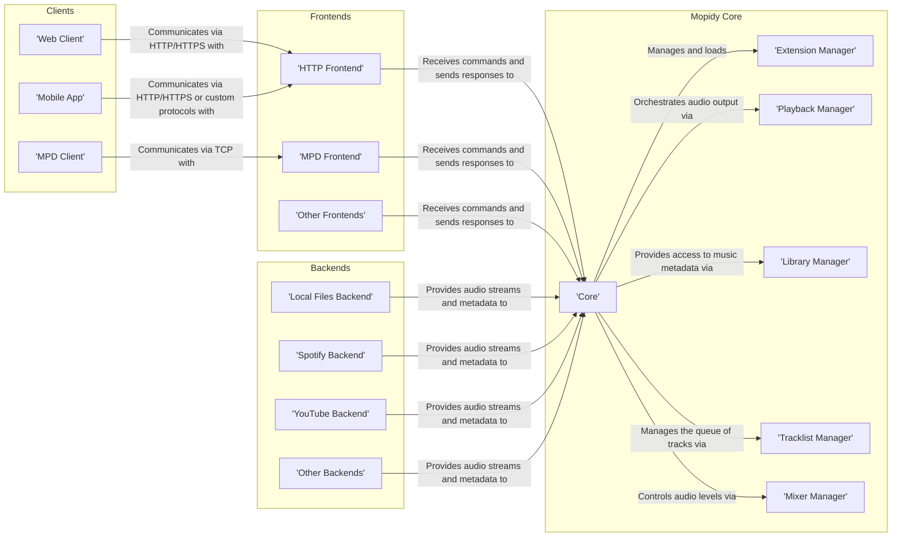
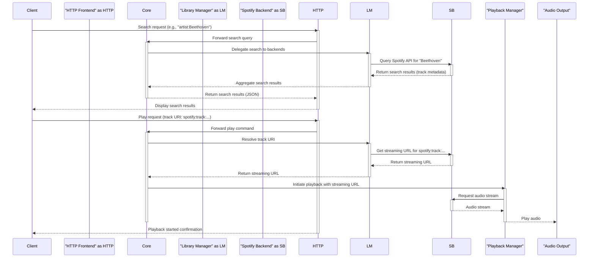

# Project Design Document: Mopidy Music Server

**Version:** 1.1
**Date:** October 26, 2023
**Author:** AI Software Architect

## 1. Introduction

This document provides a detailed design overview of the Mopidy music server project, intended for use in subsequent threat modeling activities. Mopidy is an extensible music server that aggregates audio from various sources, including local files and streaming services, presenting a unified interface. This document details the system's architecture, key components, data flow, and technologies, emphasizing aspects relevant to security analysis.

## 2. Goals and Objectives

*   Provide a clear and comprehensive architectural blueprint of Mopidy.
*   Identify and describe the core components and their interactions, focusing on trust boundaries and data exchange.
*   Illustrate the flow of data through the system, highlighting potential points of vulnerability.
*   Document the technologies and protocols employed, which influence the attack surface.
*   Serve as a foundational document for identifying potential security threats and vulnerabilities during threat modeling exercises.

## 3. High-Level Architecture

Mopidy's architecture is centered around a core system that manages various functionalities through a plugin-based extension system. This allows for a modular design where frontends provide user interfaces, and backends integrate with different music sources.

## 4. Detailed Design

### 4.1. Core Components

*   **Core:** The central orchestrator of Mopidy, responsible for managing all other components and handling requests. It represents a significant trust boundary.
    *   **Functionality:**
        *   Receives and routes commands from frontends.
        *   Delegates tasks such as library browsing, playback control, and tracklist management to respective managers.
        *   Maintains the overall state of the music server.
    *   **Interfaces:** Internal Python APIs for communication with other core components and extensions. These APIs define the internal trust relationships.
    *   **Data Storage:** Primarily in-memory state. Configuration settings are loaded from files at startup.

*   **Extension Manager:** Responsible for discovering, loading, and managing Mopidy extensions. This component handles potentially untrusted code.
    *   **Functionality:**
        *   Discovers available extensions based on configured paths and package metadata.
        *   Loads and initializes extensions, executing their code within the Mopidy process.
        *   Provides a registry of loaded extensions and their capabilities.
        *   Handles extension configuration, potentially including sensitive information.
    *   **Interfaces:** Python APIs for extension registration, interaction, and configuration.
    *   **Data Storage:** Configuration data for extensions, typically read from configuration files. This data can include API keys and credentials.

*   **Playback Manager:** Manages the audio playback process, interacting with backends to retrieve and play audio streams.
    *   **Functionality:**
        *   Manages the current playback state (playing, paused, stopped).
        *   Controls playback parameters such as position, volume, and repeat/random modes.
        *   Interacts with backends to fetch audio streams based on track URIs.
        *   Handles audio output through configured audio sinks.
    *   **Interfaces:** Python APIs for controlling playback actions.
    *   **Data Storage:** Current playback state, including the currently playing track and playback position.

*   **Library Manager:** Provides a unified interface to the music library aggregated from various backends.
    *   **Functionality:**
        *   Handles search queries across all enabled backends.
        *   Allows browsing of the music library structure provided by backends.
        *   Retrieves metadata for music items (tracks, albums, artists) from backends.
        *   Caches metadata to improve performance.
    *   **Interfaces:** Python APIs for accessing library data.
    *   **Data Storage:** Cached metadata retrieved from backends. The integrity and freshness of this cache are important.

*   **Tracklist Manager:** Manages the ordered list of tracks to be played (the tracklist or queue).
    *   **Functionality:**
        *   Adds, removes, and reorders tracks in the tracklist.
        *   Provides methods for manipulating the tracklist (e.g., shuffling, clearing).
        *   May support playlist persistence through extensions.
    *   **Interfaces:** Python APIs for manipulating the tracklist.
    *   **Data Storage:** The current tracklist in memory.

*   **Mixer Manager:** Controls the audio output volume, potentially interacting with system-level audio mixers.
    *   **Functionality:**
        *   Gets and sets the volume level.
        *   May interact with hardware or software mixers through system APIs.
    *   **Interfaces:** Python APIs for controlling the mixer.
    *   **Data Storage:** Current volume level.

### 4.2. Frontends

Frontends act as the interface between clients and the Mopidy core, translating client requests into actions within the system.

*   **HTTP Frontend:** Provides a RESTful API, often serving a web-based user interface. This is a primary entry point for external interaction.
    *   **Functionality:**
        *   Receives commands via HTTP requests (GET, POST, PUT, DELETE).
        *   Serializes responses in formats like JSON.
        *   May serve static files for a web UI, potentially introducing vulnerabilities if not handled carefully.
        *   Often includes features for authentication and authorization.
    *   **Interfaces:** HTTP/HTTPS. The security of this interface depends on proper implementation of authentication, authorization, and transport security.
    *   **Data Storage:** Session data (if implemented), which needs secure management.

*   **MPD Frontend:** Implements the Music Player Daemon (MPD) protocol, allowing interaction with a wide range of MPD clients.
    *   **Functionality:**
        *   Listens for connections on a specified TCP port.
        *   Parses and executes commands according to the MPD protocol.
        *   Sends responses in the MPD protocol format. The MPD protocol itself has known security limitations.
    *   **Interfaces:** TCP sockets. Security relies on network access controls as the protocol itself offers limited security features.
    *   **Data Storage:** None.

*   **Other Frontends:** Extensions can provide additional frontends, such as:
    *   **WebSocket Frontend:** For real-time bidirectional communication, requiring careful handling of connections and data.
    *   **gRPC Frontend:** For high-performance communication, which needs secure configuration and authentication.

### 4.3. Backends

Backends provide the actual access to music sources, handling authentication and data retrieval for specific services or local files.

*   **Local Files Backend:** Plays audio files stored on the local filesystem. Access control and file permissions are critical here.
    *   **Functionality:**
        *   Scans configured directories for audio files.
        *   Reads metadata from audio files using libraries like TagLib.
        *   Provides audio streams for playback by reading file contents.
    *   **Interfaces:** Filesystem access. Vulnerable to path traversal and unauthorized file access if not implemented correctly.
    *   **Data Storage:** Caches metadata of local files.

*   **Streaming Service Backends (e.g., Spotify, YouTube):** Integrate with online music streaming services, requiring secure handling of API keys and user credentials.
    *   **Functionality:**
        *   Authenticates with the streaming service using API keys, OAuth tokens, or other credentials.
        *   Searches for music on the service's platform.
        *   Retrieves metadata and streaming URLs for tracks.
        *   Handles playback of streaming audio.
    *   **Interfaces:** APIs of the respective streaming services (e.g., Spotify Web API, YouTube Data API). Security depends on the secure storage and use of API keys and tokens.
    *   **Data Storage:** May cache metadata and authentication tokens. Secure storage of these tokens is crucial.

*   **Other Backends:** Extensions can provide access to other audio sources, such as:
    *   **Internet Radio Backends:** Streaming audio from internet radio stations.
    *   **Podcast Backends:** Downloading and playing podcast episodes.

### 4.4. Clients

Clients are applications that interact with Mopidy through its frontends. Their security posture can impact the overall security of the Mopidy instance.

*   **Web Client:** A browser-based user interface, subject to typical web application security concerns (e.g., XSS, CSRF).
*   **MPD Client:** Applications using the MPD protocol.
*   **Mobile Apps:** Native or hybrid applications, which may have their own vulnerabilities.

## 5. Data Flow

Understanding the data flow is crucial for identifying potential points where data can be intercepted, modified, or exposed.

Key data flows and security considerations:

*   **User Commands:** Transmitted from clients to frontends. Security depends on the frontend's authentication and authorization mechanisms and the transport security (HTTPS).
*   **Search Queries:** Passed from frontends to the Core and then to backends. Sensitive information might be included in search terms.
*   **Library Metadata:** Retrieved from backends and cached by the Library Manager. The integrity of this data is important.
*   **Track URIs:** Used to identify and request specific tracks. Their format and handling can have security implications.
*   **Streaming URLs:** Obtained from backends and used by the Playback Manager. These URLs might be time-limited or require authentication.
*   **Audio Streams:** Transmitted from backends to the Playback Manager. The security of these streams depends on the backend and the protocols used.
*   **Credentials and API Keys:** Used by backends to authenticate with external services. Secure storage and handling are paramount.

## 6. Key Technologies

*   **Programming Language:** Python - vulnerabilities in Python or its libraries can affect Mopidy.
*   **Web Framework (for HTTP Frontend):** Typically Flask or Tornado - security best practices for these frameworks must be followed.
*   **MPD Protocol:** A text-based protocol with inherent security limitations.
*   **Audio Handling:** Relies on system-level audio libraries and potentially GStreamer - vulnerabilities in these components can be exploited.
*   **Communication Protocols:** HTTP/HTTPS, TCP, WebSockets, gRPC - each with its own security considerations.
*   **Data Serialization:** JSON, MPD protocol format - vulnerabilities in parsing these formats can be exploited.
*   **Extension Mechanism:** Python's setuptools entry points - allows for dynamic loading of code, posing a security risk if extensions are not trusted.

## 7. Deployment Considerations

The deployment environment significantly impacts the security posture of Mopidy.

*   **Local Machine:** Security relies on the user's system security.
*   **Server:** Requires careful configuration of firewalls, access controls, and user permissions.
*   **Containerized (Docker):** Provides isolation but requires secure container image management and configuration.
*   **Embedded Systems:** Resource constraints may limit available security measures.

Configuration aspects relevant to security:

*   **Backend Credentials:** Secure storage and management of API keys and passwords.
*   **Frontend Bind Address and Port:** Limiting network exposure.
*   **TLS/SSL Configuration:** Ensuring secure communication over HTTPS.
*   **Extension Whitelisting/Blacklisting:** Controlling which extensions are loaded.

## 8. Security Considerations

This section expands on potential security concerns, providing a more detailed perspective for threat modeling.

*   **Authentication and Authorization:**
    *   **HTTP Frontend:** How are users authenticated (e.g., basic auth, API keys, OAuth)? Are credentials transmitted securely? Is authorization implemented to control access to specific API endpoints and functionalities?
    *   **MPD Frontend:** Lacks built-in authentication. Security relies on network access controls.
    *   **Extension APIs:** How are extension-provided APIs secured?
*   **Input Validation:**
    *   **HTTP API:** Are all inputs validated to prevent injection attacks (e.g., command injection, cross-site scripting in web UI)?
    *   **MPD Protocol:** How are MPD commands parsed and validated to prevent command injection?
    *   **Backend Responses:** Is data received from backends validated to prevent unexpected behavior or vulnerabilities?
*   **Communication Security:**
    *   **HTTP/HTTPS:** Is HTTPS enforced? Is TLS configuration secure?
    *   **MPD:** Communication is unencrypted. Susceptible to eavesdropping and man-in-the-middle attacks on untrusted networks.
    *   **WebSockets/gRPC:** Are these protocols configured securely with appropriate authentication and encryption?
*   **Extension Security:**
    *   **Code Review:** Are extensions reviewed for security vulnerabilities before installation?
    *   **Sandboxing:** Is there any sandboxing or isolation of extension code to limit the impact of vulnerabilities?
    *   **Permissions:** What permissions do extensions have within the Mopidy process? Can they access sensitive data or perform privileged operations?
*   **Data Storage Security:**
    *   **Credentials:** How are API keys, OAuth tokens, and other credentials stored (e.g., in configuration files)? Are they encrypted at rest?
    *   **Session Data:** If the HTTP frontend stores session data, how is it protected?
    *   **Cached Data:** Does cached metadata contain sensitive information that needs protection?
*   **Dependency Management:**
    *   Are dependencies regularly updated to patch known vulnerabilities?
    *   Is there a process for tracking and addressing security vulnerabilities in dependencies?
*   **Denial of Service:**
    *   Are there rate limiting mechanisms in place to prevent abuse of the HTTP API or other interfaces?
    *   Can malicious clients overload the server with requests?
*   **Information Disclosure:**
    *   Do error messages or logs expose sensitive information?
    *   Are API responses filtered to prevent the disclosure of unnecessary data?

## 9. Future Considerations

*   **Enhanced Authentication and Authorization:** Implementing more robust and modern authentication mechanisms like OAuth 2.0 for the HTTP Frontend.
*   **Secure MPD Protocol Extension:** Exploring options for securing the MPD protocol or providing secure alternatives.
*   **Extension Sandboxing:** Implementing a more robust sandboxing mechanism for extensions to limit their access and potential impact.
*   **Improved Credential Management:**  Adopting secure credential storage mechanisms like dedicated secrets management solutions.
*   **Comprehensive Auditing and Logging:** Implementing detailed logging of security-related events for monitoring and incident response.

This improved design document provides a more detailed and security-focused overview of the Mopidy music server. It highlights key components, data flows, and technologies, emphasizing aspects critical for identifying and mitigating potential security risks during threat modeling.
