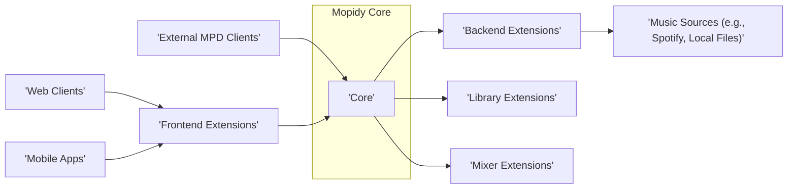
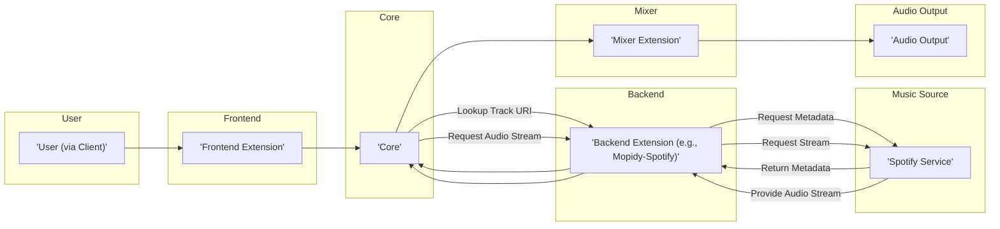
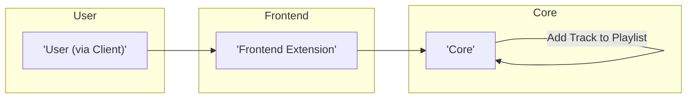
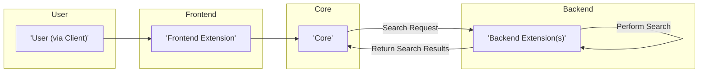

## Project Design Document: Mopidy Music Server

**Version:** 1.1
**Date:** October 26, 2023
**Author:** AI Software Architect

### 1. Project Overview

Mopidy is an extensible music server application written in Python. It acts as an aggregator and router for music from various sources, allowing users to control playback through different client interfaces. Its core functionality is intentionally minimal, with most features provided by extensions. This design document outlines the architecture and key components of Mopidy to facilitate threat modeling activities.

### 2. Goals

*   Provide a comprehensive and unambiguous description of the Mopidy architecture, focusing on components and their interactions.
*   Clearly identify the responsibilities of each key component.
*   Illustrate common data flow scenarios within the system using diagrams.
*   Highlight potential security considerations and attack surfaces relevant for threat modeling.

### 3. Non-Goals

*   In-depth analysis of the implementation details within individual extensions.
*   Specific instructions for deployment, configuration, or operation of Mopidy.
*   A complete catalog of all available Mopidy extensions.
*   Performance metrics or scalability analysis.

### 4. High-Level Architecture

Mopidy employs a plugin-based architecture where the core provides fundamental services, and extensions contribute specific functionalities. This modular design allows for a wide range of supported music sources and client interfaces.

**Key Components:**

*   **Mopidy Core:** The central engine of Mopidy, responsible for managing extensions, routing commands, and maintaining the overall state of the music server.
*   **Frontend Extensions:** Provide interfaces for users to interact with Mopidy. They translate user actions into commands for the Core.
*   **Backend Extensions:** Implement the logic for accessing and interacting with different music sources. They handle tasks like authentication, searching, and streaming.
*   **Library Extensions:** Offer access to music library data, often providing search and metadata retrieval capabilities.
*   **Mixer Extensions:** Control the audio output, including volume and potentially audio routing.
*   **External MPD Clients:** Applications that communicate with Mopidy using the standard MPD (Music Player Daemon) protocol.
*   **Web Clients:** Web browsers interacting with Mopidy through a web frontend extension, typically using HTTP and potentially WebSockets.
*   **Mobile Apps:** Native or hybrid applications that communicate with Mopidy, often through a REST API provided by a frontend extension.
*   **Music Sources:** External services or local storage where music content resides.

### 5. Component Details

This section elaborates on the responsibilities and interactions of each key component.

*   **Mopidy Core:**
    *   **Extension Management:** Loads, initializes, and manages the lifecycle of all installed extensions.
    *   **Command Routing:** Receives commands from frontend extensions and routes them to the appropriate backend or other extensions.
    *   **Event Handling:** Provides an event bus for inter-component communication, allowing extensions to subscribe to and publish events.
    *   **State Management:** Maintains the current playback state (playing, paused, stopped), playlist, and track information.
    *   **API Provision:** Offers a Python API that extensions use to interact with the Core and other extensions.

*   **Frontend Extensions:**
    *   **User Interface:** Present a user interface for controlling Mopidy's functionality.
    *   **Protocol Implementation:** Implement specific communication protocols (e.g., MPD, HTTP REST API, WebSockets).
    *   **Command Translation:** Translate user actions (e.g., button clicks, API calls) into commands understood by the Mopidy Core.
    *   **Examples:**
        *   **MPD Frontend:** Listens on a TCP port for MPD client connections and handles MPD protocol commands.
        *   **HTTP Frontend (e.g., Mopidy-Web):**  Provides a web server serving a user interface and potentially a REST API for control.

*   **Backend Extensions:**
    *   **Music Source Integration:** Implement the necessary logic to interact with a specific music source.
    *   **Authentication and Authorization:** Handle authentication and authorization with external services (e.g., OAuth for Spotify).
    *   **Metadata Retrieval:** Fetch track metadata (artist, title, album, duration, etc.) from the music source.
    *   **Audio Streaming:** Provide audio streams for playback, often handling streaming protocols and formats.
    *   **Search Functionality:** Implement search capabilities within the specific music source.
    *   **Examples:**
        *   **Mopidy-Spotify:** Interacts with the Spotify service via its API.
        *   **Mopidy-Local:** Provides access to music files stored on the local file system.
        *   **Mopidy-SoundCloud:** Integrates with the SoundCloud platform.

*   **Library Extensions:**
    *   **Music Library Access:** Provide a unified interface for accessing music library data, potentially from multiple sources.
    *   **Search Indexing:** May maintain an index of music metadata for efficient searching.
    *   **Metadata Caching:** Can cache metadata locally to improve performance.
    *   **Examples:**
        *   **Mopidy-Local-SQLite:** Uses a SQLite database to index local music files.

*   **Mixer Extensions:**
    *   **Audio Output Control:** Manage the audio output device.
    *   **Volume Control:** Allow setting and adjusting the volume.
    *   **Audio Routing (Optional):** May provide capabilities for routing audio to different outputs.
    *   **Example:**
        *   **Mopidy-Softwaremixer:** Implements software-based volume control.

### 6. Data Flow

This section illustrates common data flow scenarios within Mopidy.

#### 6.1 Playing a Track from a Remote Source (e.g., Spotify)

#### 6.2 Adding a Track to the Playlist

#### 6.3 Searching for Music

### 7. Security Considerations

This section outlines potential security considerations and attack surfaces within the Mopidy architecture, relevant for threat modeling.

*   **Extension Security:**
    *   **Untrusted Code Execution:** Malicious or poorly written extensions could execute arbitrary code on the server, potentially compromising the entire system.
    *   **API Abuse:** Extensions might exploit Mopidy's internal APIs to perform unauthorized actions or access sensitive data.
    *   **Dependency Vulnerabilities:** Extensions may rely on third-party libraries with known vulnerabilities.
    *   **Data Exposure:** Extensions could inadvertently or maliciously expose sensitive data handled by Mopidy.

*   **Frontend Security:**
    *   **Web Frontend Vulnerabilities:** HTTP frontend extensions are susceptible to common web vulnerabilities like Cross-Site Scripting (XSS), Cross-Site Request Forgery (CSRF), and injection attacks if not properly secured.
    *   **MPD Protocol Weaknesses:**  While the MPD protocol itself is relatively simple, vulnerabilities could arise in its implementation within the frontend extension. Lack of authentication or encryption in default MPD configurations is a concern.
    *   **Authentication and Authorization:** Weak or missing authentication and authorization mechanisms in frontend extensions can allow unauthorized access and control.

*   **Backend Security:**
    *   **Credential Management:** Secure storage and handling of credentials for accessing external music services (e.g., API keys, OAuth tokens) is crucial.
    *   **API Security of Music Sources:** Vulnerabilities in the APIs of integrated music services could be exploited through backend extensions.
    *   **Data Injection:** Backend extensions might be vulnerable to data injection attacks when interacting with music sources.

*   **Core Security:**
    *   **Event Bus Security:**  If not properly controlled, the event bus could be a vector for malicious extensions to interfere with other components.
    *   **Resource Exhaustion:** Malicious actors could try to exhaust system resources by sending excessive requests.

*   **Communication Security:**
    *   **Lack of Encryption:** Communication between clients and frontend extensions (especially web frontends) should ideally be encrypted using HTTPS. Communication with external services should also use secure protocols.
    *   **MPD Protocol Encryption:** The MPD protocol, by default, is unencrypted.

*   **Configuration Security:**
    *   **Insecure Defaults:** Default configurations might have security weaknesses.
    *   **Exposure of Configuration Files:** Improperly protected configuration files could reveal sensitive information.

### 8. Technologies Used

*   **Programming Language:** Python
*   **Extension Mechanism:** Python's setuptools entry points
*   **Inter-Component Communication:** Internal event bus (using Pykka)
*   **Frontend Protocols:** MPD (TCP), HTTP (potentially WebSockets)
*   **Backend Interactions:** Varies depending on the music source (e.g., REST APIs, SDKs, file system access)
*   **Data Storage (Optional):** SQLite (commonly used by library extensions for caching)
*   **Audio Handling:** GStreamer framework (for audio decoding and output)

This improved design document provides a more detailed and structured overview of the Mopidy architecture, enhancing its usefulness for threat modeling activities. The explicit identification of components, their responsibilities, and data flow scenarios, along with specific security considerations, will aid in identifying potential vulnerabilities and attack vectors.