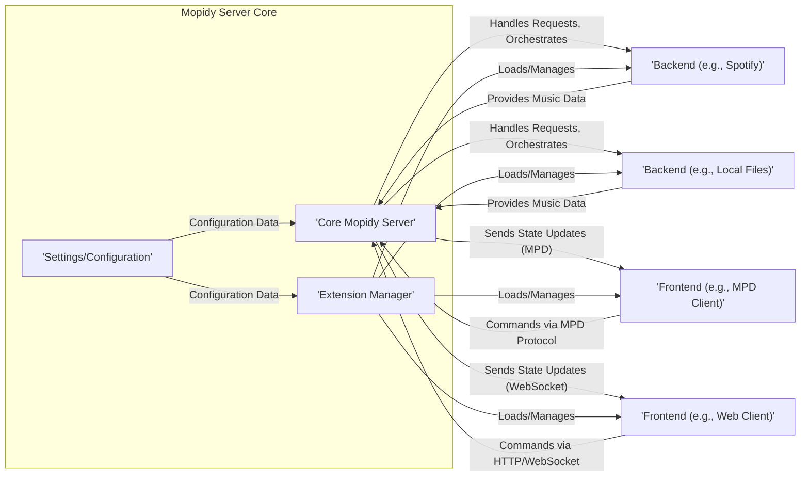
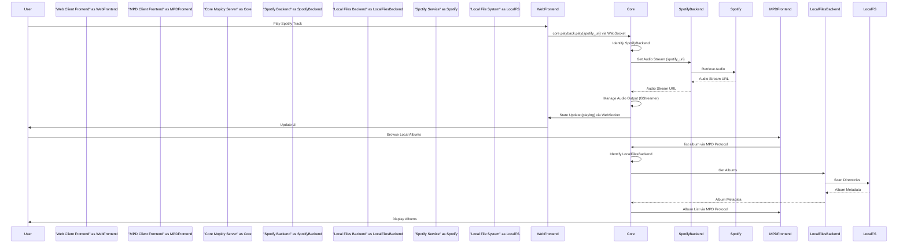

## Project Design Document: Mopidy Music Server (Improved)

**1. Introduction**

This document provides an enhanced and more detailed design overview of the Mopidy music server project. It elaborates on the system's architecture, key components, data flow, and security considerations, aiming to provide a robust foundation for subsequent threat modeling activities.

**2. Goals**

*   Deliver a refined and more comprehensive architectural overview of the Mopidy music server.
*   Provide greater detail on the responsibilities and interactions of key components.
*   Clarify the data flow within the system with more specific examples.
*   Enhance the identification of potential security considerations, categorizing them for better understanding during threat modeling.

**3. Scope**

This document encompasses the core architecture of the Mopidy server and its primary extension points, focusing on the interactions between the core server, frontends, and backends. While it still avoids deep dives into specific frontend or backend implementations, it provides more context and examples to illustrate the core architectural principles.

**4. High-Level Architecture**

Mopidy's plugin-based architecture enables extensibility and customization. The core server acts as the central hub, providing logic and an API. Frontends manage user interaction, and backends interface with various music sources.

**5. Component Details**

*   **Core Mopidy Server:**
    *   The central processing unit of the music server.
    *   Manages the overall playback state (playing, paused, stopped), the current playlist, and the music library (aggregated from backends).
    *   Provides a well-defined API for frontends to send commands and receive status updates.
    *   Orchestrates interactions between frontends and backends, routing requests appropriately.
    *   Emits events to notify frontends about changes in playback state, track information, and other relevant occurrences.

*   **Extension Manager:**
    *   Responsible for discovering, loading, initializing, and managing extensions (both frontends and backends).
    *   Handles dependencies between extensions, ensuring that required components are available.
    *   Provides a registration mechanism for extensions to expose their functionality to the core and other extensions.
    *   Manages the lifecycle of extensions, including starting, stopping, and reloading them.

*   **Settings/Configuration:**
    *   Stores all configuration parameters for the Mopidy server and its extensions.
    *   Typically loaded from configuration files (e.g., `mopidy.conf`) upon server startup.
    *   Provides an API for accessing and potentially modifying settings (though direct modification is less common during runtime).
    *   Includes settings for enabling/disabling extensions, configuring backend accounts, network settings, and more.

*   **Frontend:**
    *   Provides the user interface through which users interact with Mopidy.
    *   Examples include:
        *   **MPD (Music Player Daemon) Clients:** Utilize a text-based protocol over TCP to send commands and receive status.
        *   **Web Clients:** Browser-based interfaces communicating via HTTP for initial page load and WebSockets for real-time updates and commands.
        *   **Mobile Apps:** Applications using custom protocols or existing Mopidy APIs to interact with the server.
    *   Translates user actions into commands for the Core Mopidy Server.
    *   Receives and displays state updates and data from the Core Mopidy Server to the user.

*   **Backend:**
    *   Provides the interface to specific music sources.
    *   Examples include:
        *   **Spotify Backend:** Connects to the Spotify streaming service using their API, handling authentication and playback.
        *   **Local Files Backend:** Accesses and plays music files stored on the server's local file system.
        *   **SoundCloud Backend:** Integrates with the SoundCloud streaming platform.
        *   **Internet Archive Backend:** Allows access to audio content from the Internet Archive.
        *   **TuneIn Backend:** Provides access to internet radio streams.
    *   Handles authentication and authorization with the respective music source, securely managing credentials.
    *   Retrieves metadata about tracks, albums, and artists from the source.
    *   Provides the actual audio stream data to the Core Mopidy Server for playback.

**6. Data Flow**

The following details the typical data flow patterns within the Mopidy system, providing more specific examples:

*   **User Initiated Playback of a Spotify Track:**
    1. A user interacts with a **Web Client Frontend**, clicking the "play" button for a Spotify track.
    2. The **Web Client Frontend** sends a command (e.g., `core.playback.play`, with the Spotify track URI) to the **Core Mopidy Server** via a WebSocket message.
    3. The **Core Mopidy Server** parses the command and identifies the **Spotify Backend** as the relevant source based on the track URI.
    4. The **Core Mopidy Server** requests the audio stream for the specified track from the **Spotify Backend**.
    5. The **Spotify Backend** authenticates with the Spotify service (if necessary) and retrieves the audio stream URL or data.
    6. The **Spotify Backend** provides the audio stream (or a URL to it) to the **Core Mopidy Server**.
    7. The **Core Mopidy Server** utilizes a multimedia framework (like GStreamer) to handle the audio output.
    8. The **Core Mopidy Server** sends a state update (e.g., `state: "playing"`, current track information) to the **Web Client Frontend** via a WebSocket message.
    9. The **Web Client Frontend** updates the user interface to reflect the playing status and track details.

*   **Browsing the Local Files Library:**
    1. A user interacts with an **MPD Client**, sending a command to browse the library.
    2. The **MPD Client** sends a browse request (e.g., `list album`) to the **Core Mopidy Server** via the MPD protocol.
    3. The **Core Mopidy Server** identifies the **Local Files Backend** as the relevant source for local files.
    4. The **Core Mopidy Server** requests a list of albums from the **Local Files Backend**.
    5. The **Local Files Backend** scans the configured local music directories and retrieves metadata about the albums.
    6. The **Local Files Backend** returns the album metadata to the **Core Mopidy Server**.
    7. The **Core Mopidy Server** formats the results according to the MPD protocol.
    8. The **Core Mopidy Server** sends the library data back to the **MPD Client**.
    9. The **MPD Client** displays the list of albums to the user.

*   **Mopidy Startup and Extension Loading:**
    1. When Mopidy starts, the **Core Mopidy Server** reads the configuration from the **Settings/Configuration**.
    2. The **Core Mopidy Server** initializes the **Extension Manager**.
    3. The **Extension Manager** uses the configuration to identify enabled frontends and backends.
    4. The **Extension Manager** loads the code for each enabled extension.
    5. Extensions register their functionality (e.g., backend capabilities, frontend API endpoints) with the **Core Mopidy Server**.

**7. Security Considerations**

This section outlines potential security considerations, categorized for clarity during threat modeling.

*   **Frontend Security:**
    *   **Authentication and Authorization:**
        *   How are users authenticated to interact with Mopidy via different frontends? Are strong authentication mechanisms used?
        *   How is authorization enforced? Can any connected client perform any action?
        *   Are there vulnerabilities related to session management or token handling?
    *   **Input Validation:**
        *   Are inputs from frontends (commands, search queries, etc.) properly validated to prevent command injection or other injection attacks?
        *   Are there vulnerabilities related to handling malformed or unexpected input?
    *   **Web Frontend Specific:**
        *   **Cross-Site Scripting (XSS):** Are there vulnerabilities that could allow attackers to inject malicious scripts into the web interface?
        *   **Cross-Site Request Forgery (CSRF):** Can attackers trick authenticated users into performing unintended actions on the Mopidy server?
        *   **Insecure Direct Object References (IDOR):** Can users access or manipulate resources they shouldn't have access to by modifying IDs in requests?
    *   **MPD Protocol Specific:**
        *   Is the MPD protocol itself secure? Are there known vulnerabilities?
        *   Is access to the MPD port restricted?

*   **Backend Security:**
    *   **Authentication and Authorization with Music Sources:**
        *   How are credentials (API keys, usernames/passwords, OAuth tokens) for external services like Spotify stored and managed securely?
        *   Are there risks of credential leakage or unauthorized access to music service accounts?
    *   **API Key Management:**
        *   If backends use API keys for external services, how are these keys protected from exposure?
        *   Are there mechanisms to rotate or revoke API keys if compromised?
    *   **Data Security:**
        *   How is sensitive data retrieved from music sources handled and stored (e.g., user playlists, account information)?
        *   Are there risks of data breaches or unauthorized access to cached data?
    *   **Rate Limiting and Abuse:**
        *   Are backends susceptible to abuse by making excessive requests to external services, potentially leading to account suspension or service disruption?

*   **Core Mopidy Server Security:**
    *   **Extension Security:**
        *   Can malicious extensions compromise the server or other extensions?
        *   Is there sufficient isolation or sandboxing for extensions?
        *   How are extension permissions managed? Can an extension access arbitrary system resources?
        *   Are there vulnerabilities in the extension loading or management process?
    *   **Configuration Security:**
        *   Is the configuration file protected from unauthorized access or modification?
        *   Does the configuration file contain sensitive information (e.g., API keys, passwords)?
        *   Are there default or insecure configurations that could be exploited?
    *   **Network Security:**
        *   Is communication between frontends and the core server encrypted (e.g., using HTTPS for web clients, secure connections for MPD)?
        *   Are there vulnerabilities related to network protocols or open ports?
        *   Is the server susceptible to Denial of Service (DoS) attacks?
    *   **Logging and Monitoring:**
        *   Are security-related events logged adequately?
        *   Are there mechanisms for monitoring the server for suspicious activity?
    *   **Error Handling:**
        *   Are errors handled gracefully to avoid revealing sensitive information or internal system details to attackers?
    *   **Dependency Management:**
        *   Are the dependencies of Mopidy and its extensions kept up-to-date with security patches?
        *   Are there vulnerabilities in third-party libraries used by Mopidy?

**8. Technologies Used**

*   **Core Programming Language:** Python
*   **Plugin System:** Utilizes Python's import mechanism and setuptools entry points for dynamic loading of extensions.
*   **Communication Protocols:**
    *   MPD protocol (for MPD frontend communication over TCP).
    *   HTTP/HTTPS (for serving web clients and potentially APIs).
    *   WebSocket (for real-time communication with web clients).
*   **Configuration Format:** Typically INI-like files, parsed using Python's `configparser` module.
*   **Audio Handling:** Primarily relies on the GStreamer multimedia framework for audio decoding, processing, and output.
*   **Asynchronous Operations:** Utilizes libraries like `asyncio` for handling concurrent operations and I/O.

**9. Future Considerations**

*   **Enhanced Extension Sandboxing and Permissions:** Implementing more robust mechanisms to isolate extensions and control their access to system resources and other extensions.
*   **Centralized Authentication and Authorization Framework:** Developing a more unified and secure way to manage user authentication and authorization across different frontends, potentially using standard protocols like OAuth 2.0.
*   **Improved Security Auditing and Logging:** Implementing more comprehensive security auditing and logging capabilities to track user actions, system events, and potential security breaches.
*   **Regular Security Assessments and Penetration Testing:** Conducting periodic security assessments and penetration testing to identify and address potential vulnerabilities proactively.

This improved design document provides a more detailed and structured understanding of the Mopidy architecture, offering a stronger foundation for identifying and mitigating potential security threats. The categorized security considerations aim to facilitate a more focused and effective threat modeling process.