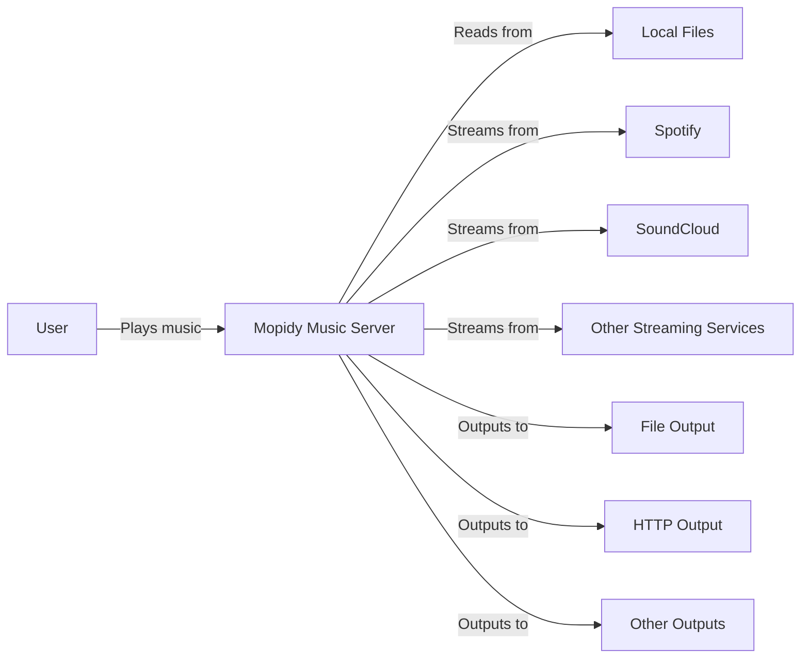
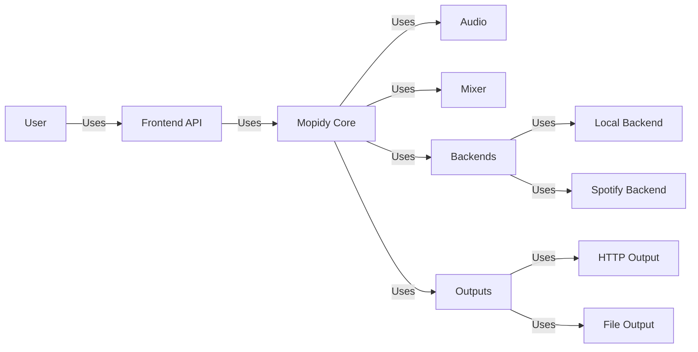
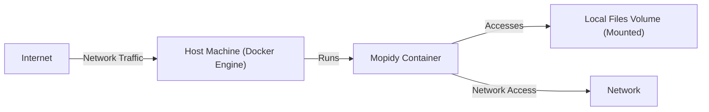
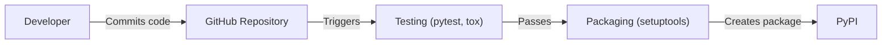

Okay, let's create a design document for the Mopidy project, focusing on aspects relevant to threat modeling.

# BUSINESS POSTURE

Mopidy is an open-source music server.  It's designed to be extensible and flexible, allowing users to play music from various sources (local files, streaming services, etc.) through a variety of outputs.  The primary business goals appear to be:

*   Provide a stable and reliable music playback experience.
*   Enable a wide range of integrations through a plugin architecture.
*   Maintain a vibrant and active open-source community.
*   Offer a user-friendly experience, even for users with limited technical expertise (within the context of a server application).

Based on these goals, the most important business risks are:

*   Reputational damage due to security vulnerabilities or instability.  This is particularly crucial for an open-source project that relies on community trust.
*   Loss of user base due to poor performance, lack of features, or difficulty of use.
*   Inability to attract and retain contributors due to a complex codebase or lack of clear direction.
*   Exposure of user data (though the data at risk is likely limited to music library metadata and potentially streaming service credentials, depending on the plugins used).

# SECURITY POSTURE

Based on the GitHub repository, the following security controls and accepted risks are identified:

*   security control: Plugin Architecture: Mopidy's core is relatively small, with most functionality provided by extensions. This limits the attack surface of the core application. Location: Core design principle.
*   security control: Community Code Review: As an open-source project, Mopidy benefits from community code review, which can help identify and address vulnerabilities. Location: GitHub repository and contribution guidelines.
*   security control: Use of Python: Python is a generally memory-safe language, reducing the risk of certain types of vulnerabilities (e.g., buffer overflows) compared to languages like C/C++. Location: Project codebase.
*   accepted risk: Third-Party Plugin Security: The security of Mopidy is heavily dependent on the security of the plugins used.  Mopidy itself cannot guarantee the security of third-party extensions.
*   accepted risk: Local Network Exposure: Mopidy is typically run on a local network, and its security relies heavily on the security of that network.  It's not designed to be directly exposed to the public internet.
*   accepted risk: Limited Authentication/Authorization: The core Mopidy server has limited built-in authentication and authorization mechanisms. Security often relies on network-level controls or frontend implementations.

Recommended Security Controls (High Priority):

*   Implement a security review process specifically for plugins, even if they are community-maintained. This could involve static analysis, guidelines for secure coding practices, and a reporting mechanism for vulnerabilities.
*   Provide clear documentation on security best practices for users, including recommendations for network configuration, plugin selection, and credential management.
*   Consider adding optional authentication/authorization mechanisms to the core server, even if they are basic (e.g., a simple password-based system).

Security Requirements:

*   Authentication:
    *   The system should provide a mechanism for authenticating users, at least optionally. This could be through a local password, integration with an existing authentication system, or through specific frontend implementations.
    *   Authentication mechanisms should be configurable and extensible via the plugin system.
*   Authorization:
    *   The system should provide a mechanism for controlling access to resources (e.g., specific music files, playlists, or streaming services). This is likely to be implemented primarily through frontend applications and plugins.
    *   Authorization mechanisms should be configurable and extensible via the plugin system.
*   Input Validation:
    *   All input from external sources (e.g., network requests, plugin data) should be validated to prevent injection attacks and other vulnerabilities. This is particularly important for plugins that interact with external services.
    *   The core Mopidy server should provide a framework or guidelines for input validation to be used by plugins.
*   Cryptography:
    *   If sensitive data (e.g., streaming service credentials) is stored or transmitted, it should be protected using appropriate cryptographic techniques.
    *   The specific cryptographic methods used should be configurable and up-to-date.
    *   Plugins handling sensitive data should be carefully reviewed for secure credential management.

# DESIGN

## C4 CONTEXT

Element Descriptions:

*   Element:
    *   Name: User
    *   Type: Person
    *   Description: A person who wants to listen to music.
    *   Responsibilities: Interacts with Mopidy through a frontend (e.g., web interface, mobile app) to control playback and manage their music library.
    *   Security controls: Authentication and authorization are typically handled by the frontend application, not directly by Mopidy.

*   Element:
    *   Name: Mopidy Music Server
    *   Type: Software System
    *   Description: The core Mopidy application, responsible for managing music playback and interacting with extensions.
    *   Responsibilities: Coordinating music playback, managing extensions, providing a core API.
    *   Security controls: Plugin architecture, community code review, use of Python.

*   Element:
    *   Name: Local Files
    *   Type: Data Source
    *   Description: Music files stored on the local filesystem.
    *   Responsibilities: Providing access to locally stored music.
    *   Security controls: Filesystem permissions.

*   Element:
    *   Name: Spotify
    *   Type: External System
    *   Description: The Spotify streaming service.
    *   Responsibilities: Providing access to the Spotify music catalog.
    *   Security controls: Handled by Spotify and the Mopidy-Spotify extension.

*   Element:
    *   Name: SoundCloud
    *   Type: External System
    *   Description: The SoundCloud streaming service.
    *   Responsibilities: Providing access to the SoundCloud music catalog.
    *   Security controls: Handled by SoundCloud and the Mopidy-SoundCloud extension.

*   Element:
    *   Name: Other Streaming Services
    *   Type: External System
    *   Description: Other streaming services supported by Mopidy extensions (e.g., Google Play Music, TuneIn Radio).
    *   Responsibilities: Providing access to their respective music catalogs.
    *   Security controls: Handled by the respective services and Mopidy extensions.

*   Element:
    *   Name: File Output
    *   Type: Output
    *   Description: Outputting audio to a file.
    *   Responsibilities: Writing audio data to a file.
    *   Security controls: Filesystem permissions.

*   Element:
    *   Name: HTTP Output
    *   Type: Output
    *   Description: Streaming audio over HTTP.
    *   Responsibilities: Encoding and transmitting audio data over HTTP.
    *   Security controls: Network security, potentially TLS for secure streaming.

*   Element:
    *   Name: Other Outputs
    *   Type: Output
    *   Description: Other audio output methods supported by Mopidy extensions (e.g., local audio devices, network audio protocols).
    *   Responsibilities: Sending audio data to the appropriate output device.
    *   Security controls: Dependent on the specific output method.

## C4 CONTAINER

Element Descriptions:

*   Element:
    *   Name: User
    *   Type: Person
    *   Description: A person who wants to listen to music.
    *   Responsibilities: Interacts with Mopidy through a frontend.
    *   Security controls: Authentication and authorization are typically handled by the frontend application.

*   Element:
    *   Name: Mopidy Core
    *   Type: Container
    *   Description: The core Mopidy application logic.
    *   Responsibilities: Managing extensions, coordinating playback, providing a core API.
    *   Security controls: Plugin architecture, community code review, use of Python.

*   Element:
    *   Name: Frontend API
    *   Type: Container
    *   Description: The API used by frontends to interact with Mopidy.
    *   Responsibilities: Providing a consistent interface for frontends.
    *   Security controls: Input validation, potentially authentication/authorization.

*   Element:
    *   Name: Audio
    *   Type: Container
    *   Description: Handles audio decoding and processing.
    *   Responsibilities: Decoding audio data from various formats.
    *   Security controls: Input validation (for audio data).

*   Element:
    *   Name: Mixer
    *   Type: Container
    *   Description: Controls audio volume and mixing.
    *   Responsibilities: Managing audio levels.
    *   Security controls: None specific.

*   Element:
    *   Name: Backends
    *   Type: Container
    *   Description: Provides access to different music sources.
    *   Responsibilities: Interacting with local files, streaming services, etc.
    *   Security controls: Input validation, secure credential management (for streaming services).

*   Element:
    *   Name: Local Backend
    *   Type: Container
    *   Description: Provides access to local music files.
    *   Responsibilities: Reading music files from the filesystem.
    *   Security controls: Filesystem permissions, input validation.

*   Element:
    *   Name: Spotify Backend
    *   Type: Container
    *   Description: Provides access to the Spotify streaming service.
    *   Responsibilities: Interacting with the Spotify API.
    *   Security controls: Secure credential management, input validation, communication with Spotify API over HTTPS.

*   Element:
    *   Name: Outputs
    *   Type: Container
    *   Description: Handles audio output to different devices.
    *   Responsibilities: Sending audio data to the appropriate output.
    *   Security controls: Dependent on the specific output method.

*   Element:
    *   Name: HTTP Output
    *   Type: Container
    *   Description: Streams audio over HTTP.
    *   Responsibilities: Encoding and transmitting audio data.
    *   Security controls: Network security, potentially TLS.

*   Element:
    *   Name: File Output
    *   Type: Container
    *   Description: Outputs audio to a file.
    *   Responsibilities: Writing audio data to a file.
    *   Security controls: Filesystem permissions.

## DEPLOYMENT

Mopidy can be deployed in several ways:

1.  **Manual Installation:** Installing Mopidy and its dependencies directly on the host operating system (e.g., using `pip`).
2.  **Docker Container:** Running Mopidy within a Docker container. This provides isolation and simplifies dependency management.
3.  **Systemd Service:** Running Mopidy as a systemd service on Linux systems. This allows Mopidy to start automatically on boot and provides process management.

We'll describe the **Docker Container** deployment in detail, as it's a common and recommended approach.

Element Descriptions:

*   Element:
    *   Name: Internet
    *   Type: External
    *   Description: The public internet.
    *   Responsibilities: Providing access to external resources (e.g., streaming services).
    *   Security controls: Firewall, network security.

*   Element:
    *   Name: Host Machine (Docker Engine)
    *   Type: Infrastructure Node
    *   Description: The physical or virtual machine running the Docker Engine.
    *   Responsibilities: Running Docker containers.
    *   Security controls: Operating system security, Docker security best practices.

*   Element:
    *   Name: Mopidy Container
    *   Type: Container Instance
    *   Description: The running instance of the Mopidy Docker image.
    *   Responsibilities: Running the Mopidy application.
    *   Security controls: Container isolation, limited privileges, regular image updates.

*   Element:
    *   Name: Local Files Volume (Mounted)
    *   Type: Data Store
    *   Description: A directory on the host machine mounted into the Mopidy container.
    *   Responsibilities: Providing access to local music files.
    *   Security controls: Filesystem permissions on the host machine.

*   Element:
    *   Name: Network
    *   Type: Network
    *   Description: Local network.
    *   Responsibilities: Providing network access.
    *   Security controls: Firewall, network security.

## BUILD

Mopidy's build process primarily involves packaging the Python code and its dependencies. While the core repository doesn't have a complex CI/CD pipeline, many Mopidy extensions and related projects do. Here's a general overview, focusing on security aspects:

1.  **Development:** Developers write code and commit it to the GitHub repository.
2.  **Testing:** Unit tests and integration tests are run to ensure code quality. These tests are often automated using tools like `pytest` and `tox`.
3.  **Packaging:** The Python code is packaged into a distributable format (e.g., a wheel or source distribution) using tools like `setuptools`.
4.  **Publication:** The package is published to the Python Package Index (PyPI).

Security Controls in the Build Process:

*   security control: Code Review: All code changes are subject to review before being merged into the main branch.
*   security control: Automated Testing: Unit and integration tests help identify bugs and vulnerabilities early in the development process.
*   security control: Dependency Management: Dependencies are managed using `requirements.txt` or similar mechanisms, allowing for tracking and updating of dependencies.
*   security control: (Recommended) Static Analysis: Incorporate static analysis tools (e.g., Bandit for Python) into the build process to automatically detect potential security issues.
*   security control: (Recommended) Dependency Scanning: Use tools to scan dependencies for known vulnerabilities (e.g., safety, Dependabot).

# RISK ASSESSMENT

*   Critical Business Processes:
    *   Providing a reliable and stable music playback experience.
    *   Maintaining a healthy and active open-source community.
*   Data to Protect:
    *   Music library metadata (low sensitivity, but could reveal user preferences).
    *   Streaming service credentials (high sensitivity, if stored by plugins).  This is the most critical data to protect.
    *   User configuration data (low sensitivity).

# QUESTIONS & ASSUMPTIONS

*   Questions:
    *   What specific frontend applications are commonly used with Mopidy? This will influence the threat model, as frontends handle user interaction and often authentication/authorization.
    *   Are there any plans to add more built-in security features to the core Mopidy server?
    *   What is the process for handling security vulnerabilities reported in Mopidy or its extensions?
    *   What level of network security is assumed for typical deployments? (e.g., home network behind a firewall, public-facing server)
    *   What are the most popular Mopidy extensions, and have they undergone any security review?

*   Assumptions:
    *   BUSINESS POSTURE: Mopidy is primarily used in home environments, not in high-security or enterprise settings. The primary concern is user experience and community reputation, not strict compliance with security regulations.
    *   SECURITY POSTURE: Users are responsible for securing their own networks and choosing trustworthy plugins. Mopidy's core provides a basic level of security, but relies heavily on external factors.
    *   DESIGN: The plugin architecture is a core design principle and will not be fundamentally changed. The focus is on providing a flexible and extensible platform, with security being a shared responsibility between the core, plugins, and users.