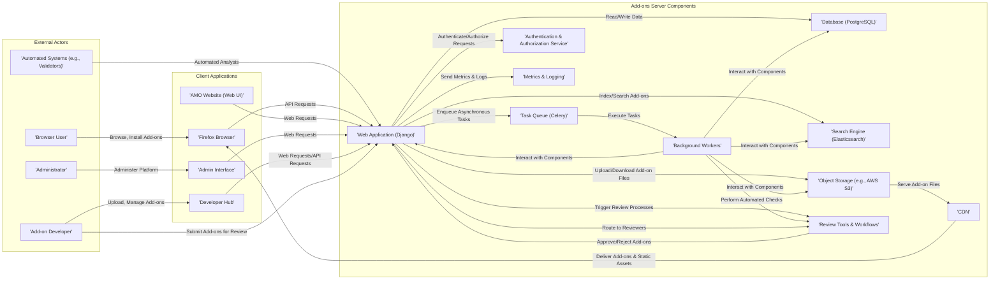
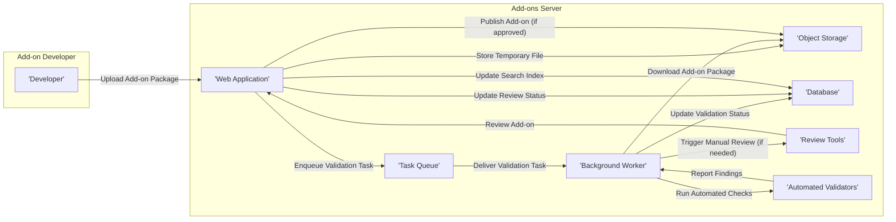
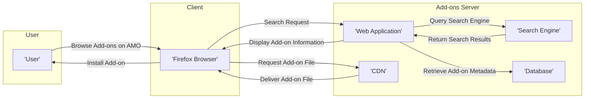

# Project Design Document: Mozilla Add-ons Server

**Version:** 1.1
**Date:** October 26, 2023
**Prepared By:** [Your Name/Team Name]

## 1. Introduction

This document provides a detailed architectural design of the Mozilla Add-ons Server project, based on the publicly available repository: [https://github.com/mozilla/addons-server](https://github.com/mozilla/addons-server). This document aims to provide a clear and comprehensive understanding of the system's components, their interactions, and data flows, with a specific focus on aspects relevant to security threat modeling.

## 2. Goals and Objectives

The primary goals of the Mozilla Add-ons Server are to:

*   Serve as the official platform for developers to upload, manage, and distribute browser extensions, themes, language packs, and other add-ons for Mozilla products, primarily Firefox.
*   Offer a secure, reliable, and easily searchable repository for users to discover, install, and manage add-ons.
*   Implement rigorous review processes, both automated and manual, to ensure the quality, security, and adherence to Mozilla's policies for submitted add-ons.
*   Provide well-defined and documented APIs for Mozilla products (like the Firefox browser) and authorized third-party applications to interact with the add-on ecosystem programmatically.
*   Collect, process, and display comprehensive metadata about add-ons, including ratings, reviews, compatibility information, developer details, and security assessments.
*   Facilitate communication and feedback between users, developers, and Mozilla regarding add-ons.

## 3. High-Level Architecture

The Mozilla Add-ons Server employs a multi-layered web application architecture, designed for scalability, maintainability, and security. The key components and their interactions are illustrated below:

*   **Presentation Layer:**  Handles user interface and user interactions.
*   **Application Layer:**  Implements the core business logic and API endpoints.
*   **Data Layer:**  Manages persistent data storage and retrieval.
*   **Infrastructure Layer:** Provides supporting services and infrastructure.

## 4. Component Breakdown

This section provides a detailed description of the key components within the Add-ons Server, highlighting their functionalities and security considerations.

*   **Web Application (Django):**
    *   The central component, built using the Django web framework (Python).
    *   Responsible for handling HTTP requests, routing, session management, and implementing core business logic.
    *   Exposes RESTful APIs for client applications (Firefox, developer tools).
    *   Implements authentication (user login, API key management) and authorization (permissions based on user roles and add-on ownership).
    *   Integrates with other components like the database, search engine, and task queue.
    *   Serves the web interface (addons.mozilla.org) and the developer hub.
    *   **Security Relevance:** Vulnerable to common web application attacks (e.g., XSS, CSRF, SQL injection if not properly coded). Authentication and authorization flaws can lead to unauthorized access and data breaches.

*   **Database (PostgreSQL):**
    *   A relational database used for persistent storage of critical application data.
    *   Stores information about users, add-ons (metadata, versions, compatibility, review status), reviews, categories, collections, developer information, and administrative data.
    *   **Security Relevance:** Requires robust access controls, encryption at rest and in transit, and regular backups to protect sensitive data. Vulnerable to SQL injection if input sanitization is insufficient in the Web Application layer.

*   **Search Engine (Elasticsearch):**
    *   Provides full-text search and indexing capabilities for add-ons, enabling efficient discovery.
    *   Indexes add-on metadata, descriptions, and potentially review content.
    *   **Security Relevance:**  Needs secure configuration to prevent unauthorized access to the index. Care must be taken to sanitize data before indexing to prevent injection attacks within search results.

*   **Task Queue (Celery):**
    *   An asynchronous task queue used to offload time-consuming or background tasks from the main web application process.
    *   Examples of tasks include: add-on validation, file scanning, thumbnail generation, email notifications, search index updates, and metrics processing.
    *   **Security Relevance:**  The message broker (e.g., RabbitMQ, Redis) needs to be secured. Care must be taken to ensure tasks are executed securely and do not introduce vulnerabilities.

*   **Object Storage (e.g., AWS S3):**
    *   Stores the actual add-on files (ZIP archives, XPI packages).
    *   Provides scalable and durable storage for add-on binaries.
    *   **Security Relevance:** Requires strict access controls to prevent unauthorized access or modification of add-on files. Integrity checks (e.g., checksums) are crucial to ensure files are not tampered with.

*   **Content Delivery Network (CDN):**
    *   A network of geographically distributed servers that cache static assets (images, CSS, JavaScript) and add-on files.
    *   Improves download speeds and reduces latency for users accessing add-ons.
    *   **Security Relevance:**  Needs secure configuration to prevent unauthorized content injection or access. HTTPS is essential for secure delivery.

*   **Authentication & Authorization Service:**
    *   Responsible for verifying user identities and controlling access to resources and functionalities.
    *   Likely integrates with Mozilla's central authentication systems (Mozilla Accounts) for user authentication.
    *   Manages API keys for developers and third-party applications.
    *   Enforces role-based access control (RBAC) for different user types (users, developers, administrators, reviewers).
    *   **Security Relevance:** A critical component for overall security. Vulnerabilities here can lead to widespread unauthorized access. Secure storage of credentials and robust authentication protocols are essential.

*   **Background Workers:**
    *   Processes tasks from the task queue (Celery).
    *   Executes the logic for asynchronous operations, such as add-on validation, file scanning, and data processing.
    *   **Security Relevance:**  Need to be designed and implemented securely to prevent vulnerabilities during task execution. Access to resources should be limited based on the task's requirements.

*   **Review Tools & Workflows:**
    *   A suite of tools and interfaces used by human reviewers and automated systems to assess the quality, security, and functionality of submitted add-ons.
    *   Includes automated static analysis tools, manual review interfaces, and reporting mechanisms.
    *   **Security Relevance:**  The review process is crucial for preventing malicious add-ons from being published. The tools themselves need to be secure to prevent manipulation or bypass.

*   **Metrics & Logging:**
    *   Collects and stores application logs, performance metrics, and security-related events.
    *   Used for monitoring, debugging, security analysis, and auditing.
    *   **Security Relevance:**  Logs can contain sensitive information and need to be stored securely. Proper logging is essential for incident response and security investigations.

## 5. Data Flow Diagrams

This section illustrates key data flows within the system, highlighting potential security touchpoints.

### 5.1. Add-on Upload, Validation, and Review

### 5.2. User Browsing and Installing Add-ons

## 6. Key Technologies

*   **Programming Languages:** Python
*   **Web Framework:** Django
*   **Database:** PostgreSQL
*   **Search Engine:** Elasticsearch
*   **Task Queue:** Celery
*   **Message Broker:** RabbitMQ or Redis (likely used by Celery)
*   **Object Storage:** Likely AWS S3 or a similar service
*   **CDN:** Likely a commercial CDN provider (e.g., Cloudflare, Fastly)
*   **Operating System:** Linux (likely)
*   **Containerization/Orchestration:** Docker, Kubernetes (potentially for deployment and scaling)
*   **Caching:** Redis or Memcached (likely used for caching frequently accessed data)

## 7. Security Considerations (Detailed for Threat Modeling)

This section expands on the initial security considerations, providing more specific examples of potential threats and vulnerabilities relevant for threat modeling.

*   **Authentication and Authorization:**
    *   **Threats:** Brute-force attacks on login forms, credential stuffing, session hijacking, API key compromise, privilege escalation.
    *   **Vulnerabilities:** Weak password policies, insecure session management, lack of multi-factor authentication, overly permissive API key scopes, flaws in role-based access control implementation.
*   **Input Validation:**
    *   **Threats:** Cross-site scripting (XSS), SQL injection, command injection, path traversal, header injection.
    *   **Vulnerabilities:** Insufficient sanitization of user-provided data (add-on descriptions, reviews, developer information), lack of proper validation of uploaded add-on files, insecure deserialization.
*   **Add-on Security:**
    *   **Threats:** Malicious add-ons containing malware, spyware, or ransomware; add-ons with vulnerabilities that can be exploited; supply chain attacks through compromised add-on dependencies.
    *   **Vulnerabilities:** Inadequate add-on review processes, bypasses in automated validation checks, lack of sandboxing or insufficient permission restrictions for add-ons within the browser.
*   **Data Security:**
    *   **Threats:** Data breaches, unauthorized access to sensitive data, data tampering, data loss.
    *   **Vulnerabilities:** Lack of encryption at rest and in transit, weak access controls on database and storage resources, insecure storage of API keys and secrets, insufficient data retention policies.
*   **Infrastructure Security:**
    *   **Threats:** Denial-of-service (DoS) and distributed denial-of-service (DDoS) attacks, server compromise, network intrusion.
    *   **Vulnerabilities:** Unpatched software vulnerabilities, misconfigured firewalls, weak security configurations on servers and network devices, lack of intrusion detection and prevention systems.
*   **Supply Chain Security:**
    *   **Threats:** Compromised dependencies or third-party libraries used in the project, malicious code injected into the build process.
    *   **Vulnerabilities:** Lack of dependency scanning and vulnerability management, insecure build pipelines, insufficient verification of third-party components.
*   **API Security:**
    *   **Threats:** Unauthorized access to API endpoints, data breaches through API vulnerabilities, abuse of API rate limits.
    *   **Vulnerabilities:** Lack of proper authentication and authorization for API requests, insecure API design, insufficient input validation on API parameters, lack of rate limiting or abuse detection mechanisms.
*   **Logging and Monitoring:**
    *   **Threats:** Insufficient logging leading to difficulty in incident response, exposure of sensitive information in logs.
    *   **Vulnerabilities:** Lack of comprehensive logging, insecure storage of logs, insufficient monitoring and alerting for security events.

## 8. Future Considerations

*   **Enhanced Add-on Review Processes:** Implementing more sophisticated static and dynamic analysis techniques, incorporating machine learning for threat detection.
*   **Improved Developer Tools:** Providing better tools for developers to test the security of their add-ons before submission.
*   **Strengthened Sandboxing:**  Further enhancing the browser's add-on sandboxing capabilities to limit the potential impact of malicious add-ons.
*   **Community Security Engagement:**  Establishing bug bounty programs and fostering collaboration with the security research community.
*   **Formal Security Audits:**  Regularly conducting independent security audits and penetration testing.

This improved design document provides a more detailed and security-focused overview of the Mozilla Add-ons Server architecture. It serves as a solid foundation for conducting thorough threat modeling exercises to identify and mitigate potential security risks effectively.