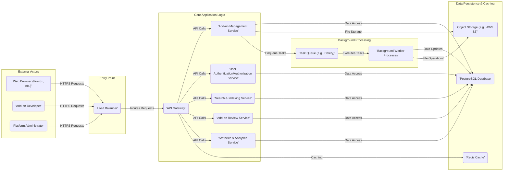

# Project Design Document: Mozilla Add-ons Server

**Version:** 1.1
**Date:** October 26, 2023
**Author:** AI Software Architect

## 1. Introduction

This document provides an enhanced high-level design of the Mozilla Add-ons Server project (referenced from [https://github.com/mozilla/addons-server](https://github.com/mozilla/addons-server)). This revised document aims to provide a clearer and more detailed understanding of the system's architecture, key components, and data flow, specifically for the purpose of facilitating comprehensive threat modeling activities. The focus remains on identifying major elements and their interactions to enable a thorough security analysis.

## 2. Project Overview

The Mozilla Add-ons Server serves as a central platform for hosting and distributing extensions, themes, and other add-ons for Mozilla products such as Firefox. It offers a repository for users to discover, install, and manage these add-ons. Furthermore, it empowers developers to upload, manage, and distribute their creations to the user base.

## 3. Goals

*   To maintain a robust and scalable platform for hosting Mozilla add-ons.
*   To provide a user-friendly interface for discovering and installing add-ons.
*   To enable developers to easily upload and manage their add-on contributions.
*   To ensure the security and integrity of both the hosted add-ons and the platform itself.
*   To offer well-defined APIs for seamless integration with Mozilla products and potentially third-party services.

## 4. Scope

This design document focuses on the core architectural components and their interactions within the Add-ons Server platform, specifically those relevant for threat modeling. This includes user interactions, data storage mechanisms, and the key services that comprise the system. This document does not delve into granular implementation details of individual code modules or specific internal algorithms.

## 5. High-Level Architecture

The Add-ons Server employs a multi-tier architecture. The primary components and their interactions are depicted below:

## 6. Key Components

This section provides a more detailed explanation of the purpose and functionality of the major components identified in the architecture diagram.

*   **External Actors:** Entities interacting with the platform.
    *   'Web Browser (Firefox, etc.)': Users who browse, search for, and install add-ons.
    *   'Add-on Developer': Users who upload, manage, and update their add-on submissions.
    *   'Platform Administrator': Users responsible for the maintenance, configuration, and monitoring of the Add-ons Server platform.
*   **Entry Point:** Handles incoming traffic.
    *   'Load Balancer': Distributes incoming user requests across multiple instances of the web application servers to ensure high availability and scalability.
*   **Core Application Logic:** Contains the main functionalities of the platform.
    *   'API Gateway': Acts as a single entry point for all API requests, handling request routing, authentication, authorization, and potentially rate limiting and request transformation.
    *   'Add-on Management Service': Manages the lifecycle of add-ons, including uploading new add-ons, updating existing ones, managing versions, and handling the associated metadata.
    *   'User Authentication/Authorization Service': Responsible for authenticating users (both developers and administrators), managing user accounts, and enforcing authorization policies to control access to different resources and functionalities.
    *   'Search & Indexing Service': Provides the search functionality for users to find add-ons based on keywords, categories, and other relevant criteria. This likely involves indexing add-on metadata and potentially content.
    *   'Add-on Review Service': Manages the process of reviewing submitted add-ons, potentially involving both automated checks and manual review by human reviewers.
    *   'Statistics & Analytics Service': Collects, aggregates, and provides data on add-on usage, downloads, user demographics (anonymized), and other relevant metrics.
*   **Data Persistence & Caching:** Manages data storage and retrieval.
    *   'PostgreSQL Database': Stores structured relational data, including user accounts, add-on metadata, review information, statistics, and platform configuration.
    *   'Object Storage (e.g., AWS S3)': Stores unstructured data, primarily the actual add-on files (ZIP archives, etc.). This is optimized for storing large binary files.
    *   'Redis Cache': Provides a fast, in-memory data store used for caching frequently accessed data to improve application performance and reduce database load.
*   **Background Processing:** Handles asynchronous and deferred tasks.
    *   'Task Queue (e.g., Celery)':  A message broker that manages a queue of tasks to be processed asynchronously.
    *   'Background Worker Processes':  Execute tasks from the task queue, such as add-on validation, virus scanning, generating statistics, and sending notifications.

## 7. Data Flow

This section outlines the typical flow of data for key user interactions, highlighting the communication paths between components.

*   **User Browsing and Installing an Add-on:**
    *   The user's web browser sends an HTTPS request to the 'Load Balancer'.
    *   The 'Load Balancer' forwards the request to an available 'API Gateway' instance.
    *   The 'API Gateway' routes the request to the 'Search & Indexing Service'.
    *   The 'Search & Indexing Service' queries the 'PostgreSQL Database' (potentially leveraging the 'Redis Cache' for frequently accessed data) to retrieve relevant add-on information.
    *   The 'Search & Indexing Service' returns the search results to the 'API Gateway'.
    *   The 'API Gateway' sends the response back to the user's web browser.
    *   If the user initiates an installation, the browser requests the add-on file from the 'API Gateway'.
    *   The 'API Gateway' routes this request to the 'Add-on Management Service'.
    *   The 'Add-on Management Service' retrieves the requested add-on file from 'Object Storage'.
    *   The add-on file is streamed back to the user's web browser via the 'API Gateway' and 'Load Balancer'.
*   **Add-on Developer Uploading an Add-on:**
    *   The 'Add-on Developer' sends an HTTPS upload request to the 'Load Balancer'.
    *   The 'Load Balancer' forwards the request to the 'API Gateway'.
    *   The 'API Gateway' authenticates and authorizes the developer using the 'User Authentication/Authorization Service'.
    *   The 'API Gateway' routes the request to the 'Add-on Management Service'.
    *   The 'Add-on Management Service' receives the add-on file and associated metadata.
    *   The 'Add-on Management Service' stores the add-on file in 'Object Storage'.
    *   The 'Add-on Management Service' stores the add-on metadata in the 'PostgreSQL Database'.
    *   The 'Add-on Management Service' enqueues tasks in the 'Task Queue' for background processing, such as validation and virus scanning.
    *   'Background Worker Processes' pick up these tasks from the 'Task Queue' and perform the necessary operations, potentially updating the 'PostgreSQL Database' and 'Object Storage'.
*   **Platform Administrator Managing the System:**
    *   The 'Platform Administrator' interacts with an administrative interface, sending HTTPS requests to the 'Load Balancer'.
    *   The 'Load Balancer' directs these requests to the 'API Gateway'.
    *   The 'API Gateway' authenticates and authorizes the administrator via the 'User Authentication/Authorization Service'.
    *   Requests are routed to the appropriate services (e.g., 'Add-on Management Service', 'User Authentication/Authorization Service') based on the action being performed.
    *   These services interact with the 'PostgreSQL Database' and potentially 'Object Storage' to manage users, add-ons, and platform settings.

## 8. Security Considerations (For Threat Modeling)

This section outlines key security considerations relevant for threat modeling, categorized by component or area of concern.

*   **Authentication and Authorization:**
    *   Secure authentication mechanisms for users, developers, and administrators.
    *   Robust authorization policies to control access to sensitive resources and functionalities.
    *   Protection against brute-force attacks and credential stuffing.
*   **API Gateway:**
    *   Protection against common web application attacks (e.g., OWASP Top 10).
    *   Rate limiting to prevent denial-of-service attacks.
    *   Input validation to prevent injection attacks.
    *   Secure handling of authentication tokens and session management.
*   **Add-on Management Service:**
    *   Secure handling of add-on uploads to prevent malicious code injection.
    *   Validation and sanitization of add-on metadata.
    *   Integrity checks for uploaded add-on files.
*   **User Authentication/Authorization Service:**
    *   Secure storage of user credentials (using strong hashing algorithms).
    *   Protection against account takeover.
    *   Secure password reset mechanisms.
*   **Search & Indexing Service:**
    *   Protection against search injection attacks.
    *   Ensuring that search results do not expose sensitive information.
*   **Add-on Review Service:**
    *   Robust processes for identifying and preventing malicious or vulnerable add-ons from being published.
    *   Secure handling of add-on analysis and review data.
*   **Statistics & Analytics Service:**
    *   Protection of user privacy when collecting and analyzing data.
    *   Secure access to statistical data.
*   **PostgreSQL Database:**
    *   Secure configuration and access controls.
    *   Protection against SQL injection attacks.
    *   Encryption of sensitive data at rest.
*   **Object Storage (e.g., AWS S3):**
    *   Secure access policies to prevent unauthorized access to add-on files.
    *   Data encryption at rest and in transit.
*   **Redis Cache:**
    *   Secure access controls to prevent unauthorized access to cached data.
    *   Consideration of the sensitivity of data being cached.
*   **Task Queue (e.g., Celery) and Background Worker Processes:**
    *   Secure configuration of the task queue to prevent unauthorized task execution.
    *   Secure handling of sensitive data within background tasks.
*   **General Security Considerations:**
    *   Secure communication using HTTPS across all network boundaries.
    *   Regular security audits and penetration testing.
    *   Proper logging and monitoring for security events.
    *   Keeping all software dependencies up-to-date with security patches.
    *   Implementation of a Content Security Policy (CSP) to mitigate XSS attacks.

## 9. Technologies Used (Inferred)

Based on common web application architectures and the project's nature, the following technologies are likely employed. This is an inferred list and may not be exhaustive.

*   **Primary Programming Language:** Python (commonly used with the Django framework for web development)
*   **Web Application Framework:** Django (a high-level Python web framework)
*   **Relational Database:** PostgreSQL (a robust and feature-rich open-source relational database)
*   **In-Memory Data Store/Cache:** Redis (a popular choice for caching and session management)
*   **Object Storage:** Likely a cloud-based service such as AWS S3, Google Cloud Storage, or Azure Blob Storage (for storing large binary files like add-on packages)
*   **Asynchronous Task Queue:** Celery (a widely used asynchronous task queue for Python)
*   **Web Server/Reverse Proxy:**  Likely a combination of a reverse proxy like Nginx or Apache, and a WSGI server like uWSGI or Gunicorn (to serve the Django application)
*   **Search Engine:** Potentially Elasticsearch or a similar full-text search engine (for indexing and searching add-on data)
*   **Operating System:**  Likely a Linux-based distribution (common for server deployments)

## 10. Future Considerations

This design document reflects the current understanding of the Add-ons Server architecture. Future enhancements and considerations may include:

*   Expanding integration capabilities with other Mozilla services and products.
*   Implementing more sophisticated automated add-on analysis and security scanning techniques.
*   Optimizing the platform for increased scalability and performance to handle growing user and add-on volumes.
*   Introducing new features and functionalities to enhance the user and developer experience.
*   Exploring more advanced analytics and reporting capabilities.

This improved design document provides a more detailed and structured overview of the Mozilla Add-ons Server, specifically tailored for use in threat modeling activities. It highlights key components, their interactions, and relevant security considerations to facilitate a comprehensive security analysis.
