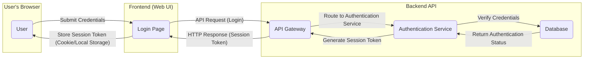
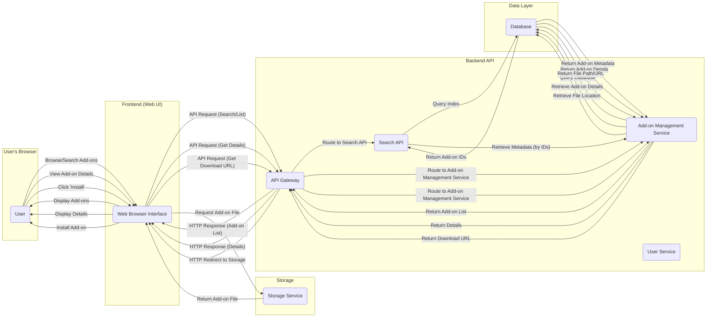
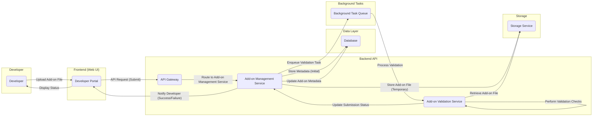

## Project Design Document: Mozilla Add-ons Server (Improved)

**1. Introduction**

This document provides an enhanced architectural design of the Mozilla Add-ons Server project (as represented by the GitHub repository: [https://github.com/mozilla/addons-server](https://github.com/mozilla/addons-server)). Building upon the previous version, this document offers a more granular understanding of the system's components, their interactions, and data flows. This detailed view is crucial for effective threat modeling.

**2. Project Overview**

The Mozilla Add-ons Server (often referred to as AMO - addons.mozilla.org) serves as the central platform for the discovery, distribution, and management of extensions, themes, and other add-ons for Mozilla products, primarily Firefox. It facilitates the connection between add-on developers and users, managing the lifecycle of add-ons from submission to installation and updates. Key functionalities include:

*   Secure and reliable distribution of add-ons.
*   Comprehensive add-on submission, review, and approval workflows.
*   Robust user authentication and authorization mechanisms.
*   Detailed add-on metadata management, encompassing descriptions, versions, compatibility information, and licensing.
*   Efficient search and discovery features enabling users to find relevant add-ons.
*   Community engagement through user reviews, ratings, and feedback.
*   Automated and manual add-on updates and distribution processes.
*   Developer-centric tools and APIs for managing their add-ons.

**3. Architectural Overview**

The Add-ons Server employs a layered, service-oriented architecture, promoting modularity and scalability. The primary layers are:

*   **Presentation Layer (Frontend):**  Provides the user interface for interaction via web browsers.
*   **Application Layer (Backend):**  Encompasses the core business logic and services.
*   **Data Layer:**  Manages persistent data storage.
*   **Infrastructure Layer:**  Provides the underlying services and resources.

**4. Component Breakdown**

This section provides a more detailed breakdown of the Add-ons Server's components and their responsibilities.

*   **Frontend (Web UI):**
    *   **Purpose:** Renders the user interface and handles user interactions.
    *   **Responsibilities:**
        *   Displaying add-on listings, details, and search results.
        *   Managing user accounts (registration, login, profile).
        *   Providing developer dashboards for add-on management.
        *   Handling user input and making API calls to the backend.
    *   **Likely Technologies:** HTML, CSS, JavaScript, React or a similar framework.

*   **Backend API:**
    *   **Purpose:**  Serves as the central point of interaction for the frontend and other clients.
    *   **Responsibilities:**
        *   Receiving and routing requests.
        *   Enforcing authentication and authorization.
        *   Orchestrating interactions between various backend services.
        *   Exposing RESTful APIs.
    *   **Likely Technologies:** Python (Django/DRF).
    *   **Sub-components:**
        *   **Authentication Service:** Handles user authentication and session management.
        *   **Authorization Service:** Manages access control and permissions.
        *   **Add-on Management Service:**  Handles operations related to add-ons (creation, update, deletion, retrieval).
        *   **User Service:** Manages user accounts and profiles.
        *   **Review Service:** Handles add-on reviews and ratings.
        *   **Search API:** Provides endpoints for searching add-ons.
        *   **Developer API:**  Exposes functionalities for developers to manage their add-ons.

*   **Database:**
    *   **Purpose:**  Provides persistent storage for application data.
    *   **Responsibilities:**
        *   Storing add-on metadata, user information, review data, categories, etc.
        *   Ensuring data integrity and consistency.
    *   **Likely Technologies:** PostgreSQL.

*   **Search Service:**
    *   **Purpose:**  Provides efficient indexing and search capabilities for add-ons.
    *   **Responsibilities:**
        *   Indexing add-on metadata for fast searching.
        *   Handling complex search queries.
        *   Providing search suggestions and filtering options.
    *   **Likely Technologies:** Elasticsearch or Solr.

*   **Storage Service (Add-on Files):**
    *   **Purpose:**  Stores the actual add-on files (e.g., XPI files).
    *   **Responsibilities:**
        *   Securely storing add-on files.
        *   Providing access to add-on files for download.
        *   Ensuring high availability and scalability.
    *   **Likely Technologies:** Amazon S3 or a similar object storage service.

*   **Background Task Queue:**
    *   **Purpose:**  Handles asynchronous and deferred tasks.
    *   **Responsibilities:**
        *   Processing add-on validation checks.
        *   Sending email notifications.
        *   Generating reports.
        *   Updating search indexes.
    *   **Likely Technologies:** Celery, Redis (as a broker).

*   **Caching Layer:**
    *   **Purpose:**  Improves performance by storing frequently accessed data in memory.
    *   **Responsibilities:**
        *   Caching add-on metadata, search results, and other frequently accessed data.
        *   Reducing load on the database and other services.
    *   **Likely Technologies:** Redis or Memcached.

*   **Add-on Validation Service:**
    *   **Purpose:**  Performs automated checks on submitted add-ons.
    *   **Responsibilities:**
        *   Scanning add-on code for potential security vulnerabilities.
        *   Enforcing code quality standards.
        *   Checking for policy violations.
        *   Generating validation reports.

*   **Review System (Internal Component/Service):**
    *   **Purpose:**  Manages the process of user reviews and ratings.
    *   **Responsibilities:**
        *   Storing and displaying user reviews and ratings.
        *   Providing moderation tools for managing inappropriate content.
        *   Calculating aggregate ratings.

*   **Metrics and Monitoring Service:**
    *   **Purpose:**  Collects and analyzes application performance and health data.
    *   **Responsibilities:**
        *   Monitoring application performance metrics (e.g., response times, error rates).
        *   Collecting logs and providing insights into system behavior.
        *   Alerting on critical issues.
    *   **Likely Technologies:** Prometheus, Grafana, Sentry.

**5. Data Flow Diagrams**

This section illustrates the flow of data between components for key use cases.

*   **User Authentication:**

*   **User Browsing and Installing an Add-on (Detailed):**

*   **Developer Submitting a New Add-on (Detailed):**

**6. Security Considerations**

This section outlines key security considerations for the Add-ons Server, focusing on potential threats and mitigation strategies.

*   **Authentication and Authorization:**
    *   **Threats:** Brute-force attacks, credential stuffing, session hijacking, privilege escalation.
    *   **Mitigations:** Strong password policies, multi-factor authentication, secure session management (HTTP-only, secure cookies), role-based access control.
*   **Input Validation:**
    *   **Threats:** Cross-site scripting (XSS), SQL injection, command injection, path traversal.
    *   **Mitigations:**  Strict input validation on all user-provided data, output encoding, parameterized queries, least privilege principles.
*   **Add-on Validation:**
    *   **Threats:** Distribution of malicious add-ons (malware, spyware, cryptominers), add-ons with vulnerabilities.
    *   **Mitigations:**  Automated static and dynamic analysis, manual review processes, code signing, sandboxing of add-ons.
*   **Secure File Storage:**
    *   **Threats:** Unauthorized access to add-on files, data breaches, tampering with add-on files.
    *   **Mitigations:**  Access control lists (ACLs), encryption at rest and in transit, integrity checks, regular security audits.
*   **API Security:**
    *   **Threats:**  Unauthorized access, API abuse, denial-of-service attacks.
    *   **Mitigations:**  API authentication (e.g., OAuth 2.0), rate limiting, input validation, output encoding, security headers.
*   **Communication Security:**
    *   **Threats:** Man-in-the-middle attacks, eavesdropping.
    *   **Mitigations:**  Enforce HTTPS for all communication, use TLS certificates.
*   **Dependency Management:**
    *   **Threats:**  Vulnerabilities in third-party libraries and dependencies.
    *   **Mitigations:**  Regularly update dependencies, use dependency scanning tools, vulnerability management processes.
*   **Rate Limiting:**
    *   **Threats:**  Denial-of-service attacks, API abuse.
    *   **Mitigations:**  Implement rate limiting on API endpoints.
*   **Content Security Policy (CSP):**
    *   **Threats:**  Cross-site scripting (XSS) attacks.
    *   **Mitigations:**  Implement and enforce a strict CSP.
*   **Regular Security Audits and Penetration Testing:**
    *   **Purpose:** Proactively identify and address security vulnerabilities.
    *   **Actions:** Conduct regular security audits and penetration testing by internal and external security experts.

**7. Technologies Used (Detailed)**

This section provides more context on the likely technologies used.

*   **Backend Framework:** Django (Python) - Chosen for its robust features, security focus, and large community.
*   **Frontend Technologies:** HTML, CSS, JavaScript, potentially React or Vue.js - Standard web technologies for building interactive user interfaces.
*   **Database:** PostgreSQL - A reliable and feature-rich open-source relational database.
*   **Search Engine:** Elasticsearch or Solr - Powerful search engines optimized for indexing and searching large volumes of data.
*   **Object Storage:** Amazon S3 or similar - Scalable and cost-effective storage for large binary files.
*   **Background Task Queue:** Celery - A popular asynchronous task queue for Python, often used with Redis or RabbitMQ as a broker.
*   **Caching:** Redis or Memcached - In-memory data stores used for caching frequently accessed data to improve performance.
*   **Message Broker (for Task Queue):** RabbitMQ or Redis - Used for reliable message queuing between components.
*   **Web Server:** Nginx or Apache - High-performance web servers used to serve static content and proxy requests to the application server.
*   **Operating System:** Linux - A common and stable operating system for server deployments.
*   **Cloud Provider:** Likely AWS, Google Cloud Platform, or Azure - Provides the infrastructure for hosting and scaling the application.
*   **Monitoring and Logging:** Prometheus, Grafana, ELK stack (Elasticsearch, Logstash, Kibana), Sentry - Tools for monitoring application performance, collecting logs, and error tracking.

**8. Deployment Model**

The Add-ons Server is likely deployed in a cloud environment using a microservices or service-oriented architecture, leveraging containerization and orchestration.

*   **Containerization:** Docker is likely used to package and isolate application components.
*   **Orchestration:** Kubernetes is likely used to manage and scale the containerized applications.
*   **Load Balancing:**  Distributes traffic across multiple instances of services for high availability and performance.
*   **Auto-Scaling:**  Dynamically adjusts the number of instances based on demand.
*   **Blue/Green Deployments:**  A deployment strategy to minimize downtime during updates.
*   **Database Replication and Failover:** Ensures high availability and data durability.
*   **Content Delivery Network (CDN):**  Used to cache static assets and improve performance for users globally.
*   **Infrastructure as Code (IaC):** Tools like Terraform or CloudFormation are likely used to manage the infrastructure.

**9. Assumptions and Constraints**

*   This design document is based on publicly available information and common architectural patterns for similar platforms. The actual implementation may have variations.
*   The focus is on the core components and data flows relevant for security and threat modeling.
*   Specific implementation details, configurations, and internal APIs are not exhaustively covered.
*   The technologies listed are based on common practices and are subject to change based on specific requirements and evolution of the project.

This improved design document provides a more detailed and nuanced understanding of the Mozilla Add-ons Server architecture. The enhanced component breakdown, detailed data flow diagrams, and specific security considerations will significantly aid in conducting a comprehensive threat modeling exercise.