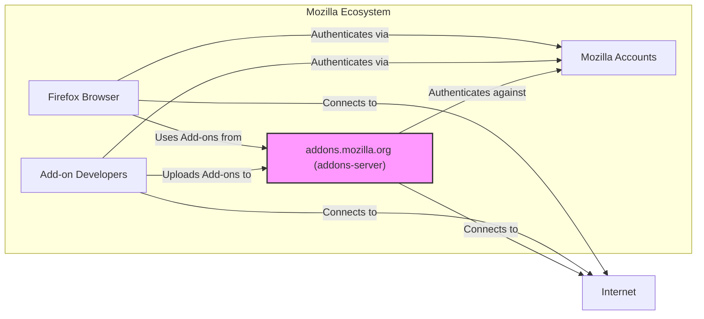
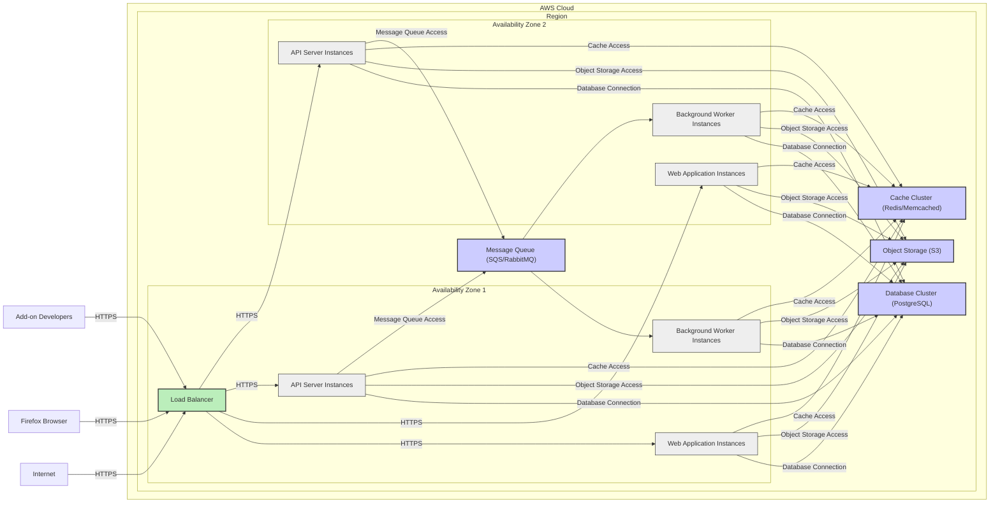

# BUSINESS POSTURE

- Business Priorities and Goals:
  - Provide a secure and reliable platform for users to discover, install, and manage browser extensions, themes, and other add-ons for Mozilla products, primarily Firefox.
  - Ensure the availability of a wide variety of add-ons to enhance user experience and browser functionality.
  - Protect users from malicious or harmful add-ons.
  - Support the Mozilla ecosystem and community of add-on developers.
  - Maintain the integrity and security of the Firefox browser and user data.

- Most Important Business Risks:
  - Risk of users installing malicious add-ons that could compromise their security and privacy.
  - Risk of platform downtime or performance issues affecting user experience and trust.
  - Risk of legal and reputational damage due to security breaches or distribution of harmful content.
  - Risk of developer dissatisfaction leading to a decrease in the quantity and quality of available add-ons.
  - Risk of supply chain attacks targeting the add-on distribution platform.

# SECURITY POSTURE

- Existing Security Controls:
  - security control: Code reviews are likely performed as part of the development process, although not explicitly stated in the provided context. Location: GitHub repository - code review process is standard practice for Mozilla projects.
  - security control: Automated testing including unit and integration tests. Location: GitHub repository - test suites are present in the codebase.
  - security control: Regular security audits and penetration testing. Location: Mozilla's security practices - Mozilla has a dedicated security team and conducts regular security assessments.
  - security control: Input validation and sanitization throughout the application. Location: Codebase - Django framework encourages input validation, and it's expected to be implemented in views and forms.
  - security control: Authentication and authorization mechanisms to manage user accounts and developer access. Location: Codebase - Django's authentication and permission framework is likely used.
  - security control: HTTPS enforced for all communication. Location: Deployment infrastructure - standard practice for web applications, especially those handling user data.
  - security control: Content Security Policy (CSP) to mitigate XSS attacks. Location: Web application configuration - CSP headers are expected to be configured.
  - security control: Subresource Integrity (SRI) to ensure integrity of loaded resources. Location: Web application configuration - SRI attributes are expected to be used for external resources.
  - security control: Dependency scanning to identify vulnerabilities in third-party libraries. Location: CI/CD pipeline - dependency scanning tools are commonly used in modern development workflows.
  - security control: Static Application Security Testing (SAST) to identify potential security flaws in the code. Location: CI/CD pipeline - SAST tools can be integrated into the build process.
  - security control: Rate limiting to prevent abuse and denial-of-service attacks. Location: API gateway or application layer - rate limiting is a common practice for public APIs.
  - security control: Web Application Firewall (WAF) to protect against common web attacks. Location: Infrastructure - WAF is typically deployed in front of web applications.
  - security control: Security monitoring and logging to detect and respond to security incidents. Location: Infrastructure and application - logging and monitoring are essential for security operations.
  - accepted risk: Performance impact of security controls. Location: General security vs performance trade-off - security measures can sometimes introduce performance overhead.
  - accepted risk: Complexity of security configurations and maintenance. Location: General security operations - managing security controls can be complex and require ongoing effort.

- Recommended Security Controls:
  - security control: Implement Dynamic Application Security Testing (DAST) in the CI/CD pipeline to identify runtime vulnerabilities.
  - security control: Enhance dependency scanning to include software composition analysis (SCA) for license compliance and deeper vulnerability analysis.
  - security control: Implement Runtime Application Self-Protection (RASP) for real-time attack detection and prevention.
  - security control: Introduce more rigorous add-on validation and scanning processes, including static and dynamic analysis of add-on code before distribution.
  - security control: Implement a bug bounty program to encourage external security researchers to find and report vulnerabilities.
  - security control: Regularly review and update security configurations and policies.
  - security control: Conduct security awareness training for developers and operations teams.

- Security Requirements:
  - Authentication:
    - requirement: Secure authentication mechanism for users accessing the platform (e.g., Mozilla accounts).
    - requirement: Secure authentication for add-on developers to manage their add-ons.
    - requirement: Multi-factor authentication (MFA) should be considered for developer accounts and administrative access.
  - Authorization:
    - requirement: Role-based access control (RBAC) to manage permissions for different user roles (e.g., users, developers, administrators, reviewers).
    - requirement: Fine-grained authorization to control access to specific resources and functionalities.
    - requirement: Enforce least privilege principle for all users and services.
  - Input Validation:
    - requirement: Comprehensive input validation for all user inputs to prevent injection attacks (e.g., XSS, SQL injection).
    - requirement: Sanitize user-generated content to prevent malicious scripts from being stored and executed.
    - requirement: Validate file uploads to prevent malicious file uploads.
  - Cryptography:
    - requirement: Use strong encryption algorithms and protocols for data in transit (HTTPS) and data at rest (database encryption if applicable).
    - requirement: Securely store and manage cryptographic keys.
    - requirement: Implement proper hashing and salting for password storage.
    - requirement: Ensure compliance with relevant cryptographic standards and regulations.

# DESIGN

## C4 CONTEXT



- Context Diagram Elements:
  - - Name: Firefox Browser
    - Type: Software System
    - Description: Mozilla Firefox web browser, the primary client application for add-ons.
    - Responsibilities:
      - Request and install add-ons from addons.mozilla.org.
      - Use installed add-ons to enhance browser functionality.
      - Authenticate users via Mozilla Accounts.
    - Security controls:
      - security control: Browser security features (e.g., sandboxing, content security policy enforcement).
      - security control: Add-on permission system to limit add-on capabilities.
      - security control: Regular browser updates to patch security vulnerabilities.
  - - Name: addons.mozilla.org (addons-server)
    - Type: Software System
    - Description: The Mozilla Add-ons platform backend, responsible for hosting, managing, and distributing add-ons.
    - Responsibilities:
      - Store and manage add-on metadata and files.
      - Provide a web interface for users to discover and install add-ons.
      - Provide an API for Firefox browsers to access add-on information.
      - Authenticate users and developers via Mozilla Accounts.
      - Process add-on submissions and updates from developers.
      - Enforce add-on review and validation processes.
    - Security controls:
      - security control: Authentication and authorization mechanisms.
      - security control: Input validation and sanitization.
      - security control: Add-on scanning and validation processes.
      - security control: Rate limiting and WAF.
      - security control: Security monitoring and logging.
  - - Name: Mozilla Accounts
    - Type: Software System
    - Description: Mozilla's central user account management system, used for authentication across Mozilla services.
    - Responsibilities:
      - Manage user accounts and credentials.
      - Provide authentication services for Firefox Browser and addons.mozilla.org.
    - Security controls:
      - security control: Secure password storage and management.
      - security control: Multi-factor authentication.
      - security control: Account security monitoring and fraud detection.
  - - Name: Add-on Developers
    - Type: Person Role
    - Description: Developers who create and maintain add-ons for the Firefox browser.
    - Responsibilities:
      - Develop and package add-ons.
      - Submit add-ons to addons.mozilla.org.
      - Manage and update their add-ons.
      - Adhere to Mozilla's add-on policies and guidelines.
    - Security controls:
      - security control: Developer account security practices (e.g., strong passwords, MFA).
      - security control: Code signing for add-ons (if applicable).
  - - Name: Internet
    - Type: Boundary
    - Description: The external network through which users, browsers, and developers access addons.mozilla.org.
    - Responsibilities:
      - Provide network connectivity.
    - Security controls:
      - security control: Network security controls (e.g., firewalls, intrusion detection systems) at the infrastructure level (not directly managed by the project).

## C4 CONTAINER

```mermaid
flowchart LR
    subgraph addons.mozilla.org (addons-server)
        A["Web Application"
        \nDjango, Python]
        B["API Server"
        \nDjango REST Framework]
        C["Database"
        \nPostgreSQL]
        D["Storage"
        \nObject Storage (e.g., AWS S3)]
        E["Background Workers"
        \nCelery]
        F["Cache"
        \nRedis/Memcached]
    end
    G["Firefox Browser"]
    H["Mozilla Accounts"]
    I["Add-on Developers"]

    G -- HTTPS --> A
    G -- HTTPS --> B
    I -- HTTPS --> A
    I -- HTTPS --> B
    A -- HTTPS (API) --> B
    B -- Read/Write --> C
    B -- Read/Write --> D
    B -- Enqueue Tasks --> E
    E -- Read/Write --> C
    E -- Read/Write --> D
    A -- Read/Write --> F
    B -- Read/Write --> F
    A -- Authenticates against --> H
    B -- Authenticates against --> H

    style A fill:#fbb,stroke:#333,stroke-width:2px
    style B fill:#fbb,stroke:#333,stroke-width:2px
    style C fill:#ccf,stroke:#333,stroke-width:2px
    style D fill:#ccf,stroke:#333,stroke-width:2px
    style E fill:#fbb,stroke:#333,stroke-width:2px
    style F fill:#ccf,stroke:#333,stroke-width:2px
```

- Container Diagram Elements:
  - - Name: Web Application
    - Type: Container
    - Description: Django-based web application serving HTML content and handling user interactions through the browser interface.
    - Responsibilities:
      - Serve the addons.mozilla.org website.
      - Handle user authentication and session management.
      - Present add-on listings and details to users.
      - Manage user accounts and profiles.
      - Handle developer interactions through the web interface.
      - Interact with the API Server for data retrieval and updates.
      - Utilize caching for performance optimization.
    - Security controls:
      - security control: Web application security best practices (e.g., input validation, output encoding, session management).
      - security control: Authentication and authorization mechanisms integrated with Mozilla Accounts.
      - security control: CSRF protection.
      - security control: CSP and SRI headers.
      - security control: Rate limiting for web requests.
  - - Name: API Server
    - Type: Container
    - Description: Django REST Framework based API server providing a programmatic interface for the Web Application and Firefox Browser.
    - Responsibilities:
      - Provide RESTful API endpoints for accessing and managing add-on data.
      - Handle API requests from the Web Application and Firefox Browser.
      - Enforce API authentication and authorization.
      - Interact with the Database and Storage containers for data persistence.
      - Delegate background tasks to Background Workers.
      - Utilize caching for API responses.
    - Security controls:
      - security control: API security best practices (e.g., input validation, output serialization, API authentication and authorization - OAuth 2.0 likely).
      - security control: Rate limiting for API requests.
      - security control: API documentation and security guidelines for developers.
      - security control: Protection against API-specific attacks (e.g., mass assignment, injection).
  - - Name: Database
    - Type: Container
    - Description: PostgreSQL database storing application data, including add-on metadata, user information, and review data.
    - Responsibilities:
      - Persistently store application data.
      - Provide data access and retrieval for the API Server and Background Workers.
      - Ensure data integrity and consistency.
      - Manage database backups and recovery.
    - Security controls:
      - security control: Database access control and authentication.
      - security control: Data encryption at rest (if required).
      - security control: Regular database backups.
      - security control: Database security hardening and patching.
      - security control: Monitoring database activity for suspicious behavior.
  - - Name: Storage
    - Type: Container
    - Description: Object storage (likely AWS S3 or similar) for storing add-on files, icons, and other static assets.
    - Responsibilities:
      - Store add-on files and assets.
      - Provide scalable and reliable storage.
      - Serve static assets to users and browsers.
    - Security controls:
      - security control: Access control policies for object storage (least privilege).
      - security control: Data encryption at rest and in transit.
      - security control: Integrity checks for stored files.
      - security control: Regular security audits of storage configurations.
  - - Name: Background Workers
    - Type: Container
    - Description: Celery workers processing asynchronous tasks, such as add-on validation, indexing, and email notifications.
    - Responsibilities:
      - Execute background tasks offloaded from the API Server.
      - Perform add-on validation and scanning.
      - Index add-ons for search functionality.
      - Send email notifications.
      - Process data updates in the background.
    - Security controls:
      - security control: Secure task queue configuration and access control.
      - security control: Input validation for task parameters.
      - security control: Secure handling of sensitive data within background tasks.
      - security control: Monitoring background worker activity.
  - - Name: Cache
    - Type: Container
    - Description: Redis or Memcached for caching frequently accessed data to improve performance and reduce database load.
    - Responsibilities:
      - Cache frequently accessed data (e.g., add-on metadata, API responses).
      - Improve application performance and responsiveness.
      - Reduce load on the database.
    - Security controls:
      - security control: Access control for the cache service.
      - security control: Secure configuration of the cache service.
      - security control: Consider data sensitivity when caching information.

## DEPLOYMENT

- Deployment Architecture Options:
  - Option 1: Cloud-based deployment using AWS, GCP, or Azure. (Likely option for Mozilla)
  - Option 2: On-premises deployment in Mozilla's data centers.
  - Option 3: Hybrid deployment combining cloud and on-premises resources.

- Detailed Deployment Architecture (Assuming Cloud-based - AWS):



- Deployment Diagram Elements:
  - - Name: Load Balancer
    - Type: Infrastructure
    - Description: Distributes incoming traffic across Web Application and API Server instances in multiple Availability Zones for high availability and scalability.
    - Responsibilities:
      - Load balancing of HTTP/HTTPS traffic.
      - SSL termination.
      - Health checks for backend instances.
    - Security controls:
      - security control: DDoS protection.
      - security control: WAF integration (optional, might be separate WAF).
      - security control: Access logs.
  - - Name: Web Application Instances
    - Type: Infrastructure
    - Description: Multiple instances of the Django Web Application running in containers or virtual machines across Availability Zones.
    - Responsibilities:
      - Serve web application requests.
      - Run the Django application code.
    - Security controls:
      - security control: Instance security hardening.
      - security control: Security patching and updates.
      - security control: Network security groups/firewalls to restrict access.
  - - Name: API Server Instances
    - Type: Infrastructure
    - Description: Multiple instances of the Django REST Framework API Server running in containers or virtual machines across Availability Zones.
    - Responsibilities:
      - Serve API requests.
      - Run the API server application code.
    - Security controls:
      - security control: Instance security hardening.
      - security control: Security patching and updates.
      - security control: Network security groups/firewalls to restrict access.
  - - Name: Background Worker Instances
    - Type: Infrastructure
    - Description: Multiple instances of Celery workers running in containers or virtual machines across Availability Zones to process background tasks.
    - Responsibilities:
      - Execute background tasks from the message queue.
      - Run Celery worker processes.
    - Security controls:
      - security control: Instance security hardening.
      - security control: Security patching and updates.
      - security control: Network security groups/firewalls to restrict access.
  - - Name: Database Cluster (PostgreSQL)
    - Type: Infrastructure
    - Description: Managed PostgreSQL database cluster for high availability and scalability.
    - Responsibilities:
      - Persistent data storage.
      - Database management and replication.
    - Security controls:
      - security control: Database access control lists (ACLs).
      - security control: Encryption at rest and in transit.
      - security control: Database monitoring and auditing.
      - security control: Automated backups.
  - - Name: Object Storage (S3)
    - Type: Infrastructure
    - Description: AWS S3 or equivalent object storage service for storing add-on files and assets.
    - Responsibilities:
      - Scalable and durable object storage.
    - Security controls:
      - security control: Access control policies (IAM roles).
      - security control: Encryption at rest and in transit.
      - security control: Versioning and data retention policies.
  - - Name: Cache Cluster (Redis/Memcached)
    - Type: Infrastructure
    - Description: Managed Redis or Memcached cluster for caching application data.
    - Responsibilities:
      - In-memory caching for performance improvement.
    - Security controls:
      - security control: Access control for cache service.
      - security control: Secure configuration.
  - - Name: Message Queue (SQS/RabbitMQ)
    - Type: Infrastructure
    - Description: Message queue service for asynchronous task processing by background workers.
    - Responsibilities:
      - Reliable message queuing for background tasks.
    - Security controls:
      - security control: Access control for message queue.
      - security control: Encryption in transit (if supported by the queue service).

## BUILD

```mermaid
flowchart LR
    A["Developer"] --> B{Code Changes};
    B -- Push Code --> C["GitHub Repository"];
    C --> D["GitHub Actions CI"];
    D -- Build & Test --> E["Build Artifacts"];
    E -- Security Scans (SAST, DAST, SCA) --> F{Security Scan Results};
    F -- Pass --> G["Container Registry"];
    F -- Fail --> H["Notification to Developer"];
    G -- Deploy --> I["Deployment Environment"];

    subgraph GitHub Actions CI
        D1["Checkout Code"]
        D2["Build Application"]
        D3["Run Unit Tests"]
        D4["Run Integration Tests"]
        D5["Run SAST"]
        D6["Run DAST"]
        D7["Run SCA"]
        D8["Publish Artifacts"]
        D --> D1 --> D2 --> D3 --> D4 --> D5 --> D6 --> D7 --> D8 --> E
    end

    style D fill:#beb,stroke:#333,stroke-width:2px
    style F fill:#ccf,stroke:#333,stroke-width:2px
    style G fill:#ccf,stroke:#333,stroke-width:2px
```



- Build Process Description:
  - Developer makes code changes and pushes them to the GitHub repository.
  - GitHub Actions CI pipeline is triggered on code push.
  - CI pipeline stages:
    - Checkout Code: Retrieves the latest code from the repository.
    - Build Application: Compiles the application code and builds necessary artifacts.
    - Run Unit Tests: Executes unit tests to verify code functionality.
    - Run Integration Tests: Executes integration tests to verify component interactions.
    - Run SAST (Static Application Security Testing): Performs static code analysis to identify potential security vulnerabilities.
    - Run DAST (Dynamic Application Security Testing): Performs dynamic application security testing (if feasible in CI, might be more suitable for staging/pre-prod environments).
    - Run SCA (Software Composition Analysis): Scans dependencies for known vulnerabilities and license compliance issues.
    - Publish Artifacts: Builds container images or packages and pushes them to a container registry.
  - Security Scan Results are evaluated:
    - If scans pass (no critical vulnerabilities found), build artifacts are pushed to the Container Registry.
    - If scans fail (critical vulnerabilities found), developers are notified, and the build process is stopped to prevent deployment of vulnerable code.
  - Build Artifacts (e.g., container images) in the Container Registry are then used for deployment to the target environment.

- Build Process Security Controls:
  - security control: Automated build process using CI/CD pipeline (GitHub Actions).
  - security control: Source code version control (GitHub).
  - security control: Static Application Security Testing (SAST) integrated into the CI pipeline.
  - security control: Dynamic Application Security Testing (DAST) integrated into the CI pipeline or pre-production environment.
  - security control: Software Composition Analysis (SCA) for dependency vulnerability scanning.
  - security control: Automated unit and integration tests.
  - security control: Secure artifact storage in a container registry with access control.
  - security control: Code review process before merging code changes (although not explicitly in build diagram, it's a crucial part of secure development).
  - security control: Build pipeline security hardening (secure runner environment, secrets management).
  - security control: Vulnerability scanning of base images used for container builds.

# RISK ASSESSMENT

- Critical Business Processes:
  - Add-on Submission and Review: Ensuring only safe and policy-compliant add-ons are published.
  - Add-on Distribution: Providing reliable and secure access to add-ons for Firefox users.
  - User Account Management: Securely managing user accounts and authentication.
  - Platform Availability: Maintaining the availability and performance of addons.mozilla.org.

- Data to Protect and Sensitivity:
  - User Data:
    - Sensitivity: High (Personally Identifiable Information - PII, browsing history potentially inferred from add-on usage).
    - Data includes: User profiles, account credentials, add-on installation history, potentially usage data.
  - Add-on Code and Metadata:
    - Sensitivity: Medium (Intellectual Property, potential for malicious code injection).
    - Data includes: Add-on source code (submitted for review), add-on packages, add-on descriptions, icons, version information.
  - Reviewer Data:
    - Sensitivity: Medium (Internal operational data, potential for process manipulation).
    - Data includes: Reviewer assignments, review decisions, review comments.
  - Platform Logs and Monitoring Data:
    - Sensitivity: Low to Medium (Operational data, potential for security incident investigation).
    - Data includes: Application logs, access logs, security logs, performance metrics.

# QUESTIONS & ASSUMPTIONS

- Questions:
  - What is the current maturity level of the security controls implemented in the addons-server project?
  - Are there specific compliance requirements (e.g., GDPR, CCPA) that the project needs to adhere to?
  - What is the process for add-on review and validation, and what security checks are performed during this process?
  - What is the incident response plan for security incidents related to addons-server?
  - What are the performance and scalability requirements for the platform?

- Assumptions:
  - BUSINESS POSTURE:
    - Security and user privacy are high priorities for the addons-server project, given Mozilla's mission and reputation.
    - Platform availability and reliability are critical for user experience and trust.
    - Supporting a vibrant add-on developer community is important for the platform's success.
  - SECURITY POSTURE:
    - Mozilla follows secure software development lifecycle (SSDLC) practices.
    - Standard security controls like authentication, authorization, input validation, and encryption are implemented.
    - There is an ongoing effort to improve and maintain the security posture of the platform.
  - DESIGN:
    - The system is designed for scalability and high availability, likely using a cloud-based infrastructure.
    - The architecture is component-based, separating concerns into web application, API server, database, storage, etc.
    - The build and deployment process is automated using CI/CD pipelines.