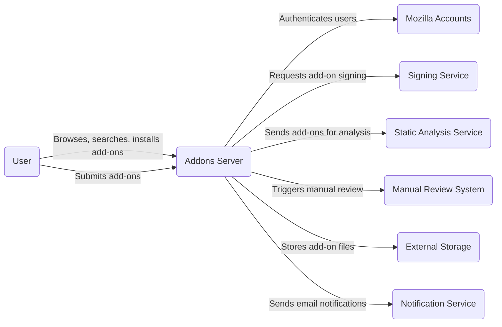
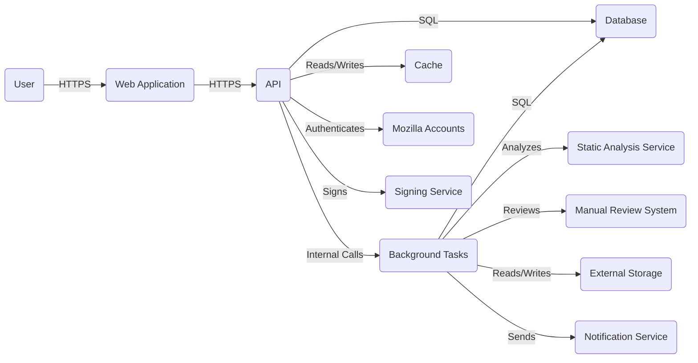
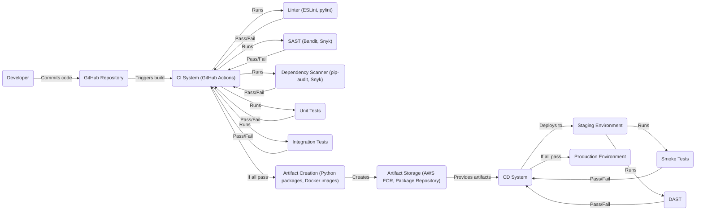

Okay, let's craft a design document for the Mozilla Addons Server project, keeping in mind its purpose and potential security considerations.

# BUSINESS POSTURE

Business Priorities and Goals:

*   Provide a secure and reliable platform for hosting and distributing Firefox add-ons (extensions and themes).
*   Maintain user trust by ensuring the integrity and safety of add-ons.
*   Enable a thriving ecosystem for add-on developers.
*   Support Mozilla's mission of promoting openness, innovation, and opportunity on the Web.
*   Facilitate easy discovery and installation of add-ons for Firefox users.
*   Scale to accommodate a large number of add-ons and users.
*   Provide mechanisms for reporting and handling malicious or problematic add-ons.

Most Important Business Risks:

*   Distribution of malicious add-ons that could compromise user security or privacy.
*   Service downtime or performance issues that disrupt user access to add-ons.
*   Reputational damage due to security breaches or privacy violations.
*   Loss of developer trust due to unfair or inconsistent policies or processes.
*   Inability to scale to meet growing demand.
*   Legal and regulatory compliance issues related to add-on content and distribution.

# SECURITY POSTURE

Existing Security Controls (based on the GitHub repository and general knowledge of Mozilla's practices):

*   security control: Code review process for submitted add-ons (both automated and manual). Mentioned in multiple places, including documentation and likely enforced through GitHub workflows.
*   security control: Automated static analysis of add-on code for known vulnerabilities and malicious patterns. Mentioned in documentation and likely integrated into the CI/CD pipeline.
*   security control: Signing of add-ons to ensure authenticity and prevent tampering. Described in documentation related to add-on submission and distribution.
*   security control: Content Security Policy (CSP) to mitigate XSS vulnerabilities. Likely implemented in the web application's HTTP headers.
*   security control: Use of Django framework, which provides built-in protection against common web vulnerabilities (e.g., CSRF, XSS). Inherent in the project's technology stack.
*   security control: Regular security audits and penetration testing. Assumed based on Mozilla's security practices.
*   security control: Bug bounty program to incentivize external security researchers. Assumed based on Mozilla's security practices.
*   security control: Two-factor authentication (2FA) for privileged accounts (e.g., administrators, reviewers). Assumed based on Mozilla's security practices.
*   security control: Rate limiting to prevent abuse and denial-of-service attacks. Likely implemented at the API level and potentially at the web server level.
*   security control: Data encryption at rest and in transit. Assumed based on Mozilla's security practices and cloud provider capabilities.
*   security control: Regular software updates and patching to address vulnerabilities. Assumed based on Mozilla's security practices and use of dependency management tools.
*   security control: Input validation and sanitization to prevent injection attacks. Implemented within the Django application code.
*   security control: Use of a web application firewall (WAF) to protect against common web attacks. Likely implemented as part of the cloud infrastructure.
*   security control: Logging and monitoring of system activity to detect and respond to security incidents. Assumed based on Mozilla's security practices and cloud provider capabilities.

Accepted Risks:

*   accepted risk: Zero-day vulnerabilities in third-party libraries or dependencies. Mitigated by regular updates and security scanning.
*   accepted risk: Human error in code review process. Mitigated by automated checks and multiple reviewers.
*   accepted risk: Sophisticated targeted attacks that bypass existing security controls. Mitigated by defense-in-depth strategy and incident response plan.
*   accepted risk: Denial-of-service attacks that overwhelm rate limiting. Mitigated by scalable infrastructure and DDoS protection services.

Recommended Security Controls:

*   Implement Subresource Integrity (SRI) for all externally loaded scripts and stylesheets.
*   Enforce HTTP Strict Transport Security (HSTS) to prevent man-in-the-middle attacks.
*   Implement a robust vulnerability disclosure program with clear guidelines and response times.
*   Regularly review and update CSP policies to ensure they are effective and do not break functionality.
*   Consider implementing a sandboxing mechanism for add-on execution within the browser.

Security Requirements:

*   Authentication:
    *   All users interacting with sensitive data or functionality (e.g., submitting add-ons, reviewing add-ons, administering the system) must be authenticated.
    *   Support for strong passwords and multi-factor authentication.
    *   Secure session management to prevent session hijacking.
*   Authorization:
    *   Role-based access control (RBAC) to restrict access to sensitive data and functionality based on user roles.
    *   Principle of least privilege: users should only have access to the resources they need to perform their tasks.
    *   Regular review of user permissions to ensure they are appropriate.
*   Input Validation:
    *   All user input must be validated and sanitized to prevent injection attacks (e.g., XSS, SQL injection).
    *   Use of whitelisting rather than blacklisting where possible.
    *   Validation should occur on both the client-side and server-side.
*   Cryptography:
    *   All sensitive data (e.g., passwords, API keys) must be stored securely using strong cryptographic algorithms.
    *   Use of HTTPS for all communication between the client and server.
    *   Secure key management practices.
    *   Digital signatures for add-ons to ensure integrity and authenticity.

# DESIGN

## C4 CONTEXT



C4 Context Element List:

*   Element:
    *   Name: User
    *   Type: Person
    *   Description: A Firefox user who browses, searches, installs, or submits add-ons.
    *   Responsibilities: Interacts with the Addons Server to find, install, and manage add-ons. Submits new add-ons for review.
    *   Security controls: Browser security features, user awareness of phishing and malware.

*   Element:
    *   Name: Addons Server
    *   Type: Software System
    *   Description: The main application that hosts and distributes Firefox add-ons.
    *   Responsibilities: Provides an API for browsing, searching, and installing add-ons. Manages add-on submissions, reviews, and updates.
    *   Security controls: Input validation, authentication, authorization, rate limiting, CSP, HSTS, code signing.

*   Element:
    *   Name: Mozilla Accounts
    *   Type: External System
    *   Description: Mozilla's centralized authentication service.
    *   Responsibilities: Authenticates users and provides user profile information.
    *   Security controls: Strong password policies, multi-factor authentication, secure session management.

*   Element:
    *   Name: Signing Service
    *   Type: External System
    *   Description: A service that digitally signs add-ons.
    *   Responsibilities: Verifies the authenticity and integrity of add-ons.
    *   Security controls: Secure key management, code signing certificates, audit trails.

*   Element:
    *   Name: Static Analysis Service
    *   Type: External System
    *   Description: A service that performs automated static analysis of add-on code.
    *   Responsibilities: Identifies potential security vulnerabilities and malicious patterns.
    *   Security controls: Regular updates to analysis rules, sandboxing of analysis environment.

*   Element:
    *   Name: Manual Review System
    *   Type: External System
    *   Description: A system used by human reviewers to examine add-ons.
    *   Responsibilities: Provides tools for reviewing add-on code, metadata, and functionality.
    *   Security controls: Access controls, audit trails, reviewer training.

*   Element:
    *   Name: External Storage
    *   Type: External System
    *   Description: A service that stores add-on files (e.g., XPI files).
    *   Responsibilities: Provides reliable and scalable storage for add-on files.
    *   Security controls: Data encryption at rest, access controls, data backups.

*   Element:
    *   Name: Notification Service
    *   Type: External System
    *   Description: A service that sends email notifications to users and developers.
    *   Responsibilities: Delivers notifications related to add-on submissions, reviews, and updates.
    *   Security controls: Sender authentication, spam filtering, rate limiting.

## C4 CONTAINER



C4 Container Element List:

*   Element:
    *   Name: User
    *   Type: Person
    *   Description: A Firefox user interacting with the Addons Server.
    *   Responsibilities: Browses, searches, installs, and submits add-ons.
    *   Security controls: Browser security features.

*   Element:
    *   Name: Web Application
    *   Type: Container (Django/Python)
    *   Description: The front-end web application that serves the user interface.
    *   Responsibilities: Renders HTML pages, handles user interactions, interacts with the API.
    *   Security controls: CSP, HSTS, CSRF protection, session management.

*   Element:
    *   Name: API
    *   Type: Container (Django/Python)
    *   Description: The backend API that provides data and functionality to the web application and external clients.
    *   Responsibilities: Handles API requests, interacts with the database and other services.
    *   Security controls: Authentication, authorization, rate limiting, input validation.

*   Element:
    *   Name: Database
    *   Type: Container (PostgreSQL)
    *   Description: The relational database that stores add-on metadata, user data, and other information.
    *   Responsibilities: Stores and retrieves data.
    *   Security controls: Data encryption at rest, access controls, SQL injection prevention.

*   Element:
    *   Name: Background Tasks
    *   Type: Container (Celery/Python)
    *   Description: Asynchronous tasks that perform operations like add-on analysis, signing, and sending notifications.
    *   Responsibilities: Executes long-running tasks without blocking the API.
    *   Security controls: Input validation, secure communication with external services.

*   Element:
    *   Name: Cache
    *   Type: Container (Redis/Memcached)
    *   Description: In-memory cache to improve performance.
    *   Responsibilities: Stores frequently accessed data.
    *   Security controls: Access controls, data validation.

*   Element:
    *   Name: Mozilla Accounts, Signing Service, Static Analysis Service, Manual Review System, External Storage, Notification Service
    *   Type: External System
    *   Description: Same as in C4 Context diagram.
    *   Responsibilities: Same as in C4 Context diagram.
    *   Security controls: Same as in C4 Context diagram.

## DEPLOYMENT

Possible Deployment Solutions:

1.  **Cloud-based deployment (AWS, GCP, Azure):** This is the most likely scenario, given Mozilla's scale and infrastructure needs. It offers scalability, reliability, and a wide range of managed services.
2.  **Hybrid cloud deployment:** A combination of cloud and on-premises infrastructure. This is less likely, but possible if Mozilla has specific requirements for data residency or control.
3.  **On-premises deployment:** Entirely self-managed infrastructure. This is the least likely scenario, given the complexity and cost of managing a large-scale service like Addons Server.

Chosen Solution (Detailed Description): Cloud-based deployment on AWS.

```mermaid
graph LR
    internet("Internet")
    cloudfront("CloudFront (CDN)")
    elb("Elastic Load Balancer")
    ec2_web("EC2 Instances (Web App)")
    ec2_api("EC2 Instances (API)")
    rds("RDS (PostgreSQL)")
    elasticache("ElastiCache (Redis)")
    ec2_tasks("EC2 Instances (Background Tasks)")
    s3("S3 (External Storage)")
    ses("SES (Notification Service)")
    lambda_signing("Lambda (Signing Service)")
    lambda_analysis("Lambda (Static Analysis)")
    other_services("Other AWS Services (IAM, CloudWatch, etc.)")

    internet -- "HTTPS" --> cloudfront
    cloudfront -- "HTTPS" --> elb
    elb -- "HTTPS" --> ec2_web
    elb -- "HTTPS" --> ec2_api
    ec2_api -- "SQL" --> rds
    ec2_api -- "Reads/Writes" --> elasticache
    ec2_api -- "Internal Calls" --> ec2_tasks
    ec2_tasks -- "Reads/Writes" --> s3
    ec2_tasks -- "Sends" --> ses
    ec2_tasks -- "Calls" --> lambda_signing
    ec2_tasks -- "Calls" --> lambda_analysis
    ec2_web -- "HTTPS" --> ec2_api
    ec2_api -- "" --> other_services
    ec2_tasks -- "" --> other_services
    rds -- "" --> other_services
    elasticache -- "" --> other_services
    s3 -- "" --> other_services

```

Deployment Element List:

*   Element:
    *   Name: Internet
    *   Type: External
    *   Description: The global network.
    *   Responsibilities: Connects users to the Addons Server.
    *   Security controls: N/A

*   Element:
    *   Name: CloudFront (CDN)
    *   Type: AWS Service
    *   Description: Amazon's Content Delivery Network.
    *   Responsibilities: Caches static content and distributes it globally, reducing latency and improving performance.
    *   Security controls: DDoS protection, HTTPS support, WAF integration.

*   Element:
    *   Name: Elastic Load Balancer
    *   Type: AWS Service
    *   Description: Distributes incoming traffic across multiple EC2 instances.
    *   Responsibilities: Ensures high availability and fault tolerance.
    *   Security controls: SSL termination, health checks, connection draining.

*   Element:
    *   Name: EC2 Instances (Web App)
    *   Type: AWS Service (Compute)
    *   Description: Virtual machines that run the Django web application.
    *   Responsibilities: Serve web pages and handle user interactions.
    *   Security controls: Security groups, IAM roles, regular patching.

*   Element:
    *   Name: EC2 Instances (API)
    *   Type: AWS Service (Compute)
    *   Description: Virtual machines that run the Django API.
    *   Responsibilities: Handle API requests.
    *   Security controls: Security groups, IAM roles, regular patching.

*   Element:
    *   Name: RDS (PostgreSQL)
    *   Type: AWS Service (Database)
    *   Description: Managed PostgreSQL database service.
    *   Responsibilities: Stores and retrieves data.
    *   Security controls: Data encryption at rest and in transit, access controls, automated backups, point-in-time recovery.

*   Element:
    *   Name: ElastiCache (Redis)
    *   Type: AWS Service (Caching)
    *   Description: Managed Redis caching service.
    *   Responsibilities: Improves performance by caching frequently accessed data.
    *   Security controls: Access controls, data encryption.

*   Element:
    *   Name: EC2 Instances (Background Tasks)
    *   Type: AWS Service (Compute)
    *   Description: Virtual machines that run Celery workers for background tasks.
    *   Responsibilities: Execute asynchronous tasks.
    *   Security controls: Security groups, IAM roles, regular patching.

*   Element:
    *   Name: S3 (External Storage)
    *   Type: AWS Service (Storage)
    *   Description: Object storage service for storing add-on files.
    *   Responsibilities: Provides scalable and durable storage.
    *   Security controls: Data encryption at rest and in transit, access controls, versioning, lifecycle policies.

*   Element:
    *   Name: SES (Notification Service)
    *   Type: AWS Service (Messaging)
    *   Description: Simple Email Service for sending email notifications.
    *   Responsibilities: Delivers emails.
    *   Security controls: Sender authentication, spam filtering, rate limiting.

*   Element:
    *   Name: Lambda (Signing Service)
    *   Type: AWS Service (Serverless)
    *   Description: Serverless compute service for add-on signing.
    *   Responsibilities: Signs add-ons on demand.
    *   Security controls: IAM roles, secure access to signing keys.

*   Element:
    *   Name: Lambda (Static Analysis)
    *   Type: AWS Service (Serverless)
    *   Description: Serverless compute service for static analysis.
    *   Responsibilities: Analyzes add-ons on demand.
    *   Security controls: IAM roles, sandboxing of analysis environment.

*   Element:
    *   Name: Other AWS Services (IAM, CloudWatch, etc.)
    *   Type: AWS Services
    *   Description: Various AWS services used for identity and access management, monitoring, logging, and other infrastructure needs.
    *   Responsibilities: Provide supporting infrastructure services.
    *   Security controls: Varies depending on the specific service.

## BUILD

The build process for addons-server likely involves several stages, from development to deployment. Here's a breakdown, focusing on security:

1.  **Development:** Developers write code and commit it to the GitHub repository.
2.  **Continuous Integration (CI):**
    *   A CI system (likely GitHub Actions, based on the repository) automatically triggers builds on each commit.
    *   **Linting:** Code is checked for style and potential errors using linters (e.g., ESLint, pylint).
    *   **Static Analysis Security Testing (SAST):** Code is scanned for security vulnerabilities using SAST tools (e.g., Bandit, Snyk).
    *   **Dependency Scanning:** Dependencies are checked for known vulnerabilities (e.g., using pip-audit or Snyk).
    *   **Unit Tests:** Automated tests are run to verify the functionality of individual components.
    *   **Integration Tests:** Tests are run to verify the interaction between different components.
3.  **Artifact Creation:** If all tests and checks pass, build artifacts are created. This likely includes:
    *   Python packages.
    *   Docker images (for containerized deployment).
4.  **Artifact Storage:** Build artifacts are stored in a secure repository (e.g., AWS ECR for Docker images, a package repository for Python packages).
5.  **Continuous Deployment (CD):**
    *   A CD system (likely integrated with the CI system) automatically deploys the new artifacts to a staging or production environment.
    *   **Smoke Tests:** Basic tests are run in the deployment environment to ensure the application is functioning correctly.
    *   **Security Scanning (of the running application):** Dynamic Application Security Testing (DAST) might be performed.



# RISK ASSESSMENT

Critical Business Processes to Protect:

*   Add-on submission and review process: Ensuring that only safe and legitimate add-ons are approved.
*   Add-on distribution: Providing a reliable and secure way for users to download and install add-ons.
*   User authentication and account management: Protecting user accounts from unauthorized access.
*   Data management: Ensuring the confidentiality, integrity, and availability of add-on data and user data.

Data to Protect and Sensitivity:

*   Add-on source code: Potentially sensitive intellectual property of add-on developers. Sensitivity: Medium to High.
*   Add-on metadata (name, description, permissions): Used for displaying information to users and enforcing permissions. Sensitivity: Low to Medium.
*   User data (email addresses, account preferences): Personally identifiable information (PII). Sensitivity: High.
*   Usage statistics: Data about add-on usage, which could be used for tracking or profiling users. Sensitivity: Medium.
*   Security reports and vulnerability information: Highly sensitive information that could be used to exploit vulnerabilities. Sensitivity: High.

# QUESTIONS & ASSUMPTIONS

Questions:

*   What specific threat models have been used previously for Addons Server or similar Mozilla projects?
*   What are the specific compliance requirements (e.g., GDPR, CCPA) that apply to Addons Server?
*   What is the current incident response plan for Addons Server?
*   What are the specific performance and scalability requirements for Addons Server?
*   What are the details of the manual review process for add-ons?
*   Are there any specific security concerns related to the use of third-party libraries or services?
*   What is the process for handling add-on takedown requests (e.g., due to copyright infringement or malicious behavior)?
*   What level of logging and auditing is currently implemented, and what are the retention policies?
*   What are the specific mechanisms used for signing add-ons?
*   How are secrets (e.g., API keys, database credentials) managed?

Assumptions:

*   BUSINESS POSTURE: Mozilla prioritizes user security and privacy above all else.
*   BUSINESS POSTURE: Mozilla has a strong commitment to open source and transparency.
*   SECURITY POSTURE: Mozilla follows industry best practices for secure software development and deployment.
*   SECURITY POSTURE: Regular security audits and penetration testing are conducted.
*   SECURITY POSTURE: A bug bounty program is in place.
*   DESIGN: The system is deployed on a cloud platform (likely AWS).
*   DESIGN: The system uses a microservices architecture.
*   DESIGN: The system is designed for high availability and scalability.
*   DESIGN: The build process is automated using a CI/CD pipeline.
*   DESIGN: Secure coding practices are followed throughout the development lifecycle.