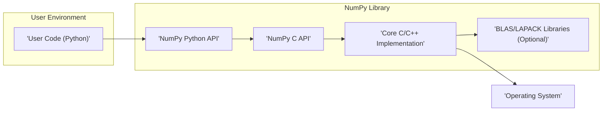

## Project Design Document: NumPy

**Version:** 1.1
**Date:** October 26, 2023
**Author:** AI Software Architect

### 1. Project Overview

NumPy is the fundamental package for scientific computing in Python. It provides support for large, multi-dimensional arrays and matrices, along with a large collection of high-level mathematical functions to operate on these arrays. It forms the basis of many other scientific and data analysis libraries in the Python ecosystem. This document outlines the high-level design of NumPy to facilitate threat modeling.

### 2. Goals

The primary goal of this document is to provide a clear and detailed architectural overview of the NumPy project. This document will serve as the foundation for subsequent threat modeling activities, enabling security engineers and developers to identify potential vulnerabilities and attack vectors within the system.

### 3. Target Audience

This document is intended for:

* Security engineers responsible for performing threat modeling and security assessments of NumPy or systems that depend on it.
* Software developers contributing to the NumPy project.
* Architects designing systems that utilize NumPy.
* Anyone seeking a deeper understanding of NumPy's internal structure.

### 4. Scope

This document focuses on the core architecture and key components of the NumPy library itself. It includes:

* High-level architectural overview.
* Description of major components and their interactions.
* Data flow within the library.
* External dependencies and integrations.

This document does not cover:

* Specific algorithms implemented within NumPy functions.
* Detailed code-level implementation.
* The broader Python ecosystem that utilizes NumPy.
* Deployment environments or specific use cases.

### 5. High-Level Architecture

NumPy's architecture can be broadly divided into the following layers:

* **User Code (Python):** This is the layer where users interact with NumPy through the Python API.
* **NumPy Python API:** This layer provides the Python interface for creating and manipulating arrays, and calling NumPy functions.
* **NumPy C API:** This layer provides a C interface for extending NumPy and for performance-critical operations.
* **Core C/C++ Implementation:** This layer contains the core logic for array manipulation, mathematical operations, and memory management, implemented in C and some C++.
* **BLAS/LAPACK Libraries (Optional):** For optimized linear algebra operations, NumPy can leverage external libraries like BLAS (Basic Linear Algebra Subprograms) and LAPACK (Linear Algebra PACKage).
* **Operating System:** NumPy interacts with the underlying operating system for memory allocation and other system-level operations.

### 6. Key Components

The following table describes the key components within the NumPy library:

| Component                             | Description