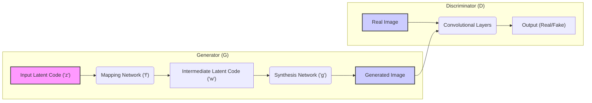

## Project Design Document: StyleGAN - Enhanced for Threat Modeling

**1. Project Title:** StyleGAN - Generative Adversarial Network for Image Synthesis

**2. Project Overview:**

This document provides a detailed architectural overview of the StyleGAN generative adversarial network (GAN), with a specific focus on facilitating subsequent threat modeling activities. StyleGAN, developed by NVIDIA, is renowned for its ability to generate high-resolution images with fine-grained control over stylistic features. This document aims to dissect the core components, data flow mechanisms, and underlying technologies of StyleGAN to enable a comprehensive security analysis. The information presented here will serve as the foundation for identifying potential vulnerabilities and attack vectors within the system.

**3. Target Audience:**

This document is primarily intended for:

*   Security architects and engineers tasked with performing threat modeling and security assessments on StyleGAN-based systems.
*   Software development teams involved in the deployment, integration, and maintenance of StyleGAN models and related infrastructure.
*   Cloud architects and DevOps engineers responsible for designing and managing the infrastructure supporting StyleGAN applications, with a focus on security.

**4. Scope:**

This document encompasses the following aspects of the StyleGAN project, specifically from a security perspective:

*   A detailed breakdown of the high-level architecture of the StyleGAN model, emphasizing components relevant to security boundaries and data flow.
*   In-depth descriptions of the key components within both the generator and discriminator networks, highlighting their functionalities and potential security implications.
*   A clear articulation of the data flow pathways during both the training and inference phases, identifying potential points of data manipulation or interception.
*   Identification of the core technologies and libraries utilized in StyleGAN implementations, which can introduce dependencies and potential vulnerabilities.
*   A survey of typical deployment environments for StyleGAN models, considering the unique security challenges associated with each.
*   An expanded section on preliminary security considerations, providing more specific examples of potential threats and vulnerabilities.

This document explicitly excludes:

*   Specific details regarding the datasets used for training StyleGAN models.
*   The intricate mathematical formulations and derivations underlying the model's operation.
*   Micro-level implementation details specific to the NVIDIA codebase or particular framework implementations.
*   Detailed performance optimization strategies that do not directly impact the security architecture.

**5. High-Level Architecture:**

**6. Component Details:**

*   **Generator (G):** The core component responsible for synthesizing realistic images from a latent space. It is further divided into:
    *   **Mapping Network ('f'):** This network transforms the input latent code ('z'), typically sampled from a Gaussian distribution, into an intermediate latent code ('w'). This transformation is non-linear and aims to disentangle the factors of variation within the latent space. From a security perspective, manipulation of this network or its inputs could lead to control over the generated image features.
        *   Input: Latent code ('z') - A vector representing a point in the latent space.
        *   Output: Intermediate latent code ('w') - A vector intended to represent independent style controls.
    *   **Synthesis Network ('g'):** This network constructs the output image progressively, layer by layer. It receives the intermediate latent code ('w') and uses it to control the style of the generated features at different scales. This is achieved through adaptive instance normalization (AdaIN) or similar style modulation techniques. Compromising this network could allow for direct manipulation of image content and style.
        *   Input: Intermediate latent code ('w').
        *   Output: Generated image (a tensor representing pixel values).
*   **Discriminator (D):** This component acts as the adversary during training, tasked with distinguishing between real images from the training dataset and synthetic images generated by the Generator. It typically consists of a series of convolutional layers that extract features from the input image, followed by fully connected layers that output a probability score. A compromised discriminator could lead to a false sense of security regarding the quality or realism of generated images, or be exploited to extract information about the training data.
    *   Input: An image - Either a real image from the training dataset or a generated image from the Generator.
    *   Output: A scalar value - Representing the probability that the input image is real (as opposed to generated).

**7. Data Flow:**

*   **Training Phase:**
    *   **Latent Code Sampling:** A batch of random latent codes ('z') is sampled from a predefined probability distribution. This is a potential point for adversarial input if the sampling process is not secure.
    *   **Mapping Network Transformation:** The sampled latent codes are fed into the Mapping Network ('f') to generate intermediate latent codes ('w'). Attacks targeting this stage could involve manipulating the network's weights or biases to influence the style representation.
    *   **Synthesis Network Generation:** The intermediate latent codes are used by the Synthesis Network ('g') to produce a batch of synthetic images. Vulnerabilities in this network could allow for the generation of undesirable or malicious content.
    *   **Real Image Input:** A batch of real images is sampled from the training dataset. The security of this data source is crucial to prevent data poisoning attacks.
    *   **Discrimination:** Both the generated and real images are fed into the Discriminator (D).
    *   **Feedback and Optimization:** The Discriminator's output (real/fake probabilities) is used to calculate loss functions, which are then used to update the weights of both the Generator and Discriminator through backpropagation. This feedback loop is a potential area for adversarial manipulation.
*   **Inference Phase (Image Generation):**
    *   **Latent Code Input:** A latent code ('z') is provided as input to the Generator. This input is a primary control point and needs to be secured against malicious or unintended values.
    *   **Mapping and Synthesis:** The latent code is processed through the Mapping Network ('f') and then the Synthesis Network ('g') to generate an output image.
    *   **Output Image Delivery:** The generated image is delivered to the requesting application or user. Secure delivery mechanisms are essential to prevent interception or tampering.

**8. Key Technologies:**

*   **Core Programming Language:**
    *   Python - The primary language for most StyleGAN implementations.
*   **Deep Learning Frameworks:**
    *   PyTorch - A widely used framework for StyleGAN development and research.
    *   TensorFlow - Another popular framework, potentially used in earlier versions or alternative implementations.
*   **Essential Libraries:**
    *   NumPy - For efficient numerical computations and array manipulation.
    *   PIL (Pillow) - For image processing and manipulation tasks.
    *   SciPy - Providing scientific and technical computing tools.
    *   CUDA/cuDNN - NVIDIA libraries for GPU acceleration, crucial for the performance of StyleGAN. Vulnerabilities in these libraries could impact the security of StyleGAN deployments.
*   **Potential Dependencies:**
    *   Various other Python libraries for data handling, visualization, and utilities. Each dependency introduces a potential point of vulnerability.

**9. Deployment Environment:**

The security considerations for StyleGAN significantly depend on the deployment environment:

*   **Cloud Platforms (AWS, GCP, Azure):**
    *   **Virtual Machines/Instances:** Security relies on proper VM hardening, access control (IAM), and network segmentation.
    *   **Containers (Docker, Kubernetes):** Container security best practices are crucial, including image scanning, vulnerability management, and secure orchestration.
    *   **Managed Services (e.g., SageMaker, Vertex AI):** Security is a shared responsibility, requiring understanding and configuration of the platform's security features. Misconfigurations can lead to vulnerabilities.
*   **On-Premise Infrastructure:**
    *   Physical security of the hardware is paramount.
    *   Network security controls (firewalls, intrusion detection) are essential.
    *   Secure configuration and patching of operating systems and supporting software are critical.
*   **Edge Devices:**
    *   Physical security of the device itself is a major concern.
    *   Limited computational resources may restrict the ability to implement robust security measures.
    *   Remote management and updates require secure channels.
*   **Research Environments:**
    *   Data security and access control are important to protect sensitive training data.
    *   Collaboration and sharing of models require secure mechanisms to prevent unauthorized access or modification.

**10. Security Considerations (Enhanced):**

This section expands on the initial security considerations, providing more specific examples of potential threats:

*   **Model Security:**
    *   **Model Theft/Extraction:** Unauthorized access to the trained model weights, potentially through insecure storage, network vulnerabilities, or insider threats. This allows attackers to replicate or monetize the model.
    *   **Reverse Engineering:** Analysis of the model architecture and weights to understand its inner workings, potentially revealing vulnerabilities or biases that can be exploited.
*   **Data Security (Training):**
    *   **Data Poisoning:**  Introduction of malicious or manipulated data into the training dataset, leading to the model learning undesirable behaviors or biases (e.g., generating biased outputs or being susceptible to specific adversarial attacks).
    *   **Privacy Breaches:** If the training data contains personally identifiable information (PII), vulnerabilities could lead to the unintentional generation of images revealing sensitive details.
*   **Input Security (Inference):**
    *   **Adversarial Attacks:** Carefully crafted input latent codes designed to cause the model to generate specific, targeted, and potentially harmful outputs (e.g., generating images with malicious content or bypassing content filters).
    *   **Denial of Service (DoS):** Flooding the inference service with a large number of requests to exhaust resources and prevent legitimate use.
    *   **Input Injection:** Attempting to inject malicious code or commands through the input latent code, although this is less likely given the nature of the input.
*   **Output Security:**
    *   **Misuse of Generated Content (Deepfakes):** Malicious use of generated images for disinformation campaigns, fraud, or impersonation.
    *   **Copyright Infringement:** Generating images that infringe on existing copyrighted material.
*   **Infrastructure Security:**
    *   **Unauthorized Access:** Exploiting vulnerabilities in the underlying infrastructure (operating systems, networks) to gain unauthorized access to the model or its data.
    *   **Vulnerability Exploitation:** Leveraging known vulnerabilities in the software and libraries used by StyleGAN (e.g., in PyTorch, CUDA).
    *   **Supply Chain Attacks:** Compromise of dependencies or third-party libraries used in the project, potentially introducing malicious code.
*   **Model Integrity:**
    *   **Model Tampering:** Unauthorized modification of the trained model weights, leading to unpredictable or malicious behavior.

**11. Assumptions and Constraints:**

*   This document assumes a foundational understanding of generative adversarial networks (GANs) and deep learning principles within the target audience.
*   The architectural description is primarily based on the original StyleGAN and StyleGAN2 research papers and common implementations. Variations and subsequent advancements in the architecture may exist.
*   Specific implementation details can vary significantly depending on the chosen deep learning framework, libraries, and hardware platform.
*   The security considerations outlined are preliminary and intended to provide a starting point for a more thorough and context-specific threat modeling exercise. A comprehensive threat model will require deeper analysis of the specific deployment environment and use cases.
*   The focus of this document is on the software and architectural aspects of StyleGAN. Organizational security policies and procedures are outside the scope of this document.
