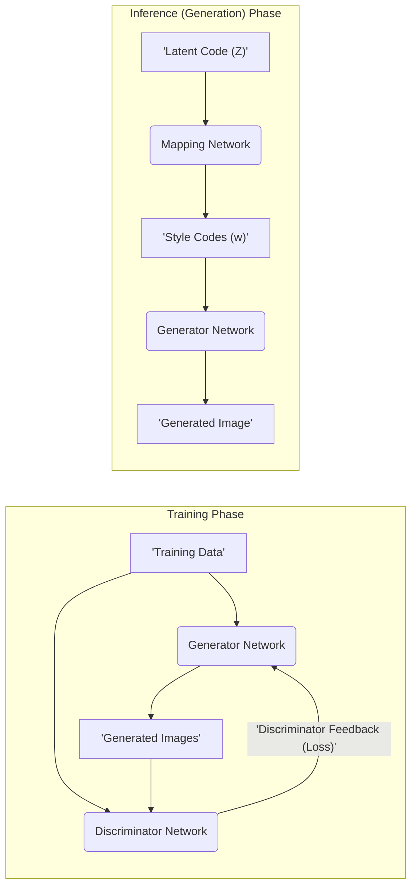
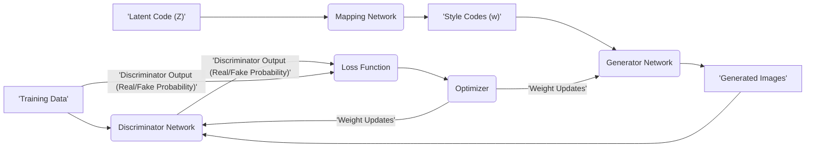
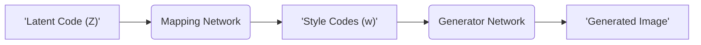

## Project Design Document: StyleGAN (Improved)

**1. Introduction**

This document provides an enhanced and detailed design overview of the StyleGAN project, based on the codebase available at [https://github.com/nvlabs/stylegan](https://github.com/nvlabs/stylegan). This revised document aims to provide a more comprehensive understanding of the architectural components, intricate data flows, and underlying technologies of StyleGAN. It serves as a robust foundation for subsequent threat modeling activities, enabling a thorough analysis of potential security vulnerabilities. StyleGAN is a sophisticated generative adversarial network (GAN) architecture renowned for its ability to generate high-resolution, photorealistic images with granular control over image styles and features.

**2. Goals and Objectives**

The primary goals and objectives of the StyleGAN project are:

*   **Achieve State-of-the-Art Image Fidelity:**  Generate synthetic images that are virtually indistinguishable from real-world photographs, pushing the boundaries of realism in generative models.
*   **Enable Disentangled Style Control:** Facilitate independent manipulation of specific visual attributes (styles) of the generated images, such as pose, lighting, and facial features, without affecting other attributes.
*   **Advance Generative Image Modeling Research:** Serve as a cutting-edge platform for exploring and developing novel techniques in generative image modeling and understanding the latent space of images.
*   **Foster Open Source Collaboration:**  Provide the research community with access to the codebase, pre-trained models, and training methodologies to encourage further innovation and development in the field.

**3. High-Level Architecture**

The StyleGAN architecture operates in two distinct phases: **Training** and **Inference (Generation)**. The training phase focuses on learning the underlying data distribution, while the inference phase leverages the learned model to generate new samples.

**4. Detailed Design**

This section provides a more granular breakdown of the key components and their interactions within the StyleGAN architecture, highlighting the specific functionalities of each element.

**4.1. Training Phase Components:**

*   **Training Data:**
    *   A substantial collection of real-world images representing the target distribution the model aims to learn.
    *   Typically curated for a specific category (e.g., human faces, natural landscapes, artwork).
    *   Undergoes preprocessing steps such as resizing to a consistent resolution, cropping to focus on relevant features, and normalization to standardize pixel values.
*   **Generator Network (G):**
    *   The central component responsible for synthesizing novel images from latent representations.
    *   Comprises several interconnected sub-networks and layers:
        *   **Mapping Network (MLP):** Transforms the input latent code (Z) into an intermediate latent space (W). This mapping is non-linear and aims to disentangle the factors of variation in the data.
        *   **Synthesis Network:**  Constructs the image progressively, starting from a low-resolution constant input. It iteratively increases the resolution through upsampling layers.
        *   **Style Blocks (Adaptive Instance Normalization - AdaIN):** Apply the style codes (w) to control the visual features at different resolutions. Each style code influences the mean and variance of the feature maps within a specific layer, enabling fine-grained style control.
        *   **Noise Inputs:** Introduce stochastic variation at each resolution level, contributing to the fine-grained details and realism of the generated images. These are typically per-pixel Gaussian noise.
*   **Discriminator Network (D):**
    *   A binary classifier tasked with distinguishing between genuine images from the training data and synthetic images produced by the Generator.
    *   Consists of multiple convolutional layers that progressively downsample the input image, extracting hierarchical features.
    *   Outputs a scalar value representing the probability that the input image is real (from the training data) rather than fake (generated).
*   **Loss Function:**
    *   A mathematical function that quantifies the discrepancy between the distributions of real and generated images. It guides the learning process by providing a measure of how well the Generator is fooling the Discriminator.
    *   Common loss functions employed in StyleGAN include variations of the non-saturating loss with techniques like R1 regularization or the path length regularization to improve training stability and sample quality.
*   **Optimizer:**
    *   An optimization algorithm used to update the weights and biases of the Generator and Discriminator networks based on the gradients calculated from the loss function.
    *   Popular optimizers include Adam or SGD with momentum, often with carefully tuned learning rates and other hyperparameters.

**4.2. Inference (Generation) Phase Components:**

*   **Latent Code (Z):**
    *   A random vector sampled from a predefined probability distribution, typically a standard Gaussian distribution.
    *   Serves as the initial seed for the image generation process, representing a point in the high-dimensional latent space that encodes the potential variations in the generated images.
*   **Mapping Network:**
    *   The pre-trained Mapping Network from the training phase.
    *   Transforms the input Latent Code (Z) into the intermediate latent space (W), which is designed to be more disentangled than the original latent space.
*   **Style Codes (w):**
    *   The output vectors from the Mapping Network.
    *   These vectors control the style of the generated image at different levels of detail and resolution within the Generator Network. Multiple style codes are often used, one for each style block in the Synthesis Network.
*   **Generator Network:**
    *   The pre-trained Generator Network from the training phase.
    *   Takes the Style Codes (w) as input and progressively generates the final high-resolution image.
*   **Generated Image:**
    *   The final output of the Generator Network.
    *   A synthetic image exhibiting the stylistic characteristics determined by the input Latent Code and the learned parameters of the network.

**5. Data Flow**

This section provides a more detailed illustration of the data flow during both the training and inference phases, emphasizing the transformations and interactions between components.

**5.1. Training Data Flow:**

*   Real images are sampled from the **Training Data** and fed into the **Discriminator Network**.
*   Random **Latent Codes (Z)** are sampled from a probability distribution.
*   The **Latent Codes (Z)** are input to the **Mapping Network**.
*   The **Mapping Network** transforms the latent codes into **Style Codes (w)**.
*   The **Style Codes (w)** are fed into the **Generator Network**.
*   The **Generator Network** synthesizes **Generated Images**.
*   Both the real images from the **Training Data** and the **Generated Images** are presented to the **Discriminator Network**.
*   The **Discriminator Network** outputs a probability score for each input, indicating its belief about whether the image is real or fake.
*   The **Loss Function** calculates a scalar value based on the Discriminator's outputs, quantifying the difference between the real and generated image distributions.
*   The **Optimizer** uses the gradients of the loss function with respect to the Generator's and Discriminator's parameters to update their weights, aiming to improve the Generator's ability to create realistic images and the Discriminator's ability to distinguish them.

**5.2. Inference Data Flow:**

*   A random **Latent Code (Z)** is sampled from the latent space.
*   The **Latent Code (Z)** is passed as input to the pre-trained **Mapping Network**.
*   The **Mapping Network** transforms the **Latent Code (Z)** into a set of **Style Codes (w)**.
*   The **Style Codes (w)** are fed into the pre-trained **Generator Network**.
*   The **Generator Network** utilizes the **Style Codes (w)** to generate a **Generated Image** with specific stylistic characteristics.

**6. Key Technologies**

*   **Primary Programming Language:** Python
*   **Core Deep Learning Framework:**  Typically implemented using either TensorFlow or PyTorch, providing the necessary tools for building and training neural networks.
*   **GPU Acceleration:**  Leverages CUDA (Compute Unified Device Architecture) for accelerating the computationally intensive training and inference processes on NVIDIA GPUs.
*   **Essential Libraries:**
    *   NumPy: For efficient numerical computations and array manipulation.
    *   SciPy: For scientific and technical computing tasks.
    *   PIL (Pillow): For image processing and manipulation.
    *   Other utility libraries for data loading, preprocessing, and visualization.

**7. Deployment Considerations**

The deployment strategy for StyleGAN depends heavily on the intended application and scale of usage.

*   **Local Workstations:** Suitable for research, experimentation, and generating individual images or small batches. Requires a machine equipped with a compatible GPU.
*   **Cloud Computing Platforms (AWS, GCP, Azure):** Ideal for large-scale image generation, training new models from scratch, and serving generated images through APIs. Cloud platforms offer scalable compute resources and managed services.
*   **Containerization (Docker):**  Enables packaging the StyleGAN application and its dependencies into a container, ensuring consistent execution across different environments and simplifying deployment.
*   **Edge Devices (Limited):** While possible for specific, less computationally demanding applications, deploying StyleGAN directly on edge devices is generally constrained by the hardware resources available. Optimization techniques might be necessary.
*   **Web Services/APIs:**  For providing image generation as a service, requiring the development of APIs to handle requests, manage resources, and deliver generated images.

**8. Security Considerations (Detailed)**

This section expands on the preliminary security considerations, providing a more in-depth analysis of potential threats and vulnerabilities.

*   **Training Data Security:**
    *   **Unauthorized Access:** Protecting the training dataset from unauthorized access, which could lead to data breaches or the use of proprietary data without permission.
    *   **Data Integrity:** Ensuring the integrity of the training data to prevent malicious modification or corruption, which could lead to biased or compromised models.
    *   **Privacy Concerns:** Addressing potential privacy issues if the training data contains personally identifiable information.
*   **Model Security:**
    *   **Model Theft:** Protecting trained model weights from unauthorized copying or extraction, as these models represent significant intellectual property and computational investment.
    *   **Model Poisoning:** Preventing attackers from injecting malicious data into the training process to subtly alter the model's behavior or introduce backdoors.
    *   **Adversarial Attacks:**  Understanding and mitigating potential adversarial attacks on the generated images, where subtle perturbations can cause the model to generate unintended or malicious outputs.
*   **Input Validation and Sanitization:**
    *   **Latent Space Manipulation:** Implementing checks and safeguards to prevent malicious manipulation of input latent codes that could lead to the generation of harmful or inappropriate content.
    *   **Parameter Injection:**  If the system allows for user-defined parameters, ensuring proper validation to prevent injection attacks.
*   **Output Security and Misuse:**
    *   **Deepfakes and Misinformation:**  Addressing the potential misuse of generated images for creating deepfakes or spreading misinformation.
    *   **Content Moderation:** Implementing mechanisms for detecting and filtering potentially harmful or inappropriate generated content.
    *   **Watermarking and Provenance:** Exploring techniques for watermarking generated images to track their origin and potentially mitigate misuse.
*   **Dependency Management and Supply Chain Security:**
    *   **Vulnerability Scanning:** Regularly scanning third-party libraries and dependencies for known vulnerabilities.
    *   **Secure Dependency Management:** Using tools and practices to ensure the integrity and authenticity of dependencies.
*   **Access Control and Authentication:**
    *   **Secure Access to Infrastructure:** Implementing robust authentication and authorization mechanisms to control access to training infrastructure, model storage, and generation endpoints.
    *   **API Security:**  If deployed as a service, securing APIs with authentication (e.g., API keys, OAuth), authorization, and rate limiting to prevent abuse and unauthorized access.
*   **Infrastructure Security:**
    *   **Secure Configuration:** Ensuring secure configuration of servers, networks, and cloud resources used for training and deployment.
    *   **Regular Security Audits:** Conducting regular security audits and penetration testing to identify and address potential vulnerabilities.

**9. Assumptions and Constraints**

*   **Availability of High-Quality Training Data:** The project's success is contingent on the availability of a large, diverse, and high-quality dataset relevant to the desired image generation task.
*   **Significant Computational Resources:** Training StyleGAN models requires substantial computational resources, including high-end GPUs and potentially distributed training infrastructure.
*   **Reliance on Deep Learning Frameworks:** The project depends on the stability and security of the underlying deep learning frameworks (TensorFlow or PyTorch) and their associated ecosystems.
*   **Open Source Nature and Community Contributions:** While beneficial, the open-source nature implies reliance on community contributions and the potential for vulnerabilities to be introduced or discovered.

This improved document provides a more detailed and comprehensive design overview of the StyleGAN project, offering a stronger foundation for understanding its intricacies and facilitating a more thorough and effective threat modeling process.