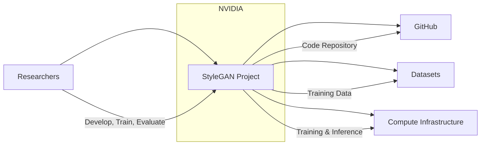
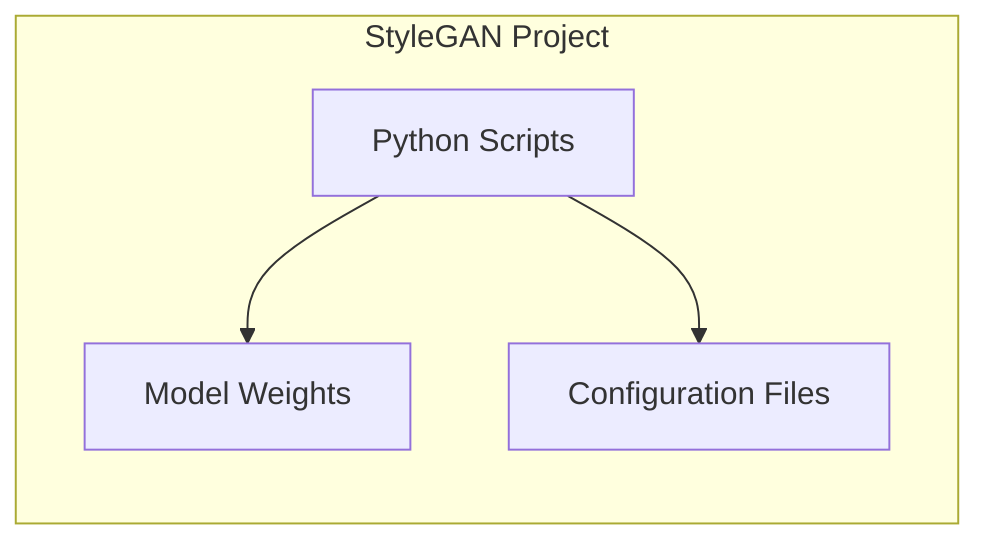
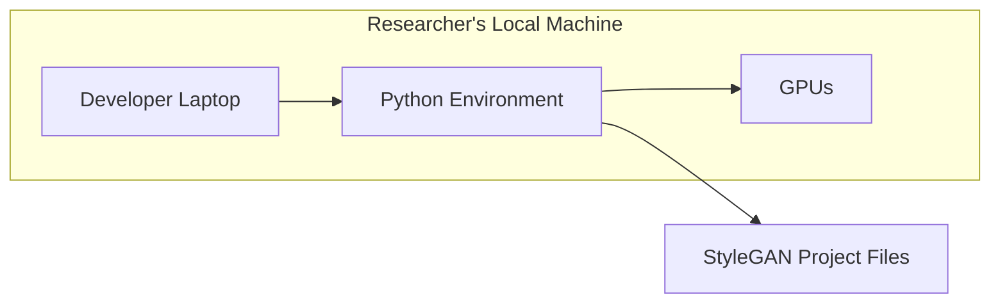
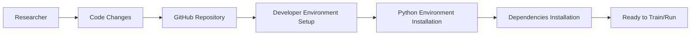

# BUSINESS POSTURE

- Business Priorities and Goals:
  - The primary goal of the StyleGAN project is to conduct research and development in the field of Generative Adversarial Networks (GANs), specifically focusing on style-based image generation.
  - The project aims to advance the state-of-the-art in image synthesis, exploring new techniques and architectures for generating high-quality and controllable images.
  - A key priority is to share research findings and code with the wider research community through open-source release on GitHub, fostering collaboration and accelerating innovation in the field.
  - Another priority might be to demonstrate NVIDIA's leadership and capabilities in AI and deep learning research.

- Business Risks:
  - Intellectual Property (IP) leakage: Publicly releasing research code and models could potentially lead to competitors or other entities benefiting from NVIDIA's research without direct contribution.
  - Misuse of technology: StyleGAN's ability to generate realistic images could be misused for malicious purposes, such as creating deepfakes or spreading misinformation, potentially damaging NVIDIA's reputation.
  - Vulnerabilities in research code: As research code is often developed rapidly and iteratively, it may contain security vulnerabilities that could be exploited if the code is used in production systems or if the repository itself is compromised.
  - Reputational risk: Negative public perception due to the potential misuse of StyleGAN technology could harm NVIDIA's brand image.
  - Limited direct revenue generation: As a research project, StyleGAN may not have immediate or direct revenue generation goals. The business risk here is the opportunity cost of investing resources in research that may not translate into profitable products or services in the short term.

# SECURITY POSTURE

- Existing Security Controls:
  - security control: GitHub repository access control: GitHub provides basic access control mechanisms to manage who can access and contribute to the repository. This is managed by repository administrators. (Implemented by GitHub platform)
  - security control: Public repository: The repository is public, meaning anyone can view the code. This is a conscious decision to promote open research and collaboration. (Implemented by repository settings)
  - accepted risk: Vulnerabilities in research code: Research code may not undergo the same level of rigorous security testing as production software, potentially leading to vulnerabilities. This is accepted to prioritize research agility and innovation.
  - accepted risk: Public code visibility: Making the code public inherently exposes it to potential security analysis and exploitation, although it also benefits from community review. This is accepted for open research purposes.

- Recommended Security Controls:
  - security control: Dependency scanning: Implement automated scanning of project dependencies to identify and mitigate known vulnerabilities in third-party libraries used by StyleGAN.
  - security control: Static Application Security Testing (SAST): Integrate SAST tools into the development workflow to automatically analyze the StyleGAN code for potential security flaws during development.
  - security control: Code review: Encourage security-focused code reviews, especially for any components that might be used in more sensitive contexts or if the project evolves beyond pure research.
  - security control: Security awareness training for researchers: Provide researchers with basic security awareness training to help them understand secure coding practices and potential security risks in research projects.

- Security Requirements:
  - Authentication:
    - For accessing and contributing to the GitHub repository, authentication is handled by GitHub accounts.
    - No specific authentication requirements are defined within the StyleGAN code itself as it is primarily research-focused and not a user-facing application.
  - Authorization:
    - GitHub repository permissions manage authorization for contributors and collaborators.
    - Within the StyleGAN code, authorization is not a primary concern as it is designed for research and experimentation, not for controlling access to sensitive data or functionalities.
  - Input Validation:
    - Input validation is relevant if StyleGAN is used in applications that take external input, such as user-provided images or parameters.
    - Research code might not have extensive input validation, but any application built on top of StyleGAN should implement robust input validation to prevent vulnerabilities like injection attacks.
  - Cryptography:
    - Cryptography might be relevant for securing model weights if they are considered highly sensitive or proprietary. However, for a public research project, model weights are often shared openly.
    - If StyleGAN is integrated into systems that handle sensitive data, cryptographic measures might be needed to protect data in transit and at rest within those systems, but this is outside the scope of the core StyleGAN research repository itself.

# DESIGN

## C4 CONTEXT

- Context Diagram Elements:
  - - Name: StyleGAN Project
    - Type: System
    - Description: The StyleGAN research project, encompassing the code, models, and research efforts related to style-based generative adversarial networks.
    - Responsibilities:
      - Develop and implement novel GAN architectures for image synthesis.
      - Train and evaluate StyleGAN models.
      - Publish research findings and code on GitHub.
    - Security controls:
      - security control: GitHub repository access control.
      - security control: Public code repository.

  - - Name: Researchers
    - Type: Person
    - Description: NVIDIA researchers and developers working on the StyleGAN project.
    - Responsibilities:
      - Design and implement StyleGAN models.
      - Train models using datasets and compute infrastructure.
      - Evaluate model performance and iterate on designs.
      - Contribute code and documentation to the GitHub repository.
    - Security controls:
      - security control: NVIDIA employee access controls.
      - security control: Code review processes (potentially).

  - - Name: GitHub
    - Type: External System
    - Description: The GitHub platform used to host the StyleGAN code repository, manage version control, and facilitate collaboration.
    - Responsibilities:
      - Host the StyleGAN code repository.
      - Provide version control and collaboration features.
      - Manage access control to the repository.
      - Facilitate issue tracking and pull requests.
    - Security controls:
      - security control: GitHub platform security controls (authentication, authorization, infrastructure security).

  - - Name: Datasets
    - Type: External System
    - Description: Public or internal datasets used to train StyleGAN models. These datasets consist of images used to teach the GAN to generate new images.
    - Responsibilities:
      - Provide training data for StyleGAN models.
      - Datasets are typically publicly available or curated internal datasets.
    - Security controls:
      - security control: Dataset source validation (ensure datasets are from trusted sources).
      - security control: Data access controls (if datasets are internal and sensitive).

  - - Name: Compute Infrastructure
    - Type: External System
    - Description: The computing resources (GPUs, servers, cloud infrastructure) used to train and run StyleGAN models.
    - Responsibilities:
      - Provide computational power for training and inference.
      - Infrastructure can be on-premises NVIDIA resources or cloud-based services.
    - Security controls:
      - security control: Infrastructure security controls (physical security, network security, access controls).
      - security control: Secure configuration of compute instances.

## C4 CONTAINER

- Container Diagram Elements:
  - - Name: Python Scripts
    - Type: Container - Application
    - Description: The core Python code implementing the StyleGAN models, training procedures, and utility scripts. This is the primary executable code of the project.
    - Responsibilities:
      - Implement StyleGAN model architectures.
      - Define training and evaluation logic.
      - Handle data loading and preprocessing.
      - Provide scripts for running experiments and generating images.
    - Security controls:
      - security control: SAST (Static Application Security Testing) on Python code (recommended).
      - security control: Dependency scanning for Python libraries (recommended).
      - security control: Code review (recommended).

  - - Name: Model Weights
    - Type: Container - Data Store
    - Description: Pre-trained model weights (parameters) of StyleGAN models. These files store the learned knowledge of the GAN and are essential for generating images without retraining.
    - Responsibilities:
      - Store trained model parameters.
      - Loaded by Python scripts for image generation.
      - May be distributed separately from the code.
    - Security controls:
      - security control: Access control to model weight storage (if considered sensitive).
      - security control: Integrity checks for model weights (to prevent tampering).

  - - Name: Configuration Files
    - Type: Container - Configuration
    - Description: Configuration files (e.g., YAML, JSON) that define hyperparameters, training settings, model architectures, and other configurable aspects of StyleGAN.
    - Responsibilities:
      - Store configuration parameters for the project.
      - Allow researchers to customize experiments and model behavior.
      - Separate configuration from code for flexibility.
    - Security controls:
      - security control: Access control to configuration files (if they contain sensitive settings).
      - security control: Validation of configuration file format and values (to prevent errors).

## DEPLOYMENT

- Deployment Architecture Options:
  - Researcher's Local Machine: For initial development, experimentation, and small-scale training.
  - On-Premises NVIDIA Compute Cluster: For larger-scale training and research within NVIDIA's infrastructure.
  - Cloud-based Compute Instances (e.g., AWS, GCP, Azure): For scalable training and deployment in cloud environments.

- Detailed Deployment Architecture (Researcher's Local Machine - Example):

- Deployment Diagram Elements (Researcher's Local Machine):
  - - Name: Developer Laptop
    - Type: Infrastructure - Physical Device
    - Description: The personal laptop or workstation used by a researcher to develop, run, and experiment with StyleGAN.
    - Responsibilities:
      - Host the development environment.
      - Provide user interface for interacting with StyleGAN.
      - Run Python scripts and initiate training/inference.
    - Security controls:
      - security control: Operating system security controls (user accounts, firewalls, antivirus).
      - security control: Physical security of the laptop.
      - security control: Full disk encryption (recommended).

  - - Name: Python Environment
    - Type: Infrastructure - Software Environment
    - Description: A Python environment (e.g., using venv or conda) with all necessary libraries and dependencies installed to run StyleGAN.
    - Responsibilities:
      - Provide the runtime environment for Python scripts.
      - Manage dependencies and libraries.
      - Execute StyleGAN code.
    - Security controls:
      - security control: Keeping Python environment and libraries up-to-date with security patches.
      - security control: Dependency scanning of installed libraries (recommended).

  - - Name: GPUs
    - Type: Infrastructure - Hardware
    - Description: Graphics Processing Units (GPUs) installed in the developer's machine, used to accelerate the computationally intensive tasks of training and running StyleGAN models.
    - Responsibilities:
      - Provide parallel processing power for deep learning computations.
      - Accelerate matrix operations and neural network calculations.
    - Security controls:
      - security control: Physical security of the hardware.
      - security control: Firmware updates for GPUs (as needed).

  - - Name: StyleGAN Project Files
    - Type: Infrastructure - File System
    - Description: The directory on the developer's laptop containing the StyleGAN project code, model weights, configuration files, and datasets (or links to datasets).
    - Responsibilities:
      - Store all project-related files.
      - Provide access to code, models, and data for the Python environment.
    - Security controls:
      - security control: File system permissions (to control access to project files).
      - security control: Data loss prevention measures (backups).

## BUILD

- Build Process Description:
  - For a research project like StyleGAN, a formal automated build process (CI/CD) is less likely to be in place compared to a product.
  - The "build" process is primarily manual and researcher-driven.
  - It involves setting up the Python environment, installing dependencies, and potentially pre-processing datasets.
  - There isn't a typical "build artifact" in the sense of a deployable application. The main artifacts are the code itself and the trained model weights.

- Build Process Diagram (Simplified Researcher Setup):

- Build Process Elements:
  - - Name: Researcher
    - Type: Person
    - Description: The researcher who develops and modifies the StyleGAN code.
    - Responsibilities:
      - Write and modify code.
      - Commit code changes to the GitHub repository.
      - Set up their development environment.
    - Security controls:
      - security control: Secure coding practices (researcher responsibility).
      - security control: Code review (potentially).

  - - Name: Code Changes
    - Type: Process - Development
    - Description: Modifications and additions to the StyleGAN codebase made by researchers.
    - Responsibilities:
      - Implement new features and bug fixes.
      - Improve model architectures and training procedures.
    - Security controls:
      - security control: Code review for significant changes (recommended).

  - - Name: GitHub Repository
    - Type: System - Code Repository
    - Description: The central repository on GitHub where the StyleGAN code is stored and version controlled.
    - Responsibilities:
      - Store the source code.
      - Track code changes.
      - Facilitate collaboration.
    - Security controls:
      - security control: GitHub access controls.
      - security control: Branch protection (potentially).

  - - Name: Developer Environment Setup
    - Type: Process - Environment Setup
    - Description: The process of setting up a local development environment with the necessary software and libraries to work on StyleGAN.
    - Responsibilities:
      - Configure Python environment.
      - Install required dependencies.
      - Download datasets (or access dataset locations).
    - Security controls:
      - security control: Using trusted sources for software and libraries (e.g., official Python package repositories).
      - security control: Dependency scanning (recommended after environment setup).

  - - Name: Python Environment Installation
    - Type: Process - Software Installation
    - Description: Installing Python and creating a virtual environment (e.g., using venv or conda).
    - Responsibilities:
      - Install Python interpreter.
      - Create isolated Python environment.
    - Security controls:
      - security control: Downloading Python from official sources.

  - - Name: Dependencies Installation
    - Type: Process - Software Installation
    - Description: Installing required Python libraries and packages listed in `requirements.txt` or similar dependency files.
    - Responsibilities:
      - Install all necessary libraries (TensorFlow, PyTorch, etc.).
      - Resolve dependency conflicts.
    - Security controls:
      - security control: Using `pip` or `conda` with trusted package repositories.
      - security control: Dependency scanning of installed packages (recommended).

  - - Name: Ready to Train/Run
    - Type: State - Operational Readiness
    - Description: The state where the development environment is set up, and the researcher can start training models or running inference.
    - Responsibilities:
      - Indicate that the environment is correctly configured.
      - Allow researchers to proceed with experiments.
    - Security controls:
      - security control: Verification of environment setup (manual testing).

# RISK ASSESSMENT

- Critical Business Processes:
  - Research and Development of advanced AI technologies, specifically Generative Adversarial Networks.
  - Maintaining NVIDIA's reputation as a leader in AI research and innovation.
  - Open-source contribution and collaboration with the research community.

- Data to Protect and Sensitivity:
  - Model Weights: High sensitivity. These represent the learned knowledge and are a valuable output of the research. While often shared in research, they are still a key asset.
  - Source Code: Medium sensitivity. Publicly available on GitHub, but modifications or vulnerabilities could impact the project's integrity.
  - Training Datasets: Low to Medium sensitivity. Often public datasets, but if internal or proprietary datasets are used, sensitivity increases.
  - Research Findings and IP: Medium to High sensitivity. The novel ideas and techniques developed in StyleGAN are valuable IP.

# QUESTIONS & ASSUMPTIONS

- BUSINESS POSTURE:
  - Question: Is StyleGAN purely a research project, or are there plans to productize or commercialize aspects of this technology in the future?
  - Assumption: Primarily a research project focused on advancing the state-of-the-art in GANs and open-source contribution.
  - Question: What is the acceptable level of risk regarding potential misuse of StyleGAN technology (e.g., deepfakes)?
  - Assumption: Risk of misuse is acknowledged but considered acceptable for the benefits of open research and innovation.

- SECURITY POSTURE:
  - Question: Are there any specific NVIDIA internal security policies or guidelines that apply to research projects like StyleGAN?
  - Assumption: Basic corporate security awareness and practices are expected, but research projects may have more flexibility than product development.
  - Question: Are there any compliance requirements (e.g., data privacy) that are relevant to StyleGAN, especially regarding training datasets?
  - Assumption: Public datasets are primarily used, minimizing data privacy compliance concerns. If internal datasets are used, appropriate data handling procedures are assumed to be in place.

- DESIGN:
  - Question: Is there any user-facing application or API planned to be built on top of StyleGAN, or is it purely a research codebase?
  - Assumption: Primarily a research codebase, not intended as a direct user-facing product in its current form.
  - Question: What is the typical scale of deployment for StyleGAN? Is it primarily for local research, or is it intended for larger-scale deployments in cloud or on-premises infrastructure?
  - Assumption: Primarily used in research environments, ranging from local machines to internal compute clusters and potentially cloud-based resources for larger experiments.