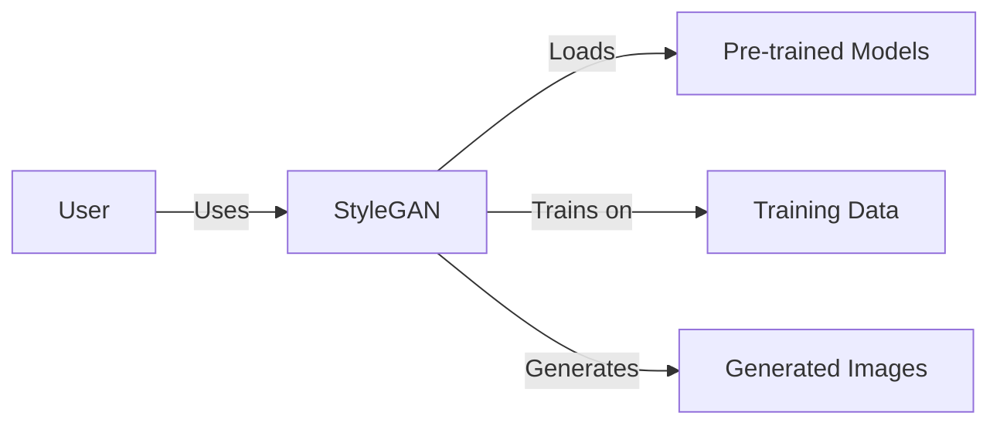
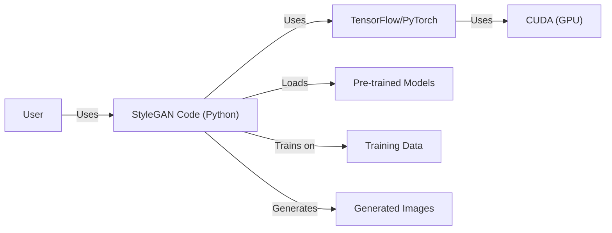
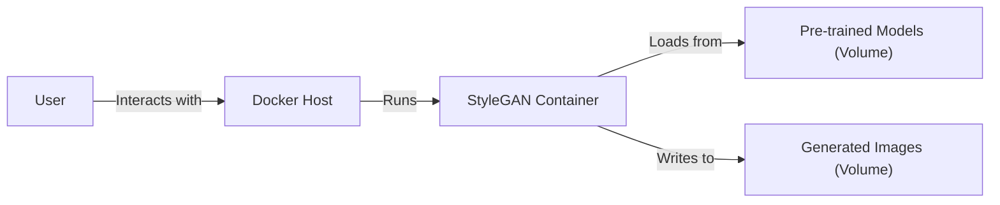
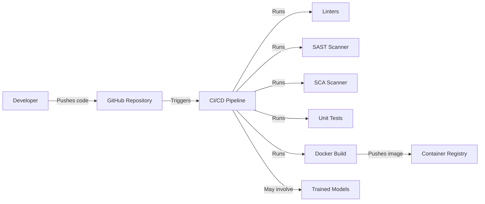

Okay, let's create a design document for the StyleGAN project from NVIDIA, focusing on aspects relevant for threat modeling.

# BUSINESS POSTURE

Business Priorities and Goals:

*   Research and Development: The primary goal is to advance the state-of-the-art in generative adversarial networks (GANs) for image synthesis. This involves exploring new architectures and techniques to improve image quality, control, and efficiency.
*   Innovation Leadership: Establish and maintain NVIDIA's leadership in the field of AI-driven image generation. This includes publishing research papers, releasing code, and potentially influencing future hardware designs.
*   Potential Commercialization: While primarily research-focused, the technology has potential applications in various commercial domains, such as:
    *   Content Creation: Generating realistic images for games, movies, advertising, and design.
    *   Data Augmentation: Creating synthetic data to train other AI models, especially in scenarios with limited real-world data.
    *   Image Editing and Manipulation: Providing tools for advanced image editing and style transfer.

Most Important Business Risks:

*   Intellectual Property Theft: The core algorithms and trained models represent valuable intellectual property. Unauthorized access and use could undermine NVIDIA's competitive advantage.
*   Reputational Damage: The technology could be misused to generate deepfakes or other harmful content, leading to negative publicity and potential legal liabilities.
*   Competition: Other research institutions and companies are actively working in the same field. Failure to innovate quickly enough could result in losing market leadership.
*   Ethical Concerns: The potential for misuse raises ethical concerns that need to be addressed proactively.

# SECURITY POSTURE

Existing Security Controls:

*   security control: Code Repository Access Control: The GitHub repository is public, meaning the source code is openly available. However, write access is likely restricted to authorized NVIDIA personnel.
*   security control: Licensing: The code is released under the NVIDIA Source Code License, which specifies terms of use and redistribution. This provides some legal protection against unauthorized commercial use.
*   security control: Code Review: While not explicitly stated, it's highly likely that NVIDIA employs internal code review processes to ensure code quality and identify potential security vulnerabilities before release.

Accepted Risks:

*   accepted risk: Open Source Code: The code is publicly available, meaning anyone can inspect it for vulnerabilities. This is a common trade-off for open-source projects, balancing transparency and collaboration with potential security risks.
*   accepted risk: Limited Runtime Security: The provided code primarily focuses on training and generating images. It does not include robust runtime security features like input sanitization or access controls, as it's primarily intended for research and development purposes.
*   accepted risk: Dependency Vulnerabilities: The project depends on external libraries (e.g., TensorFlow, PyTorch), which may contain vulnerabilities.

Recommended Security Controls:

*   security control: Software Composition Analysis (SCA): Implement SCA tools to identify and track known vulnerabilities in third-party dependencies.
*   security control: Static Application Security Testing (SAST): Integrate SAST tools into the development workflow to detect potential security flaws in the code itself.
*   security control: Fuzzing: Use fuzzing techniques to test the robustness of the code against unexpected or malicious inputs.
*   security control: Model Security: If pre-trained models are distributed, consider techniques to protect them from unauthorized access or modification (e.g., digital signatures, encryption).
*   security control: Watermarking: Add watermarks to generated images to help identify their origin and potentially deter misuse.

Security Requirements:

*   Authentication: Not directly applicable to the core functionality of StyleGAN, as it's primarily a library for image generation. However, if deployed as a service, authentication would be crucial.
*   Authorization: Similarly, not directly applicable in the current context. If used as part of a larger system with user accounts, authorization mechanisms would be needed to control access to features and data.
*   Input Validation: While the primary input is random noise, any user-configurable parameters (e.g., style vectors, truncation parameters) should be validated to prevent unexpected behavior or potential vulnerabilities.
*   Cryptography: If sensitive data is involved (e.g., training data, user-provided images), appropriate cryptographic techniques should be used for storage and transmission. This is not a primary concern for the core StyleGAN functionality, but could be relevant in specific applications.

# DESIGN

## C4 CONTEXT

Element Descriptions:

*   Element:
    *   Name: User
    *   Type: Person
    *   Description: A researcher, developer, or artist who uses StyleGAN to generate or manipulate images.
    *   Responsibilities: Provides input parameters, runs the code, and uses the generated output.
    *   Security controls: None directly implemented by the user. Relies on the security of the environment where StyleGAN is run.

*   Element:
    *   Name: StyleGAN
    *   Type: Software System
    *   Description: The core StyleGAN software, including the generator and discriminator networks, training scripts, and utility functions.
    *   Responsibilities: Generates images based on input noise and (optionally) pre-trained models or training data.
    *   Security controls: Code repository access control, licensing.

*   Element:
    *   Name: Pre-trained Models
    *   Type: Data
    *   Description: Pre-trained StyleGAN models that can be used to generate images without requiring training.
    *   Responsibilities: Provides a starting point for image generation.
    *   Security controls: Potentially model security measures (e.g., digital signatures).

*   Element:
    *   Name: Training Data
    *   Type: Data
    *   Description: Datasets of images used to train StyleGAN models.
    *   Responsibilities: Provides the data that StyleGAN learns from.
    *   Security controls: Potentially data sanitization and privacy protection measures.

*   Element:
    *   Name: Generated Images
    *   Type: Data
    *   Description: The images produced by StyleGAN.
    *   Responsibilities: Represents the output of the system.
    *   Security controls: Potentially watermarking.

## C4 CONTAINER

Element Descriptions:

*   Element:
    *   Name: User
    *   Type: Person
    *   Description: A researcher, developer, or artist who uses StyleGAN to generate or manipulate images.
    *   Responsibilities: Provides input parameters, runs the code, and uses the generated output.
    *   Security controls: None directly implemented by the user. Relies on the security of the environment where StyleGAN is run.

*   Element:
    *   Name: StyleGAN Code (Python)
    *   Type: Application
    *   Description: The Python code that implements the StyleGAN architecture and training procedures.
    *   Responsibilities: Implements the core logic of StyleGAN, manages data loading, training, and image generation.
    *   Security controls: Code repository access control, licensing, potential SAST and SCA.

*   Element:
    *   Name: TensorFlow/PyTorch
    *   Type: Framework
    *   Description: The deep learning framework used to implement StyleGAN (either TensorFlow or PyTorch).
    *   Responsibilities: Provides the underlying infrastructure for building and training neural networks.
    *   Security controls: Relies on the security of the chosen framework and its dependencies. SCA is crucial.

*   Element:
    *   Name: CUDA (GPU)
    *   Type: Hardware
    *   Description: The NVIDIA GPU and CUDA toolkit used for accelerated computation.
    *   Responsibilities: Provides the computational power for training and generating images.
    *   Security controls: Relies on the security of the GPU drivers and the underlying hardware.

*   Element:
    *   Name: Pre-trained Models
    *   Type: Data
    *   Description: Pre-trained StyleGAN models.
    *   Responsibilities: Provides a starting point for image generation.
    *   Security controls: Potentially model security measures (e.g., digital signatures).

*   Element:
    *   Name: Training Data
    *   Type: Data
    *   Description: Datasets of images used to train StyleGAN models.
    *   Responsibilities: Provides the data that StyleGAN learns from.
    *   Security controls: Potentially data sanitization and privacy protection measures.

*   Element:
    *   Name: Generated Images
    *   Type: Data
    *   Description: The images produced by StyleGAN.
    *   Responsibilities: Represents the output of the system.
    *   Security controls: Potentially watermarking.

## DEPLOYMENT

Possible Deployment Solutions:

1.  Local Machine: Running StyleGAN directly on a user's machine with a compatible GPU and software environment.
2.  Cloud VM: Deploying StyleGAN on a virtual machine in a cloud environment (e.g., AWS, GCP, Azure).
3.  Containerized Deployment: Packaging StyleGAN and its dependencies into a Docker container for easier deployment and portability.
4.  Serverless Functions: Deploying specific StyleGAN functionalities (e.g., image generation) as serverless functions. This is less likely given the computational requirements.

Chosen Solution (for detailed description): Containerized Deployment (using Docker)

Element Descriptions:

*   Element:
    *   Name: User
    *   Type: Person
    *   Description: Interacts with the deployed StyleGAN container.
    *   Responsibilities: Sends requests to the container and receives generated images.
    *   Security controls: Depends on the access controls configured for the Docker host and container.

*   Element:
    *   Name: Docker Host
    *   Type: Infrastructure
    *   Description: The machine (physical or virtual) that runs the Docker engine and hosts the StyleGAN container.
    *   Responsibilities: Provides the runtime environment for the container.
    *   Security controls: Operating system security, Docker daemon security, network security.

*   Element:
    *   Name: StyleGAN Container
    *   Type: Container
    *   Description: A Docker container that packages StyleGAN, its dependencies, and potentially pre-trained models.
    *   Responsibilities: Runs the StyleGAN code and generates images.
    *   Security controls: Container image security (e.g., vulnerability scanning), limited container privileges.

*   Element:
    *   Name: Pre-trained Models (Volume)
    *   Type: Data
    *   Description: A Docker volume that stores pre-trained StyleGAN models.
    *   Responsibilities: Provides persistent storage for the models.
    *   Security controls: Access controls for the Docker volume.

*   Element:
    *   Name: Generated Images (Volume)
    *   Type: Data
    *   Description: A Docker volume that stores the generated images.
    *   Responsibilities: Provides persistent storage for the output.
    *   Security controls: Access controls for the Docker volume.

## BUILD

The build process for StyleGAN, as inferred from the GitHub repository and common practices, likely involves the following steps:

1.  Developer: A developer writes or modifies the StyleGAN code (Python).
2.  Code Repository (GitHub): The code is pushed to the GitHub repository.
3.  (Optional) CI/CD Pipeline: A CI/CD pipeline (e.g., GitHub Actions, Jenkins) might be triggered by code changes. This pipeline could perform the following steps:
    *   Linting: Check the code for style and potential errors.
    *   Static Analysis (SAST): Scan the code for security vulnerabilities.
    *   Dependency Scanning (SCA): Identify vulnerabilities in third-party libraries.
    *   Unit Tests: Run unit tests to verify the correctness of individual components.
    *   Build Docker Image: Create a Docker image containing the StyleGAN code and its dependencies.
    *   Push Docker Image: Push the Docker image to a container registry (e.g., Docker Hub, NVIDIA NGC).
4.  Artifacts: The primary artifacts are:
    *   Source Code (in the GitHub repository)
    *   (Optional) Docker Image (in a container registry)
    *   Trained Models (typically stored separately, potentially on cloud storage or a dedicated model repository)

Security Controls in Build Process:

*   security control: Code Repository Access Control: Limiting write access to the GitHub repository.
*   security control: Linting: Enforcing coding standards and identifying potential errors.
*   security control: Static Analysis (SAST): Detecting security vulnerabilities in the code.
*   security control: Software Composition Analysis (SCA): Identifying vulnerabilities in dependencies.
*   security control: Unit Tests: Verifying the correctness of code components.
*   security control: Docker Image Security: Scanning the Docker image for vulnerabilities.

# RISK ASSESSMENT

Critical Business Processes:

*   Research and Development: The core process of developing and improving StyleGAN.
*   Model Training: The process of training StyleGAN models on large datasets.
*   Image Generation: The process of using StyleGAN to generate images.

Data to Protect:

*   Source Code: High sensitivity. Contains the core algorithms and intellectual property.
*   Trained Models: High sensitivity. Represents a significant investment in training and data.
*   Training Data: Variable sensitivity, depending on the nature of the data. Could range from publicly available images to proprietary or sensitive datasets.
*   Generated Images: Generally low sensitivity, unless used in a specific context where they become sensitive (e.g., generating images of specific individuals).

# QUESTIONS & ASSUMPTIONS

Questions:

*   What specific datasets are used for training StyleGAN models? Are there any privacy or security concerns related to these datasets?
*   Are there any plans to deploy StyleGAN as a service or API? If so, what are the security requirements for such a deployment?
*   What is the process for managing and distributing pre-trained models?
*   Are there any specific legal or ethical guidelines that NVIDIA follows regarding the use and distribution of StyleGAN?
*   What is the process for handling vulnerability reports related to StyleGAN?

Assumptions:

*   BUSINESS POSTURE: NVIDIA prioritizes innovation and leadership in the field of AI-driven image generation.
*   BUSINESS POSTURE: NVIDIA is aware of the potential for misuse of StyleGAN and takes steps to mitigate these risks.
*   SECURITY POSTURE: NVIDIA has internal security processes and guidelines that are followed during the development of StyleGAN.
*   SECURITY POSTURE: The primary use case for StyleGAN is research and development, and runtime security is not a primary focus of the provided code.
*   DESIGN: The provided code is primarily intended to be run in a controlled environment (e.g., a local machine, a secure cloud VM).
*   DESIGN: Users are responsible for securing their own environments and data.
*   DESIGN: The build process may not be fully automated, and some steps may be performed manually.