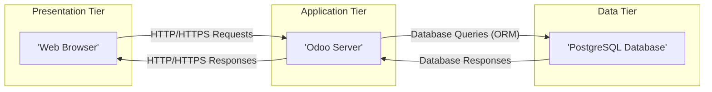
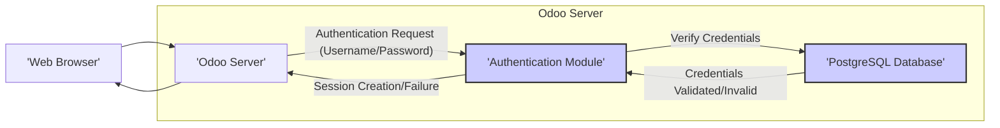
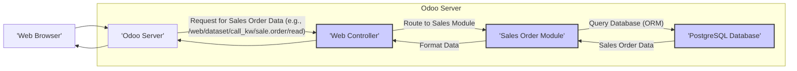
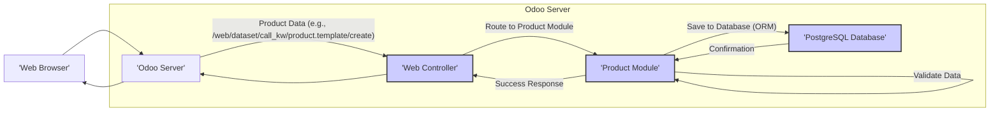

# Project Design Document: Odoo ERP System

**Version:** 1.1
**Date:** October 26, 2023
**Author:** AI Software Architect

## 1. Introduction

This document provides an enhanced architectural design of the Odoo ERP system, based on the open-source project available at [https://github.com/odoo/odoo](https://github.com/odoo/odoo). This revised document offers a more detailed understanding of the system's components, their interactions, and key data flows, specifically tailored for effective threat modeling.

## 2. Goals and Objectives

*   Provide a comprehensive and detailed overview of the Odoo architecture.
*   Clearly identify key components, their functionalities, and underlying technologies.
*   Describe the primary and secondary data flows within the system, including specific module interactions.
*   Highlight potential security-relevant areas with more specific examples for thorough threat modeling.
*   Serve as a robust and detailed reference point for security assessments, penetration testing, and design improvements.

## 3. System Architecture Overview

Odoo's architecture is fundamentally modular, built around a core framework that supports a wide array of business applications (modules). The system adheres to a multi-tier architecture:

*   **Presentation Tier (Web Client):** The user-facing interface, typically accessed via a web browser.
*   **Application Tier (Odoo Server):** The central processing unit, housing the business logic, module implementations, and API endpoints.
*   **Data Tier (Database):** The persistent storage layer for all system data.

## 4. Key Components

This section provides a more granular view of the major components within the Odoo system.

### 4.1. Web Client

*   **Description:** The front-end interface enabling user interaction with Odoo.
*   **Functionality:**
    *   Rendering dynamic user interfaces based on server-side definitions.
    *   Handling user input events (e.g., clicks, form submissions).
    *   Displaying data received from the Odoo Server, often formatted using JavaScript frameworks.
    *   Initiating API calls (typically RESTful) to the Odoo Server to perform actions or retrieve data.
    *   Managing user sessions and local storage.
*   **Technology:** Primarily JavaScript (often utilizing the Odoo framework's JavaScript components), HTML, and CSS.
*   **Security Considerations:**
    *   High susceptibility to client-side vulnerabilities such as Cross-Site Scripting (XSS) through injection points in server-rendered content or user-provided data.
    *   Reliance on secure communication (HTTPS) to protect data in transit between the browser and the server.
    *   Importance of secure session management to prevent session hijacking or fixation attacks.
    *   Potential for vulnerabilities in third-party JavaScript libraries used by the client.

### 4.2. Odoo Server

*   **Description:** The core application server responsible for processing requests, executing business logic, and managing data interactions.
*   **Functionality:**
    *   Receiving and routing requests from the Web Client and other integrated systems.
    *   Executing business logic defined within Odoo modules (apps).
    *   Managing user authentication and authorization using its internal mechanisms and potentially external providers.
    *   Interacting with the PostgreSQL database via the Odoo ORM (Object-Relational Mapper).
    *   Providing a comprehensive suite of APIs:
        *   **Web Service API (XML-RPC, JSON-RPC):** Used primarily for communication with the Web Client and external systems.
        *   **Internal Python API:** Used for communication between different Odoo modules.
    *   Handling asynchronous tasks and scheduled actions through a worker system.
    *   Generating reports in various formats (PDF, XLSX, etc.).
*   **Technology:** Primarily Python, leveraging frameworks like Werkzeug for WSGI and Jinja2 for templating.
*   **Key Sub-components:**
    *   **Odoo Framework:** The foundational layer providing core functionalities like ORM, workflow engine, reporting engine, and security mechanisms.
    *   **Modules (Apps):**  Discrete units of functionality implementing specific business processes (e.g., Sales, Inventory, Accounting, Manufacturing, CRM, etc.). These can be:
        *   **Core Modules:** Developed and maintained by Odoo S.A.
        *   **Community Modules (OCA):** Developed by the Odoo community.
        *   **Custom Modules:** Developed specifically for a particular deployment.
    *   **ORM (Object-Relational Mapper):**  Abstracts database interactions, providing a Pythonic interface for querying and manipulating data.
    *   **Web Service API:** Exposes functionalities through standardized protocols for external integrations.
    *   **Workflow Engine:** Manages automated processes and state transitions within business workflows.
    *   **Report Engine:** Facilitates the generation of dynamic reports based on data within the system.
*   **Security Considerations:**
    *   Potential for server-side vulnerabilities such as SQL Injection (if raw SQL queries are used or ORM is misused), Remote Code Execution (through insecure deserialization or template injection), and insecure file uploads.
    *   Importance of secure configuration and hardening of the Odoo Server instance and its dependencies.
    *   Criticality of module security, as vulnerabilities in individual modules can compromise the entire system. This includes access control within modules and secure coding practices.
    *   API security is paramount, requiring robust authentication (e.g., API keys, OAuth 2.0), authorization, input validation, and rate limiting to prevent abuse.
    *   Vulnerabilities in third-party Python libraries used by Odoo or its modules.

### 4.3. PostgreSQL Database

*   **Description:** The relational database system used by Odoo for persistent data storage.
*   **Functionality:**
    *   Storing all application data, including user credentials, business records, configuration settings, and module data.
    *   Providing data persistence, retrieval, and transactional integrity.
    *   Supporting indexing and query optimization for efficient data access.
*   **Technology:** PostgreSQL.
*   **Security Considerations:**
    *   Requires strong authentication and authorization mechanisms to control access to the database.
    *   Vulnerable to SQL Injection attacks if the Odoo Server does not properly sanitize user inputs before constructing database queries.
    *   Importance of data encryption at rest (using PostgreSQL features or disk-level encryption) and in transit (using TLS/SSL for database connections).
    *   Regular database backups and a robust disaster recovery plan are essential.
    *   Properly configured firewall rules to restrict network access to the database server.

### 4.4. External Integrations (Conceptual)

*   **Description:** Odoo's modular design facilitates integration with various external systems and services to extend its functionality.
*   **Examples:**
    *   Payment gateways (e.g., Stripe, PayPal) via APIs.
    *   Shipping providers (e.g., UPS, FedEx) via APIs.
    *   Email servers (SMTP) for sending notifications and transactional emails.
    *   LDAP/OAuth providers for external authentication.
    *   Other business applications (e.g., CRM, e-commerce platforms) via REST or other APIs.
*   **Communication Protocols:** Primarily HTTP/HTTPS for API communication, SMTP for email, and potentially other protocols depending on the integration.
*   **Security Considerations:**
    *   Security of the third-party APIs and services being integrated with, including their authentication and authorization mechanisms.
    *   Secure storage and management of API keys, tokens, and other credentials required for integration.
    *   Ensuring secure data exchange between Odoo and external systems, including data validation and encryption.
    *   Potential for vulnerabilities introduced through insecure integration code or misconfigurations.

## 5. Data Flow

This section provides more detailed data flow diagrams, highlighting specific module interactions.

### 5.1. User Login

*   The user enters their login credentials in the Web Browser.
*   The Web Browser sends an authentication request (typically a POST request with username and password) to the Odoo Server.
*   The Odoo Server's Authentication Module processes the request.
*   The Authentication Module queries the PostgreSQL Database to verify the provided credentials against stored user data.
*   The PostgreSQL Database returns the validation result to the Authentication Module.
*   Based on the validation, the Authentication Module either creates a new user session or returns an authentication failure to the Odoo Server.
*   The Odoo Server sends a response back to the Web Browser, typically setting a session cookie upon successful authentication.

### 5.2. Requesting Data (e.g., Viewing a Sales Order)

*   The user interacts with the Web Browser to request data, such as viewing a specific sales order.
*   The Web Browser sends a request to the Odoo Server, often targeting a specific web controller endpoint (e.g., `/web/dataset/call_kw/sale.order/read`).
*   The Odoo Server's Web Controller routes the request to the appropriate module, in this case, the Sales Order Module.
*   The Sales Order Module uses the Odoo ORM to query the PostgreSQL Database for the requested sales order data.
*   The PostgreSQL Database returns the sales order data to the Sales Order Module.
*   The Sales Order Module formats the data (often into JSON) and sends it back through the Web Controller to the Web Browser for display.

### 5.3. Saving Data (e.g., Creating a New Product)

*   The user enters product information in the Web Browser and submits the data.
*   The Web Browser sends the product data to the Odoo Server, typically targeting a web controller endpoint for creating records (e.g., `/web/dataset/call_kw/product.template/create`).
*   The Odoo Server's Web Controller routes the request to the Product Module.
*   The Product Module validates the incoming data to ensure its integrity and correctness.
*   The Product Module uses the Odoo ORM to save the new product data to the PostgreSQL Database.
*   The PostgreSQL Database confirms the successful data insertion.
*   The Product Module sends a success response back through the Web Controller to the Web Browser.

## 6. Security Considerations (Detailed)

This section provides a more detailed breakdown of potential security concerns for each component.

*   **Web Client:**
    *   **Cross-Site Scripting (XSS):**  Malicious scripts injected into web pages viewed by other users. This can occur through unsanitized user input displayed on the page or vulnerabilities in server-side rendering logic.
    *   **Cross-Site Request Forgery (CSRF):**  Attacker tricks a logged-in user into making unintended requests on the Odoo application.
    *   **Insecure Session Management:**  Vulnerabilities in how user sessions are handled (e.g., predictable session IDs, lack of HTTPOnly or Secure flags on cookies) can lead to session hijacking.
    *   **Client-Side Data Tampering:**  Manipulating data in the browser before sending it to the server, potentially bypassing client-side validation.
    *   **Dependency Vulnerabilities:**  Security flaws in third-party JavaScript libraries used by the client.

*   **Odoo Server:**
    *   **SQL Injection:**  Exploiting vulnerabilities in database queries to execute arbitrary SQL commands, potentially leading to data breaches or manipulation.
    *   **Remote Code Execution (RCE):**  Gaining the ability to execute arbitrary code on the server. This can occur through vulnerabilities like insecure deserialization, template injection, or file upload vulnerabilities.
    *   **Authentication and Authorization Flaws:**  Weak password policies, bypassable authentication mechanisms, or improperly configured access controls can allow unauthorized access.
    *   **Insecure Direct Object References (IDOR):**  Exposing internal object IDs that can be directly manipulated to access unauthorized resources.
    *   **API Security Vulnerabilities:**  Lack of proper authentication, authorization, input validation, or rate limiting on API endpoints can lead to abuse and security breaches.
    *   **Module Vulnerabilities:**  Security flaws within individual Odoo modules (especially community or custom modules) can compromise the entire system.
    *   **Denial of Service (DoS):**  Overwhelming the server with requests to make it unavailable.

*   **PostgreSQL Database:**
    *   **SQL Injection (Indirect):** While the Odoo ORM aims to prevent direct SQL injection, vulnerabilities in custom SQL queries or misuse of the ORM can still lead to this.
    *   **Insufficient Access Controls:**  Granting excessive privileges to database users can increase the impact of a compromise.
    *   **Data Breach through Direct Access:**  If the database server is directly accessible from the internet or an untrusted network.
    *   **Lack of Encryption:**  Sensitive data stored without encryption at rest is vulnerable if the database is compromised.
    *   **Backup Security:**  Insecurely stored or accessed backups can lead to data breaches.

*   **External Integrations:**
    *   **Insecure API Communication:**  Data transmitted over unencrypted channels (HTTP) or without proper authentication can be intercepted or manipulated.
    *   **Credential Compromise:**  If API keys or other credentials for external services are stored insecurely within Odoo.
    *   **Data Exposure:**  Sensitive data being unintentionally exposed to external systems due to misconfigured integrations.
    *   **Man-in-the-Middle (MitM) Attacks:**  If communication with external services is not properly secured with TLS/SSL.

## 7. Deployment Considerations

The security of an Odoo deployment is significantly influenced by the chosen deployment method.

*   **Odoo Online (SaaS):**  Odoo S.A. manages the infrastructure and security. Users have limited control over server-level security configurations. Trust in the provider's security practices is paramount.
*   **Odoo.sh (PaaS):**  Odoo S.A. manages the platform, but users have more control over application-level configurations. Security responsibilities are shared.
*   **Self-Hosted (On-Premise or IaaS):**  The organization is responsible for the entire infrastructure and application security, including server hardening, network security, database security, and regular patching. This requires significant expertise and resources.

## 8. Future Considerations

*   Detailed threat modeling sessions based on this design document to identify specific threats and vulnerabilities.
*   Development of security controls and mitigation strategies for the identified threats.
*   Regular security audits and penetration testing to validate the effectiveness of security measures.
*   Implementation of a Security Development Lifecycle (SDL) for custom module development.
*   Consideration of security best practices for each deployment scenario.

This enhanced design document provides a more detailed and security-focused overview of the Odoo ERP system, serving as a solid foundation for comprehensive threat modeling activities.