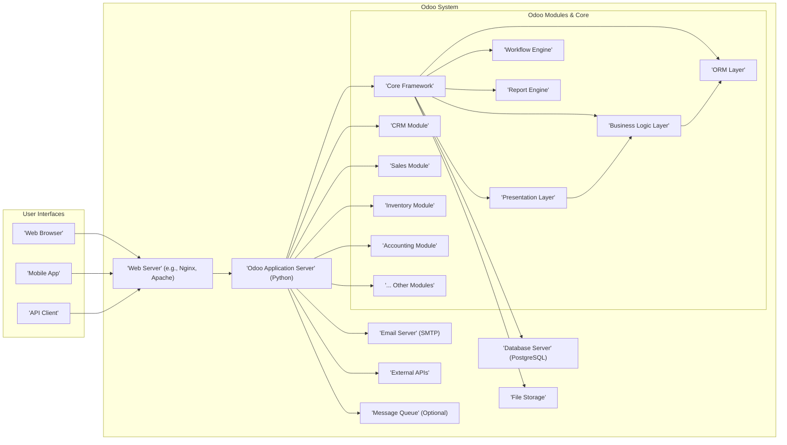

# Project Design Document: Odoo

**Version:** 1.1
**Date:** October 26, 2023
**Author:** AI Software Architect

## 1. Introduction

This document provides an enhanced architectural design of the Odoo project, based on the codebase available at [https://github.com/odoo/odoo](https://github.com/odoo/odoo). Building upon the previous version, this document offers a more detailed understanding of the system's components, their interactions, and the overall architecture, with a stronger focus on aspects relevant to threat modeling.

## 2. Goals and Objectives

The primary goals of this design document are to:

*   Provide a comprehensive and detailed overview of the Odoo architecture.
*   Clearly identify key components and their specific responsibilities and internal workings.
*   Illustrate various data flow scenarios within the system, highlighting security-relevant interactions.
*   Describe different deployment architectures and their associated security considerations.
*   Elaborate on key security considerations from an architectural perspective, linking them to specific components and data flows.

This document is specifically intended to be used as a refined input for more granular threat modeling exercises.

## 3. High-Level Architecture

Odoo's architecture is characterized by its modularity, built upon a robust core framework. This allows for the addition and integration of various business applications.



**Description:**

*   **User Interfaces:** The various ways users interact with Odoo.
    *   **Web Browser:** The primary interface for most users.
    *   **Mobile App:** Provides access to Odoo functionalities on mobile devices.
    *   **API Client:** Allows external systems to interact with Odoo programmatically.
*   **Web Server:** The entry point for user requests.
    *   Handles HTTPS connections and SSL/TLS termination.
    *   Often acts as a reverse proxy, directing traffic to the application server.
    *   Serves static content like images, CSS, and JavaScript.
*   **Odoo Application Server:** The core of the Odoo application.
    *   Executes Python code and manages the application logic.
    *   Handles user authentication and session management.
    *   Orchestrates interactions between different modules.
*   **Database Server:** Stores persistent data.
    *   PostgreSQL is the primary supported database.
    *   Manages data integrity and transactions.
    *   Stores user credentials and access rights.
*   **File Storage:** Stores uploaded files and attachments.
    *   Can be local storage or cloud-based object storage.
    *   Requires careful management of access permissions.
*   **Odoo Modules & Core:** The building blocks of Odoo's functionality.
    *   **Core Framework:** Provides essential services and APIs for module development.
    *   **ORM Layer:** Maps Python objects to database tables, handling data persistence.
    *   **Business Logic Layer:** Implements the core functionalities of each module.
    *   **Presentation Layer:** Handles user interface rendering and interaction.
    *   **Workflow Engine:** Manages automated processes and state transitions.
    *   **Report Engine:** Generates reports and documents.
    *   **Individual Modules:** Self-contained applications like CRM, Sales, Inventory, etc.
*   **Email Server:** Used for sending outgoing emails.
    *   Typically uses SMTP protocol.
    *   Requires secure configuration to prevent unauthorized sending.
*   **External APIs:** Enables integration with other systems.
    *   Can be used for data exchange, synchronization, and extending functionality.
    *   Requires robust authentication and authorization.
*   **Message Queue (Optional):** Facilitates asynchronous task processing.
    *   Improves performance and responsiveness for long-running operations.
    *   Examples include Celery or RabbitMQ.

## 4. Key Components

This section provides a more detailed breakdown of the key components, highlighting their internal workings and security implications.

*   **Web Server (e.g., Nginx, Apache):**
    *   **Responsibilities:**
        *   Receives and routes incoming HTTP/HTTPS requests.
        *   Performs SSL/TLS termination, encrypting communication.
        *   May handle load balancing across multiple application server instances.
        *   Serves static content efficiently.
        *   Implements security measures like request filtering and rate limiting.
    *   **Security Implications:** Misconfiguration can lead to vulnerabilities like information disclosure or denial-of-service. Improper SSL/TLS setup can expose sensitive data.
*   **Odoo Application Server (Python):**
    *   **Responsibilities:**
        *   Executes the Odoo Python code.
        *   Handles user authentication and authorization, verifying user credentials and permissions.
        *   Manages user sessions, storing temporary user-specific data.
        *   Interacts with the database through the ORM, translating object operations to SQL queries.
        *   Enforces business logic defined within the modules.
        *   Renders dynamic web pages and API responses.
        *   Manages background tasks and scheduled jobs.
    *   **Security Implications:** Vulnerabilities in the Python code or framework can lead to remote code execution. Improper session management can result in session hijacking. Weak authentication mechanisms can allow unauthorized access.
*   **Database Server (PostgreSQL):**
    *   **Responsibilities:**
        *   Stores all persistent data, including user accounts, business records, and configuration settings.
        *   Manages database users and their access privileges.
        *   Ensures data integrity and consistency through transactions.
        *   Provides mechanisms for backup and recovery.
    *   **Security Implications:** SQL injection vulnerabilities in the application server can allow attackers to manipulate or extract data. Weak database passwords or misconfigured access controls can lead to unauthorized access and data breaches.
*   **File Storage:**
    *   **Responsibilities:**
        *   Stores binary files associated with Odoo records, such as attachments, images, and documents.
        *   Provides mechanisms for uploading, downloading, and managing files.
        *   May implement access control policies to restrict access to specific files.
    *   **Security Implications:** Improper access controls can allow unauthorized users to access sensitive files. Vulnerabilities in file upload mechanisms can lead to malicious file uploads and potential code execution. Lack of virus scanning can introduce malware into the system.
*   **Odoo Modules:**
    *   **Responsibilities:**
        *   Implement specific business functionalities, such as managing customer relationships (CRM), processing sales orders, or tracking inventory.
        *   Define data models, business logic, and user interfaces for their respective domains.
        *   Interact with other modules and the core framework.
    *   **Security Implications:** Vulnerabilities within individual modules, especially those developed by third parties, can introduce security risks. Improperly implemented authorization checks within modules can lead to privilege escalation.
*   **Core Framework:**
    *   **Responsibilities:**
        *   Provides the foundational components for module development, including the ORM, workflow engine, and reporting engine.
        *   Manages user authentication and authorization across the entire system.
        *   Provides APIs and tools for module developers.
        *   Enforces security policies and best practices.
    *   **Security Implications:** Vulnerabilities in the core framework can have widespread impact across all modules. Weaknesses in authentication or authorization mechanisms within the framework compromise the entire system's security.
*   **Email Server (SMTP):**
    *   **Responsibilities:**
        *   Sends outgoing emails generated by Odoo, such as notifications, invoices, and marketing campaigns.
        *   May handle email delivery and queuing.
    *   **Security Implications:** Misconfigured email servers can be used to send spam or phishing emails. Lack of proper authentication can allow unauthorized users to send emails through the system. Sensitive information transmitted via email should be encrypted.
*   **External APIs:**
    *   **Responsibilities:**
        *   Enable Odoo to communicate and exchange data with external systems.
        *   Provide programmatic access to Odoo functionalities.
    *   **Security Implications:** Weak or missing authentication and authorization mechanisms can allow unauthorized access to Odoo data and functionalities. Lack of input validation can expose the system to injection attacks. Data transmitted over APIs should be encrypted.

## 5. Data Flow Scenarios

This section illustrates specific data flow scenarios relevant to security considerations.

*   **User Login:**
    1. User enters credentials in the **'Web Browser'**.
    2. The **'Web Browser'** sends a login request to the **'Web Server'** over HTTPS.
    3. The **'Web Server'** forwards the request to the **'Odoo Application Server'**.
    4. The **'Odoo Application Server'** retrieves the user's credentials from the **'Database Server'**.
    5. The **'Odoo Application Server'** verifies the credentials (e.g., by comparing hashed passwords).
    6. Upon successful authentication, the **'Odoo Application Server'** creates a session and stores the session ID (potentially in a secure cookie).
    7. The **'Odoo Application Server'** sends a response to the **'Web Server'**, including the session cookie.
    8. The **'Web Server'** sends the response to the **'Web Browser'**.
    9. The **'Web Browser'** stores the session cookie and includes it in subsequent requests.

    ```mermaid
    graph LR
        A["'Web Browser'"] --> B["'Web Server'"];
        B --> C["'Odoo Application Server'"];
        C --> D["'Database Server'"];
        D --> C;
        C --> B;
        B --> A;
        style A fill:#ccf,stroke:#333,stroke-width:2px
        style B fill:#ccf,stroke:#333,stroke-width:2px
        style C fill:#ccf,stroke:#333,stroke-width:2px
        style D fill:#ccf,stroke:#333,stroke-width:2px
    ```

*   **Data Modification (e.g., Updating a Customer Record):**
    1. User interacts with the **'Web Browser'** to modify customer data.
    2. The **'Web Browser'** sends an update request to the **'Web Server'**, including the data to be modified and the session cookie.
    3. The **'Web Server'** forwards the request to the **'Odoo Application Server'**.
    4. The **'Odoo Application Server'** verifies the user's session and authorization to modify the specific record.
    5. The **'Odoo Application Server'** validates the input data to prevent injection attacks and ensure data integrity.
    6. The **'Odoo Application Server'** uses the ORM to update the corresponding record in the **'Database Server'**.
    7. The **'Database Server'** updates the record.
    8. The **'Odoo Application Server'** sends a success response to the **'Web Server'**.
    9. The **'Web Server'** sends the response to the **'Web Browser'**.

    ```mermaid
    graph LR
        A["'Web Browser'"] --> B["'Web Server'"];
        B --> C["'Odoo Application Server'"];
        C --> D["'Database Server'"];
        D --> C;
        C --> B;
        B --> A;
        style A fill:#fcc,stroke:#333,stroke-width:2px
        style B fill:#fcc,stroke:#333,stroke-width:2px
        style C fill:#fcc,stroke:#333,stroke-width:2px
        style D fill:#fcc,stroke:#333,stroke-width:2px
    ```

## 6. Deployment Architecture

Odoo's deployment architecture can significantly impact its security posture.

*   **On-Premise Deployment:**
    *   **Characteristics:** The organization manages all aspects of the infrastructure, including servers, networking, and security.
    *   **Security Considerations:** Requires robust security practices for server hardening, network segmentation, firewall configuration, and physical security. The organization is responsible for patching vulnerabilities and managing access controls at all levels.
*   **Cloud-Based Deployment:**
    *   **Odoo Online (SaaS):**
        *   **Characteristics:** Odoo manages the infrastructure and application.
        *   **Security Considerations:** Relies on Odoo's security measures. Understanding Odoo's security policies and certifications is crucial. Data privacy and compliance are key considerations.
    *   **Self-Hosted on Cloud (IaaS/PaaS):**
        *   **Characteristics:** The organization manages the application on cloud infrastructure (e.g., AWS, Azure, Google Cloud).
        *   **Security Considerations:** Shared responsibility model. The cloud provider manages the security of the underlying infrastructure, while the organization is responsible for securing the application, operating system, and data. Proper configuration of cloud security services (e.g., security groups, IAM) is essential.
    *   **Containerized Deployment (Docker, Kubernetes):**
        *   **Characteristics:** Odoo is deployed within containers, orchestrated by platforms like Kubernetes.
        *   **Security Considerations:** Requires securing the container images, the container runtime environment, and the orchestration platform. Implementing network policies and access controls within the container environment is crucial.

## 7. Security Considerations

This section expands on the security considerations, linking them to specific components and data flows.

*   **Authentication and Authorization:**
    *   **Components Involved:** 'Web Server', 'Odoo Application Server', 'Core Framework', 'Database Server'.
    *   **Data Flow Relevance:** User Login.
    *   **Considerations:** Multi-factor authentication (MFA), strong password policies, protection against brute-force attacks, secure session management (e.g., HTTPOnly and Secure flags for cookies), proper implementation of role-based access control (RBAC).
*   **Input Validation and Output Encoding:**
    *   **Components Involved:** 'Web Server', 'Odoo Application Server', 'Odoo Modules'.
    *   **Data Flow Relevance:** Data Modification.
    *   **Considerations:** Server-side validation of all user inputs, sanitization of data before processing, proper encoding of output to prevent XSS vulnerabilities, protection against SQL injection through parameterized queries or ORM usage.
*   **Data Protection (Encryption):**
    *   **Components Involved:** 'Web Server', 'Odoo Application Server', 'Database Server', 'File Storage', 'Email Server'.
    *   **Data Flow Relevance:** All data flows involving sensitive information.
    *   **Considerations:** Encryption of data at rest (e.g., database encryption, file system encryption), encryption of data in transit (HTTPS/TLS), secure storage of encryption keys.
*   **Session Management:**
    *   **Components Involved:** 'Web Server', 'Odoo Application Server'.
    *   **Data Flow Relevance:** All authenticated interactions.
    *   **Considerations:** Use of strong, unpredictable session IDs, secure storage of session data, appropriate session timeouts, protection against session fixation and hijacking.
*   **Dependency Management:**
    *   **Components Involved:** 'Odoo Application Server', 'Odoo Modules'.
    *   **Considerations:** Regularly updating Odoo core and its dependencies to patch vulnerabilities, using vulnerability scanning tools to identify vulnerable dependencies, careful selection and vetting of third-party modules.
*   **API Security:**
    *   **Components Involved:** 'Web Server', 'Odoo Application Server', 'External APIs'.
    *   **Data Flow Relevance:** Interactions with external systems.
    *   **Considerations:** Implementing secure authentication and authorization mechanisms for APIs (e.g., OAuth 2.0), input validation for API requests, rate limiting to prevent abuse, secure transmission of API data (HTTPS).
*   **File Upload Security:**
    *   **Components Involved:** 'Web Server', 'Odoo Application Server', 'File Storage'.
    *   **Data Flow Relevance:** Uploading attachments or files.
    *   **Considerations:** Validating file types and sizes, preventing execution of uploaded files, storing uploaded files outside the webroot, scanning uploaded files for malware.
*   **Database Security:**
    *   **Components Involved:** 'Database Server', 'Odoo Application Server'.
    *   **Considerations:** Strong database passwords, restricting database access to authorized users and applications, regular database backups, monitoring database activity for suspicious behavior.

## 8. Assumptions and Constraints

*   This design document assumes a standard Odoo deployment with commonly used components. Custom configurations or third-party integrations may introduce additional complexities.
*   The security considerations are based on common security best practices. A comprehensive security assessment would be required for a more tailored analysis.
*   The document focuses on architectural aspects. Implementation details within specific modules are not exhaustively covered.

## 9. Future Considerations

*   **Further Granularization of Modules:** Analyzing the architecture of individual key modules in more detail for targeted threat modeling.
*   **Integration with Security Information and Event Management (SIEM) Systems:** Designing the system to provide relevant security logs and events to SIEM solutions.
*   **Implementation of a Web Application Firewall (WAF):** Adding a WAF in front of the 'Web Server' for enhanced protection against web-based attacks.
*   **Regular Security Audits and Penetration Testing:** Incorporating regular security assessments to identify and address potential vulnerabilities.